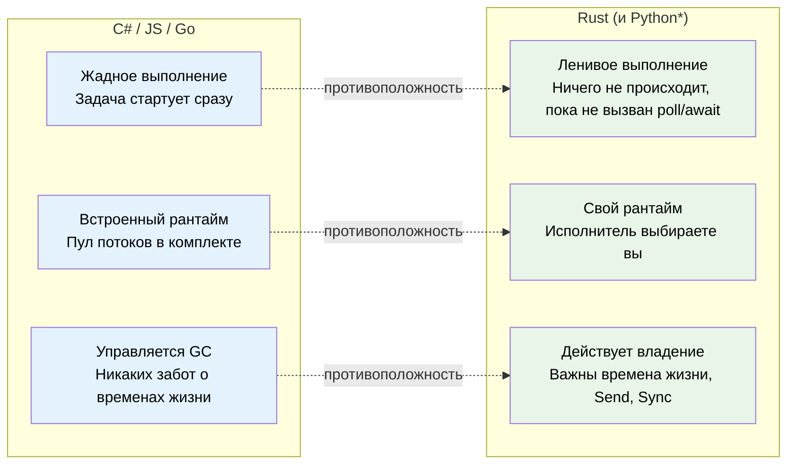
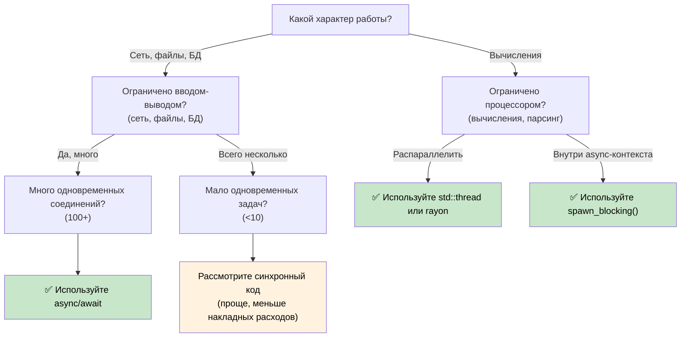

# 1. Почему async в Rust устроен иначе 🟢

> **Что вы узнаете:**
> - Почему в Rust нет встроенного асинхронного рантайма (и что это значит для вас)
> - Три ключевых свойства: ленивое выполнение, отсутствие рантайма, абстракции с нулевой стоимостью
> - Когда async — правильный инструмент (а когда он медленнее)
> - Как модель Rust соотносится с C#, Go, Python и JavaScript

## Фундаментальное отличие

Большинство языков с `async/await` скрывают внутренний механизм. В C# есть пул потоков CLR. В JavaScript есть цикл событий (event loop). В Go есть горутины и планировщик, встроенный в рантайм. В Python есть `asyncio`.

**В Rust ничего этого нет.**

Нет встроенного рантайма, нет пула потоков, нет цикла событий. Ключевое слово `async` — это стратегия компиляции с нулевой стоимостью: она превращает вашу функцию в конечный автомат, реализующий трейт `Future`. Кто-то другой (*исполнитель*, executor) должен продвигать этот автомат вперёд.

### Три ключевых свойства async в Rust



> \* Корутины Python, как и фьючи Rust, ленивые — они не выполняются, пока их не `await`-ят или не запланируют. Однако Python по-прежнему использует GC и не знает о владении и временах жизни.

### Нет встроенного рантайма

```rust
// Это компилируется, но НИЧЕГО не делает:
async fn fetch_data() -> String {
    "hello".to_string()
}

fn main() {
    let future = fetch_data(); // Создаёт Future, но не выполняет его
    // future — это просто структура на стеке
    // Никакого вывода, никаких побочных эффектов, ничего не происходит
    drop(future); // Молча уничтожена — работа так и не начиналась
}
```

Сравните с C#, где `Task` стартует сразу:
```csharp
// C# — это немедленно начинает выполняться:
async Task<string> FetchData() => "hello";

var task = FetchData(); // Уже выполняется!
var result = await task; // Только ждём завершения
```

### Ленивые фьючи против жадных задач

Это самая важная смена мышления:

| | C# / JavaScript | Python | Go | Rust |
|---|---|---|---|---|
| **Создание** | `Task` начинает выполняться сразу | Корутина **ленивая** — возвращает объект, не выполняется, пока её не `await`-ят или не запланируют | Горутина стартует сразу | `Future` ничего не делает, пока его не опросили (polled) |
| **Уничтожение** | Отсоединённая задача продолжает работать | Невызванная корутина собирается GC (с предупреждением) | Горутина работает до возврата | Уничтожение Future отменяет его |
| **Рантайм** | Встроен в язык / VM | Цикл событий `asyncio` (нужно запускать явно) | Встроен в бинарник (планировщик M:N) | Выбираете вы (tokio, smol и др.) |
| **Планирование** | Автоматическое (пул потоков) | Цикл событий + `await` или `create_task()` | Автоматическое (планировщик GMP) | Явное (`spawn`, `block_on`) |
| **Отмена** | `CancellationToken` (кооперативная) | `Task.cancel()` (кооперативная, выбрасывает `CancelledError`) | `context.Context` (кооперативная) | Уничтожить фьючу (мгновенно) |

```rust
// Чтобы РЕАЛЬНО выполнить фьючу, нужен исполнитель:
#[tokio::main]
async fn main() {
    let result = fetch_data().await; // ТЕПЕРЬ оно выполняется
    println!("{result}");
}
```

### Когда использовать async (и когда не стоит)



**Практическое правило**: async нужен для конкурентности ввода-вывода (делать много дел одновременно, пока ждём), а не для параллелизма вычислений (ускорение одной операции). Если у вас 10 000 сетевых соединений, async проявляет себя во всей красе. Если вы считаете числа, используйте `rayon` или потоки ОС.

### Когда async может быть *медленнее*

Async не бесплатен. При низкой конкурентности синхронный код может работать быстрее async:

| Издержка | Почему |
|----------|--------|
| **Накладные расходы конечного автомата** | Каждый `.await` добавляет вариант enum; глубоко вложенные фьючи порождают большие и сложные автоматы |
| **Динамическая диспетчеризация** | `Box<dyn Future>` добавляет косвенность и мешает инлайнингу |
| **Переключение контекста** | Кооперативное планирование тоже стоит ресурсов — исполнителю нужно управлять очередью задач, wakers и регистрациями I/O |
| **Время компиляции** | Async-код порождает более сложные типы и замедляет компиляцию |
| **Отладка** | Трассировки стека через конечные автоматы труднее читать (см. гл. 12) |

**Рекомендация по бенчмаркам**: если одновременных операций ввода-вывода меньше ~10, сначала профилируйте, и только потом переходите на async. Простой `std::thread::spawn` на соединение хорошо масштабируется до сотен потоков на современном Linux.

### Упражнение: когда использовать async?

<details>
<summary>🏋️ Упражнение (нажмите, чтобы раскрыть)</summary>

Для каждого сценария решите, уместен ли async, и объясните почему:

1. Веб-сервер, обрабатывающий 10 000 одновременных WebSocket-соединений
2. CLI-утилита, которая сжимает один большой файл
3. Сервис, который опрашивает 5 разных баз данных и объединяет результаты
4. Игровой движок, который выполняет физическую симуляцию с 60 FPS

<details>
<summary>🔑 Решение</summary>

1. **Async** — ограничено вводом-выводом, огромная конкурентность. Каждое соединение большую часть времени ждёт данных. Для потоков понадобилось бы 10 000 стеков.
2. **Синхронно / потоки** — ограничено процессором, одна задача. Async добавляет накладные расходы без пользы. Для параллельного сжатия используйте `rayon`.
3. **Async** — пять одновременных ожиданий I/O. `tokio::join!` выполняет все пять запросов одновременно.
4. **Синхронно / потоки** — ограничено процессором, чувствительно к задержкам. Кооперативное планирование async может вызвать джиттер кадров.

</details>
</details>

> **Ключевые выводы — почему async устроен иначе**
> - Фьючи в Rust **ленивые** — они ничего не делают, пока исполнитель их не опросит
> - Встроенного рантайма **нет** — вы выбираете (или создаёте) свой
> - Async — это **стратегия компиляции с нулевой стоимостью**, которая порождает конечные автоматы
> - Async проявляет себя в **конкурентности ввода-вывода**; для вычислений используйте потоки или rayon

> **См. также:** [Гл. 2 — Трейт Future](ch02-the-future-trait.md) — трейт, на котором всё это держится, [Гл. 7 — Исполнители и рантаймы](ch07-executors-and-runtimes.md) — как выбрать рантайм

***
