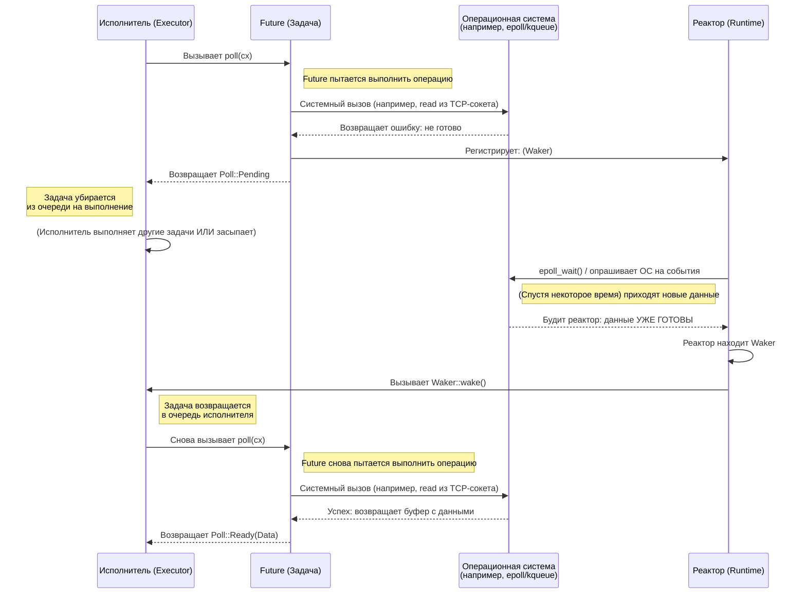

# 2. Трейт Future 🟡

> **Что вы узнаете:**
> - Трейт `Future`: `Output`, `poll()`, `Context`, `Waker`
> - Как waker сообщает исполнителю «опроси меня снова»
> - Контракт: если никогда не вызвать `wake()`, программа молча зависнет
> - Реализация настоящего фьючи вручную (`Delay`)

## Анатомия Future

Всё в асинхронном Rust в конечном счёте реализует этот трейт:

```rust
pub trait Future {
    type Output;

    fn poll(self: Pin<&mut Self>, cx: &mut Context<'_>) -> Poll<Self::Output>;
}

pub enum Poll<T> {
    Ready(T),   // Future завершился со значением T
    Pending,    // Future ещё не готов — вызови меня позже
}
```

Вот и всё. `Future` — это всё, что можно *опросить* (polled): у него спрашивают «ты уже готов?», и он отвечает либо «да, вот результат», либо «пока нет, я разбужу тебя, когда буду готов».

### Output, poll(), Context, Waker



Разберём каждую часть:

```rust
use std::future::Future;
use std::pin::Pin;
use std::task::{Context, Poll};

// Future, который сразу возвращает 42
struct Ready42;

impl Future for Ready42 {
    type Output = i32; // Что в итоге вернёт future

    fn poll(self: Pin<&mut Self>, _cx: &mut Context<'_>) -> Poll<i32> {
        Poll::Ready(42) // Всегда готов — ожидание не нужно
    }
}
```

**Компоненты**:
- **`Output`** — тип значения, которое получится по завершении future
- **`poll()`** — вызывается исполнителем, чтобы проверить прогресс; возвращает `Ready(value)` или `Pending`
- **`Pin<&mut Self>`** — гарантирует, что future не переместят в памяти (почему это важно, разберём в гл. 4)
- **`Context`** — содержит `Waker`, чтобы future мог сообщить исполнителю, что готов двигаться дальше

### Контракт Waker

`Waker` — это механизм обратного вызова. Когда future возвращает `Pending`, он *обязан* обеспечить последующий вызов `waker.wake()` — иначе исполнитель никогда не опросит его снова, и программа зависнет.

```rust
use std::task::{Context, Poll, Waker};
use std::pin::Pin;
use std::future::Future;
use std::sync::{Arc, Mutex};
use std::thread;
use std::time::Duration;

/// Future, который завершается через заданное время (упрощённая реализация)
struct Delay {
    completed: Arc<Mutex<bool>>,
    waker_stored: Arc<Mutex<Option<Waker>>>,
    duration: Duration,
    started: bool,
}

impl Delay {
    fn new(duration: Duration) -> Self {
        Delay {
            completed: Arc::new(Mutex::new(false)),
            waker_stored: Arc::new(Mutex::new(None)),
            duration,
            started: false,
        }
    }
}

impl Future for Delay {
    type Output = ();

    fn poll(mut self: Pin<&mut Self>, cx: &mut Context<'_>) -> Poll<()> {
        // Проверяем, не завершился ли уже, до того как сохранить waker
        if *self.completed.lock().unwrap() {
            return Poll::Ready(());
        }

        // Сохраняем waker — исполнитель может передавать новый при каждом poll
        *self.waker_stored.lock().unwrap() = Some(cx.waker().clone());

        // Запускаем фоновый таймер при первом poll
        if !self.started {
            self.started = true;
            let completed = Arc::clone(&self.completed);
            let waker = Arc::clone(&self.waker_stored);
            let duration = self.duration;

            thread::spawn(move || {
                thread::sleep(duration);
                *completed.lock().unwrap() = true;

                // ВАЖНО: будим исполнитель, чтобы он снова опросил нас
                if let Some(w) = waker.lock().unwrap().take() {
                    w.wake(); // «Эй, исполнитель, я готов — опроси меня снова!»
                }
            });
        }

        // Перепроверяем завершение после сохранения waker (защита от гонки)
        if *self.completed.lock().unwrap() {
            return Poll::Ready(());
        }

        Poll::Pending // Ещё не готово
    }
}
```

> **Ключевая мысль**: в C# за пробуждение отвечает TaskScheduler автоматически.
> В Rust **вы** (или библиотека ввода-вывода, которую вы используете) отвечаете за вызов
> `waker.wake()`. Забудете — и программа молча зависнет.

### Упражнение: реализуйте CountdownFuture

<details>
<summary>🏋️ Упражнение (нажмите, чтобы раскрыть)</summary>

**Задача**: реализуйте `CountdownFuture`, который отсчитывает от N до 0 и выводит текущее значение при каждом опросе. Когда дойдёт до 0, он завершается с `Ready("Liftoff!")`.

*Подсказка*: future должен хранить текущее значение счётчика и уменьшать его при каждом poll. Не забывайте каждый раз заново регистрировать waker!

<details>
<summary>🔑 Решение</summary>

```rust
use std::future::Future;
use std::pin::Pin;
use std::task::{Context, Poll};

struct CountdownFuture {
    count: u32,
}

impl CountdownFuture {
    fn new(start: u32) -> Self {
        CountdownFuture { count: start }
    }
}

impl Future for CountdownFuture {
    type Output = &'static str;

    fn poll(mut self: Pin<&mut Self>, cx: &mut Context<'_>) -> Poll<Self::Output> {
        if self.count == 0 {
            println!("Liftoff!");
            Poll::Ready("Liftoff!")
        } else {
            println!("{}...", self.count);
            self.count -= 1;
            cx.waker().wake_by_ref(); // Немедленно планируем повторный poll
            Poll::Pending
        }
    }
}
```

**Ключевой вывод**: этот future опрашивается по одному разу на каждое значение счётчика. Каждый раз, возвращая `Pending`, он сразу будит себя для повторного опроса. В продакшене вместо активного опроса (busy-polling) следует использовать таймер.

</details>
</details>

> **Ключевые выводы — трейт Future**
> - `Future::poll()` возвращает `Poll::Ready(value)` или `Poll::Pending`
> - Перед возвратом `Pending` future обязан зарегистрировать `Waker` — исполнитель использует его, чтобы понять, когда опрашивать снова
> - `Pin<&mut Self>` гарантирует, что future не переместят в памяти (нужно для самоссылающихся конечных автоматов — см. гл. 4)
> - Всё в асинхронном Rust — `async fn`, `.await`, комбинаторы — построено на этом одном трейте

> **См. также:** [Гл. 3 — Как работает poll](ch03-how-poll-works.md) — цикл исполнителя, [Гл. 6 — Создаём фьючи вручную](ch06-building-futures-by-hand.md) — более сложные реализации

***
