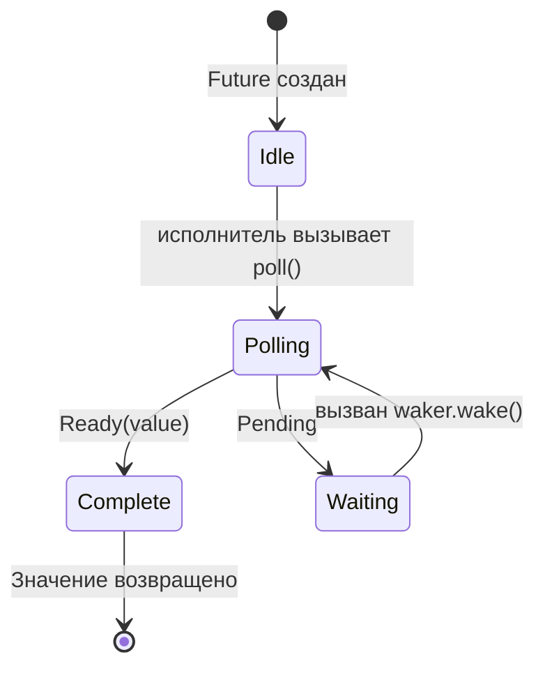

# 3. Как работает poll 🟡

> **Что вы узнаете:**
> - Цикл опроса исполнителя: poll → Pending → wake → снова poll
> - Как собрать минимальный исполнитель с нуля
> - Правила «ложных» пробуждений и почему они важны
> - Вспомогательные функции: `poll_fn()` и `yield_now()`

## Конечный автомат опроса

Исполнитель работает в цикле: опрашивает future, и если он возвращает `Pending`, откладывает его до срабатывания waker, а затем опрашивает снова. Это принципиально отличается от потоков ОС, где планированием занимается ядро.



> **Важно:** находясь в состоянии *Waiting*, future **обязан** был зарегистрировать
> waker у источника ввода-вывода. Без регистрации — зависание навсегда.

### Минимальный исполнитель

Чтобы развеять магию исполнителей, построим самый простой из возможных:

```rust
use std::future::Future;
use std::task::{Context, Poll, RawWaker, RawWakerVTable, Waker};
use std::pin::Pin;

/// Простейший исполнитель: крутим poll в цикле, пока не получим Ready
fn block_on<F: Future>(mut future: F) -> F::Output {
    // Закрепляем future на стеке
    // SAFETY: `future` не перемещается после этого момента — мы обращаемся
    // к нему только через закреплённую ссылку до самого завершения.
    let mut future = unsafe { Pin::new_unchecked(&mut future) };

    // Создаём пустой waker (он просто продолжает опрос — неэффективно, зато просто)
    fn noop_raw_waker() -> RawWaker {
        fn no_op(_: *const ()) {}
        fn clone(_: *const ()) -> RawWaker { noop_raw_waker() }
        let vtable = &RawWakerVTable::new(clone, no_op, no_op, no_op);
        RawWaker::new(std::ptr::null(), vtable)
    }

    // SAFETY: noop_raw_waker() возвращает корректный RawWaker с правильной таблицей vtable.
    let waker = unsafe { Waker::from_raw(noop_raw_waker()) };
    let mut cx = Context::from_waker(&waker);

    // Крутим цикл, пока future не завершится
    loop {
        match future.as_mut().poll(&mut cx) {
            Poll::Ready(value) => return value,
            Poll::Pending => {
                // Настоящий исполнитель усыпил бы поток здесь
                // и ждал бы waker.wake() — а мы просто крутимся
                std::thread::yield_now();
            }
        }
    }
}

// Использование:
fn main() {
    let result = block_on(async {
        println!("Hello from our mini executor!");
        42
    });
    println!("Got: {result}");
}
```

> **Не используйте это в продакшене!** Здесь активный цикл, он тратит CPU впустую. Настоящие исполнители
> (tokio, smol) используют `epoll`/`kqueue`/`io_uring`, чтобы спать до готовности ввода-вывода.
> Но этот пример показывает главную идею: исполнитель — это просто цикл, который вызывает `poll()`.

### Уведомления о пробуждении

Настоящий исполнитель управляется событиями. Когда все future находятся в `Pending`, исполнитель засыпает. Waker работает как механизм прерывания:

```rust
// Концептуальная модель главного цикла настоящего исполнителя:
fn executor_loop(tasks: &mut TaskQueue) {
    loop {
        // 1. Опрашиваем все задачи, которые были разбужены
        while let Some(task) = tasks.get_woken_task() {
            match task.poll() {
                Poll::Ready(result) => task.complete(result),
                Poll::Pending => { /* задача остаётся в очереди, ждём пробуждения */ }
            }
        }

        // 2. Спим, пока что-нибудь нас не разбудит (epoll_wait, kevent и т. п.)
        //    Вот где основную работу делает mio/polling
        tasks.wait_for_events(); // блокируется до события ввода-вывода или срабатывания waker
    }
}
```

### Ложные пробуждения

Future может быть опрошен, даже когда его ввод-вывод ещё не готов. Это называется *ложным пробуждением* (spurious wake). Future должен корректно с этим справляться:

```rust
impl Future for MyFuture {
    type Output = Data;

    fn poll(self: Pin<&mut Self>, cx: &mut Context<'_>) -> Poll<Data> {
        // ✅ ПРАВИЛЬНО: всегда перепроверяем реальное условие
        if let Some(data) = self.try_read_data() {
            Poll::Ready(data)
        } else {
            // Регистрируем waker заново (он мог измениться!)
            self.register_waker(cx.waker());
            Poll::Pending
        }

        // ❌ НЕПРАВИЛЬНО: считать, что poll означает готовность данных
        // let data = self.read_data(); // может заблокироваться или упасть с паникой
        // Poll::Ready(data)
    }
}
```

**Правила реализации `poll()`**:
1. **Никогда не блокируйтесь** — если данных нет, сразу возвращайте `Pending`
2. **Всегда регистрируйте waker заново** — он мог измениться между опросами
3. **Обрабатывайте ложные пробуждения** — проверяйте реальное условие, а не полагайтесь на готовность
4. **Не опрашивайте после `Ready`** — поведение **не определено** (может вызвать панику, вернуть `Pending` или снова `Ready`). Гарантированно безопасный опрос после завершения даёт только `FusedFuture`

<details>
<summary><strong>🏋️ Упражнение: FlagFuture, устойчивый к ложным пробуждениям</strong> (нажмите, чтобы раскрыть)</summary>

**Задача**: реализуйте `FlagFuture`, который оборачивает общий флаг `Arc<AtomicBool>`. При опросе он проверяет, равен ли флаг `true`. Если да — завершается с `Ready(())`. Если нет — сохраняет waker и возвращает `Pending`. Тонкость: future должен корректно обрабатывать **ложные пробуждения** — он должен перепроверять флаг при каждом опросе и никогда не считать, что флаг установлен, только потому что его разбудили.

*Подсказка*: понадобится `Arc<Mutex<Option<Waker>>>` (или что-то похожее), чтобы внешний поток мог установить флаг и разбудить future. Для краткого альтернативного решения используйте `poll_fn`.

<details>
<summary>🔑 Решение</summary>

```rust
use std::future::Future;
use std::pin::Pin;
use std::sync::{Arc, Mutex};
use std::sync::atomic::{AtomicBool, Ordering};
use std::task::{Context, Poll, Waker};

struct FlagFuture {
    flag: Arc<AtomicBool>,
    waker_slot: Arc<Mutex<Option<Waker>>>,
}

impl FlagFuture {
    fn new(flag: Arc<AtomicBool>, waker_slot: Arc<Mutex<Option<Waker>>>) -> Self {
        FlagFuture { flag, waker_slot }
    }
}

impl Future for FlagFuture {
    type Output = ();

    fn poll(self: Pin<&mut Self>, cx: &mut Context<'_>) -> Poll<Self::Output> {
        // Всегда перепроверяем реальное условие — никогда не доверяем одному только пробуждению
        if self.flag.load(Ordering::Acquire) {
            return Poll::Ready(());
        }

        // Сохраняем/обновляем waker, чтобы нас уведомили
        let mut slot = self.waker_slot.lock().unwrap();
        *slot = Some(cx.waker().clone());

        // Перепроверяем после сохранения waker, чтобы избежать гонки:
        // флаг мог быть установлен между нашей первой проверкой
        // и сохранением waker
        if self.flag.load(Ordering::Acquire) {
            Poll::Ready(())
        } else {
            Poll::Pending
        }
    }
}

// Сторона, которая устанавливает флаг (например, другой поток или задача):
fn set_flag(flag: &AtomicBool, waker_slot: &Mutex<Option<Waker>>) {
    flag.store(true, Ordering::Release);
    if let Some(waker) = waker_slot.lock().unwrap().take() {
        waker.wake();
    }
}

// Эквивалент через poll_fn:
// async fn wait_for_flag(flag: Arc<AtomicBool>, waker_slot: Arc<Mutex<Option<Waker>>>) {
//     std::future::poll_fn(|cx| {
//         if flag.load(Ordering::Acquire) {
//             return Poll::Ready(());
//         }
//         *waker_slot.lock().unwrap() = Some(cx.waker().clone());
//         if flag.load(Ordering::Acquire) { Poll::Ready(()) } else { Poll::Pending }
//     }).await
// }
```

**Ключевой вывод**: шаблон «двойной проверки» (проверить → сохранить waker → проверить снова) необходим, чтобы избежать гонки между изменением условия и регистрацией waker. Именно так внутри работают все фьючи ввода-вывода, и это показывает, почему обработка ложных пробуждений так важна.

</details>
</details>

### Полезные утилиты: `poll_fn` и `yield_now`

Две утилиты из стандартной библиотеки и tokio, которые избавляют от написания полных реализаций `Future`:

```rust
use std::future::poll_fn;
use std::task::Poll;

// poll_fn: создаём разовый future из замыкания
let value = poll_fn(|cx| {
    // Делаем что-нибудь с cx.waker(), возвращаем Ready или Pending
    Poll::Ready(42)
}).await;

// Пример из практики: адаптируем API на основе колбэков к async
async fn read_when_ready(source: &MySource) -> Data {
    poll_fn(|cx| source.poll_read(cx)).await
}
```

```rust
// yield_now: добровольно отдаём управление исполнителю
// Полезно в тяжёлых по CPU асинхронных циклах, чтобы не морить голодом другие задачи
async fn cpu_heavy_work(items: &[Item]) {
    for (i, item) in items.iter().enumerate() {
        process(item); // работа с CPU

        // Каждые 100 элементов уступаем управление, чтобы могли выполниться другие задачи
        if i % 100 == 0 {
            tokio::task::yield_now().await;
        }
    }
}
```

> **Когда использовать `yield_now()`**: если асинхронная функция выполняет работу с CPU в цикле
> без единой точки `.await`, она монополизирует поток исполнителя. Периодически вставляйте
> `yield_now().await`, чтобы включить кооперативную многозадачность.

> **Ключевые выводы — как работает poll**
> - Исполнитель многократно вызывает `poll()` для future, которые были разбужены
> - Future должны обрабатывать **ложные пробуждения** — всегда перепроверяйте реальное условие
> - `poll_fn()` позволяет создавать разовые future из замыканий
> - `yield_now()` — это лаз для кооперативного планирования в async-коде с тяжёлыми вычислениями

> **См. также:** [Гл. 2 — Трейт Future](ch02-the-future-trait.md) — определение трейта, [Гл. 5 — Раскрываем конечный автомат](ch05-the-state-machine-reveal.md) — что генерирует компилятор

***
