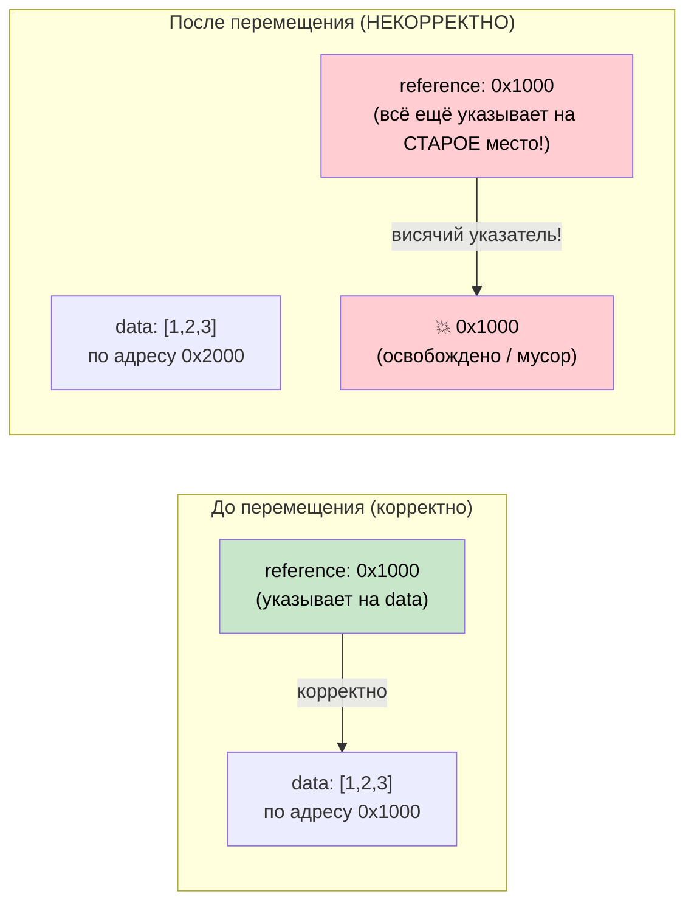

# 4. Pin и Unpin 🔴

> **Что вы узнаете:**
> - Почему самоссылающиеся структуры ломаются при перемещении в памяти
> - Что гарантирует `Pin<P>` и как он предотвращает перемещение
> - Три практических паттерна закрепления: `Box::pin()`, `tokio::pin!()`, `Pin::new()`
> - Когда `Unpin` даёт вам лазейку

## Зачем нужен Pin

Это самое запутанное понятие в асинхронном Rust. Построим интуицию шаг за шагом.

### Проблема: самоссылающиеся структуры

Когда компилятор превращает `async fn` в конечный автомат, этот автомат может содержать ссылки на собственные поля. Так возникает *самоссылающаяся структура* — и её перемещение в памяти сделает внутренние ссылки недействительными.

```rust
// Что компилятор генерирует (упрощённо) для:
// async fn example() {
//     let data = vec![1, 2, 3];
//     let reference = &data;       // Указывает на data выше
//     use_ref(reference).await;
// }

// Превращается во что-то вроде:
enum ExampleStateMachine {
    State0 {
        data: Vec<i32>,
        // reference: &Vec<i32>,  // ПРОБЛЕМА: указывает на `data` выше
        //                        // Если структура переместится, указатель повиснет!
    },
    State1 {
        data: Vec<i32>,
        reference: *const Vec<i32>, // Внутренний указатель на поле data
    },
    Complete,
}
```



### Самоссылающиеся структуры

Это не академическая проблема. Любая `async fn`, которая удерживает ссылку через точку `.await`, создаёт самоссылающийся конечный автомат:

```rust
async fn problematic() {
    let data = String::from("hello");
    let slice = &data[..]; // slice заимствует data

    some_io().await; // <-- точка .await: автомат хранит и data, и slice

    println!("{slice}"); // использует ссылку после await
}
// Сгенерированный автомат содержит `data: String` и `slice: &str`,
// где slice указывает ВНУТРЬ data. Перемещение автомата = висячий указатель.
```

### Pin на практике

`Pin<P>` — это обёртка, которая запрещает перемещать значение, на которое указывает указатель:

```rust
use std::pin::Pin;

let mut data = String::from("hello");

// Закрепляем — теперь его нельзя переместить
let pinned: Pin<&mut String> = Pin::new(&mut data);

// Всё ещё можно использовать:
println!("{}", pinned.as_ref().get_ref()); // "hello"

// Но получить обратно &mut String нельзя (это позволило бы mem::swap):
// let mutable: &mut String = Pin::into_inner(pinned); // Только если String: Unpin
// String — это Unpin, поэтому здесь это на самом деле работает.
// Но для самоссылающихся конечных автоматов (они !Unpin) это заблокировано.
```

В реальном коде Pin встречается в основном в трёх местах:

```rust
// 1. Сигнатура poll() — все future опрашиваются через Pin
fn poll(self: Pin<&mut Self>, cx: &mut Context<'_>) -> Poll<Output>;

// 2. Box::pin() — разместить future в куче и закрепить его
let future: Pin<Box<dyn Future<Output = i32>>> = Box::pin(async { 42 });

// 3. tokio::pin!() — закрепить future на стеке
tokio::pin!(my_future);
// Теперь my_future: Pin<&mut impl Future>
```

### Лазейка Unpin

Большинство типов в Rust — `Unpin`: они не содержат самоссылок, поэтому закрепление для них ничего не меняет. `!Unpin` — только автоматы, сгенерированные компилятором из `async fn`.

```rust
// Все эти типы — Unpin, закрепление для них ничего особого не делает:
// i32, String, Vec<T>, HashMap<K,V>, Box<T>, &T, &mut T

// Эти типы — !Unpin, их ОБЯЗАТЕЛЬНО нужно закрепить перед опросом:
// Конечные автоматы, сгенерированные из `async fn` и `async {}`

// Практический вывод:
// Если вы пишете Future вручную и в нём НЕТ самоссылок,
// реализуйте Unpin, чтобы с ним было проще работать:
impl Unpin for MySimpleFuture {} // «Его безопасно перемещать, поверьте мне»
```

### Краткая справка

| Что | Когда | Как |
|-----|-------|-----|
| Закрепить future в куче | Хранение в коллекции, возврат из функции | `Box::pin(future)` |
| Закрепить future на стеке | Локальное использование в `select!` или при ручном опросе | `std::pin::pin!(future)` или `tokio::pin!(future)` |
| Pin в сигнатуре функции | Приём уже закреплённых future | `future: Pin<&mut F>` |
| Требовать Unpin | Когда нужно переместить future после создания | `F: Future + Unpin` |

<details>
<summary><strong>🏋️ Упражнение: Pin и перемещение</strong> (нажмите, чтобы раскрыть)</summary>

**Задача**: какие из этих фрагментов кода компилируются? Для каждого, который не компилируется, объясните почему и исправьте.

```rust
// Фрагмент A
let fut = async { 42 };
let pinned = Box::pin(fut);
let moved = pinned; // Перемещаем Box
let result = moved.await;

// Фрагмент B
let fut = async { 42 };
tokio::pin!(fut);
let moved = fut; // Перемещаем закреплённый future
let result = moved.await;

// Фрагмент C
use std::pin::Pin;
let mut fut = async { 42 };
let pinned = Pin::new(&mut fut);
```

<details>
<summary>🔑 Решение</summary>

**Фрагмент A**: ✅ **Компилируется.** `Box::pin()` размещает future в куче. Перемещение `Box` перемещает *указатель*, а не сам future. Future остаётся закреплённым в своём месте в куче.

**Фрагмент B**: ✅ **Компилируется.** `tokio::pin!` закрепляет future на стеке и переобъявляет `fut` как `Pin<&mut ...>`. `let moved = fut` перемещает **обёртку `Pin`** (по сути, указатель), а не лежащий в ней future — future остаётся закреплённым на стеке. Это похоже на `Box::pin`: перемещение `Box` не перемещает выделение в куче. Однако `fut` потребляется перемещением, поэтому после него нельзя использовать `fut` — только `moved`:
```rust
let fut = async { 42 };
tokio::pin!(fut);
let moved = fut;        // Перемещаем обёртку Pin<&mut> — OK
// fut.await;           // ❌ Ошибка: fut уже перемещён
let result = moved.await; // ✅ Используем moved
```

**Фрагмент C**: ❌ **Не компилируется.** `Pin::new()` требует `T: Unpin`. Async-блоки порождают типы `!Unpin`. **Исправление**: используйте `Box::pin()` или `unsafe Pin::new_unchecked()`:
```rust
let fut = async { 42 };
let pinned = Box::pin(fut); // Закрепление в куче — работает с !Unpin
```

**Ключевой вывод**: `Box::pin()` — безопасный и простой способ закрепить `!Unpin` future. `tokio::pin!()` закрепляет на стеке — можно перемещать обёртку `Pin<&mut>` (это всего лишь указатель), но сам future остаётся на месте. `Pin::new()` работает только с типами `Unpin`.

</details>
</details>

> **Ключевые выводы — Pin и Unpin**
> - `Pin<P>` — это обёртка, которая **запрещает перемещать то, на что указывает**; без неё невозможны самоссылающиеся конечные автоматы
> - `Box::pin()` — безопасный и простой вариант по умолчанию для закрепления future в куче
> - `tokio::pin!()` закрепляет на стеке — обёртку `Pin<&mut>` можно перемещать, но сам future остаётся на месте
> - `Unpin` — это автотрейт-исключение: типы, реализующие `Unpin`, можно перемещать даже будучи закреплёнными (большинство типов — `Unpin`; async-блоки — нет)

> **См. также:** [Гл. 2 — Трейт Future](ch02-the-future-trait.md) — `Pin<&mut Self>` в poll, [Гл. 5 — Раскрываем конечный автомат](ch05-the-state-machine-reveal.md) — почему async-автоматы самоссылающиеся

***
