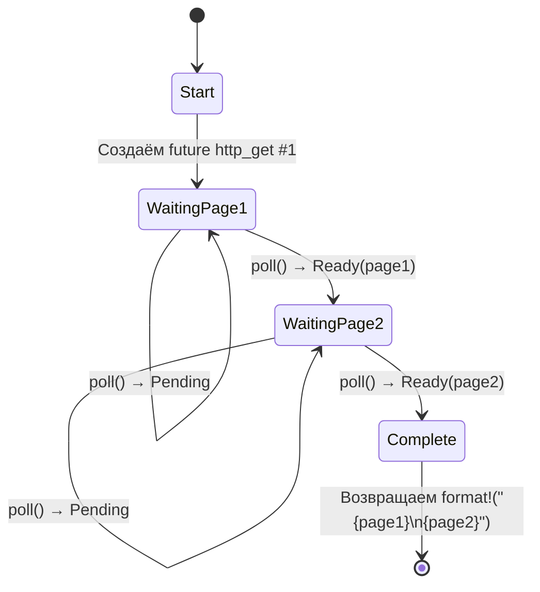

# 5. Раскрываем конечный автомат 🟢

> **Что вы узнаете:**
> - Как компилятор превращает `async fn` в перечисление (enum) — конечный автомат
> - Сравнение бок о бок: исходный код и сгенерированные состояния
> - Почему большие стековые выделения в `async fn` раздувают размер future
> - Оптимизация уничтожения: значения освобождаются, как только больше не нужны

## Что компилятор генерирует на самом деле

Когда вы пишете `async fn`, компилятор превращает ваш последовательно выглядящий код в конечный автомат на основе enum. Понимание этого преобразования — ключ к пониманию производительности асинхронного Rust и многих его особенностей.

### Бок о бок: async fn и конечный автомат

```rust
// Что вы пишете:
async fn fetch_two_pages() -> String {
    let page1 = http_get("https://example.com/a").await;
    let page2 = http_get("https://example.com/b").await;
    format!("{page1}\n{page2}")
}
```

Компилятор генерирует примерно такой код:

```rust
enum FetchTwoPagesStateMachine {
    // Состояние 0: собираемся вызвать http_get для page1
    Start,

    // Состояние 1: ждём page1, удерживая future
    WaitingPage1 {
        fut1: HttpGetFuture,
    },

    // Состояние 2: получили page1, ждём page2
    WaitingPage2 {
        page1: String,
        fut2: HttpGetFuture,
    },

    // Конечное состояние
    Complete,
}

impl Future for FetchTwoPagesStateMachine {
    type Output = String;

    fn poll(mut self: Pin<&mut Self>, cx: &mut Context<'_>) -> Poll<String> {
        loop {
            match self.as_mut().get_mut() {
                Self::Start => {
                    let fut1 = http_get("https://example.com/a");
                    *self.as_mut().get_mut() = Self::WaitingPage1 { fut1 };
                }
                Self::WaitingPage1 { fut1 } => {
                    let page1 = match Pin::new(fut1).poll(cx) {
                        Poll::Ready(v) => v,
                        Poll::Pending => return Poll::Pending,
                    };
                    let fut2 = http_get("https://example.com/b");
                    *self.as_mut().get_mut() = Self::WaitingPage2 { page1, fut2 };
                }
                Self::WaitingPage2 { page1, fut2 } => {
                    let page2 = match Pin::new(fut2).poll(cx) {
                        Poll::Ready(v) => v,
                        Poll::Pending => return Poll::Pending,
                    };
                    let result = format!("{page1}\n{page2}");
                    *self.as_mut().get_mut() = Self::Complete;
                    return Poll::Ready(result);
                }
                Self::Complete => panic!("polled after completion"),
            }
        }
    }
}
```

> **Примечание**: это преобразование *концептуальное*. Реальный вывод компилятора использует
> `unsafe`-проекции Pin — вызовы `get_mut()`, показанные здесь, требуют
> `Unpin`, а async-автоматы являются `!Unpin`. Цель — проиллюстрировать
> переходы между состояниями, а не получить код, который компилируется.



> **Содержимое состояний:**
> - **WaitingPage1** — хранит `fut1: HttpGetFuture` (page2 ещё не выделен)
> - **WaitingPage2** — хранит `page1: String`, `fut2: HttpGetFuture` (fut1 уже уничтожен)

### Почему это важно для производительности

**Нулевая стоимость**: конечный автомат — это enum на стеке. Никаких выделений в куче на каждый future, никакого сборщика мусора, никакого боксинга — если вы явно не используете `Box::pin()`.

**Размер**: размер enum равен максимуму размеров всех его вариантов. Каждая точка `.await` создаёт новый вариант. Это означает:

```rust
async fn small() {
    let a: u8 = 0;
    yield_now().await;
    let b: u8 = 0;
    yield_now().await;
}
// Размер ≈ max(size_of(u8), size_of(u8)) + дискриминант + размеры future
//       ≈ маленький!

async fn big() {
    let buf: [u8; 1_000_000] = [0; 1_000_000]; // 1 МБ на стеке!
    some_io().await;
    process(&buf);
}
// Размер ≈ 1 МБ + размеры вложенных future
// ⚠️ Не размещайте огромные буферы на стеке в async-функциях!
// Используйте Vec<u8> или Box<[u8]>.
```

**Оптимизация уничтожения**: при переходе между состояниями автомат уничтожает значения, которые больше не нужны. В примере выше `fut1` уничтожается при переходе из `WaitingPage1` в `WaitingPage2` — компилятор вставляет уничтожение автоматически.

> **Практическое правило**: большие стековые выделения в `async fn` раздувают размер future.
> Если вы видите переполнение стека в async-коде, проверьте большие массивы или
> глубоко вложенные future. При необходимости используйте `Box::pin()`, чтобы
> разместить вложенные future в куче.

### Упражнение: предскажите конечный автомат

<details>
<summary>🏋️ Упражнение (нажмите, чтобы раскрыть)</summary>

**Задача**: для этой async-функции набросайте конечный автомат, который генерирует компилятор. Сколько у него состояний (вариантов enum)? Какие значения хранятся в каждом?

```rust
async fn pipeline(url: &str) -> Result<usize, Error> {
    let response = fetch(url).await?;
    let body = response.text().await?;
    let parsed = parse(body).await?;
    Ok(parsed.len())
}
```

<details>
<summary>🔑 Решение</summary>

Пять состояний:

1. **Start** — хранит `url`
2. **WaitingFetch** — хранит `url`, future `fetch`
3. **WaitingText** — хранит `response`, future `text()`
4. **WaitingParse** — хранит `body`, future `parse`
5. **Done** — вернул `Ok(parsed.len())`

Каждый `.await` создаёт точку передачи управления = новый вариант enum. Оператор `?` добавляет пути раннего выхода, но не добавляет лишних состояний — это просто `match` по значению `Poll::Ready`.

</details>
</details>

> **Ключевые выводы — раскрываем конечный автомат**
> - `async fn` компилируется в enum с одним вариантом на каждую точку `.await`
> - **Размер** future = максимум размеров всех вариантов — большие значения на стеке его раздувают
> - Компилятор автоматически вставляет **уничтожение** значений при переходах между состояниями
> - Используйте `Box::pin()` или выделение в куче, когда размер future становится проблемой

> **См. также:** [Гл. 4 — Pin и Unpin](ch04-pin-and-unpin.md) — почему сгенерированный enum нужно закреплять, [Гл. 6 — Создаём фьючи вручную](ch06-building-futures-by-hand.md) — построить такие автоматы самостоятельно

***
