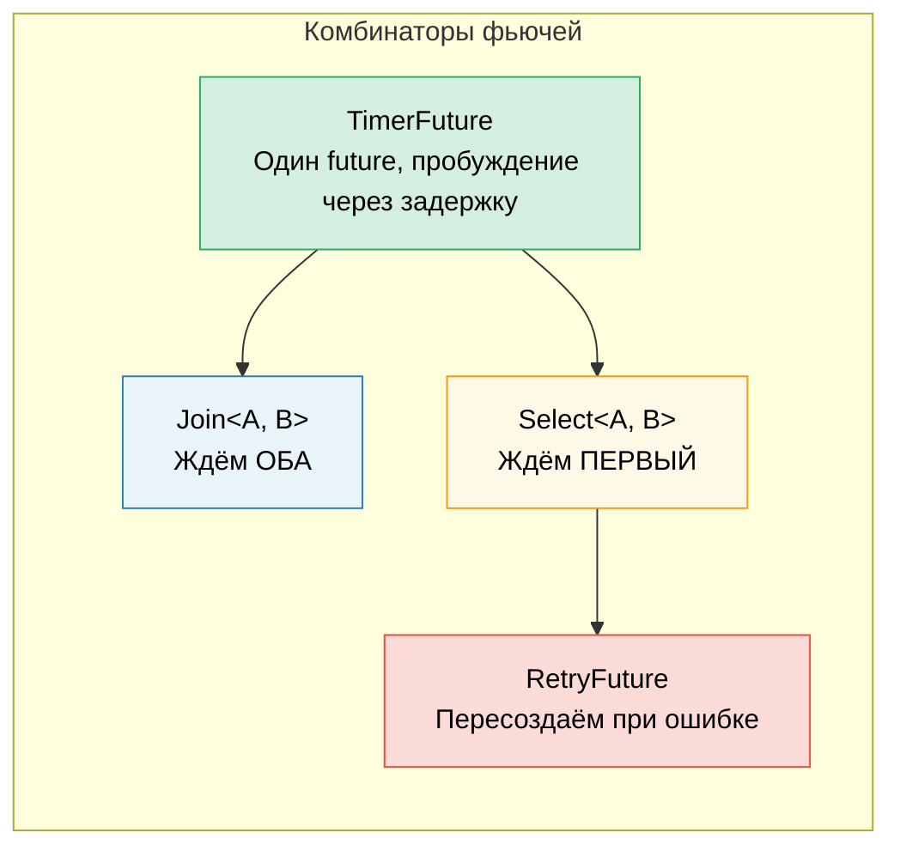

# 6. Создаём фьючи вручную 🟡

> **Что вы узнаете:**
> - Реализация `TimerFuture` с пробуждением через поток
> - Построение комбинатора `Join`: одновременный запуск двух фьючей
> - Построение комбинатора `Select`: гонка двух фьючей
> - Как комбинаторы компонуются — фьючи внутри фьючей до самого низа

## Простой таймер-фьюча

Теперь построим настоящие, полезные фьючи с нуля. Это закрепит теорию из глав 2–5.

### TimerFuture: полный пример

```rust
use std::future::Future;
use std::pin::Pin;
use std::sync::{Arc, Mutex};
use std::task::{Context, Poll, Waker};
use std::thread;
use std::time::{Duration, Instant};

pub struct TimerFuture {
    shared_state: Arc<Mutex<SharedState>>,
}

struct SharedState {
    completed: bool,
    waker: Option<Waker>,
}

impl TimerFuture {
    pub fn new(duration: Duration) -> Self {
        let shared_state = Arc::new(Mutex::new(SharedState {
            completed: false,
            waker: None,
        }));

        // Запускаем поток, который через duration выставит completed=true
        let thread_shared_state = Arc::clone(&shared_state);
        thread::spawn(move || {
            thread::sleep(duration);
            let mut state = thread_shared_state.lock().unwrap();
            state.completed = true;
            if let Some(waker) = state.waker.take() {
                waker.wake(); // Уведомляем исполнитель
            }
        });

        TimerFuture { shared_state }
    }
}

impl Future for TimerFuture {
    type Output = ();

    fn poll(self: Pin<&mut Self>, cx: &mut Context<'_>) -> Poll<()> {
        let mut state = self.shared_state.lock().unwrap();
        if state.completed {
            Poll::Ready(())
        } else {
            // Сохраняем waker, чтобы поток таймера смог нас разбудить
            // ВАЖНО: всегда обновляйте waker — исполнитель мог заменить его
            // между опросами
            state.waker = Some(cx.waker().clone());
            Poll::Pending
        }
    }
}

// Использование:
// async fn example() {
//     println!("Запускаем таймер...");
//     TimerFuture::new(Duration::from_secs(2)).await;
//     println!("Таймер сработал!");
// }
//
// ⚠️ Здесь на каждый таймер создаётся системный поток — для обучения это нормально,
// но в продакшене используйте `tokio::time::sleep`: он работает на общем
// колесе таймеров и не требует дополнительных потоков.
```

### Join: одновременный запуск двух фьючей

`Join` опрашивает два future и завершается, когда *оба* закончились. Так `tokio::join!` работает внутри:

```rust
use std::future::Future;
use std::pin::Pin;
use std::task::{Context, Poll};

/// Опрашивает два future одновременно и возвращает оба результата в кортеже
pub struct Join<A, B>
where
    A: Future,
    B: Future,
{
    a: MaybeDone<A>,
    b: MaybeDone<B>,
}

enum MaybeDone<F: Future> {
    Pending(F),
    Done(F::Output),
    Taken, // Результат уже забран
}

// MaybeDone<F> хранит F::Output, и компилятор не может доказать,
// что он Unpin, даже когда F: Unpin. Поскольку мы используем Join только с Unpin-
// future и никогда не проецируем закрепление на поля, ручная реализация
// Unpin безопасна и позволяет вызывать self.get_mut() в poll().
impl<A: Future + Unpin, B: Future + Unpin> Unpin for Join<A, B> {}

impl<A, B> Join<A, B>
where
    A: Future,
    B: Future,
{
    pub fn new(a: A, b: B) -> Self {
        Join {
            a: MaybeDone::Pending(a),
            b: MaybeDone::Pending(b),
        }
    }
}

impl<A, B> Future for Join<A, B>
where
    A: Future + Unpin,
    B: Future + Unpin,
{
    type Output = (A::Output, B::Output);

    fn poll(self: Pin<&mut Self>, cx: &mut Context<'_>) -> Poll<Self::Output> {
        let this = self.get_mut();

        // Опрашиваем A, если он ещё не завершён
        if let MaybeDone::Pending(ref mut fut) = this.a {
            if let Poll::Ready(val) = Pin::new(fut).poll(cx) {
                this.a = MaybeDone::Done(val);
            }
        }

        // Опрашиваем B, если он ещё не завершён
        if let MaybeDone::Pending(ref mut fut) = this.b {
            if let Poll::Ready(val) = Pin::new(fut).poll(cx) {
                this.b = MaybeDone::Done(val);
            }
        }

        // Оба готовы?
        match (&this.a, &this.b) {
            (MaybeDone::Done(_), MaybeDone::Done(_)) => {
                // Забираем оба результата
                let a_val = match std::mem::replace(&mut this.a, MaybeDone::Taken) {
                    MaybeDone::Done(v) => v,
                    _ => unreachable!(),
                };
                let b_val = match std::mem::replace(&mut this.b, MaybeDone::Taken) {
                    MaybeDone::Done(v) => v,
                    _ => unreachable!(),
                };
                Poll::Ready((a_val, b_val))
            }
            _ => Poll::Pending, // Хотя бы один ещё ожидает
        }
    }
}

// Использование (async-блоки являются !Unpin, поэтому оборачиваем их в Box::pin):
// let (page1, page2) = Join::new(
//     Box::pin(http_get("https://example.com/a")),
//     Box::pin(http_get("https://example.com/b")),
// ).await;
// Оба запроса выполняются одновременно!
```

> **Ключевая мысль**: «одновременно» здесь означает *чередование на одном потоке*.
> Join не создаёт потоков — он опрашивает оба future в одном и том же вызове `poll()`.
> Это кооперативная конкурентность, а не параллелизм.



### Select: гонка двух фьючей

`Select` завершается, когда *любой* из future закончился первым (второй уничтожается):

```rust
use std::future::Future;
use std::pin::Pin;
use std::task::{Context, Poll};

pub enum Either<A, B> {
    Left(A),
    Right(B),
}

/// Возвращает тот future, который завершился первым; второй уничтожает
pub struct Select<A, B> {
    a: A,
    b: B,
}

impl<A, B> Select<A, B>
where
    A: Future + Unpin,
    B: Future + Unpin,
{
    pub fn new(a: A, b: B) -> Self {
        Select { a, b }
    }
}

impl<A, B> Future for Select<A, B>
where
    A: Future + Unpin,
    B: Future + Unpin,
{
    type Output = Either<A::Output, B::Output>;

    fn poll(mut self: Pin<&mut Self>, cx: &mut Context<'_>) -> Poll<Self::Output> {
        // Сначала опрашиваем A
        if let Poll::Ready(val) = Pin::new(&mut self.a).poll(cx) {
            return Poll::Ready(Either::Left(val));
        }

        // Затем опрашиваем B
        if let Poll::Ready(val) = Pin::new(&mut self.b).poll(cx) {
            return Poll::Ready(Either::Right(val));
        }

        Poll::Pending
    }
}

// Использование с таймаутом:
// match Select::new(http_get(url), TimerFuture::new(timeout)).await {
//     Either::Left(response) => println!("Получен ответ: {}", response),
//     Either::Right(()) => println!("Запрос просрочен по таймауту!"),
// }
```

> **Замечание о справедливости**: наш `Select` всегда опрашивает A первым — если готовы оба, всегда побеждает A.
> Макрос `select!` в tokio рандомизирует порядок опроса, чтобы обеспечить справедливость.

<details>
<summary><strong>🏋️ Упражнение: реализуйте RetryFuture</strong> (нажмите, чтобы раскрыть)</summary>

**Задача**: реализуйте `RetryFuture<F, Fut>`, который принимает замыкание `F: Fn() -> Fut` и повторяет попытку до N раз, если внутренний future возвращает `Err`. Он должен вернуть первый `Ok` или последний `Err`.

*Подсказка*: понадобятся состояния «выполняется попытка» и «все попытки исчерпаны».

<details>
<summary>🔑 Решение</summary>

```rust
use std::future::Future;
use std::pin::Pin;
use std::task::{Context, Poll};

pub struct RetryFuture<F, Fut, T, E>
where
    F: Fn() -> Fut,
    Fut: Future<Output = Result<T, E>>,
{
    factory: F,
    current: Option<Pin<Box<Fut>>>,
    remaining: usize,
    last_error: Option<E>,
}

impl<F, Fut, T, E> RetryFuture<F, Fut, T, E>
where
    F: Fn() -> Fut,
    Fut: Future<Output = Result<T, E>>,
{
    pub fn new(max_attempts: usize, factory: F) -> Self {
        let current = Some(Box::pin((factory)()));
        RetryFuture {
            factory,
            current,
            remaining: max_attempts.saturating_sub(1),
            last_error: None,
        }
    }
}

impl<F, Fut, T, E> Future for RetryFuture<F, Fut, T, E>
where
    F: Fn() -> Fut + Unpin,
    Fut: Future<Output = Result<T, E>>,
    E: Unpin,
{
    type Output = Result<T, E>;

    fn poll(mut self: Pin<&mut Self>, cx: &mut Context<'_>) -> Poll<Self::Output> {
        // Pin<Box<Fut>> всегда Unpin, поэтому структура Unpin, когда Unpin F и E.
        // Это позволяет безопасно использовать get_mut() без unsafe-кода.
        loop {
            if let Some(ref mut fut) = self.current {
                match fut.as_mut().poll(cx) {
                    Poll::Ready(Ok(val)) => return Poll::Ready(Ok(val)),
                    Poll::Ready(Err(e)) => {
                        self.last_error = Some(e);
                        if self.remaining > 0 {
                            self.remaining -= 1;
                            self.current = Some(Box::pin((self.factory)()));
                            // Возвращаемся в цикл, чтобы сразу опросить новый future
                        } else {
                            return Poll::Ready(Err(self.last_error.take().unwrap()));
                        }
                    }
                    Poll::Pending => return Poll::Pending,
                }
            } else {
                return Poll::Ready(Err(self.last_error.take().unwrap()));
            }
        }
    }
}

// Использование:
// let result = RetryFuture::new(3, || async {
//     http_get("https://flaky-server.com/api").await
// }).await;
```

**Ключевой вывод**: сам future для повторов — это конечный автомат: он хранит текущую попытку и создаёт новые внутренние future при ошибке. Оборачивание внутреннего future в `Pin<Box<Fut>>` снимает ограничение `Fut: Unpin` — поскольку `Pin<Box<T>>` всегда `Unpin`, со структурой легко работать, и при этом она поддерживает любой тип future. Так компонуются комбинаторы — фьючи внутри фьючей до самого низа.

</details>
</details>

> **Ключевые выводы — создаём фьючи вручную**
> - Future нужны три вещи: состояние, реализация `poll()` и регистрация waker
> - `Join` опрашивает оба вложенных future; `Select` возвращает тот, что завершится первым
> - Комбинаторы — это сами фьючи, оборачивающие другие фьючи: и так до самого низа
> - Построение фьючей вручную даёт глубокое понимание, но в продакшене используйте `tokio::join!`/`select!`

> **См. также:** [Гл. 2 — Трейт Future](ch02-the-future-trait.md) — определение трейта, [Гл. 8 — Глубокое погружение в Tokio](ch08-tokio-deep-dive.md) — продакшен-аналоги

***
