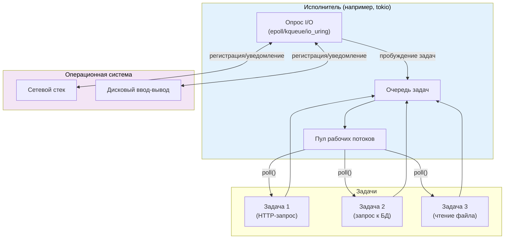
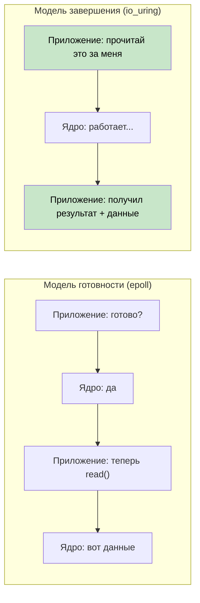
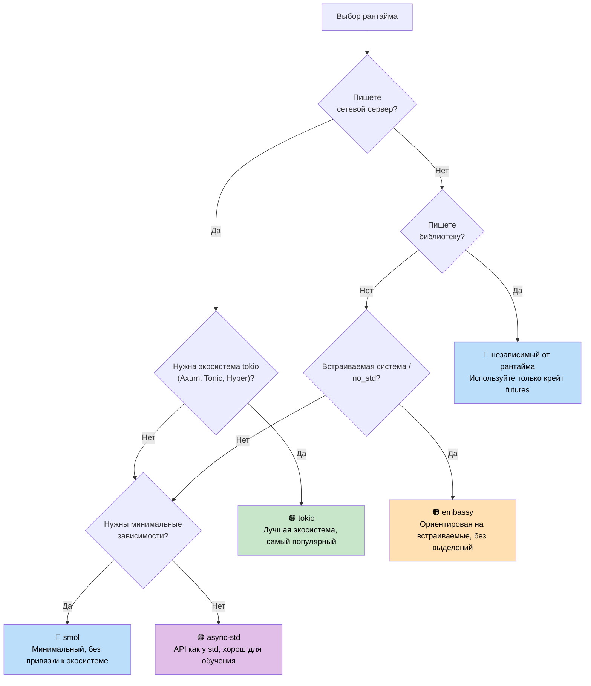

# 7. Исполнители и рантаймы 🟡

> **Что вы узнаете:**
> - Что делает исполнитель: опрашивает future и эффективно засыпает
> - Шесть основных рантаймов: mio, io_uring, tokio, async-std, smol, embassy
> - Дерево решений для выбора подходящего рантайма
> - Почему важен дизайн библиотек, не привязанных к рантайму

## Что делает исполнитель

У исполнителя две задачи:
1. **Опрашивать future**, когда они готовы продвинуться дальше
2. **Эффективно засыпать**, когда ни один future не готов (используя API уведомлений ввода-вывода ОС)



### mio: базовый слой

[mio](https://github.com/tokio-rs/mio) (Metal I/O) — это не исполнитель, а самая низкоуровневая кроссплатформенная библиотека уведомлений о вводе-выводе. Она оборачивает `epoll` (Linux), `kqueue` (macOS/BSD) и IOCP (Windows).

```rust
// Условное использование mio (упрощённо):
use mio::{Events, Interest, Poll, Token};
use mio::net::TcpListener;

let mut poll = Poll::new()?;
let mut events = Events::with_capacity(128);

let mut server = TcpListener::bind("0.0.0.0:8080")?;
poll.registry().register(&mut server, Token(0), Interest::READABLE)?;

// Цикл событий — блокируется, пока что-нибудь не произойдёт
loop {
    poll.poll(&mut events, None)?; // Спим до события ввода-вывода
    for event in events.iter() {
        match event.token() {
            Token(0) => { /* у сервера новое соединение */ }
            _ => { /* другой ввод-вывод готов */ }
        }
    }
}
```

Большинство разработчиков никогда не работают с mio напрямую — tokio и smol строятся поверх него.

### io_uring: завершение как основа

`io_uring` в Linux (ядро 5.1+) — это принципиальный сдвиг по сравнению с моделью ввода-вывода на основе готовности, которую используют mio/epoll:

```text
На основе готовности (epoll / mio / tokio):
  1. Спрашиваем: «Можно ли читать из этого сокета?»  → epoll_wait()
  2. Ядро: «Да, готов»                                → событие EPOLLIN
  3. Приложение: read(fd, buf)                        → может всё ещё ненадолго заблокироваться!

На основе завершения (io_uring):
  1. Отправляем: «Прочитай из этого сокета в этот буфер»  → SQE
  2. Ядро: выполняет чтение асинхронно
  3. Приложение: получает готовый результат с данными     → CQE
```



**Проблема владения**: io_uring требует, чтобы ядро владело буфером до завершения операции. Это конфликтует со стандартным трейтом `AsyncRead` в Rust, который заимствует буфер. Поэтому в `tokio-uring` другие трейты ввода-вывода:

```rust
// Стандартный tokio (на основе готовности) — заимствует буфер:
let n = stream.read(&mut buf).await?;  // buf заимствован

// tokio-uring (на основе завершения) — забирает владение буфером:
let (result, buf) = stream.read(buf).await;  // buf передан внутрь и возвращён обратно
let n = result?;
```

```rust
// Cargo.toml: tokio-uring = "0.5"
// ЗАМЕТЬТЕ: только Linux, требуется ядро 5.1+

fn main() {
    tokio_uring::start(async {
        let file = tokio_uring::fs::File::open("data.bin").await.unwrap();
        let buf = vec![0u8; 4096];
        let (result, buf) = file.read_at(buf, 0).await;
        let bytes_read = result.unwrap();
        println!("Прочитано байт: {}: {:?}", bytes_read, &buf[..bytes_read]);
    });
}
```

| Аспект | epoll (tokio) | io_uring (tokio-uring) |
|--------|--------------|----------------------|
| **Модель** | Уведомление о готовности | Уведомление о завершении |
| **Системные вызовы** | epoll_wait + read/write | Пакетное кольцо SQE/CQE |
| **Владение буфером** | Приложение сохраняет (&mut buf) | Передача владения (move buf) |
| **Платформа** | Linux, macOS (kqueue), Windows (IOCP) | Только Linux 5.1+ |
| **Zero-copy** | Нет (копирование в пользовательском пространстве) | Да (зарегистрированные буферы) |
| **Зрелость** | Готов к продакшену | Экспериментальный |

> **Когда использовать io_uring**: высокопроизводительный файловый ввод-вывод или сеть, где узким местом становятся накладные расходы системных вызовов (базы данных, движки хранения, прокси на 100k+ соединений). Для большинства приложений правильный выбор — стандартный tokio с epoll.

### tokio: рантайм «всё в комплекте»

Доминирующий асинхронный рантайм в экосистеме Rust. Используется в Axum, Hyper, Tonic и большинстве продакшен-серверов на Rust.

```rust
// Cargo.toml:
// [dependencies]
// tokio = { version = "1", features = ["full"] }

#[tokio::main]
async fn main() {
    // Запускает многопоточный рантайм с планировщиком work-stealing
    let handle = tokio::spawn(async {
        tokio::time::sleep(std::time::Duration::from_secs(1)).await;
        "done"
    });

    let result = handle.await.unwrap();
    println!("{result}");
}
```

**Возможности tokio**: таймеры, ввод-вывод, TCP/UDP, Unix-сокеты, обработка сигналов, примитивы синхронизации (Mutex, RwLock, Semaphore, каналы), fs, process, интеграция с tracing.

### async-std: зеркало стандартной библиотеки

Повторяет API `std` в асинхронных версиях. Менее популярен, чем tokio, но проще для начинающих.

```rust
// Cargo.toml:
// [dependencies]
// async-std = { version = "1", features = ["attributes"] }

#[async_std::main]
async fn main() {
    use async_std::fs;
    let content = fs::read_to_string("hello.txt").await.unwrap();
    println!("{content}");
}
```

### smol: минималистичный рантайм

Небольшой асинхронный рантайм без зависимостей. Отлично подходит для библиотек, которые хотят async, но не хотят тянуть tokio.

```rust
// Cargo.toml:
// [dependencies]
// smol = "2"

fn main() {
    smol::block_on(async {
        let result = smol::unblock(|| {
            // Выполняет блокирующий код в пуле потоков
            std::fs::read_to_string("hello.txt")
        }).await.unwrap();
        println!("{result}");
    });
}
```

### embassy: async для встраиваемых систем (no_std)

Асинхронный рантайм для встраиваемых систем. Без выделения памяти в куче, `std` не нужен.

```rust
// Работает на микроконтроллерах (например, STM32, nRF52, RP2040)
#[embassy_executor::main]
async fn main(spawner: embassy_executor::Spawner) {
    // Мигаем светодиодом через async/await — RTOS не нужна!
    let mut led = Output::new(p.PA5, Level::Low, Speed::Low);
    loop {
        led.set_high();
        Timer::after(Duration::from_millis(500)).await;
        led.set_low();
        Timer::after(Duration::from_millis(500)).await;
    }
}
```

### Дерево решений по выбору рантайма



### Сравнительная таблица рантаймов

| Характеристика | tokio | async-std | smol | embassy |
|----------------|-------|-----------|------|---------|
| **Экосистема** | Доминирующая | Небольшая | Минимальная | Встраиваемая |
| **Многопоточность** | ✅ Work-stealing | ✅ | ✅ | ❌ (одно ядро) |
| **no_std** | ❌ | ❌ | ❌ | ✅ |
| **Таймер** | ✅ Встроенный | ✅ Встроенный | Через `async-io` | ✅ На основе HAL |
| **Ввод-вывод** | ✅ Собственные абстракции | ✅ Зеркало std | ✅ Через `async-io` | ✅ Драйверы HAL |
| **Каналы** | ✅ Богатый набор | ✅ | Через `async-channel` | ✅ |
| **Порог входа** | Средний | Низкий | Низкий | Высокий (железо) |
| **Размер бинарника** | Большой | Средний | Маленький | Крошечный |

<details>
<summary><strong>🏋️ Упражнение: сравнение рантаймов</strong> (нажмите, чтобы раскрыть)</summary>

**Задача**: напишите одну и ту же программу на трёх разных рантаймах (tokio, smol и async-std). Программа должна:
1. Получить URL (имитируется через sleep)
2. Прочитать файл (имитируется через sleep)
3. Вывести оба результата

Это упражнение показывает, что код async/await одинаков — меняется только настройка рантайма.

<details>
<summary>🔑 Решение</summary>

```rust
// ----- версия для tokio -----
// Cargo.toml: tokio = { version = "1", features = ["full"] }
#[tokio::main]
async fn main() {
    let (url_result, file_result) = tokio::join!(
        async {
            tokio::time::sleep(std::time::Duration::from_millis(100)).await;
            "Ответ с URL"
        },
        async {
            tokio::time::sleep(std::time::Duration::from_millis(50)).await;
            "Содержимое файла"
        },
    );
    println!("URL: {url_result}, Файл: {file_result}");
}

// ----- версия для smol -----
// Cargo.toml: smol = "2", futures-lite = "2"
fn main() {
    smol::block_on(async {
        let (url_result, file_result) = futures_lite::future::zip(
            async {
                smol::Timer::after(std::time::Duration::from_millis(100)).await;
                "Ответ с URL"
            },
            async {
                smol::Timer::after(std::time::Duration::from_millis(50)).await;
                "Содержимое файла"
            },
        ).await;
        println!("URL: {url_result}, Файл: {file_result}");
    });
}

// ----- версия для async-std -----
// Cargo.toml: async-std = { version = "1", features = ["attributes"] }
#[async_std::main]
async fn main() {
    let (url_result, file_result) = futures::future::join(
        async {
            async_std::task::sleep(std::time::Duration::from_millis(100)).await;
            "Ответ с URL"
        },
        async {
            async_std::task::sleep(std::time::Duration::from_millis(50)).await;
            "Содержимое файла"
        },
    ).await;
    println!("URL: {url_result}, Файл: {file_result}");
}
```

**Ключевой вывод**: асинхронная бизнес-логика одинакова во всех рантаймах. Различаются только точка входа и API таймеров/ввода-вывода. Поэтому написание библиотек, не привязанных к рантайму (использующих только `std::future::Future`), так ценно.

</details>
</details>

> **Ключевые выводы — исполнители и рантаймы**
> - Работа исполнителя: опрашивать future при пробуждении и эффективно засыпать, используя API ввода-вывода ОС
> - **tokio** — выбор по умолчанию для серверов; **smol** — для минимального отпечатка; **embassy** — для встраиваемых систем
> - Ваша бизнес-логика должна зависеть от `std::future::Future`, а не от конкретного рантайма
> - io_uring (Linux 5.1+) — будущее высокопроизводительного ввода-вывода, но экосистема ещё созревает

> **См. также:** [Гл. 8 — Глубокое погружение в Tokio](ch08-tokio-deep-dive.md) — специфика tokio, [Гл. 9 — Когда Tokio не подходит](ch09-when-tokio-isnt-the-right-fit.md) — альтернативы

***
