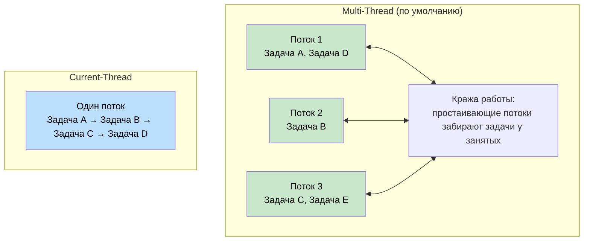
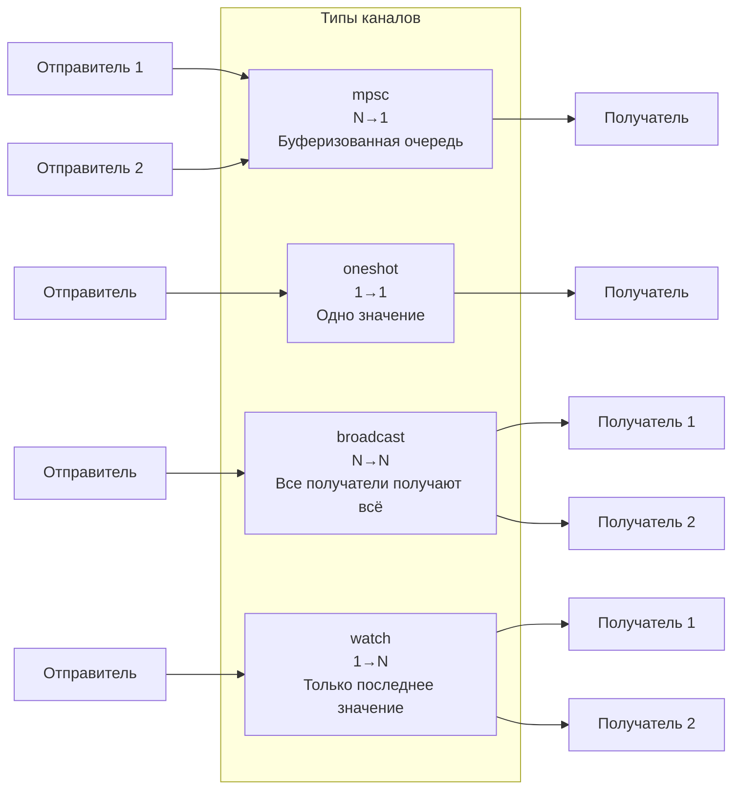
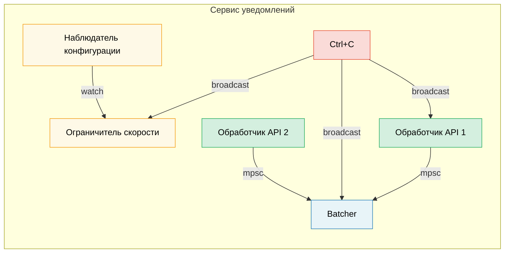

# 8. Глубокое погружение в Tokio 🟡

> **Что вы узнаете:**
> - Варианты рантайма: multi-thread и current-thread и когда какой использовать
> - `tokio::spawn`, требование `'static` и `JoinHandle`
> - Семантика отмены задач (отмена при уничтожении)
> - Примитивы синхронизации: Mutex, RwLock, Semaphore и все четыре типа каналов

## Варианты рантайма: multi-thread и current-thread

Tokio предлагает две конфигурации рантайма:

```rust
// Многопоточный (по умолчанию с #[tokio::main])
// Использует пул потоков с work-stealing — задачи могут переходить между потоками
#[tokio::main]
async fn main() {
    // N рабочих потоков (по умолчанию — количество ядер CPU)
    // Задачи должны быть Send + 'static
}

// Current-thread — всё выполняется в одном потоке
#[tokio::main(flavor = "current_thread")]
async fn main() {
    // Однопоточный — задачам не нужен Send
    // Легче по весу, подходит для простых утилит или WASM
}

// Ручное создание рантайма:
let rt = tokio::runtime::Builder::new_multi_thread()
    .worker_threads(4)
    .enable_all()
    .build()
    .unwrap();

rt.block_on(async {
    println!("Работаем на своём рантайме");
});
```



### tokio::spawn и требование 'static

`tokio::spawn` помещает future в очередь задач рантайма. Поскольку он может выполняться на *любом* рабочем потоке в *любой* момент, future должен быть `Send + 'static`:

```rust
use tokio::task;

async fn example() {
    let data = String::from("hello");

    // ✅ Работает: передаём владение в задачу
    let handle = task::spawn(async move {
        println!("{data}");
        data.len()
    });

    let len = handle.await.unwrap();
    println!("Длина: {len}");
}

async fn problem() {
    let data = String::from("hello");

    // ❌ НЕ РАБОТАЕТ: data заимствован, а не 'static
    // task::spawn(async {
    //     println!("{data}"); // заимствует `data` — не 'static
    // });

    // ❌ НЕ РАБОТАЕТ: Rc не является Send
    // let rc = std::rc::Rc::new(42);
    // task::spawn(async move {
    //     println!("{rc}"); // Rc — !Send, нельзя пересечь границу потока
    // });
}
```

**Почему `'static`?** Порождённая задача выполняется независимо — она может пережить область видимости, в которой была создана. Компилятор не может доказать, что ссылки останутся действительными, поэтому требуются данные, которыми задача владеет.

**Почему `Send`?** Задачу могут возобновить на другом потоке, а не на том, где её приостановили. Все данные, которые хранятся через точки `.await`, должны безопасно передаваться между потоками.

```rust
// Типичный паттерн: клонируем общие данные в задачу
let shared = Arc::new(config);

for i in 0..10 {
    let shared = Arc::clone(&shared); // Клонируем Arc, а не данные
    tokio::spawn(async move {
        process_item(i, &shared).await;
    });
}
```

### JoinHandle и отмена задач

```rust
use tokio::task::JoinHandle;
use tokio::time::{sleep, Duration};

async fn cancellation_example() {
    let handle: JoinHandle<String> = tokio::spawn(async {
        sleep(Duration::from_secs(10)).await;
        "completed".to_string()
    });

    // Отменить задачу, уничтожив handle? НЕТ — задача продолжит работать!
    // drop(handle); // Задача продолжает выполняться в фоне

    // Чтобы действительно отменить, вызовите abort():
    handle.abort();

    // Ожидание отменённой задачи возвращает JoinError
    match handle.await {
        Ok(val) => println!("Получено: {val}"),
        Err(e) if e.is_cancelled() => println!("Задача отменена"),
        Err(e) => println!("Задача завершилась паникой: {e}"),
    }
}
```

> **Важно**: уничтожение `JoinHandle` НЕ отменяет задачу в tokio.
> Задача становится *отсоединённой* и продолжает работать. Чтобы её отменить, нужно явно вызвать
> `.abort()`. Это отличается от уничтожения `Future` напрямую,
> которое действительно отменяет (уничтожает) базовое вычисление.

### Примитивы синхронизации Tokio

Tokio предоставляет примитивы синхронизации, которые понимают async. Ключевой принцип: **не используйте `std::sync::Mutex` через точки `.await`**.

```rust
use tokio::sync::{Mutex, RwLock, Semaphore, mpsc, oneshot, broadcast, watch};

// --- Mutex ---
// Асинхронный мьютекс: метод lock() асинхронный и не блокирует поток
let data = Arc::new(Mutex::new(vec![1, 2, 3]));
{
    let mut guard = data.lock().await; // Неблокирующая блокировка
    guard.push(4);
} // Guard уничтожен здесь — блокировка снята

// --- Каналы ---
// mpsc: несколько отправителей, один получатель
let (tx, mut rx) = mpsc::channel::<String>(100); // Буфер ограниченного размера

tokio::spawn(async move {
    tx.send("hello".into()).await.unwrap();
});

let msg = rx.recv().await.unwrap();

// oneshot: одно значение, один получатель
let (tx, rx) = oneshot::channel::<i32>();
tx.send(42).unwrap(); // await не нужен — либо отправляет, либо ошибка
let val = rx.await.unwrap();

// broadcast: несколько отправителей, несколько получателей (каждый получает все сообщения)
let (tx, _) = broadcast::channel::<String>(100);
let mut rx1 = tx.subscribe();
let mut rx2 = tx.subscribe();

// watch: одно значение, несколько получателей (только последнее значение)
let (tx, rx) = watch::channel(0u64);
tx.send(42).unwrap();
println!("Последнее значение: {}", *rx.borrow());
```

> **Примечание:** `.unwrap()` в примерах с каналами используется для краткости.
> В продакшене обрабатывайте ошибки отправки и получения аккуратно: неудачный `.send()` означает,
> что получатель уже уничтожен, а неудачный `.recv()` — что канал закрыт.



## Разбор кейса: выбор канала для сервиса уведомлений

Вы создаёте сервис уведомлений, где:
- Несколько обработчиков API порождают события
- Одна фоновая задача группирует их в пакеты и отправляет
- Наблюдатель за конфигурацией обновляет лимиты скорости во время работы
- Сигнал остановки должен дойти до всех компонентов

**Какой канал для каждого случая?**

| Требование | Канал | Почему |
|------------|-------|--------|
| Обработчики API → Batcher | `mpsc` (ограниченный) | N отправителей, 1 получатель. Ограничение нужно для backpressure — если batcher отстаёт, обработчики API замедляются вместо переполнения памяти (OOM) |
| Наблюдатель конфигурации → Ограничитель скорости | `watch` | Важна только последняя конфигурация. Несколько читателей (каждый воркер) видят текущее значение |
| Сигнал остановки → Все компоненты | `broadcast` | Каждый компонент должен независимо получить уведомление об остановке |
| Ответ на единичную проверку здоровья | `oneshot` | Шаблон запрос/ответ — одно значение, и всё |



<details>
<summary><strong>🏋️ Упражнение: пул задач</strong> (нажмите, чтобы раскрыть)</summary>

**Задача**: реализуйте функцию `run_with_limit`, которая принимает список асинхронных замыканий и лимит конкурентности и выполняет не более N задач одновременно. Используйте `tokio::sync::Semaphore`.

<details>
<summary>🔑 Решение</summary>

```rust
use std::future::Future;
use std::sync::Arc;
use tokio::sync::Semaphore;

async fn run_with_limit<F, Fut, T>(tasks: Vec<F>, limit: usize) -> Vec<T>
where
    F: FnOnce() -> Fut + Send + 'static,
    Fut: Future<Output = T> + Send + 'static,
    T: Send + 'static,
{
    let semaphore = Arc::new(Semaphore::new(limit));
    let mut handles = Vec::new();

    for task in tasks {
        let permit = Arc::clone(&semaphore);
        let handle = tokio::spawn(async move {
            let _permit = permit.acquire().await.unwrap();
            // Разрешение удерживается, пока выполняется задача, затем освобождается
            task().await
        });
        handles.push(handle);
    }

    let mut results = Vec::new();
    for handle in handles {
        results.push(handle.await.unwrap());
    }
    results
}

// Использование:
// let tasks: Vec<_> = urls.into_iter().map(|url| {
//     move || async move { fetch(url).await }
// }).collect();
// let results = run_with_limit(tasks, 10).await; // Не более 10 одновременно
```

**Ключевой вывод**: `Semaphore` — стандартный способ ограничить конкурентность в tokio. Каждая задача получает разрешение перед началом работы. Когда семафор заполнен, новые задачи асинхронно (без блокировки потока) ждут, пока не освободится слот.

</details>
</details>

> **Ключевые выводы — глубокое погружение в Tokio**
> - Используйте `multi_thread` для серверов (по умолчанию); `current_thread` — для CLI-утилит, тестов или типов `!Send`
> - `tokio::spawn` требует future типа `'static` — для совместного использования данных применяйте `Arc` или каналы
> - Уничтожение `JoinHandle` **не** отменяет задачу — вызывайте `.abort()` явно
> - Выбирайте примитивы синхронизации по потребности: `Mutex` для общего состояния, `Semaphore` для лимитов конкурентности, `mpsc`/`oneshot`/`broadcast`/`watch` для обмена сообщениями

> **См. также:** [Гл. 9 — Когда Tokio не подходит](ch09-when-tokio-isnt-the-right-fit.md) — альтернативы spawn, [Гл. 12 — Типичные ловушки](ch12-common-pitfalls.md) — ошибки с MutexGuard через await

***
