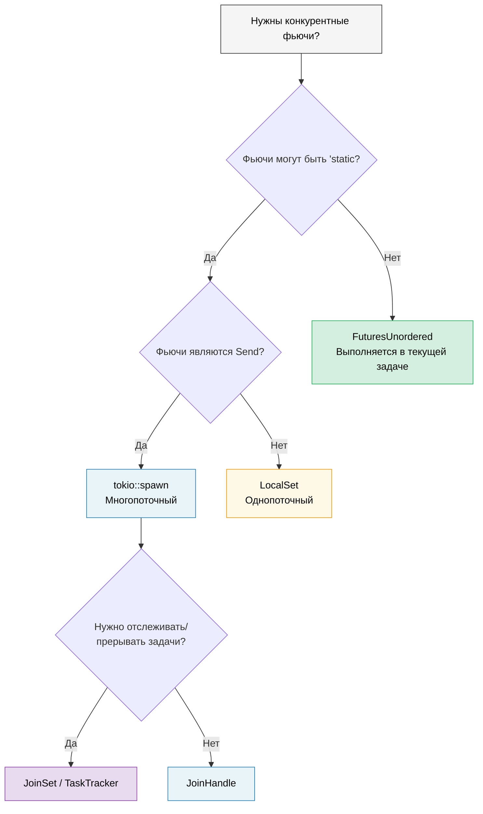

# 9. Когда Tokio не подходит 🟡

> **Что вы узнаете:**
> - Проблему `'static`: когда `tokio::spawn` заставляет использовать `Arc` повсюду
> - `LocalSet` для фьючей типа `!Send`
> - `FuturesUnordered` для конкурентности, дружественной к заимствованиям (без spawn)
> - `JoinSet` для управляемых групп задач
> - Написание библиотек, не привязанных к рантайму



## Проблема 'static у фьючей

`spawn` в Tokio требует future типа `'static`. Это значит, что в порождённых задачах нельзя заимствовать локальные данные:

```rust
async fn process_items(items: &[String]) {
    // ❌ Так нельзя — items заимствован, а не 'static
    // for item in items {
    //     tokio::spawn(async {
    //         process(item).await;
    //     });
    // }

    // 😐 Обходной путь 1: клонировать всё
    for item in items {
        let item = item.clone();
        tokio::spawn(async move {
            process(&item).await;
        });
    }

    // 😐 Обходной путь 2: использовать Arc
    let items = Arc::new(items.to_vec());
    for i in 0..items.len() {
        let items = Arc::clone(&items);
        tokio::spawn(async move {
            process(&items[i]).await;
        });
    }
}
```

Это раздражает! В Go можно просто написать `go func() { use(item) }` с замыканием. В Rust система владения заставляет думать о том, кому что принадлежит и как долго это живёт.

### Альтернативы `tokio::spawn`

Не каждая задача требует `spawn`. Вот три инструмента, каждый из которых решает
*другое* ограничение:

```rust
// 1. FuturesUnordered — полностью обходит 'static (без spawn!)
use futures::stream::{FuturesUnordered, StreamExt};

async fn process_items(items: &[String]) {
    let futures: FuturesUnordered<_> = items
        .iter()
        .map(|item| async move {
            // ✅ Может заимствовать item — ни spawn, ни 'static не нужны!
            process(item).await
        })
        .collect();

    // Доводим все фьючи до завершения
    futures.for_each(|result| async move {
        println!("Результат: {result:?}");
    }).await;
}

// 2. tokio::task::LocalSet — запускает фьючи !Send в текущем потоке
//    ⚠️  Всё ещё требует 'static — решает Send, а не 'static
use tokio::task::LocalSet;

let local_set = LocalSet::new();
local_set.run_until(async {
    tokio::task::spawn_local(async {
        // Здесь можно использовать Rc, Cell и другие типы !Send
        let rc = std::rc::Rc::new(42);
        println!("{rc}");
    }).await.unwrap();
}).await;

// 3. JoinSet в tokio (tokio 1.21+) — управляемый набор порождённых задач
//    ⚠️  Всё ещё требует 'static + Send — решает управление задачами,
//    а не проблему 'static. Полезен для отслеживания, прерывания и
//    ожидания динамической группы задач.
use tokio::task::JoinSet;

async fn with_joinset() {
    let mut set = JoinSet::new();

    for i in 0..10 {
        // i — Copy и перемещается в замыкание, поэтому он уже 'static.
        // Для заимствованных данных всё равно понадобятся Arc или clone.
        set.spawn(async move {
            tokio::time::sleep(Duration::from_millis(100)).await;
            i * 2
        });
    }

    while let Some(result) = set.join_next().await {
        println!("Задача завершена: {:?}", result.unwrap());
    }
}
```

> **Какой инструмент решает какую проблему?**
>
> | Ограничение, с которым вы столкнулись | Инструмент | Обходит `'static`? | Обходит `Send`? |
> |---|---|---|---|
> | Нельзя сделать фьючи `'static` | `FuturesUnordered` | ✅ Да | ✅ Да |
> | Фьючи `'static`, но `!Send` | `LocalSet` | ❌ Нет | ✅ Да |
> | Нужно отслеживать / прерывать порождённые задачи | `JoinSet` | ❌ Нет | ❌ Нет |

### Лёгкие рантаймы для библиотек

Если вы пишете библиотеку — не заставляйте пользователей использовать tokio:

```rust
// ❌ ПЛОХО: библиотека навязывает tokio пользователям
pub async fn my_lib_function() {
    tokio::time::sleep(Duration::from_secs(1)).await;
    // Теперь твои пользователи ОБЯЗАНЫ использовать tokio
}

// ✅ ХОРОШО: библиотека не привязана к рантайму
pub async fn my_lib_function() {
    // Используем только типы из std::future и крейта futures
    do_computation().await;
}

// ✅ ХОРОШО: принимаем обобщённую фьючу для операций ввода-вывода
pub async fn fetch_with_retry<F, Fut, T, E>(
    operation: F,
    max_retries: usize,
) -> Result<T, E>
where
    F: Fn() -> Fut,
    Fut: Future<Output = Result<T, E>>,
{
    for attempt in 0..max_retries {
        match operation().await {
            Ok(val) => return Ok(val),
            Err(e) if attempt == max_retries - 1 => return Err(e),
            Err(_) => continue,
        }
    }
    unreachable!()
}
```

> **Эмпирическое правило**: библиотеки должны зависеть от крейта `futures`, а не от `tokio`.
> Приложения должны зависеть от `tokio` (или от выбранного рантайма).
> Так экосистема остаётся компонуемой.

<details>
<summary><strong>🏋️ Упражнение: FuturesUnordered против spawn</strong> (нажмите, чтобы раскрыть)</summary>

**Задача**: напишите одну и ту же функцию двумя способами — один раз с `tokio::spawn` (требует `'static`) и один раз с `FuturesUnordered` (заимствует данные). Функция получает `&[String]` и возвращает длину каждой строки после имитации асинхронного поиска.

Сравните: какой подход требует `.clone()`? Какой может заимствовать входной срез?

<details>
<summary>🔑 Решение</summary>

```rust
use futures::stream::{FuturesUnordered, StreamExt};
use tokio::time::{sleep, Duration};

// Версия 1: tokio::spawn — требует 'static, нужно клонирование
async fn lengths_with_spawn(items: &[String]) -> Vec<usize> {
    let mut handles = Vec::new();
    for item in items {
        let owned = item.clone(); // Обязательно клонируем — spawn требует 'static
        handles.push(tokio::spawn(async move {
            sleep(Duration::from_millis(10)).await;
            owned.len()
        }));
    }

    let mut results = Vec::new();
    for handle in handles {
        results.push(handle.await.unwrap());
    }
    results
}

// Версия 2: FuturesUnordered — заимствует данные, клонирование не нужно
async fn lengths_without_spawn(items: &[String]) -> Vec<usize> {
    let futures: FuturesUnordered<_> = items
        .iter()
        .map(|item| async move {
            sleep(Duration::from_millis(10)).await;
            item.len() // ✅ Заимствует item — без клонирования!
        })
        .collect();

    futures.collect().await
}

#[tokio::test]
async fn test_both_versions() {
    let items = vec!["hello".into(), "world".into(), "rust".into()];

    let v1 = lengths_with_spawn(&items).await;
    // Примечание: v1 сохраняет порядок вставки (последовательное ожидание)

    let mut v2 = lengths_without_spawn(&items).await;
    v2.sort(); // FuturesUnordered возвращает результаты в порядке завершения

    assert_eq!(v1, vec![5, 5, 4]);
    assert_eq!(v2, vec![4, 5, 5]);
}
```

**Ключевой вывод**: `FuturesUnordered` обходит требование `'static`, выполняя все фьючи в текущей задаче (без миграции между потоками). Цена: все фьючи делят одну задачу — если один блокируется, остальные стоят. Для тяжёлых по CPU вычислений, которые должны идти в отдельных потоках, используйте `spawn`.

</details>
</details>

> **Ключевые выводы — когда Tokio не подходит**
> - `FuturesUnordered` выполняет фьючи конкурентно в текущей задаче — требования `'static` нет
> - `LocalSet` позволяет запускать фьючи `!Send` в однопоточном исполнителе
> - `JoinSet` (tokio 1.21+) предоставляет управляемые группы задач с автоматической очисткой
> - Для библиотек: зависьте только от `std::future::Future` и крейта `futures`, а не напрямую от tokio

> **См. также:** [Гл. 8 — Глубокое погружение в Tokio](ch08-tokio-deep-dive.md) — когда spawn — правильный инструмент, [Гл. 11 — Потоки](ch11-streams-and-asynciterator.md) — `buffer_unordered()` как ещё один ограничитель конкурентности

***
