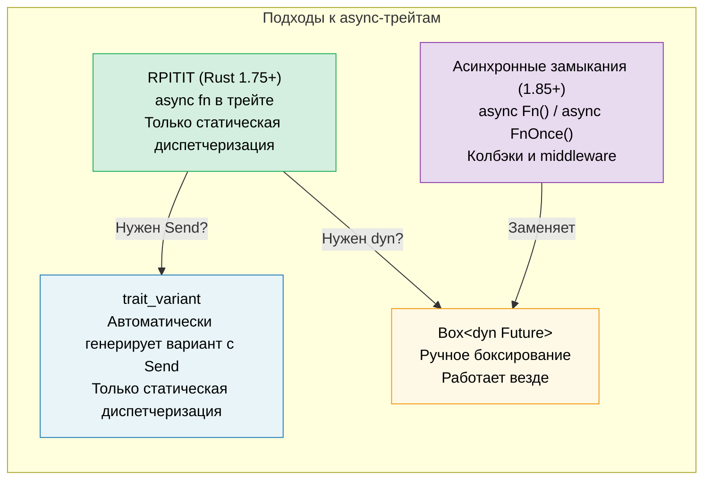

# 10. Async-трейты 🟡

> **Что вы узнаете:**
> - Почему асинхронные методы в трейтах стабилизировались так долго
> - RPITIT: нативные асинхронные методы трейтов (Rust 1.75+)
> - Проблему динамической диспетчеризации и ограничения `Send` через `trait_variant`
> - Асинхронные замыкания (Rust 1.85+): `async Fn()` и `async FnOnce()`



## История: почему это заняло так много времени

Асинхронные методы в трейтах многие годы были самой востребованной функцией Rust. Проблема:

```rust
// Это не компилировалось до Rust 1.75 (декабрь 2023):
trait DataStore {
    async fn get(&self, key: &str) -> Option<String>;
}
// Почему? Потому что async fn возвращает `impl Future<Output = T>`,
// а `impl Trait` в позиции возвращаемого значения трейта не поддерживался.
```

Основная сложность: когда метод трейта возвращает `impl Future`, каждый реализующий тип возвращает *свой конкретный тип*. Компилятору нужно знать размер возвращаемого типа, но методы трейтов диспетчеризуются динамически.

### RPITIT: возвращаемый impl Trait в трейте

С Rust 1.75 это просто работает для статической диспетчеризации:

```rust
trait DataStore {
    async fn get(&self, key: &str) -> Option<String>;
    // Эквивалентно:
    // fn get(&self, key: &str) -> impl Future<Output = Option<String>>;
}

struct InMemoryStore {
    data: std::collections::HashMap<String, String>,
}

impl DataStore for InMemoryStore {
    async fn get(&self, key: &str) -> Option<String> {
        self.data.get(key).cloned()
    }
}

// ✅ Работает с обобщёнными типами (статическая диспетчеризация):
async fn lookup<S: DataStore>(store: &S, key: &str) {
    if let Some(val) = store.get(key).await {
        println!("{key} = {val}");
    }
}
```

### Динамическая диспетчеризация и ограничения Send

Ограничение: нельзя напрямую использовать `dyn DataStore`, потому что компилятор не знает размер возвращаемого future:

```rust
// ❌ Не работает:
// async fn lookup_dyn(store: &dyn DataStore, key: &str) { ... }
// Ошибка: трейт `DataStore` не является dyn-совместимым, потому что метод `get`
//         является `async`

// ✅ Обходной путь: возвращаем упакованный (boxed) future
trait DynDataStore {
    fn get(&self, key: &str) -> Pin<Box<dyn Future<Output = Option<String>> + Send + '_>>;
}
```

**Проблема Send**: в многопоточных рантаймах порождённые задачи должны быть `Send`. Но асинхронные методы трейтов не добавляют ограничение `Send` автоматически:

```rust
trait Worker {
    async fn run(self); // Future может быть Send, а может и не быть
}

struct MyWorker;

impl Worker for MyWorker {
    async fn run(self) {
        // Если здесь используются типы !Send, future тоже !Send
        let rc = std::rc::Rc::new(42);
        some_work().await;
        println!("{rc}");
    }
}

// ❌ Это не сработает, потому что future — !Send (Rc — !Send):
// tokio::spawn(worker.run()); // Требует Send + 'static
//
// Примечание: здесь мы используем `self` (владение), потому что tokio::spawn
// также требует 'static — future, заимствующий &self, не может быть 'static.
// Даже без Rc `async fn run(&self)` нельзя было бы порождать.
```

### Крейт trait_variant

Крейт `trait_variant` (из рабочей группы по async в Rust) автоматически генерирует вариант с `Send`:

```rust
// Cargo.toml: trait-variant = "0.1"

#[trait_variant::make(SendDataStore: Send)]
trait DataStore {
    async fn get(&self, key: &str) -> Option<String>;
    async fn set(&self, key: &str, value: String);
}

// Теперь у вас два трейта:
// - DataStore: без ограничения Send для future
// - SendDataStore: все future являются Send
// У обоих одинаковые методы; реализующие типы реализуют DataStore
// и получают SendDataStore бесплатно, если их future являются Send.

// Используйте SendDataStore, когда нужно порождать задачи:
async fn spawn_lookup<S: SendDataStore + 'static>(store: Arc<S>) {
    tokio::spawn(async move {
        store.get("key").await;
    });
}

// ⚠️ Важно: trait_variant НЕ включает динамическую диспетчеризацию.
// Сгенерированный трейт по-прежнему использует `impl Future`, поэтому `dyn SendDataStore`
// не является dyn-совместимым. Для dyn-диспетчеризации всё ещё нужно ручное боксирование
// (см. подход с Box::pin выше) или крейт `async-trait`.
```

### Краткая справка: async-трейты

| Подход | Статическая диспетчеризация | Динамическая диспетчеризация | Send | Синтаксические издержки |
|--------|:---:|:---:|:---:|---|
| Нативный `async fn` в трейте | ✅ | ❌ | Неявно | Нет |
| `trait_variant` | ✅ | ❌ | Явно | `#[trait_variant::make]` |
| Ручной `Box::pin` | ✅ | ✅ | Явно | Высокие |
| Крейт `async-trait` | ✅ | ✅ | `#[async_trait]` | Средние (макрос-процедура) |

> **Рекомендация**: для нового кода (Rust 1.75+) используйте нативные async-трейты. Добавляйте
> `trait_variant`, когда нужны ограничения `Send` для порождения задач. Для
> динамической диспетчеризации используйте ручной `Box::pin` или крейт `async-trait`. Нативный
> подход не имеет накладных расходов для статической диспетчеризации.

### Асинхронные замыкания (Rust 1.85+)

С Rust 1.85 стабилизированы `async closures` — замыкания, которые захватывают окружение и возвращают future:

```rust
// До 1.85: неудобный обходной путь
let urls = vec!["https://a.com", "https://b.com"];
let fetchers: Vec<_> = urls.iter().map(|url| {
    let url = url.to_string();
    // Возвращаем обычное замыкание, которое возвращает async-блок
    move || async move { reqwest::get(&url).await }
}).collect();

// После 1.85: асинхронные замыкания работают напрямую
let fetchers: Vec<_> = urls.iter().map(|url| {
    async move || { reqwest::get(url).await }
    // ↑ Это асинхронное замыкание — захватывает url и возвращает Future
}).collect();
```

Асинхронные замыкания реализуют новые трейты `AsyncFn`, `AsyncFnMut` и `AsyncFnOnce`, которые повторяют `Fn`, `FnMut`, `FnOnce`:

```rust
// Обобщённая функция, принимающая асинхронное замыкание
async fn retry<F>(max: usize, f: F) -> Result<String, Error>
where
    F: AsyncFn() -> Result<String, Error>,
{
    for _ in 0..max {
        if let Ok(val) = f().await {
            return Ok(val);
        }
    }
    f().await
}
```

> **Совет по миграции**: если у вас код с `Fn() -> impl Future<Output = T>`,
> рассмотрите переход на `AsyncFn() -> T` — сигнатуры станут чище.

<details>
<summary><strong>🏋️ Упражнение: спроектируйте асинхронный трейт сервиса</strong> (нажмите, чтобы раскрыть)</summary>

**Задача**: спроектируйте трейт `Cache` с асинхронными методами `get` и `set`. Реализуйте его дважды: один раз на `HashMap` (в памяти) и один раз на имитации бэкенда Redis (используйте `tokio::time::sleep`, чтобы имитировать задержку сети). Напишите обобщённую функцию, которая работает с обеими реализациями.

<details>
<summary>🔑 Решение</summary>

```rust
use std::collections::HashMap;
use std::sync::Arc;
use tokio::sync::Mutex;
use tokio::time::{sleep, Duration};

trait Cache {
    async fn get(&self, key: &str) -> Option<String>;
    async fn set(&self, key: &str, value: String);
}

// --- Реализация в памяти ---
struct MemoryCache {
    store: Mutex<HashMap<String, String>>,
}

impl MemoryCache {
    fn new() -> Self {
        MemoryCache {
            store: Mutex::new(HashMap::new()),
        }
    }
}

impl Cache for MemoryCache {
    async fn get(&self, key: &str) -> Option<String> {
        self.store.lock().await.get(key).cloned()
    }

    async fn set(&self, key: &str, value: String) {
        self.store.lock().await.insert(key.to_string(), value);
    }
}

// --- Имитация реализации Redis ---
struct RedisCache {
    store: Mutex<HashMap<String, String>>,
    latency: Duration,
}

impl RedisCache {
    fn new(latency_ms: u64) -> Self {
        RedisCache {
            store: Mutex::new(HashMap::new()),
            latency: Duration::from_millis(latency_ms),
        }
    }
}

impl Cache for RedisCache {
    async fn get(&self, key: &str) -> Option<String> {
        sleep(self.latency).await; // Имитируем сетевой round-trip
        self.store.lock().await.get(key).cloned()
    }

    async fn set(&self, key: &str, value: String) {
        sleep(self.latency).await;
        self.store.lock().await.insert(key.to_string(), value);
    }
}

// --- Обобщённая функция, работающая с любым Cache ---
async fn cache_demo<C: Cache>(cache: &C, label: &str) {
    cache.set("greeting", "Hello, async!".into()).await;
    let val = cache.get("greeting").await;
    println!("[{label}] greeting = {val:?}");
}

#[tokio::main]
async fn main() {
    let mem = MemoryCache::new();
    cache_demo(&mem, "memory").await;

    let redis = RedisCache::new(50);
    cache_demo(&redis, "redis").await;
}
```

**Ключевой вывод**: одна и та же обобщённая функция работает с обеими реализациями через статическую диспетчеризацию. Без боксирования и без накладных расходов на выделение памяти. Если нужно порождать эти future в многопоточном рантайме, добавьте `trait_variant::make(SendCache: Send)`, чтобы получить ограничения `Send`. Для динамической диспетчеризации используйте ручной `Box::pin` или крейт `async-trait`.

</details>
</details>

> **Ключевые выводы — async-трейты**
> - С Rust 1.75 можно писать `async fn` прямо в трейтах (крейт `#[async_trait]` не нужен)
> - `trait_variant::make` автоматически генерирует вариант с `Send` для порождения задач (только статическая диспетчеризация)
> - Асинхронные замыкания (`async Fn()`) стабилизированы в 1.85 — используйте их для колбэков и middleware
> - Для кода, критичного к производительности, предпочитайте статическую диспетчеризацию (`<S: Service>`) вместо `dyn`

> **См. также:** [Гл. 13 — Продакшен-паттерны](ch13-production-patterns.md) — трейт `Service` из Tower, [Гл. 6 — Создаём фьючи вручную](ch06-building-futures-by-hand.md) — ручные реализации трейтов

***
