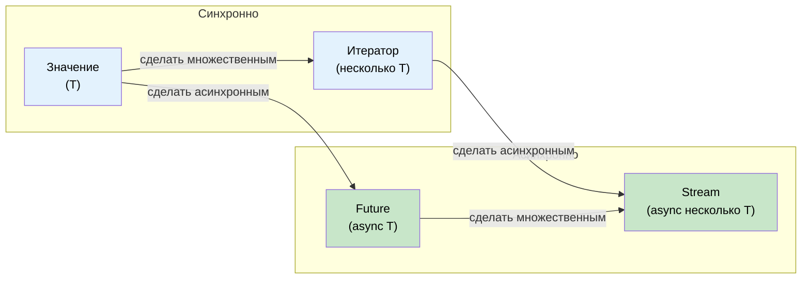

# 11. Потоки и AsyncIterator 🟡

> **Что вы узнаете:**
> - Трейт `Stream`: асинхронная итерация по нескольким значениям
> - Создание потоков: `stream::iter`, `async_stream`, `unfold`
> - Комбинаторы потоков: `map`, `filter`, `buffer_unordered`, `fold`
> - Асинхронные трейты ввода-вывода: `AsyncRead`, `AsyncWrite`, `AsyncBufRead`

## Обзор трейта Stream

`Stream` относится к `Iterator` так же, как `Future` относится к одиночному значению, — он асинхронно выдаёт несколько значений:

```rust
// std::iter::Iterator (синхронный, несколько значений)
trait Iterator {
    type Item;
    fn next(&mut self) -> Option<Self::Item>;
}

// futures::Stream (асинхронный, несколько значений)
trait Stream {
    type Item;
    fn poll_next(self: Pin<&mut Self>, cx: &mut Context<'_>) -> Poll<Option<Self::Item>>;
}
```



### Создание потоков

```rust
use futures::stream::{self, StreamExt};
use tokio::time::{interval, Duration};
use tokio_stream::wrappers::IntervalStream;

// 1. Из итератора
let s = stream::iter(vec![1, 2, 3]);

// 2. Из асинхронного генератора (с помощью крейта async_stream)
// Cargo.toml: async-stream = "0.3"
use async_stream::stream;

fn countdown(from: u32) -> impl futures::Stream<Item = u32> {
    stream! {
        for i in (0..=from).rev() {
            tokio::time::sleep(Duration::from_millis(500)).await;
            yield i;
        }
    }
}

// 3. Из интервала tokio
let tick_stream = IntervalStream::new(interval(Duration::from_secs(1)));

// 4. Из приёмника канала (tokio_stream::wrappers)
let (tx, rx) = tokio::sync::mpsc::channel::<String>(100);
let rx_stream = tokio_stream::wrappers::ReceiverStream::new(rx);

// 5. Из unfold (генерация из асинхронного состояния)
let s = stream::unfold(0u32, |state| async move {
    if state >= 5 {
        None // Поток завершается
    } else {
        let next = state + 1;
        Some((state, next)) // выдаём `state`, новое состояние — `next`
    }
});
```

### Потребление потоков

```rust
use futures::stream::{self, StreamExt};

async fn stream_examples() {
    let s = stream::iter(vec![1, 2, 3, 4, 5]);

    // for_each — обрабатываем каждый элемент
    s.for_each(|x| async move {
        println!("{x}");
    }).await;

    // map + collect
    let doubled: Vec<i32> = stream::iter(vec![1, 2, 3])
        .map(|x| x * 2)
        .collect()
        .await;

    // filter
    let evens: Vec<i32> = stream::iter(1..=10)
        .filter(|x| futures::future::ready(x % 2 == 0))
        .collect()
        .await;

    // buffer_unordered — обрабатываем N элементов одновременно
    let results: Vec<_> = stream::iter(vec!["url1", "url2", "url3"])
        .map(|url| async move {
            // Имитация HTTP-запроса
            tokio::time::sleep(Duration::from_millis(100)).await;
            format!("ответ от {url}")
        })
        .buffer_unordered(10) // До 10 одновременных запросов
        .collect()
        .await;

    // take, skip, zip, chain — точно как у Iterator
    let first_three: Vec<i32> = stream::iter(1..=100)
        .take(3)
        .collect()
        .await;
}
```

### Сравнение с C# IAsyncEnumerable

| Характеристика | Rust `Stream` | C# `IAsyncEnumerable<T>` |
|----------------|---------------|--------------------------|
| **Синтаксис** | `stream! { yield x; }` | `await foreach` / `yield return` |
| **Отмена** | Уничтожить поток | `CancellationToken` |
| **Обратное давление** | Потребитель управляет частотой poll | Потребитель управляет `MoveNextAsync` |
| **Встроено** | Нет (нужен крейт `futures`) | Да (с C# 8.0) |
| **Комбинаторы** | `.map()`, `.filter()`, `.buffer_unordered()` | LINQ + `System.Linq.Async` |
| **Обработка ошибок** | `Stream<Item = Result<T, E>>` | Выброс исключения в асинхронном итераторе |

```rust
// Rust: поток строк из базы данных
// ПРИМЕЧАНИЕ: при использовании ? внутри тела нужен try_stream! (а не stream!).
// stream! не пробрасывает ошибки — try_stream! выдаёт Err(e) и завершается.
fn get_users(db: &Database) -> impl Stream<Item = Result<User, DbError>> + '_ {
    try_stream! {
        let mut cursor = db.query("SELECT * FROM users").await?;
        while let Some(row) = cursor.next().await {
            yield User::from_row(row?);
        }
    }
}

// Потребление:
let mut users = pin!(get_users(&db));
while let Some(result) = users.next().await {
    match result {
        Ok(user) => println!("{}", user.name),
        Err(e) => eprintln!("Ошибка: {e}"),
    }
}
```

```csharp
// Эквивалент на C#:
async IAsyncEnumerable<User> GetUsers() {
    await using var reader = await db.QueryAsync("SELECT * FROM users");
    while (await reader.ReadAsync()) {
        yield return User.FromRow(reader);
    }
}

// Потребление:
await foreach (var user in GetUsers()) {
    Console.WriteLine(user.Name);
}
```

<details>
<summary><strong>🏋️ Упражнение: напишите асинхронный агрегатор статистики</strong> (нажмите, чтобы раскрыть)</summary>

**Задача**: дан поток показаний датчиков `Stream<Item = f64>`. Напишите асинхронную функцию, которая потребляет поток и возвращает `(count, min, max, average)`. Используйте комбинаторы `StreamExt` — не собирайте всё в Vec.

*Подсказка*: используйте `.fold()`, чтобы накапливать состояние по мере прохода по потоку.

<details>
<summary>🔑 Решение</summary>

```rust
use futures::stream::{self, StreamExt};

#[derive(Debug)]
struct Stats {
    count: usize,
    min: f64,
    max: f64,
    sum: f64,
}

impl Stats {
    fn average(&self) -> f64 {
        if self.count == 0 { 0.0 } else { self.sum / self.count as f64 }
    }
}

async fn compute_stats<S: futures::Stream<Item = f64>>(stream: S) -> Stats {
    stream
        .fold(
            Stats { count: 0, min: f64::INFINITY, max: f64::NEG_INFINITY, sum: 0.0 },
            |mut acc, value| async move {
                acc.count += 1;
                acc.min = acc.min.min(value);
                acc.max = acc.max.max(value);
                acc.sum += value;
                acc
            },
        )
        .await
}

#[tokio::test]
async fn test_stats() {
    let readings = stream::iter(vec![23.5, 24.1, 22.8, 25.0, 23.9]);
    let stats = compute_stats(readings).await;

    assert_eq!(stats.count, 5);
    assert!((stats.min - 22.8).abs() < f64::EPSILON);
    assert!((stats.max - 25.0).abs() < f64::EPSILON);
    assert!((stats.average() - 23.86).abs() < 0.01);
}
```

**Ключевой вывод**: комбинаторы потоков вроде `.fold()` обрабатывают элементы по одному, не собирая их в память — это необходимо для обработки больших или бесконечных потоков данных.

</details>
</details>

### Асинхронные трейты ввода-вывода: AsyncRead, AsyncWrite, AsyncBufRead

Так же как `std::io::Read`/`Write` являются основой синхронного ввода-вывода, их асинхронные аналоги являются основой асинхронного ввода-вывода. Эти трейты предоставляются `tokio::io` (или `futures::io` для кода, не привязанного к рантайму):

```rust
// tokio::io — асинхронные версии трейтов std::io

/// Асинхронное чтение байтов из источника
pub trait AsyncRead {
    fn poll_read(
        self: Pin<&mut Self>,
        cx: &mut Context<'_>,
        buf: &mut ReadBuf<'_>,  // Безопасная обёртка tokio над неинициализированной памятью
    ) -> Poll<io::Result<()>>;
}

/// Асинхронная запись байтов в приёмник
pub trait AsyncWrite {
    fn poll_write(
        self: Pin<&mut Self>,
        cx: &mut Context<'_>,
        buf: &[u8],
    ) -> Poll<io::Result<usize>>;

    fn poll_flush(self: Pin<&mut Self>, cx: &mut Context<'_>) -> Poll<io::Result<()>>;
    fn poll_shutdown(self: Pin<&mut Self>, cx: &mut Context<'_>) -> Poll<io::Result<()>>;
}

/// Буферизованное чтение с поддержкой строк
pub trait AsyncBufRead: AsyncRead {
    fn poll_fill_buf(self: Pin<&mut Self>, cx: &mut Context<'_>) -> Poll<io::Result<&[u8]>>;
    fn consume(self: Pin<&mut Self>, amt: usize);
}
```

**На практике** вы редко вызываете эти методы `poll_*` напрямую. Вместо этого используйте трейты-расширения `AsyncReadExt` и `AsyncWriteExt`, которые предоставляют удобные вспомогательные методы для `.await`:

```rust
use tokio::io::{AsyncReadExt, AsyncWriteExt, AsyncBufReadExt};
use tokio::net::TcpStream;
use tokio::io::BufReader;

async fn io_examples() -> tokio::io::Result<()> {
    let mut stream = TcpStream::connect("127.0.0.1:8080").await?;

    // AsyncWriteExt: write_all, write_u32, write_buf и др.
    stream.write_all(b"GET / HTTP/1.0\r\n\r\n").await?;

    // AsyncReadExt: read, read_exact, read_to_end, read_to_string
    let mut response = Vec::new();
    stream.read_to_end(&mut response).await?;

    // AsyncBufReadExt: read_line, lines(), split()
    let file = tokio::fs::File::open("config.txt").await?;
    let reader = BufReader::new(file);
    let mut lines = reader.lines();
    while let Some(line) = lines.next_line().await? {
        println!("{line}");
    }

    Ok(())
}
```

**Реализация собственного асинхронного ввода-вывода** — оборачиваем протокол поверх сырого TCP:

```rust
use tokio::io::{AsyncRead, AsyncWrite, ReadBuf};
use std::pin::Pin;
use std::task::{Context, Poll};

/// Протокол с префиксом длины: [u32 длина][байты полезной нагрузки]
struct FramedStream<T> {
    inner: T,
}

impl<T: AsyncRead + AsyncReadExt + Unpin> FramedStream<T> {
    /// Прочитать один полный кадр
    async fn read_frame(&mut self) -> tokio::io::Result<Vec<u8>>
    {
        // Читаем 4-байтовый префикс длины
        let len = self.inner.read_u32().await? as usize;

        // Читаем ровно столько байт
        let mut payload = vec![0u8; len];
        self.inner.read_exact(&mut payload).await?;
        Ok(payload)
    }
}

impl<T: AsyncWrite + AsyncWriteExt + Unpin> FramedStream<T> {
    /// Записать один полный кадр
    async fn write_frame(&mut self, data: &[u8]) -> tokio::io::Result<()>
    {
        self.inner.write_u32(data.len() as u32).await?;
        self.inner.write_all(data).await?;
        self.inner.flush().await?;
        Ok(())
    }
}
```

| Синхронный трейт | Асинхронный трейт (tokio) | Асинхронный трейт (futures) | Трейт-расширение |
|-----------------|--------------------------|-----------------------------|-----------------|
| `std::io::Read` | `tokio::io::AsyncRead` | `futures::io::AsyncRead` | `AsyncReadExt` |
| `std::io::Write` | `tokio::io::AsyncWrite` | `futures::io::AsyncWrite` | `AsyncWriteExt` |
| `std::io::BufRead` | `tokio::io::AsyncBufRead` | `futures::io::AsyncBufRead` | `AsyncBufReadExt` |
| `std::io::Seek` | `tokio::io::AsyncSeek` | `futures::io::AsyncSeek` | `AsyncSeekExt` |

> **Трейты ввода-вывода tokio и futures**: они похожи, но не идентичны — `AsyncRead` из tokio использует `ReadBuf` (безопасно работает с неинициализированной памятью), а `futures::AsyncRead` использует `&mut [u8]`. Для конвертации между ними используйте `tokio_util::compat`.

> **Утилиты копирования**: `tokio::io::copy(&mut reader, &mut writer)` — асинхронный аналог `std::io::copy`, полезен для прокси-серверов или передачи файлов. `tokio::io::copy_bidirectional` копирует данные в обоих направлениях одновременно.

<details>
<summary><strong>🏋️ Упражнение: напишите асинхронный счётчик строк</strong> (нажмите, чтобы раскрыть)</summary>

**Задача**: напишите асинхронную функцию, которая принимает любой источник `AsyncBufRead` и возвращает количество непустых строк. Она должна работать с файлами, TCP-потоками или любым буферизованным читателем.

*Подсказка*: используйте `AsyncBufReadExt::lines()` и считайте строки, для которых `!line.is_empty()`.

<details>
<summary>🔑 Решение</summary>

```rust
use tokio::io::AsyncBufReadExt;

async fn count_non_empty_lines<R: tokio::io::AsyncBufRead + Unpin>(
    reader: R,
) -> tokio::io::Result<usize> {
    let mut lines = reader.lines();
    let mut count = 0;
    while let Some(line) = lines.next_line().await? {
        if !line.is_empty() {
            count += 1;
        }
    }
    Ok(count)
}

// Работает с любым AsyncBufRead:
// let file = tokio::io::BufReader::new(tokio::fs::File::open("data.txt").await?);
// let count = count_non_empty_lines(file).await?;
//
// let tcp = tokio::io::BufReader::new(TcpStream::connect("...").await?);
// let count = count_non_empty_lines(tcp).await?;
```

**Ключевой вывод**: программируя против `AsyncBufRead`, а не против конкретного типа, вы делаете код ввода-вывода пригодным для файлов, сокетов, каналов и даже буферов в памяти (`tokio::io::BufReader::new(std::io::Cursor::new(data))`).

</details>
</details>

> **Ключевые выводы — потоки и AsyncIterator**
> - `Stream` — асинхронный аналог `Iterator`: выдаёт `Poll::Ready(Some(item))` или `Poll::Ready(None)`
> - `.buffer_unordered(N)` обрабатывает N элементов потока одновременно — главный инструмент конкурентности для потоков
> - `async_stream::stream!` — самый простой способ создать собственный поток (использует `yield`)
> - `AsyncRead`/`AsyncBufRead` позволяют писать обобщённый, переиспользуемый код ввода-вывода для файлов, сокетов и каналов

> **См. также:** [Гл. 9 — Когда Tokio не подходит](ch09-when-tokio-isnt-the-right-fit.md) — `FuturesUnordered` (родственный паттерн), [Гл. 13 — Продакшен-паттерны](ch13-production-patterns.md) — обратное давление с ограниченными каналами

***
