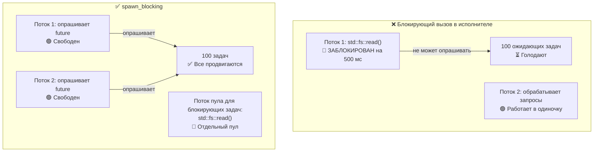

# 12. Типичные ловушки 🔴

> **Что вы узнаете:**
> - 9 типичных ошибок асинхронного Rust и как исправить каждую
> - Почему блокировка исполнителя — ошибка номер один (и как её исправляет `spawn_blocking`)
> - Опасности отмены: что происходит, когда future уничтожается посреди `await`
> - Отладка: `tokio-console`, `tracing`, `#[instrument]`
> - Тестирование: `#[tokio::test]`, `time::pause()`, моки на основе трейтов

## Блокировка исполнителя

Ошибка номер один в асинхронном Rust: выполнение блокирующего кода в потоке исполнителя. Это морит голодом другие задачи.

```rust
// ❌ НЕПРАВИЛЬНО: блокирует весь поток исполнителя
async fn bad_handler() -> String {
    let data = std::fs::read_to_string("big_file.txt").unwrap(); // БЛОКИРУЕТ!
    process(&data)
}

// ✅ ПРАВИЛЬНО: переносим блокирующую работу в отдельный пул потоков
async fn good_handler() -> String {
    let data = tokio::task::spawn_blocking(|| {
        std::fs::read_to_string("big_file.txt").unwrap()
    }).await.unwrap();
    process(&data)
}

// ✅ ТОЖЕ ПРАВИЛЬНО: используем асинхронную fs из tokio
async fn also_good_handler() -> String {
    let data = tokio::fs::read_to_string("big_file.txt").await.unwrap();
    process(&data)
}
```



### std::thread::sleep и tokio::time::sleep

```rust
// ❌ НЕПРАВИЛЬНО: блокирует поток исполнителя на 5 секунд
async fn bad_delay() {
    std::thread::sleep(Duration::from_secs(5)); // Поток не может опрашивать ничего другого!
}

// ✅ ПРАВИЛЬНО: уступаем управление исполнителю, другие задачи могут работать
async fn good_delay() {
    tokio::time::sleep(Duration::from_secs(5)).await; // Не блокирует!
}
```

### Удержание MutexGuard через .await

```rust
use std::sync::Mutex; // std Mutex — НЕ учитывает async

// ⚠️ РИСКОВАННО: MutexGuard удерживается через .await
async fn bad_mutex(data: &Mutex<Vec<String>>) {
    let mut guard = data.lock().unwrap();
    guard.push("item".into());
    some_io().await; // Guard удерживается здесь — другие потоки не могут взять блокировку!
    guard.push("another".into());
}
// ПРИМЕЧАНИЕ: это компилируется! std::sync::MutexGuard — !Send, но компилятор требует Send
// для Future только тогда, когда вы передаёте его туда, где это требуется
// (например, в tokio::spawn). Прямой вызов bad_mutex(...).await компилируется без проблем.
// Однако tokio::spawn(bad_mutex(data)) упадёт с ошибкой ограничения Send.
```

**Почему это обычно проблема** — но не всегда:

Удержание `std::sync::Mutex` через `.await` блокирует **поток ОС** на всё время I/O, не давая исполнителю опрашивать другие задачи в этом потоке. Для коротких критических секций это расточительно; для длительного I/O — это ловушка производительности.

**Однако** бывают законные случаи, когда блокировку *необходимо* удерживать через `.await` — так же как транзакция базы данных удерживает блокировку между чтением и фиксацией. Если отпустить и заново захватить блокировку, возникает **гонка TOCTOU (time-of-check to time-of-use)**: другая задача может изменить данные между вашими двумя критическими секциями. Правильное решение зависит от сценария:

```rust
// ВАРИАНТ 1: ограничиваем область видимости guard — подходит, когда операции независимы
async fn scoped_mutex(data: &Mutex<Vec<String>>) {
    {
        let mut guard = data.lock().unwrap();
        guard.push("item".into());
    } // Guard уничтожается здесь
    some_io().await; // Блокировка снята — другие задачи могут продолжать
    {
        let mut guard = data.lock().unwrap();
        guard.push("another".into());
    }
}
// ⚠️ Осторожно: другая задача может захватить блокировку и изменить Vec между двумя секциями.
//    Это нормально, если два push независимы, но неверно, если "another"
//    зависит от состояния, установленного "item".

// ВАРИАНТ 2: используем tokio::sync::Mutex — удерживает блокировку через .await,
//            не блокируя поток ОС. Лучше всего, когда нужна транзакционная
//            операция «прочитать-изменить-записать» через точку await.
use tokio::sync::Mutex as AsyncMutex;

async fn async_mutex(data: &AsyncMutex<Vec<String>>) {
    let mut guard = data.lock().await; // Асинхронная блокировка — не блокирует поток
    guard.push("item".into());
    some_io().await; // OK — guard tokio Mutex является Send
    guard.push("another".into());
    // Guard удерживался всё время — ни гонки TOCTOU, ни заблокированного потока.
}
```

> **Когда какой Mutex использовать**:
> - `std::sync::Mutex`: короткие критические секции без `.await` внутри
> - `tokio::sync::Mutex`: когда нужно удерживать блокировку через точки `.await`
>   (транзакционная семантика, предотвращение TOCTOU)
> - `parking_lot::Mutex`: прямая замена `std`, быстрее и компактнее, но тоже без `.await`
>
> **Эмпирическое правило**: не режьте критическую секцию вокруг `.await` не задумываясь.
> Спросите себя, действительно ли обе половины независимы. Если нет — если вторая половина
> зависит от состояния из первой, — используйте `tokio::sync::Mutex` или перепроектируйте
> поток данных.

### Опасности отмены

Уничтожение future отменяет его — но это может оставить систему в несогласованном состоянии:

```rust
// ❌ ОПАСНО: утечка ресурсов при отмене
async fn transfer(from: &Account, to: &Account, amount: u64) {
    from.debit(amount).await;  // Если отменить ЗДЕСЬ...
    to.credit(amount).await;   // ...деньги пропадут!
}

// ✅ БЕЗОПАСНО: делаем операции атомарными или используем компенсацию
async fn safe_transfer(from: &Account, to: &Account, amount: u64) -> Result<(), Error> {
    // Используем транзакцию базы данных (всё или ничего)
    let tx = db.begin_transaction().await?;
    tx.debit(from, amount).await?;
    tx.credit(to, amount).await?;
    tx.commit().await?; // Фиксируется, только если всё прошло успешно
    Ok(())
}

// ✅ ТОЖЕ БЕЗОПАСНО: tokio::select! с учётом отмены
tokio::select! {
    result = transfer(from, to, amount) => {
        // Перевод завершён
    }
    _ = shutdown_signal() => {
        // Не прерываем перевод на полпути — даём ему завершиться
        // Или: явно откатываем
    }
}
```

### Нет асинхронного Drop

Трейт `Drop` в Rust синхронный — вы **не можете** вызвать `.await` внутри `drop()`. Это частый источник путаницы:

```rust
struct DbConnection { /* ... */ }

impl Drop for DbConnection {
    fn drop(&mut self) {
        // ❌ Так нельзя — drop() синхронный!
        // self.connection.shutdown().await;

        // ✅ Обходной путь 1: порождаем задачу очистки (fire-and-forget)
        let conn = self.connection.take();
        tokio::spawn(async move {
            let _ = conn.shutdown().await;
        });

        // ✅ Обходной путь 2: синхронное закрытие
        // self.connection.blocking_close();
    }
}
```

**Лучшая практика**: предоставьте явный метод `async fn close(self)` и задокументируйте, что вызывающий код должен использовать его. Полагайтесь на `Drop` только как на страховочную сетку, а не как на основной путь очистки.

### Справедливость и голодание в select!

```rust
use tokio::sync::mpsc;

// ❌ НЕСПРАВЕДЛИВО: busy_stream всегда побеждает, slow_stream голодает
async fn unfair(mut fast: mpsc::Receiver<i32>, mut slow: mpsc::Receiver<i32>) {
    loop {
        tokio::select! {
            Some(v) = fast.recv() => println!("fast: {v}"),
            Some(v) = slow.recv() => println!("slow: {v}"),
            // Если готовы оба, tokio выбирает случайно.
            // Но если `fast` ВСЕГДА готов, `slow` почти никогда не опрашивается.
        }
    }
}

// ✅ СПРАВЕДЛИВО: используем biased select или вычитываем пачками
async fn fair(mut fast: mpsc::Receiver<i32>, mut slow: mpsc::Receiver<i32>) {
    loop {
        tokio::select! {
            biased; // Всегда проверяем по порядку — явный приоритет

            Some(v) = slow.recv() => println!("slow: {v}"),  // Приоритет!
            Some(v) = fast.recv() => println!("fast: {v}"),
        }
    }
}
```

### Случайное последовательное выполнение

```rust
// ❌ ПОСЛЕДОВАТЕЛЬНО: занимает в сумме 2 секунды
async fn slow() {
    let a = fetch("url_a").await; // 1 секунда
    let b = fetch("url_b").await; // 1 секунда (ждёт, пока завершится a!)
}

// ✅ КОНКУРЕНТНО: занимает в сумме 1 секунду
async fn fast() {
    let (a, b) = tokio::join!(
        fetch("url_a"), // Оба стартуют сразу
        fetch("url_b"),
    );
}

// ✅ ТОЖЕ КОНКУРЕНТНО: через let + join
async fn also_fast() {
    let fut_a = fetch("url_a"); // Создаём future (ленивый — ещё не запущен)
    let fut_b = fetch("url_b"); // Создаём future
    let (a, b) = tokio::join!(fut_a, fut_b); // ТЕПЕРЬ оба выполняются конкурентно
}
```

> **Ловушка**: `let a = fetch(url).await; let b = fetch(url).await;` выполняется последовательно!
> Второй `.await` не начнётся, пока не завершится первый. Для конкурентности используйте `join!` или
> `spawn`.

## Разбор кейса: отладка зависшего продакшен-сервиса

Реальный сценарий: сервис 10 минут обрабатывает запросы нормально, а потом перестаёт отвечать. В логах нет ошибок. Загрузка CPU — 0%.

**Шаги диагностики:**

1. **Подключаем `tokio-console`** — показывает 200+ задач, застрявших в состоянии `Pending`
2. **Смотрим детали задач** — все ждут одного и того же `Mutex::lock().await`
3. **Первопричина** — одна задача удерживала `std::sync::MutexGuard` через `.await` и упала с паникой, «отравив» мьютекс. Теперь все остальные задачи падают на `lock().unwrap()`

**Исправление:**

| Было (сломано) | Стало (исправлено) |
|----------------|--------------------|
| `std::sync::Mutex` | `tokio::sync::Mutex` |
| `.lock().unwrap()` через `.await` | Ограничиваем блокировку до `.await` |
| Нет таймаута на получение блокировки | `tokio::time::timeout(dur, mutex.lock())` |
| Нет восстановления после отравленного мьютекса | `tokio::sync::Mutex` не отравляется |

**Чек-лист профилактики:**
- [ ] Используйте `tokio::sync::Mutex`, если guard пересекает любой `.await`
- [ ] Добавляйте `#[tracing::instrument]` к асинхронным функциям для отслеживания span
- [ ] Запускайте `tokio-console` в staging, чтобы рано замечать зависшие задачи
- [ ] Добавляйте эндпоинты проверки работоспособности, которые проверяют отзывчивость задач

<details>
<summary><strong>🏋️ Упражнение: найдите ошибки</strong> (нажмите, чтобы раскрыть)</summary>

**Задача**: найдите все асинхронные ловушки в этом коде и исправьте их.

```rust
use std::sync::Mutex;

async fn process_requests(urls: Vec<String>) -> Vec<String> {
    let results = Mutex::new(Vec::new());
    
    for url in &urls {
        let response = reqwest::get(url).await.unwrap().text().await.unwrap();
        std::thread::sleep(std::time::Duration::from_millis(100)); // Ограничение частоты
        let mut guard = results.lock().unwrap();
        guard.push(response);
        expensive_parse(&guard).await; // Разбираем все результаты на данный момент
    }
    
    results.into_inner().unwrap()
}
```

<details>
<summary>🔑 Решение</summary>

**Найденные ошибки:**

1. **Последовательные запросы** — URL запрашиваются по одному, а не конкурентно
2. **`std::thread::sleep`** — блокирует поток исполнителя
3. **MutexGuard удерживается через `.await`** — `guard` жив, когда ожидается `expensive_parse`
4. **Нет конкурентности** — следовало использовать `join!` или `FuturesUnordered`

```rust
use tokio::sync::Mutex;
use std::sync::Arc;
use futures::stream::{self, StreamExt};

async fn process_requests(urls: Vec<String>) -> Vec<String> {
    // Исправление 4: обрабатываем URL конкурентно с помощью buffer_unordered
    let results: Vec<String> = stream::iter(urls)
        .map(|url| async move {
            let response = reqwest::get(&url).await.unwrap().text().await.unwrap();
            // Исправление 2: используем tokio::time::sleep вместо std::thread::sleep
            tokio::time::sleep(std::time::Duration::from_millis(100)).await;
            response
        })
        .buffer_unordered(10) // До 10 одновременных запросов
        .collect()
        .await;

    // Исправление 3: разбираем после сбора — мьютекс вообще не нужен!
    for result in &results {
        expensive_parse(result).await;
    }

    results
}
```

**Ключевой вывод**: часто асинхронный код можно перестроить так, чтобы мьютексы не понадобились вовсе. Собирайте результаты через потоки или join, а затем обрабатывайте. Это проще, быстрее и без риска взаимной блокировки (deadlock).

</details>
</details>

---

### Отладка асинхронного кода

Асинхронные трассировки стека известны своей невнятностью — они показывают цикл опроса исполнителя, а не вашу логическую цепочку вызовов. Ниже перечислены основные инструменты отладки.

#### tokio-console: инспектор задач в реальном времени

[tokio-console](https://github.com/tokio-rs/console) даёт вид, похожий на `htop`, для каждой порождённой задачи: её состояние, длительность опроса, активность waker и использование ресурсов.

```toml
# Cargo.toml
[dependencies]
console-subscriber = "0.4"
tokio = { version = "1", features = ["full", "tracing"] }
```

```rust
#[tokio::main]
async fn main() {
    console_subscriber::init(); // Заменяет стандартный подписчик tracing
    // ... остальная часть вашего приложения
}
```

Затем в другом терминале:

```bash
$ RUSTFLAGS="--cfg tokio_unstable" cargo run   # Обязательный флаг на этапе компиляции
$ tokio-console                                # Подключается к 127.0.0.1:6669
```

#### tracing + #[instrument]: структурированное логирование для async

Крейт [`tracing`](https://docs.rs/tracing) понимает времена жизни `Future`. Span остаются открытыми через точки `.await`, давая логический стек вызовов, даже когда поток ОС уже переключился на другую работу:

```rust
use tracing::{info, instrument};

#[instrument(skip(db_pool), fields(user_id = %user_id))]
async fn handle_request(user_id: u64, db_pool: &Pool) -> Result<Response> {
    info!("ищем пользователя");
    let user = db_pool.get_user(user_id).await?;  // span остаётся открытым через .await
    info!(email = %user.email, "пользователь найден");
    let orders = fetch_orders(user_id).await?;     // всё тот же span
    Ok(build_response(user, orders))
}
```

Вывод (с `tracing_subscriber::fmt::json()`):

```json
{"timestamp":"...","level":"INFO","span":{"name":"handle_request","user_id":"42"},"message":"ищем пользователя"}
{"timestamp":"...","level":"INFO","span":{"name":"handle_request","user_id":"42"},"fields":{"email":"a@b.com"},"message":"пользователь найден"}
```

#### Чек-лист отладки

| Симптом | Вероятная причина | Инструмент |
|---------|-------------------|------------|
| Задача зависает навсегда | Пропущен `.await` или взаимная блокировка `Mutex` | Представление задач в `tokio-console` |
| Низкая пропускная способность | Блокирующий вызов в асинхронном потоке | Гистограмма времени опроса в `tokio-console` |
| `Future is not Send` | Тип !Send удерживается через `.await` | Ошибка компилятора + `#[instrument]` для поиска места |
| Загадочная отмена | Родительский `select!` отбросил ветку | События жизненного цикла span в `tracing` |

> **Совет**: включите `RUSTFLAGS="--cfg tokio_unstable"`, чтобы получить метрики на уровне задач
> в tokio-console. Это флаг времени компиляции, а не времени выполнения.

### Тестирование асинхронного кода

Асинхронный код создаёт особые трудности для тестирования: нужны рантайм, управление временем и стратегии проверки конкурентного поведения.

**Базовые асинхронные тесты** с `#[tokio::test]`:

```rust
// Cargo.toml
// [dev-dependencies]
// tokio = { version = "1", features = ["full", "test-util"] }

#[tokio::test]
async fn test_basic_async() {
    let result = fetch_data().await;
    assert_eq!(result, "expected");
}

// Однопоточный тест (полезно для типов !Send):
#[tokio::test(flavor = "current_thread")]
async fn test_single_threaded() {
    let rc = std::rc::Rc::new(42);
    let val = async { *rc }.await;
    assert_eq!(val, 42);
}

// Многопоточный тест с явным количеством воркеров:
#[tokio::test(flavor = "multi_thread", worker_threads = 2)]
async fn test_concurrent_behavior() {
    // Проверяет гонки при реальной конкурентности
    let counter = std::sync::Arc::new(std::sync::atomic::AtomicU32::new(0));
    let c1 = counter.clone();
    let c2 = counter.clone();
    let (a, b) = tokio::join!(
        tokio::spawn(async move { c1.fetch_add(1, std::sync::atomic::Ordering::SeqCst) }),
        tokio::spawn(async move { c2.fetch_add(1, std::sync::atomic::Ordering::SeqCst) }),
    );
    a.unwrap();
    b.unwrap();
    assert_eq!(counter.load(std::sync::atomic::Ordering::SeqCst), 2);
}
```

**Управление временем** — тестируем таймауты, не дожидаясь их:

```rust
use tokio::time::{self, Duration, Instant};

#[tokio::test]
async fn test_timeout_behavior() {
    // Останавливаем время — sleep() переходит вперёд мгновенно, без реальной задержки
    time::pause();

    let start = Instant::now();
    time::sleep(Duration::from_secs(3600)).await; // «ждём» 1 час — занимает 0 мс
    assert!(start.elapsed() >= Duration::from_secs(3600));
    // Тест выполнился за миллисекунды, а не за час!
}

#[tokio::test]
async fn test_retry_timing() {
    time::pause();

    // Проверяем, что логика повторов ждёт ожидаемое время
    let start = Instant::now();
    let result = retry_with_backoff(|| async {
        Err::<(), _>("simulated failure")
    }, 3, Duration::from_secs(1))
    .await;

    assert!(result.is_err());
    // 1с + 2с + 4с = 7с ожидания (экспоненциально)
    assert!(start.elapsed() >= Duration::from_secs(7));
}

#[tokio::test]
async fn test_deadline_exceeded() {
    time::pause();

    let result = tokio::time::timeout(
        Duration::from_secs(5),
        async {
            // Имитируем медленную операцию
            time::sleep(Duration::from_secs(10)).await;
            "done"
        }
    ).await;

    assert!(result.is_err()); // Таймаут
}
```

**Мокирование асинхронных зависимостей** — используйте трейт-объекты или дженерики:

```rust
// Определяем трейт для зависимости:
trait Storage {
    async fn get(&self, key: &str) -> Option<String>;
    async fn set(&self, key: &str, value: String);
}

// Продакшен-реализация:
struct RedisStorage { /* ... */ }
impl Storage for RedisStorage {
    async fn get(&self, key: &str) -> Option<String> {
        // Реальный вызов Redis
        todo!()
    }
    async fn set(&self, key: &str, value: String) {
        todo!()
    }
}

// Тестовый мок:
struct MockStorage {
    data: std::sync::Mutex<std::collections::HashMap<String, String>>,
}

impl MockStorage {
    fn new() -> Self {
        MockStorage { data: std::sync::Mutex::new(std::collections::HashMap::new()) }
    }
}

impl Storage for MockStorage {
    async fn get(&self, key: &str) -> Option<String> {
        self.data.lock().unwrap().get(key).cloned()
    }
    async fn set(&self, key: &str, value: String) {
        self.data.lock().unwrap().insert(key.to_string(), value);
    }
}

// Тестируемая функция обобщена по Storage:
async fn cache_lookup<S: Storage>(store: &S, key: &str) -> String {
    match store.get(key).await {
        Some(val) => val,
        None => {
            let val = "computed".to_string();
            store.set(key, val.clone()).await;
            val
        }
    }
}

#[tokio::test]
async fn test_cache_miss_then_hit() {
    let mock = MockStorage::new();

    // Первый вызов: промах → вычисляем и сохраняем
    let val = cache_lookup(&mock, "key1").await;
    assert_eq!(val, "computed");

    // Второй вызов: попадание → возвращаем сохранённое значение
    let val = cache_lookup(&mock, "key1").await;
    assert_eq!(val, "computed");
    assert!(mock.data.lock().unwrap().contains_key("key1"));
}
```

**Тестирование каналов и обмена между задачами**:

```rust
#[tokio::test]
async fn test_producer_consumer() {
    let (tx, mut rx) = tokio::sync::mpsc::channel(10);

    tokio::spawn(async move {
        for i in 0..5 {
            tx.send(i).await.unwrap();
        }
        // tx уничтожается здесь — канал закрывается
    });

    let mut received = Vec::new();
    while let Some(val) = rx.recv().await {
        received.push(val);
    }

    assert_eq!(received, vec![0, 1, 2, 3, 4]);
}
```

| Паттерн тестирования | Когда использовать | Ключевой инструмент |
|---------------------|--------------------|---------------------|
| `#[tokio::test]` | Все асинхронные тесты | `tokio = { features = ["macros", "rt"] }` |
| `time::pause()` | Тестирование таймаутов, повторов, периодических задач | `tokio::time::pause()` |
| Мокирование через трейты | Тестирование бизнес-логики без I/O | Обобщение `<S: Storage>` |
| Вариант `current_thread` | Тестирование типов `!Send` или детерминированного планирования | `#[tokio::test(flavor = "current_thread")]` |
| Вариант `multi_thread` | Тестирование гонок | `#[tokio::test(flavor = "multi_thread")]` |

> **Ключевые выводы — типичные ловушки**
> - Никогда не блокируйте исполнитель — используйте `spawn_blocking` для работы с CPU или синхронного кода
> - Никогда не удерживайте `MutexGuard` через `.await` — ограничивайте блокировки или используйте `tokio::sync::Mutex`
> - Отмена мгновенно уничтожает future — для частично выполненных операций используйте паттерны, устойчивые к отмене (cancel-safe)
> - Используйте `tokio-console` и `#[tracing::instrument]` для отладки асинхронного кода
> - Тестируйте асинхронный код через `#[tokio::test]` и `time::pause()` для детерминированного тайминга

> **См. также:** [Гл. 8 — Глубокое погружение в Tokio](ch08-tokio-deep-dive.md) — примитивы синхронизации, [Гл. 13 — Продакшен-паттерны](ch13-production-patterns.md) — graceful shutdown и структурированную конкурентность

***
