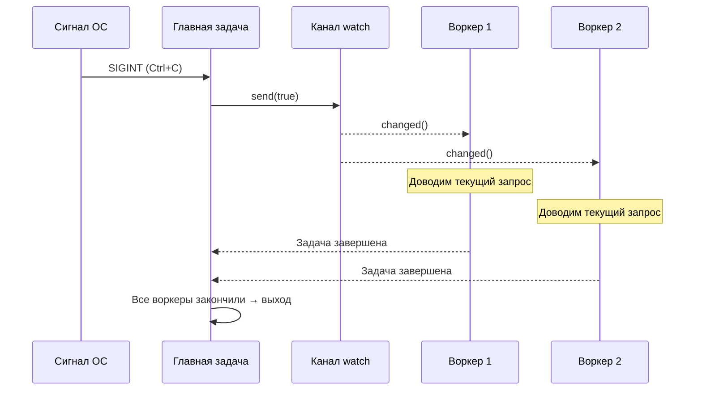

# 13. Продакшен-паттерны 🔴

> **Что вы узнаете:**
> - Graceful shutdown с помощью каналов `watch` и `select!`
> - Обратное давление: ограниченные каналы защищают от OOM
> - Структурированная конкурентность: `JoinSet` и `TaskTracker`
> - Таймауты, повторы и экспоненциальная задержка (backoff)
> - Обработка ошибок: `thiserror` против `anyhow`, паттерн двойного `?`
> - Tower: паттерн middleware, который используют axum, tonic и hyper

## Корректное завершение работы (Graceful Shutdown)

Продакшен-серверы должны корректно завершаться: доводить до конца текущие запросы, сбрасывать буферы, закрывать соединения:

```rust
use tokio::signal;
use tokio::sync::watch;

async fn main_server() {
    // Создаём канал для сигнала остановки
    let (shutdown_tx, shutdown_rx) = watch::channel(false);

    // Запускаем сервер
    let server_handle = tokio::spawn(run_server(shutdown_rx.clone()));

    // Ждём Ctrl+C
    signal::ctrl_c().await.expect("Не удалось подписаться на Ctrl+C");
    println!("Получен сигнал остановки, доводим текущие запросы...");

    // Уведомляем все задачи о завершении
    // ПРИМЕЧАНИЕ: .unwrap() используется для краткости. В продакшен-коде нужно обрабатывать
    // случай, когда все получатели уже уничтожены.
    shutdown_tx.send(true).unwrap();

    // Ждём завершения сервера (с таймаутом)
    match tokio::time::timeout(
        std::time::Duration::from_secs(30),
        server_handle,
    ).await {
        Ok(Ok(())) => println!("Сервер корректно остановлен"),
        Ok(Err(e)) => eprintln!("Ошибка сервера: {e}"),
        Err(_) => eprintln!("Таймаут остановки сервера — принудительный выход"),
    }
}

async fn run_server(mut shutdown: watch::Receiver<bool>) {
    loop {
        tokio::select! {
            // Принимаем новые соединения
            conn = accept_connection() => {
                let shutdown = shutdown.clone();
                tokio::spawn(handle_connection(conn, shutdown));
            }
            // Сигнал остановки
            _ = shutdown.changed() => {
                if *shutdown.borrow() {
                    println!("Прекращаем приём новых соединений");
                    break;
                }
            }
        }
    }
    // Активные соединения завершатся сами,
    // потому что у них есть собственный клон shutdown_rx
}

async fn handle_connection(conn: Connection, mut shutdown: watch::Receiver<bool>) {
    loop {
        tokio::select! {
            request = conn.next_request() => {
                // Обрабатываем запрос полностью — не бросаем его на полпути
                process_request(request).await;
            }
            _ = shutdown.changed() => {
                if *shutdown.borrow() {
                    // Завершаем текущий запрос и выходим
                    break;
                }
            }
        }
    }
}
```



### Обратное давление через ограниченные каналы

Неограниченные каналы могут привести к OOM, если производитель быстрее потребителя. В продакшене всегда используйте ограниченные каналы:

```rust
use tokio::sync::mpsc;

async fn backpressure_example() {
    // Ограниченный канал: не более 100 элементов в буфере
    let (tx, mut rx) = mpsc::channel::<WorkItem>(100);

    // Производитель: естественно замедляется, когда буфер заполнен
    let producer = tokio::spawn(async move {
        for i in 0..1_000_000 {
            // send() асинхронный — ждёт, если буфер полон
            // Это создаёт естественное обратное давление!
            tx.send(WorkItem { id: i }).await.unwrap();
        }
    });

    // Потребитель: обрабатывает элементы в своём темпе
    let consumer = tokio::spawn(async move {
        while let Some(item) = rx.recv().await {
            process(item).await; // Медленная обработка — нормально, производитель будет ждать
        }
    });

    let _ = tokio::join!(producer, consumer);
}

// Сравните с неограниченным — ОПАСНО:
// let (tx, rx) = mpsc::unbounded_channel(); // Никакого обратного давления!
// Производитель может бесконечно заполнять память
```

### Структурированная конкурентность: JoinSet и TaskTracker

`JoinSet` объединяет связанные задачи и гарантирует, что все они завершатся:

```rust
use tokio::task::JoinSet;
use tokio::time::{sleep, Duration};

async fn structured_concurrency() {
    let mut set = JoinSet::new();

    // Порождаем пачку задач
    for url in get_urls() {
        set.spawn(async move {
            fetch_and_process(url).await
        });
    }

    // Собираем все результаты (порядок не гарантирован)
    let mut results = Vec::new();
    while let Some(result) = set.join_next().await {
        match result {
            Ok(Ok(data)) => results.push(data),
            Ok(Err(e)) => eprintln!("Ошибка задачи: {e}"),
            Err(e) => eprintln!("Задача завершилась паникой: {e}"),
        }
    }

    // ВСЕ задачи завершены — фоновой работы не осталось
    println!("Обработано элементов: {}", results.len());
}

// TaskTracker (tokio-util 0.7.9+) — ждём все порождённые задачи
use tokio_util::task::TaskTracker;

async fn with_tracker() {
    let tracker = TaskTracker::new();

    for i in 0..10 {
        tracker.spawn(async move {
            sleep(Duration::from_millis(100 * i)).await;
            println!("Задача {i} завершена");
        });
    }

    tracker.close(); // Больше задач добавлять не будут
    tracker.wait().await; // Ждём ВСЕ отслеживаемые задачи
    println!("Все задачи завершены");
}
```

### Таймауты и повторы

```rust
use tokio::time::{timeout, sleep, Duration};

// Простой таймаут
async fn with_timeout() -> Result<Response, Error> {
    match timeout(Duration::from_secs(5), fetch_data()).await {
        Ok(Ok(response)) => Ok(response),
        Ok(Err(e)) => Err(Error::Fetch(e)),
        Err(_) => Err(Error::Timeout),
    }
}

// Повтор с экспоненциальной задержкой
async fn retry_with_backoff<F, Fut, T, E>(
    max_attempts: u32,
    base_delay_ms: u64,
    operation: F,
) -> Result<T, E>
where
    F: Fn() -> Fut,
    Fut: std::future::Future<Output = Result<T, E>>,
    E: std::fmt::Display,
{
    let mut delay = Duration::from_millis(base_delay_ms);

    for attempt in 1..=max_attempts {
        match operation().await {
            Ok(result) => return Ok(result),
            Err(e) => {
                if attempt == max_attempts {
                    eprintln!("Последняя попытка {attempt} не удалась: {e}");
                    return Err(e);
                }
                eprintln!("Попытка {attempt} не удалась: {e}, повтор через {delay:?}");
                sleep(delay).await;
                delay *= 2; // Экспоненциальная задержка
            }
        }
    }
    unreachable!()
}

// Использование:
// let result = retry_with_backoff(3, 100, || async {
//     reqwest::get("https://api.example.com/data").await
// }).await?;
```

> **Совет для продакшена — добавляйте jitter**: функция выше использует чистую экспоненциальную задержку, но в продакшене
> много клиентов, падающих одновременно, будут повторять запросы в одни и те же моменты (эффект «стада»,
> thundering herd). Добавьте случайный *jitter* — например, `sleep(delay + rand_jitter)`, где `rand_jitter` —
> это значение из `0..delay/4`, — чтобы повторы распределялись во времени.

### Обработка ошибок в асинхронном коде

Асинхронность создаёт особые сложности при распространении ошибок: порождённые задачи образуют границы ошибок, ошибки таймаута оборачивают внутренние ошибки, и `?` ведёт себя иначе, когда futures пересекают границы задач.

**`thiserror` против `anyhow`** — выбираем подходящий инструмент:

```rust
// thiserror: определяем типизированные ошибки для библиотек и публичных API
// Каждый вариант явный — вызывающий код может сопоставлять конкретные ошибки
use thiserror::Error;

#[derive(Error, Debug)]
enum DiagError {
    #[error("Команда IPMI не выполнена: {0}")]
    Ipmi(#[from] IpmiError),

    #[error("Датчик {sensor} вне диапазона: {value}°C (максимум {max}°C)")]
    OverTemp { sensor: String, value: f64, max: f64 },

    #[error("Операция завершилась по таймауту через {0:?}")]
    Timeout(std::time::Duration),

    #[error("Задача завершилась паникой: {0}")]
    TaskPanic(#[from] tokio::task::JoinError),
}

// anyhow: быстрая обработка ошибок для приложений и прототипов
// Оборачивает любую ошибку — не нужно определять типы для каждого случая
use anyhow::{Context, Result};

async fn run_diagnostics() -> Result<()> {
    let config = load_config()
        .await
        .context("Не удалось загрузить конфигурацию диагностики")?;  // Добавляет контекст

    let result = run_gpu_test(&config)
        .await
        .context("Диагностика GPU не выполнена")?;              // Строит цепочку контекста

    Ok(())
}
// anyhow выведет: "Диагностика GPU не выполнена: Команда IPMI не выполнена: timeout"
```

| Крейт | Когда использовать | Тип ошибки | Сопоставление |
|-------|--------------------|------------|---------------|
| `thiserror` | Код библиотек, публичные API | `enum MyError { ... }` | `match err { MyError::Timeout => ... }` |
| `anyhow` | Приложения, CLI-утилиты, скрипты | `anyhow::Error` (стёртый тип) | `err.downcast_ref::<MyError>()` |
| Оба вместе | Библиотека отдаёт `thiserror`, приложение оборачивает `anyhow` | Лучшее из двух | Ошибки библиотеки типизированы, приложению это безразлично |

**Паттерн двойного `?`** с `tokio::spawn`:

```rust
use thiserror::Error;
use tokio::task::JoinError;

#[derive(Error, Debug)]
enum AppError {
    #[error("Ошибка HTTP: {0}")]
    Http(#[from] reqwest::Error),

    #[error("Задача завершилась паникой: {0}")]
    TaskPanic(#[from] JoinError),
}

async fn spawn_with_errors() -> Result<String, AppError> {
    let handle = tokio::spawn(async {
        let resp = reqwest::get("https://example.com").await?;
        Ok::<_, reqwest::Error>(resp.text().await?)
    });

    // Двойной ?: первый ? разворачивает JoinError (паника задачи), второй ? — внутренний Result
    let result = handle.await??;
    Ok(result)
}
```

**Проблема границы ошибок** — `tokio::spawn` стирает контекст:

```rust
// ❌ Контекст ошибки теряется на границе spawn:
async fn bad_error_handling() -> Result<()> {
    let handle = tokio::spawn(async {
        some_fallible_work().await  // Возвращает Result<T, SomeError>
    });

    // handle.await возвращает Result<Result<T, SomeError>, JoinError>
    // У внутренней ошибки нет контекста о том, какая задача упала
    let result = handle.await??;
    Ok(())
}

// ✅ Добавляем контекст на границе spawn:
async fn good_error_handling() -> Result<()> {
    let handle = tokio::spawn(async {
        some_fallible_work()
            .await
            .context("ошибка рабочей задачи")  // Контекст до пересечения границы
    });

    let result = handle.await
        .context("рабочая задача завершилась паникой")??;  // Контекст и для JoinError
    Ok(())
}
```

**Ошибки таймаута** — оборачивание или замена:

```rust
use tokio::time::{timeout, Duration};

async fn with_timeout_context() -> Result<String, DiagError> {
    let dur = Duration::from_secs(30);
    match timeout(dur, fetch_sensor_data()).await {
        Ok(Ok(data)) => Ok(data),
        Ok(Err(e)) => Err(e),                      // Внутренняя ошибка сохраняется
        Err(_) => Err(DiagError::Timeout(dur)),     // Таймаут → типизированная ошибка
    }
}
```

### Tower: паттерн middleware

Крейт [Tower](https://docs.rs/tower) определяет компонуемый трейт `Service` — основу асинхронных middleware в Rust (его используют `axum`, `tonic`, `hyper`):

```rust
// Основной трейт Tower (упрощённо):
pub trait Service<Request> {
    type Response;
    type Error;
    type Future: Future<Output = Result<Self::Response, Self::Error>>;

    fn poll_ready(&mut self, cx: &mut Context<'_>) -> Poll<Result<(), Self::Error>>;
    fn call(&mut self, req: Request) -> Self::Future;
}
```

Middleware оборачивает `Service`, добавляя сквозное поведение — логирование, таймауты, ограничение частоты — без изменения внутренней логики:

```rust
use tower::{ServiceBuilder, timeout::TimeoutLayer, limit::RateLimitLayer};
use std::time::Duration;

let service = ServiceBuilder::new()
    .layer(TimeoutLayer::new(Duration::from_secs(10)))       // Самый внешний: таймаут
    .layer(RateLimitLayer::new(100, Duration::from_secs(1))) // Затем: ограничение частоты
    .service(my_handler);                                     // Самый внутренний: ваш код
```

**Почему это важно**: если вы использовали middleware в ASP.NET или Express.js, Tower — это его аналог в Rust. Так продакшен-сервисы на Rust добавляют сквозные задачи без дублирования кода.

### Упражнение: graceful shutdown с пулом воркеров

<details>
<summary>🏋️ Упражнение (нажмите, чтобы раскрыть)</summary>

**Задача**: постройте обработчик задач с очередью работы на каналах, N задачами-воркерами и graceful shutdown по Ctrl+C. Воркеры должны доделать текущую работу, прежде чем завершиться.

<details>
<summary>🔑 Решение</summary>

```rust
use tokio::sync::{mpsc, watch};
use tokio::time::{sleep, Duration};

struct WorkItem { id: u64, payload: String }

#[tokio::main]
async fn main() {
    let (work_tx, work_rx) = mpsc::channel::<WorkItem>(100);
    let (shutdown_tx, shutdown_rx) = watch::channel(false);
    let work_rx = std::sync::Arc::new(tokio::sync::Mutex::new(work_rx));

    let mut handles = Vec::new();
    for id in 0..4 {
        let rx = work_rx.clone();
        let mut shutdown = shutdown_rx.clone();
        handles.push(tokio::spawn(async move {
            loop {
                let item = {
                    let mut rx = rx.lock().await;
                    tokio::select! {
                        item = rx.recv() => item,
                        _ = shutdown.changed() => {
                            if *shutdown.borrow() { None } else { continue }
                        }
                    }
                };
                match item {
                    Some(work) => {
                        println!("Воркер {id}: обрабатываю {}", work.id);
                        sleep(Duration::from_millis(200)).await;
                    }
                    None => break,
                }
            }
        }));
    }

    // Отправляем работу
    for i in 0..20 {
        let _ = work_tx.send(WorkItem { id: i, payload: format!("task-{i}") }).await;
        sleep(Duration::from_millis(50)).await;
    }

    // По Ctrl+C: сигнализируем об остановке и ждём воркеров
    // ПРИМЕЧАНИЕ: .unwrap() используется для краткости — в продакшене обрабатывайте ошибки.
    tokio::signal::ctrl_c().await.unwrap();
    shutdown_tx.send(true).unwrap();
    for h in handles { let _ = h.await; }
    println!("Корректно завершено.");
}
```

</details>
</details>

> **Ключевые выводы — продакшен-паттерны**
> - Используйте канал `watch` + `select!` для согласованного graceful shutdown
> - Ограниченные каналы (`mpsc::channel(N)`) обеспечивают **обратное давление** — отправители блокируются, когда буфер полон
> - `JoinSet` и `TaskTracker` обеспечивают **структурированную конкурентность**: отслеживание, прерывание и ожидание групп задач
> - Для сетевых операций всегда задавайте таймауты — `tokio::time::timeout(dur, fut)`
> - Трейт `Service` из Tower — стандартный паттерн middleware для продакшен-сервисов на Rust

> **См. также:** [Гл. 8 — Глубокое погружение в Tokio](ch08-tokio-deep-dive.md) — каналы и примитивы синхронизации, [Гл. 12 — Типичные ловушки](ch12-common-pitfalls.md) — опасности отмены при остановке

***
