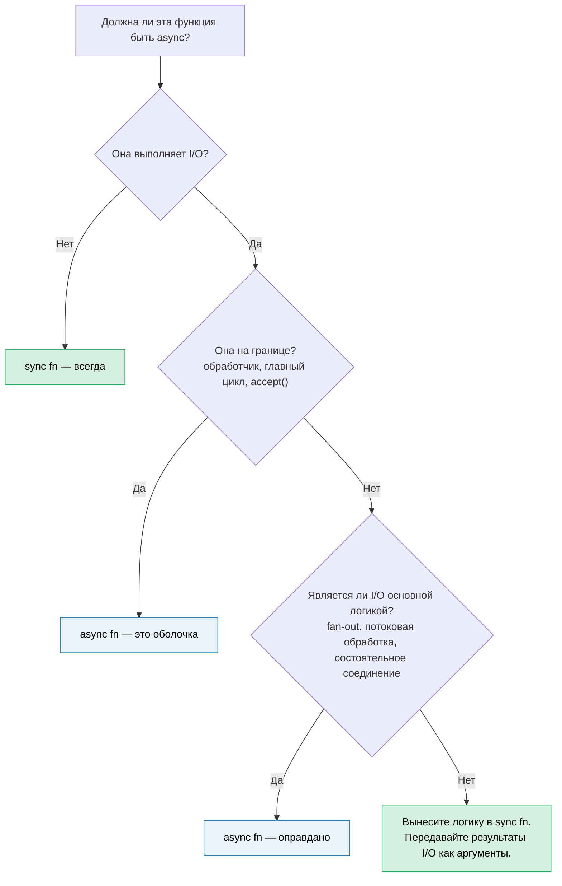

# 14. Async — это оптимизация, а не архитектура 🔴

> **Что вы узнаете:**
> - Почему async обычно «заражает» всю кодовую базу — и почему это недостаток дизайна, а не возможность
> - Паттерн «синхронное ядро, асинхронная оболочка», который делает большую часть кода тестируемой и понятной
> - Как справляться со сложным случаем: логикой, которой *тоже* нужен ввод-вывод
> - Когда `spawn_blocking` — это решение, а когда — симптом
> - Когда async действительно уместен в основной логике
> - Почему библиотеки, построенные сначала на синхронном коде, компонуемее библиотек, построенных сначала на async

Вы уже прошли 13 глав, изучая асинхронный Rust. Вот самое важное, о чём эта книга до сих пор не говорила: **большая часть вашего кода не должна быть асинхронной.**

## Проблема раскраски функций

В статье Боба Ныстрома [«What Color is Your Function?»](https://journal.stuffwithstuff.com/2015/02/01/what-color-is-your-function/) описана основная проблема: асинхронные функции могут вызывать синхронные, а синхронные функции не могут вызывать асинхронные. Как только одна функция становится асинхронной, всё, что выше по цепочке вызовов, тоже должно стать асинхронным.

В Rust это **хуже**, чем в C# или JavaScript, потому что async заражает не только сигнатуры функций, но и типы:

| Синхронный код | Асинхронный аналог | Чем отличается |
|---|---|---|
| `fn process(&self)` | `async fn process(&self)` | Вызывающие тоже должны быть асинхронными |
| `&mut T` | `Arc<Mutex<T>>` | Порождаемым задачам нужны `'static + Send` |
| `std::sync::Mutex` | `tokio::sync::Mutex` | Другой тип, если блокировка удерживается через `.await` |
| Возврат `impl Trait` | `impl Future<Output = T> + Send` | Проще с RPITIT (Rust 1.75, гл. 10), но всё равно «окрашено» |
| `#[test]` | `#[tokio::test]` | Тестам нужен рантайм |
| Трассировка стека: 5 кадров | Трассировка стека: 25 кадров | Половина — внутренности рантайма |

Каждая строка — это решение, которое кто-то должен принять, сделать правильно и поддерживать, и ни одно из них не относится к бизнес-логике. Индустрия движется *от* этого: виртуальные потоки Project Loom в Java и горутины в Go позволяют писать код, который выглядит синхронным, а рантайм дёшево мультиплексирует его. Rust выбрал явный async ради контроля с нулевой стоимостью, но у этого контроля есть цена в сложности, которую стоит платить осознанно, а не по умолчанию.

## «Но потоки дорогие»

Рефлекторный аргумент: «нам нужен async, потому что потоки дорогие». В масштабах, в которых работает большинство команд, это в основном неверно.

- **Память стека:** каждый поток ОС резервирует 8 МБ виртуального адресного пространства (по умолчанию в Linux), но ОС выделяет физическую память только под реально затронутые страницы — поток, который в основном простаивает, занимает 20–80 КБ физической памяти.
- **Переключение контекста:** ~1–5 мкс на современном железе. При 50 одновременных запросах это шум. При 100 тысячах переключений в секунду это уже заметно.
- **Стоимость создания:** ~10–30 мкс на поток в Linux. Пул потоков (rayon, `std::thread::scope`) амортизирует это до нуля.

Честный порог, при котором async окупает свою сложность, — примерно **1–10 тысяч одновременных, в основном простаивающих соединений**: зона epoll/io_uring, где стеки на соединение становятся реальной стоимостью. Ниже этого порога пул потоков проще, легче отлаживается и достаточно быстр. Выше — побеждает async. Большинство сервисов находятся ниже этого порога.

## Трудный пример: логика, которой тоже нужен ввод-вывод

Тривиальная чистая функция — `fn add(a: i32, b: i32) -> i32` — очевидно не нуждается в async. Это неинтересный урок. Интересный случай — когда бизнес-логике *кажется*, что ей посреди работы нужен ввод-вывод: валидация, которая проверяет остатки на складе, ценообразование, которое запрашивает курс валют, конвейер заказов, который ищет клиента.

Рассмотрим сервис обработки заказов. Вариант «async везде» выглядит естественно:

### Вариант A: async через всё ядро

```rust
// orders.rs — async до самого низа

pub async fn process_order(order: Order) -> Result<Receipt, OrderError> {
    // Шаг 1: валидация — чистые бизнес-правила, без ввода-вывода
    validate_items(&order)?;
    validate_quantities(&order)?;

    // Шаг 2: проверка остатков — нужен вызов к базе данных
    let stock = inventory_client.check(&order.items).await?;
    if !stock.all_available() {
        return Err(OrderError::OutOfStock(stock.missing()));
    }

    // Шаг 3: расчёт цены — чистая арифметика, но async, потому что мы уже здесь
    let pricing = calculate_pricing(&order, &stock);

    // Шаг 4: применение скидки — нужен вызов внешнего сервиса
    let discount = discount_service.lookup(order.customer_id).await?;
    let final_price = pricing.apply_discount(discount);

    // Шаг 5: формирование чека — чисто
    Ok(Receipt::new(order, final_price))
}
```

Это *разумный* асинхронный код. Никакого злоупотребления `Arc<Mutex>` — просто последовательные `await`. Большинство разработчиков написали бы именно так и пошли дальше. Но посмотрите, что произошло: `validate_items`, `validate_quantities`, `calculate_pricing` и `Receipt::new` — это чистые функции, которые затянуло в асинхронный контекст, потому что шагам 2 и 4 нужен ввод-вывод. Вся функция должна стать асинхронной, её тестам нужен рантайм, и каждый вызывающий выше по цепочке тоже оказывается «окрашенным».

### Вариант B: синхронное ядро, асинхронная оболочка

Альтернатива: отделить *что решить* от *как получить данные*:

```rust
// core.rs — чистая бизнес-логика, ноль async, ноль зависимостей от tokio

pub fn validate_order(order: &Order) -> Result<ValidatedOrder, OrderError> {
    validate_items(order)?;
    validate_quantities(order)?;
    Ok(ValidatedOrder::from(order))
}

pub fn check_stock(
    order: &ValidatedOrder,
    stock: &StockResult,
) -> Result<StockedOrder, OrderError> {
    if !stock.all_available() {
        return Err(OrderError::OutOfStock(stock.missing()));
    }
    Ok(StockedOrder::from(order, stock))
}

pub fn finalize(
    order: &StockedOrder,
    discount: Discount,
) -> Receipt {
    let pricing = calculate_pricing(order);
    let final_price = pricing.apply_discount(discount);
    Receipt::new(order, final_price)
}
```

```rust
// shell.rs — тонкий асинхронный оркестратор
//
// Примечание: `?` на сетевых вызовах требует `impl From<reqwest::Error> for OrderError`
// (или единого перечисления ошибок). См. гл. 12 — паттерны обработки ошибок в async.

use crate::core;

pub async fn process_order(order: Order) -> Result<Receipt, OrderError> {
    // Синхронно: валидация
    let validated = core::validate_order(&order)?;

    // Асинхронно: получаем остатки (это задача оболочки)
    let stock = inventory_client.check(&validated.items).await?;

    // Синхронно: применяем бизнес-правило к полученным данным
    let stocked = core::check_stock(&validated, &stock)?;

    // Асинхронно: получаем скидку
    let discount = discount_service.lookup(order.customer_id).await?;

    // Синхронно: финализируем
    Ok(core::finalize(&stocked, discount))
}
```

Асинхронная оболочка — это **конвейер «получить → решить → получить → решить»**. Каждый шаг «решить» — синхронная функция, которая получает результат ввода-вывода как входные данные, а не ходит за ним сама.

### Тестирование разницы

Синхронное ядро проверяет каждое бизнес-правило без рантайма и моков:

```rust
#[test]
fn out_of_stock_rejects_order() {
    let order = validated_order(vec![item("widget", 10)]);
    let stock = stock_result(vec![("widget", 3)]); // доступно только 3

    let result = core::check_stock(&order, &stock);
    assert_eq!(result.unwrap_err(), OrderError::OutOfStock(vec!["widget"]));
}

#[test]
fn discount_applied_correctly() {
    let order = stocked_order(100_00); // цена в копейках
    let receipt = core::finalize(&order, Discount::Percent(15));
    assert_eq!(receipt.final_price, 85_00);
}
```

Асинхронная оболочка получает более тонкий *интеграционный* тест, который проверяет связку компонентов, а не логику:

```rust
#[tokio::test]
async fn process_order_integration() {
    let mock_inventory = mock_service(/* возвращает остатки */);
    let mock_discounts = mock_service(/* возвращает 10% */);
    let receipt = process_order(sample_order()).await.unwrap();
    assert!(receipt.final_price > 0);
    // Корректность логики уже доказана тестами ядра выше
}
```

### Почему это важно

| Аспект | Async через всё ядро | Синхронное ядро + асинхронная оболочка |
|---|---|---|
| Бизнес-правила тестируются без рантайма | Нет | **Да** |
| Число модульных тестов, которым нужен `#[tokio::test]` | Все | **Только интеграционные** |
| Ошибки ввода-вывода перемешаны с логическими ошибками | Да — один тип `Result` для обоих | **Нет** — синхронный код возвращает логические ошибки, оболочка обрабатывает ошибки I/O |
| `validate_order` переиспользуем в CLI / WASM / пакетной обработке | Нет — тянет tokio транзитивно | **Да** — чистая `fn` |
| Трассировки стека через бизнес-логику | Перемешаны с кадрами рантайма | **Чистые** |
| HTTP-клиент можно заменить на gRPC позже | Нужно менять функции ядра | **Меняется только оболочка** |

Ключевая мысль: **вызовы I/O на шагах 2 и 4 не обязаны находиться внутри бизнес-логики. Они — её входные данные.** Синхронное ядро принимает `StockResult` и `Discount` как аргументы. Откуда пришли эти значения — из HTTP, gRPC, тестовой фикстуры или кэша — это забота оболочки.

## Запах `spawn_blocking`

В главе 12 `spawn_blocking` был представлен как средство от случайной блокировки исполнителя. Это правильное решение для разовых блокирующих вызовов — `std::fs::read`, библиотеки сжатия, устаревшей FFI-функции.

Но если вы обнаруживаете, что оборачиваете в `spawn_blocking` большие участки кода:

```rust
async fn handler(req: Request) -> Response {
    // Если это ваша кодовая база, граница проведена не там
    tokio::task::spawn_blocking(move || {
        let validated = validate(&req);       // синхронно
        let enriched = enrich(validated);      // синхронно
        let result = process(enriched);        // синхронно
        let output = format_response(result);  // синхронно
        output
    }).await.unwrap()
}
```

...то это кодовая база сообщает вам: **эта логика никогда не была асинхронной.** `spawn_blocking` здесь не нужен — нужен синхронный модуль, который асинхронный обработчик вызывает напрямую:

```rust
async fn handler(req: Request) -> Response {
    // validate → enrich → process → format — всё синхронное.
    // spawn_blocking не нужен: это быстро и почти не нагружает CPU.
    let response = my_core::handle(req);
    response
}
```

Оставляйте `spawn_blocking` для действительно тяжёлой работы с CPU (разбор больших полезных нагрузок, обработка изображений, сжатие), где затраты времени реально могут заморить исполнитель. Для обычной бизнес-логики, которая выполняется за микросекунды, прямой синхронный вызов проще и корректен.

## Библиотеки: сначала синхронные, асинхронная обёртка — по желанию

Вопрос границы ещё важнее для авторов библиотек. Синхронная библиотека может использоваться как из синхронного, так и из асинхронного кода:

```rust
// Синхронная библиотека — пригодна везде
let report = my_lib::analyze(&data);

// Вызывающий A: синхронная CLI-утилита
fn main() {
    let report = my_lib::analyze(&data);
    println!("{report}");
}

// Вызывающий B: асинхронный обработчик, работает нормально
async fn handler() -> Json<Report> {
    let report = my_lib::analyze(&data); // синхронный вызов в async-контексте — нормально
    Json(report)
}

// Вызывающий C: тяжёлый анализ — вызывающий решает разгрузить его
async fn handler_heavy() -> Json<Report> {
    let data = data.clone();
    let report = tokio::task::spawn_blocking(move || {
        my_lib::analyze(&data) // граница async контролирует вызывающий
    }).await.unwrap();
    Json(report)
}
```

Асинхронная библиотека загоняет *всех* вызывающих в рантайм:

```rust
// Асинхронная библиотека — пригодна только из асинхронного контекста
let report = my_lib::analyze(&data).await; // вызывающий ОБЯЗАН быть асинхронным

// Синхронный вызывающий? Теперь нужен block_on — и надежда, что нет вложенного рантайма
let report = tokio::runtime::Runtime::new().unwrap().block_on(
    my_lib::analyze(&data)
); // хрупко, может паниковать, если мы уже внутри рантайма
```

**По умолчанию проектируйте синхронные API.** Если ваша библиотека выполняет чистые вычисления, преобразование данных или разбор, нет причин делать её асинхронной. Если она выполняет ввод-вывод, рассмотрите синхронное ядро с необязательным асинхронным удобным слоем за feature-флагом — пусть вызывающий сам решает, где граница.

## Когда async принадлежит ядру

Не всё можно аккуратно разделить. Async уместен в основной логике, когда:

- **Fan-out/fan-in и есть логика.** Если бизнес-правило звучит как «одновременно запросить 5 сервисов ценообразования и вернуть самый дешёвый», конкурентность — это *и есть* логика, а не сантехника. Пытаться протащить это через синхронный код и потоки — значит заново изобретать худший async.

- **Потоковая обработка и есть логика.** Обработка непрерывного потока событий с обратным давлением — управление потоком нетривиальная бизнес-логика, а не просто обёртка над I/O.

- **Долгоживущие состоятельные соединения.** Обработчики WebSocket, двунаправленные потоки gRPC и конечные автоматы протоколов имеют переходы состояний, неразрывно связанные с событиями ввода-вывода. Итоговый проект в [гл. 17](ch17-capstone-project.md) — асинхронный чат-сервер — как раз такой случай: одновременные соединения, рассылка по комнатам и корректное завершение по своей природе являются асинхронной работой.

**Проверка:** если удаление `async` из функции потребовало бы заменить её потоками, каналами или ручным опросом, значит async оправдывает себя. Если же удаление `async` сводится к тому, чтобы просто убрать ключевое слово без других изменений, в асинхронности не было необходимости.

## Правило принятия решения



> **Эмпирическое правило:** начинайте с синхронного кода. Добавляйте async только на самой внешней границе ввода-вывода. Перемещайте его внутрь, только когда можете назвать, *какие конкурентные операции ввода-вывода* оправдывают налог на сложность.

---

<details>
<summary><strong>🏋️ Упражнение: выделите синхронное ядро</strong> (нажмите, чтобы раскрыть)</summary>

Следующий обработчик axum «заражён» async: бизнес-логика смешана с вводом-выводом. Отрефакторите его в модуль синхронного ядра и тонкую асинхронную оболочку.

```rust
use axum::{Json, extract::Path};

async fn get_device_report(Path(device_id): Path<String>) -> Result<Json<Report>, AppError> {
    // Получаем сырую телеметрию с устройства по HTTP
    let raw = reqwest::get(format!("http://bmc-{device_id}/telemetry"))
        .await?
        .json::<RawTelemetry>()
        .await?;

    // Бизнес-логика: преобразуем сырые показания датчиков в калиброванные значения
    let mut readings = Vec::new();
    for sensor in &raw.sensors {
        let calibrated = (sensor.raw_value as f64) * sensor.scale + sensor.offset;
        if calibrated < sensor.min_valid || calibrated > sensor.max_valid {
            return Err(AppError::SensorOutOfRange {
                name: sensor.name.clone(),
                value: calibrated,
            });
        }
        readings.push(CalibratedReading {
            name: sensor.name.clone(),
            value: calibrated,
            unit: sensor.unit.clone(),
        });
    }

    // Бизнес-логика: классифицируем состояние устройства
    let critical_count = readings.iter()
        .filter(|r| r.value > 90.0)
        .count();
    let health = if critical_count > 2 { Health::Critical }
                 else if critical_count > 0 { Health::Warning }
                 else { Health::Ok };

    // Получаем метаданные устройства из сервиса инвентаризации
    let meta = reqwest::get(format!("http://inventory/devices/{device_id}"))
        .await?
        .json::<DeviceMetadata>()
        .await?;

    Ok(Json(Report {
        device_id,
        device_name: meta.name,
        health,
        readings,
        timestamp: chrono::Utc::now(),
    }))
}
```

**Ваши задачи:**

1. Создайте `core.rs` с синхронными функциями: `calibrate_sensors`, `classify_health` и `build_report`
2. Создайте `shell.rs` с тонким асинхронным обработчиком, который сначала получает данные, а затем вызывает синхронное ядро
3. Напишите `#[test]` (а не `#[tokio::test]`) для: датчика вне диапазона, порогов классификации состояния и обычного отчёта

**Подсказки:**
- Синхронное ядро должно принимать `RawTelemetry` и `DeviceMetadata` как входные данные — оно никогда не должно знать, что они пришли по HTTP.
- Понадобятся небольшие вспомогательные функции для тестов (например, `raw_telemetry()`, `sensor()`, `reading()`, `device_meta()`), которые конструируют тестовые фикстуры. Их сигнатуры должны быть очевидны из использования.

<details>
<summary>🔑 Решение</summary>

```rust
// core.rs — ноль зависимостей от async

pub fn calibrate_sensors(raw: &RawTelemetry) -> Result<Vec<CalibratedReading>, AppError> {
    raw.sensors.iter().map(|sensor| {
        let calibrated = (sensor.raw_value as f64) * sensor.scale + sensor.offset;
        if calibrated < sensor.min_valid || calibrated > sensor.max_valid {
            return Err(AppError::SensorOutOfRange {
                name: sensor.name.clone(),
                value: calibrated,
            });
        }
        Ok(CalibratedReading {
            name: sensor.name.clone(),
            value: calibrated,
            unit: sensor.unit.clone(),
        })
    }).collect()
}

pub fn classify_health(readings: &[CalibratedReading]) -> Health {
    let critical_count = readings.iter()
        .filter(|r| r.value > 90.0)
        .count();
    if critical_count > 2 { Health::Critical }
    else if critical_count > 0 { Health::Warning }
    else { Health::Ok }
}

pub fn build_report(
    device_id: String,
    readings: Vec<CalibratedReading>,
    meta: &DeviceMetadata,
) -> Report {
    Report {
        device_id,
        device_name: meta.name.clone(),
        health: classify_health(&readings),
        readings,
        timestamp: chrono::Utc::now(),
    }
}
```

```rust
// shell.rs — только асинхронная граница

pub async fn get_device_report(
    Path(device_id): Path<String>,
) -> Result<Json<Report>, AppError> {
    let raw = reqwest::get(format!("http://bmc-{device_id}/telemetry"))
        .await?
        .json::<RawTelemetry>()
        .await?;

    let readings = core::calibrate_sensors(&raw)?;

    let meta = reqwest::get(format!("http://inventory/devices/{device_id}"))
        .await?
        .json::<DeviceMetadata>()
        .await?;

    Ok(Json(core::build_report(device_id, readings, &meta)))
}
```

```rust
// core_tests.rs — рантайм не нужен

// Вспомогательные функции для фикстур — создают данные без какого-либо ввода-вывода
fn sensor(name: &str, raw_value: f64, valid_range: std::ops::Range<f64>) -> RawSensor {
    RawSensor {
        name: name.into(),
        raw_value,
        scale: 1.0,
        offset: 0.0,
        min_valid: valid_range.start,
        max_valid: valid_range.end,
        unit: "unit".into(),
    }
}

fn raw_telemetry(sensors: Vec<RawSensor>) -> RawTelemetry {
    RawTelemetry { sensors }
}

fn reading(name: &str, value: f64) -> CalibratedReading {
    CalibratedReading { name: name.into(), value, unit: "unit".into() }
}

fn device_meta(name: &str) -> DeviceMetadata {
    DeviceMetadata { name: name.into() }
}

#[test]
fn sensor_out_of_range_rejected() {
    let raw = raw_telemetry(vec![sensor("gpu_temp", 105.0, 0.0..100.0)]);
    let result = core::calibrate_sensors(&raw);
    assert!(matches!(result, Err(AppError::SensorOutOfRange { .. })));
}

#[test]
fn health_classification() {
    let readings = vec![
        reading("a", 50.0),  // ok
        reading("b", 95.0),  // critical
        reading("c", 91.0),  // critical
        reading("d", 92.0),  // critical
    ];
    assert_eq!(core::classify_health(&readings), Health::Critical);
}

#[test]
fn normal_report() {
    let raw = raw_telemetry(vec![sensor("fan_rpm", 3000.0, 0.0..10000.0)]);
    let readings = core::calibrate_sensors(&raw).unwrap();
    let meta = device_meta("gpu-node-42");
    let report = core::build_report("dev-1".into(), readings, &meta);
    assert_eq!(report.health, Health::Ok);
    assert_eq!(report.readings.len(), 1);
}
```

**Что изменилось:** асинхронный обработчик сократился с 30 строк смешанной логики и ввода-вывода до 8 строк чистой оркестрации. Бизнес-правила (математика калибровки, проверка диапазонов, пороги состояния) теперь проверяются через `#[test]`, выполняются за миллисекунды и не зависят ни от tokio, ни от reqwest, ни от какого-либо мок-сервера HTTP.

</details>
</details>

---

> **Ключевые выводы:**
>
> 1. Async — это **оптимизация мультиплексирования I/O**, а не архитектура приложения. Большая часть бизнес-логики синхронна.
> 2. **Синхронное ядро, асинхронная оболочка:** держите бизнес-правила в чистых синхронных функциях, которые принимают результаты I/O как аргументы. Асинхронная оболочка организует запросы и вызывает ядро.
> 3. Если вы оборачиваете большие блоки в `spawn_blocking`, **граница проведена не там** — вместо этого вынесите логику в синхронный модуль.
> 4. **Библиотеки должны по умолчанию предлагать синхронные API.** Асинхронная библиотека заставляет всех вызывающих работать с рантаймом; синхронная позволяет вызывающему самому определять асинхронную границу.
> 5. Async окупает себя в **fan-out/fan-in, потоковой обработке и состоятельных соединениях** — там, где конкурентность *и есть* бизнес-логика.
>
> **См. также:** [Гл. 12 — Типичные ловушки](ch12-common-pitfalls.md) (spawn_blocking как тактическое решение) · [Гл. 13 — Продакшен-паттерны](ch13-production-patterns.md) (обратное давление, структурированная конкурентность) · [Гл. 17 — Итоговый проект: асинхронный чат-сервер](ch17-capstone-project.md) (случай, когда async — правильная архитектура)
