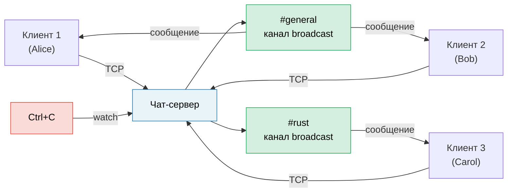

# Итоговый проект: асинхронный чат-сервер

Этот проект объединяет паттерны из всей книги в одно приложение продакшен-уровня. Вы построите **многокомнатный асинхронный чат-сервер** с использованием tokio, каналов, потоков, graceful shutdown и корректной обработки ошибок.

**Расчётное время**: 4–6 часов | **Сложность**: ★★★

> **Что вы потренируете:**
> - `tokio::spawn` и требование `'static` (гл. 8)
> - Каналы: `mpsc` для сообщений, `broadcast` для комнат, `watch` для остановки (гл. 8)
> - Потоки: чтение строк из TCP-соединений (гл. 11)
> - Типичные ловушки: безопасность при отмене, MutexGuard через `.await` (гл. 12)
> - Продакшен-паттерны: graceful shutdown, обратное давление (гл. 13)
> - Async-трейты для подключаемых бэкендов (гл. 10)

## Постановка задачи

Постройте TCP-чат-сервер, где:

1. **Клиенты** подключаются по TCP и входят в именованные комнаты
2. **Сообщения** рассылаются всем клиентам в той же комнате
3. **Команды**: `/join <комната>`, `/nick <имя>`, `/rooms`, `/quit`
4. Сервер корректно завершается по Ctrl+C — доставляя сообщения, которые уже в пути



## Шаг 1: базовый цикл принятия TCP-соединений

Начните с сервера, который принимает соединения и возвращает строки обратно:

```rust
use tokio::io::{AsyncBufReadExt, AsyncWriteExt, BufReader};
use tokio::net::TcpListener;

#[tokio::main]
async fn main() -> anyhow::Result<()> {
    let listener = TcpListener::bind("127.0.0.1:8080").await?;
    println!("Чат-сервер слушает :8080");

    loop {
        let (socket, addr) = listener.accept().await?;
        println!("[{addr}] Подключён");

        tokio::spawn(async move {
            let (reader, mut writer) = socket.into_split();
            let mut reader = BufReader::new(reader);
            let mut line = String::new();

            loop {
                line.clear();
                match reader.read_line(&mut line).await {
                    Ok(0) | Err(_) => break,
                    Ok(_) => {
                        let _ = writer.write_all(line.as_bytes()).await;
                    }
                }
            }
            println!("[{addr}] Отключён");
        });
    }
}
```

**Ваша задача**: убедитесь, что это компилируется и работает через `telnet localhost 8080`.

## Шаг 2: состояние комнат с broadcast-каналами

Каждая комната — это `broadcast::Sender`. Все клиенты в комнате подписываются, чтобы получать сообщения.

```rust
use std::collections::HashMap;
use std::sync::Arc;
use tokio::sync::{broadcast, RwLock};

type RoomMap = Arc<RwLock<HashMap<String, broadcast::Sender<String>>>>;

fn get_or_create_room(rooms: &mut HashMap<String, broadcast::Sender<String>>, name: &str) -> broadcast::Sender<String> {
    rooms.entry(name.to_string())
        .or_insert_with(|| {
            let (tx, _) = broadcast::channel(100); // Буфер на 100 сообщений
            tx
        })
        .clone()
}
```

**Ваша задача**: реализуйте состояние комнат так, чтобы:
- Клиенты начинают в `#general`
- `/join <комната>` переключает комнату (отписка от старой, подписка на новую)
- Сообщения рассылаются всем клиентам в текущей комнате отправителя

<details>
<summary>💡 Подсказка — структура клиентской задачи</summary>

Каждой клиентской задаче нужны два конкурентных цикла:
1. **Чтение из TCP** → разбор команд или рассылка в комнату
2. **Чтение из broadcast-приёмника** → запись в TCP

Используйте `tokio::select!`, чтобы запускать оба:

```rust
loop {
    tokio::select! {
        // Клиент прислал строку
        result = reader.read_line(&mut line) => {
            match result {
                Ok(0) | Err(_) => break,
                Ok(_) => {
                    // Разобрать команду или разослать сообщение
                }
            }
        }
        // Получено сообщение комнаты
        result = room_rx.recv() => {
            match result {
                Ok(msg) => {
                    let _ = writer.write_all(msg.as_bytes()).await;
                }
                Err(_) => break,
            }
        }
    }
}
```

</details>

## Шаг 3: команды

Реализуйте протокол команд:

| Команда | Действие |
|---------|----------|
| `/join <комната>` | Покинуть текущую комнату, войти в новую, объявить об этом в обеих |
| `/nick <имя>` | Сменить отображаемое имя |
| `/rooms` | Показать все активные комнаты и число участников |
| `/quit` | Корректно отключиться |
| Всё остальное | Разослать как обычное сообщение чата |

**Ваша задача**: разберите команды из входной строки. Для `/rooms` нужно читать из `RoomMap` — используйте `RwLock::read()`, чтобы не блокировать других клиентов.

## Шаг 4: graceful shutdown

Добавьте обработку Ctrl+C, чтобы сервер:
1. Прекратил приём новых соединений
2. Отправил «Сервер останавливается...» во все комнаты
3. Дождался, пока сообщения в пути будут доставлены
4. Корректно завершился

```rust
use tokio::sync::watch;

let (shutdown_tx, shutdown_rx) = watch::channel(false);

// В цикле принятия соединений:
loop {
    tokio::select! {
        result = listener.accept() => {
            let (socket, addr) = result?;
            // запускаем клиентскую задачу с shutdown_rx.clone()
        }
        _ = tokio::signal::ctrl_c() => {
            println!("Получен сигнал остановки");
            shutdown_tx.send(true)?;
            break;
        }
    }
}
```

**Ваша задача**: добавьте `shutdown_rx.changed()` в `select!`-цикл каждого клиента, чтобы клиенты завершались при сигнале остановки.

## Шаг 5: обработка ошибок и граничных случаев

Усильте сервер для продакшена:

1. **Отстающие получатели**: `broadcast::recv()` возвращает `RecvError::Lagged(n)`, если медленный клиент пропустил сообщения. Обработайте это аккуратно (запишите в лог и продолжайте, не падайте).
2. **Валидация имени**: отклоняйте пустые и слишком длинные никнеймы.
3. **Обратное давление**: буфер broadcast-канала ограничен (100). Если клиент не успевает, он получает ошибку `Lagged`.
4. **Таймаут**: отключайте клиентов, которые простаивают больше 5 минут.

```rust
use tokio::time::{timeout, Duration};

// Оборачиваем чтение в таймаут:
match timeout(Duration::from_secs(300), reader.read_line(&mut line)).await {
    Ok(Ok(0)) | Ok(Err(_)) | Err(_) => break, // конец потока, ошибка или таймаут
    Ok(Ok(_)) => { /* обрабатываем строку */ }
}
```

## Шаг 6: интеграционный тест

Напишите тест, который запускает сервер, подключает двух клиентов и проверяет доставку сообщений:

```rust
#[tokio::test]
async fn two_clients_can_chat() {
    // Запускаем сервер в фоне
    let server = tokio::spawn(run_server("127.0.0.1:0")); // Порт 0 = ОС выберет сама

    // Подключаем двух клиентов
    let mut client1 = TcpStream::connect(addr).await.unwrap();
    let mut client2 = TcpStream::connect(addr).await.unwrap();

    // Клиент 1 отправляет сообщение
    client1.write_all(b"Hello from client 1\n").await.unwrap();

    // Клиент 2 должен его получить
    let mut buf = vec![0u8; 1024];
    let n = client2.read(&mut buf).await.unwrap();
    let msg = String::from_utf8_lossy(&buf[..n]);
    assert!(msg.contains("Hello from client 1"));
}
```

## Критерии оценки

| Критерий | Цель |
|----------|------|
| Конкурентность | Много клиентов в нескольких комнатах, без блокировок |
| Корректность | Сообщения попадают только клиентам той же комнаты |
| Graceful shutdown | Ctrl+C доставляет сообщения и корректно завершает работу |
| Обработка ошибок | Отстающие получатели, отключения и таймауты обработаны |
| Организация кода | Чёткое разделение: цикл принятия, клиентская задача, состояние комнат |
| Тестирование | Минимум 2 интеграционных теста |

## Идеи для расширения

Когда базовый чат-сервер заработает, попробуйте такие улучшения:

1. **Постоянная история**: храните последние N сообщений каждой комнаты и проигрывайте их новым участникам
2. **Поддержка WebSocket**: принимайте и TCP-, и WebSocket-клиентов с помощью `tokio-tungstenite`
3. **Ограничение частоты**: используйте `tokio::time::Interval`, чтобы ограничить число сообщений от клиента в секунду
4. **Метрики**: отслеживайте число подключённых клиентов, сообщений в секунду и число комнат через крейт `prometheus`
5. **TLS**: добавьте `tokio-rustls` для зашифрованных соединений

***
