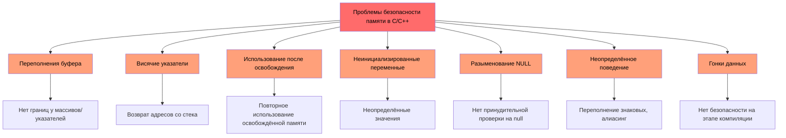
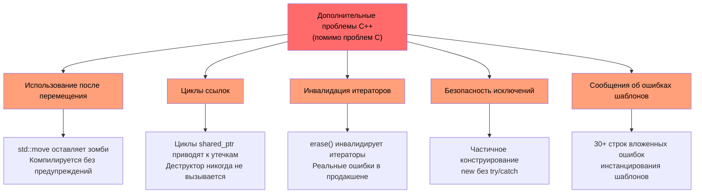
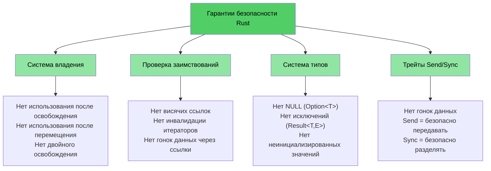

# Почему разработчикам C/C++ нужен Rust

> **Что вы узнаете:**
> - Полный список проблем, которые устраняет Rust: безопасность памяти, неопределённое поведение, гонки данных и многое другое
> - Почему `shared_ptr`, `unique_ptr` и другие средства C++ — это пластыри, а не решения
> - Конкретные примеры уязвимостей C и C++, которые в безопасном Rust структурно невозможны

> **Хотите сразу перейти к коду?** Перейдите к разделу [Покажите мне код](ch02-getting-started.md#хватит-разговоров-покажите-код)

## Что Rust устраняет — полный список

Прежде чем переходить к примерам, вот краткое резюме. Безопасный Rust **структурно предотвращает** каждую проблему из этого списка — не дисциплиной, инструментами или код-ревью, а системой типов и компилятором:

| **Устранённая проблема** | **C** | **C++** | **Как Rust её предотвращает** |
|--------------------------|:-----:|:-------:|-------------------------------|
| Переполнения и недополнения буфера | ✅ | ✅ | У всех массивов, срезов и строк есть границы; индексация проверяется во время выполнения |
| Утечки памяти (без сборщика мусора) | ✅ | ✅ | Трейт `Drop` = RAII, сделанный правильно; автоматическая очистка, правило пяти не нужно |
| Висячие указатели | ✅ | ✅ | Система времён жизни доказывает, что ссылки переживают объект, на который ссылаются, на этапе компиляции |
| Использование после освобождения | ✅ | ✅ | Система владения делает это ошибкой компиляции |
| Использование после перемещения | — | ✅ | Перемещения **разрушающие** — исходная привязка перестаёт существовать |
| Неинициализированные переменные | ✅ | ✅ | Все переменные должны быть инициализированы до использования; это обеспечивает компилятор |
| Неопределённое поведение при переполнении целых | ✅ | ✅ | В отладочных сборках переполнение вызывает panic; в релизных — переполняется (в обоих случаях поведение определено) |
| Разыменование NULL-указателей / SEGV | ✅ | ✅ | Нулевых указателей нет; `Option<T>` вынуждает явно обрабатывать отсутствие значения |
| Гонки данных | ✅ | ✅ | Трейты `Send`/`Sync` и проверка заимствований делают гонки данных ошибкой компиляции |
| Неконтролируемые побочные эффекты | ✅ | ✅ | Неизменяемость по умолчанию; для изменения нужен явный `mut` |
| Отсутствие наследования (лучшая сопровождаемость) | — | ✅ | Трейты и композиция заменяют иерархии классов; способствуют повторному использованию без жёсткой связанности |
| Отсутствие исключений; предсказуемый поток управления | — | ✅ | Ошибки — это значения (`Result<T, E>`); их невозможно проигнорировать, нет скрытых путей `throw` |
| Инвалидация итераторов | — | ✅ | Проверка заимствований запрещает изменять коллекцию во время итерации по ней |
| Циклы ссылок / утечки финализаторов | — | ✅ | Владение имеет древовидную структуру; циклы `Rc` — явный выбор, который можно обнаружить и разорвать с помощью `Weak` |
| Забытые разблокировки мьютексов | ✅ | ✅ | `Mutex<T>` оборачивает данные; защитник блокировки — единственный способ доступа к ним |
| Неопределённое поведение (вообще) | ✅ | ✅ | В безопасном Rust **нет** неопределённого поведения; блоки `unsafe` явные и поддаются аудиту |

> **Главное:** это не желаемые цели, которые навязываются правилами кодирования. Это **гарантии на этапе компиляции**. Если ваш код компилируется, эти ошибки не могут существовать.

---

## Проблемы, общие для C и C++

> **Хотите пропустить примеры?** Перейдите к разделу [Как Rust решает всё это](#как-rust-решает-всё-это) или сразу к [Покажите мне код](ch02-getting-started.md#хватит-разговоров-покажите-код)

Оба языка разделяют базовый набор проблем безопасности памяти, которые являются первопричиной более 70% CVE (Common Vulnerabilities and Exposures — общеизвестных уязвимостей и подверженностей):

### Переполнения буфера

Массивы, указатели и строки в C не имеют встроенных границ. Выйти за них очень легко:

```c
#include <stdlib.h>
#include <string.h>

void buffer_dangers() {
    char buffer[10];
    strcpy(buffer, "This string is way too long!");  // Переполнение буфера

    int arr[5] = {1, 2, 3, 4, 5};
    int *ptr = arr;           // Теряется информация о размере
    ptr[10] = 42;             // Нет проверки границ — неопределённое поведение
}
```

В C++ `std::vector::operator[]` по-прежнему не проверяет границы. Проверяет только `.at()` — но кто поймает исключение?

### Висячие указатели и использование после освобождения

```c
int *bar() {
    int i = 42;
    return &i;    // Возвращается адрес переменной на стеке — висячий указатель!
}

void use_after_free() {
    char *p = (char *)malloc(20);
    free(p);
    *p = '\0';   // Использование после освобождения — неопределённое поведение
}
```

### Неинициализированные переменные и неопределённое поведение

И C, и C++ допускают неинициализированные переменные. Их значения не определены, и чтение таких значений — неопределённое поведение:

```c
int x;               // Не инициализирована
if (x > 0) { ... }  // Неопределённое поведение — x может быть чем угодно
```

Переполнение целых в C **определено** для беззнаковых типов, но **не определено** для знаковых. В C++ переполнение знакового типа тоже является неопределённым поведением. Оба компилятора могут и действительно используют это для «оптимизаций», которые ломают программы самым неожиданным образом.

### Разыменование NULL-указателей

```c
int *ptr = NULL;
*ptr = 42;           // SEGV — но компилятор вас не остановит
```

В C++ `std::optional<T>` помогает, но он громоздкий, и его часто обходят вызовом `.value()`, который выбрасывает исключение.

### Визуализация: общие проблемы



---

## C++ добавляет новые проблемы

> **Читатели, знакомые только с C**: можете [сразу перейти к разделу Как Rust решает эти проблемы](#как-rust-решает-всё-это), если не используете C++.
>
> **Хотите сразу перейти к коду?** Перейдите к разделу [Покажите мне код](ch02-getting-started.md#хватит-разговоров-покажите-код)

C++ ввёл умные указатели, RAII, семантику перемещения и исключения, чтобы решить проблемы C. Это **пластыри, а не лекарства** — они переносят сбой из режима «падение во время выполнения» в режим «более тонкая ошибка во время выполнения»:

### `unique_ptr` и `shared_ptr` — пластыри, а не решения

Умные указатели C++ — заметное улучшение по сравнению с сырыми `malloc`/`free`, но они не решают основных проблем:

| Средство C++ | Что исправляет | Что **не** исправляет |
|--------------|----------------|------------------------|
| `std::unique_ptr` | Предотвращает утечки через RAII | **Использование после перемещения** по-прежнему компилируется; остаётся «зомби»-nullptr |
| `std::shared_ptr` | Совместное владение | **Циклы ссылок** незаметно приводят к утечкам; дисциплина `weak_ptr` — ручная |
| `std::optional` | Заменяет часть использований null | `.value()` **выбрасывает исключение**, если значения нет — скрытый поток управления |
| `std::string_view` | Избегает копирования | **Висячий**, если исходная строка освобождена — нет проверки времён жизни |
| Семантика перемещения | Эффективная передача | Объекты после перемещения находятся в **«допустимом, но не определённом состоянии»** — неопределённое поведение, которое только ждёт своего часа |
| RAII | Автоматическая очистка | Чтобы всё сделать правильно, нужно **правило пяти**; одна ошибка ломает всё |

```cpp
// unique_ptr: использование после перемещения компилируется без проблем
std::unique_ptr<int> ptr = std::make_unique<int>(42);
std::unique_ptr<int> ptr2 = std::move(ptr);
std::cout << *ptr;  // Компилируется! Неопределённое поведение во время выполнения.
                     // В Rust это ошибка компиляции: "value used after move"
```

```cpp
// shared_ptr: циклы ссылок незаметно приводят к утечкам
struct Node {
    std::shared_ptr<Node> next;
    std::shared_ptr<Node> parent;  // Цикл! Деструктор никогда не вызывается.
};
auto a = std::make_shared<Node>();
auto b = std::make_shared<Node>();
a->next = b;
b->parent = a;  // Утечка памяти — счётчик ссылок никогда не станет 0
                 // В Rust Rc<T> + Weak<T> делают циклы явными и разрываемыми
```

### Использование после перемещения — тихий убийца

`std::move` в C++ — это не перемещение, а приведение типа. Исходный объект остаётся в «допустимом, но не определённом состоянии». Компилятор позволяет продолжать его использовать:

```cpp
auto vec = std::make_unique<std::vector<int>>({1, 2, 3});
auto vec2 = std::move(vec);
vec->size();  // Компилируется! Но разыменование nullptr — падение во время выполнения
```

В Rust перемещения **разрушающие**. Исходной привязки больше нет:

```rust
let vec = vec![1, 2, 3];
let vec2 = vec;           // Перемещение — vec поглощён
// vec.len();             // Ошибка компиляции: значение использовано после перемещения
```

### Инвалидация итераторов — настоящие ошибки из боевого C++

Это не надуманные примеры — они представляют собой **реальные шаблоны ошибок**, встречающиеся в больших кодовых базах на C++:

```cpp
// ОШИБКА 1: удаление без переприсваивания итератора (неопределённое поведение)
while (it != pending_faults.end()) {
    if (*it != nullptr && (*it)->GetId() == fault->GetId()) {
        pending_faults.erase(it);   // ← итератор инвалидирован!
        removed_count++;            //   следующая итерация использует висячий итератор
    } else {
        ++it;
    }
}
// Исправление: it = pending_faults.erase(it);
```

```cpp
// ОШИБКА 2: удаление по индексу пропускает элементы
for (auto i = 0; i < entries.size(); i++) {
    if (config_status == ConfigDisable::Status::Disabled) {
        entries.erase(entries.begin() + i);  // ← сдвигает элементы
    }                                         //   i++ пропускает сдвинутый элемент
}
```

```cpp
// ОШИБКА 3: один путь удаления правильный, другой — нет
while (it != incomplete_ids.end()) {
    if (current_action == nullptr) {
        incomplete_ids.erase(it);  // ← ОШИБКА: итератор не переприсвоен
        continue;
    }
    it = incomplete_ids.erase(it); // ← Правильный путь
}
```

**Все эти примеры компилируются без единого предупреждения.** В Rust проверка заимствований делает все три ошибки ошибками компиляции — вы не можете изменять коллекцию во время итерации по ней, точка.

### Безопасность исключений и шаблон `dynamic_cast`/`new`

Современные кодовые базы на C++ по-прежнему опираются на шаблоны, у которых нет безопасности на этапе компиляции:

```cpp
// Типичный фабричный шаблон C++ — каждая ветка является потенциальной ошибкой
DriverBase* driver = nullptr;
if (dynamic_cast<ModelA*>(device)) {
    driver = new DriverForModelA(framework);
} else if (dynamic_cast<ModelB*>(device)) {
    driver = new DriverForModelB(framework);
}
// Что, если driver всё ещё nullptr? Что, если new выбросит исключение? Кто владеет driver?
```

В типичной кодовой базе на C++ на 100 тысяч строк можно найти сотни вызовов `dynamic_cast` (каждый — потенциальный сбой во время выполнения), сотни сырых вызовов `new` (каждый — потенциальная утечка) и сотни методов `virtual`/`override` (накладные расходы на таблицы виртуальных функций повсюду).

### Висячие ссылки и захваты в лямбдах

```cpp
int& get_reference() {
    int x = 42;
    return x;  // Висячая ссылка — компилируется, неопределённое поведение во время выполнения
}

auto make_closure() {
    int local = 42;
    return [&local]() { return local; };  // Висячий захват!
}
```

### Визуализация: дополнительные проблемы C++



---

## Как Rust решает всё это

Каждая проблема, перечисленная выше — и из C, и из C++, — предотвращается гарантиями Rust на этапе компиляции:

| Проблема | Решение в Rust |
|----------|----------------|
| Переполнения буфера | Срезы хранят длину; индексация проверяется на границы |
| Висячие указатели / использование после освобождения | Система времён жизни доказывает, что ссылки валидны, на этапе компиляции |
| Использование после перемещения | Перемещения разрушающие — компилятор не позволит трогать исходное значение |
| Утечки памяти | Трейт `Drop` = RAII без правила пяти; автоматическая и корректная очистка |
| Циклы ссылок | Владение имеет древовидную структуру; `Rc` + `Weak` делают циклы явными |
| Инвалидация итераторов | Проверка заимствований запрещает изменять коллекцию, пока она заимствована |
| NULL-указатели | Нет null. `Option<T>` вынуждает явно обрабатывать значение через сопоставление с образцом |
| Гонки данных | Трейты `Send`/`Sync` делают гонки данных ошибкой компиляции |
| Неинициализированные переменные | Все переменные должны быть инициализированы; это проверяет компилятор |
| Неопределённое поведение при переполнении | В отладке panic; в релизе переполнение (оба варианта определены) |
| Исключения | Исключений нет; `Result<T, E>` виден в сигнатурах типов и распространяется с помощью `?` |
| Сложность наследования | Трейты + композиция; нет проблемы ромба, нет хрупкости таблиц виртуальных функций |
| Забытые разблокировки мьютексов | `Mutex<T>` оборачивает данные; защитник блокировки — единственный путь доступа |

```rust
fn rust_prevents_everything() {
    // ✅ Нет переполнения буфера — границы проверяются
    let arr = [1, 2, 3, 4, 5];
    // arr[10];  // panic во время выполнения, никогда не UB

    // ✅ Нет использования после перемещения — ошибка компиляции
    let data = vec![1, 2, 3];
    let moved = data;
    // data.len();  // error: value used after move

    // ✅ Нет висячих указателей — ошибка времени жизни
    // let r;
    // { let x = 5; r = &x; }  // error: x does not live long enough

    // ✅ Нет null — Option вынуждает обработку
    let maybe: Option<i32> = None;
    // maybe.unwrap();  // panic, но вместо этого вы бы использовали match или if let

    // ✅ Нет гонки данных — ошибка компиляции
    // let mut shared = vec![1, 2, 3];
    // std::thread::spawn(|| shared.push(4));  // error: closure may outlive
    // shared.push(5);                         //   borrowed value
}
```

### Модель безопасности Rust — полная картина



## Краткий справочник: C vs C++ vs Rust

| **Концепция** | **C** | **C++** | **Rust** | **Ключевое отличие** |
|---------------|-------|---------|----------|---------------------|
| Управление памятью | `malloc()/free()` | `unique_ptr`, `shared_ptr` | `Box<T>`, `Rc<T>`, `Arc<T>` | Автоматическое, без циклов и зомби |
| Массивы | `int arr[10]` | `std::vector<T>`, `std::array<T>` | `Vec<T>`, `[T; N]` | Проверка границ по умолчанию |
| Строки | `char*` с `\0` | `std::string`, `string_view` | `String`, `&str` | Гарантированный UTF-8, проверка времён жизни |
| Ссылки | `int*` (сырые) | `T&`, `T&&` (перемещение) | `&T`, `&mut T` | Проверка времён жизни и заимствований |
| Полиморфизм | Указатели на функции | Виртуальные функции, наследование | Трейты, трейт-объекты | Композиция вместо наследования |
| Обобщения | Макросы / `void*` | Шаблоны | Обобщения + ограничения трейтами | Понятные сообщения об ошибках |
| Обработка ошибок | Коды возврата, `errno` | Исключения, `std::optional` | `Result<T, E>`, `Option<T>` | Никакого скрытого потока управления |
| Безопасность при null | `ptr == NULL` | `nullptr`, `std::optional<T>` | `Option<T>` | Принудительная проверка на null |
| Потокобезопасность | Вручную (pthreads) | Вручную (`std::mutex` и др.) | `Send`/`Sync` на этапе компиляции | Гонки данных невозможны |
| Система сборки | Make, CMake | CMake, Make и др. | Cargo | Интегрированный инструментарий |
| Неопределённое поведение | Повсеместно | Тонкое (переполнение знаковых, алиасинг) | Нет в безопасном коде | Безопасность гарантирована |

***
