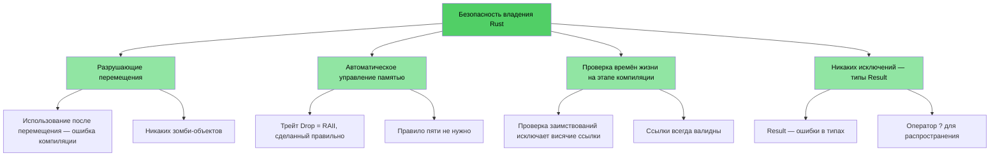
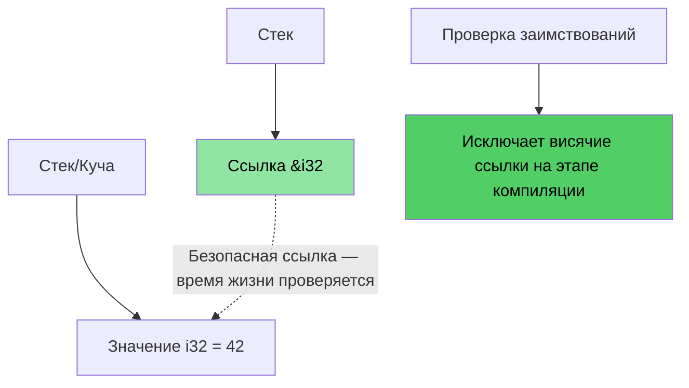
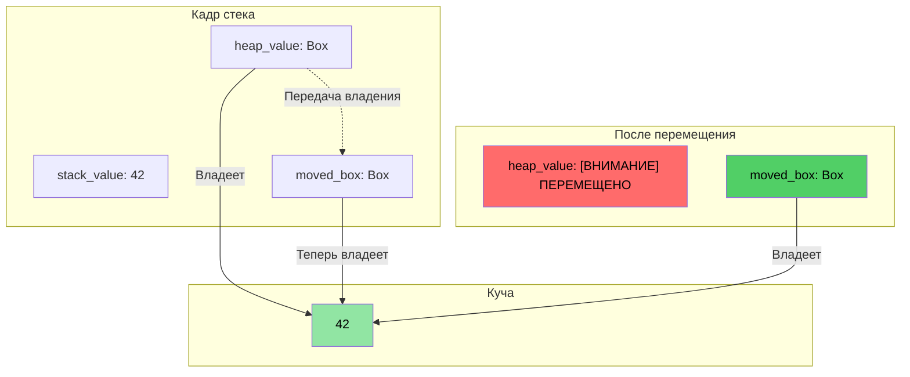
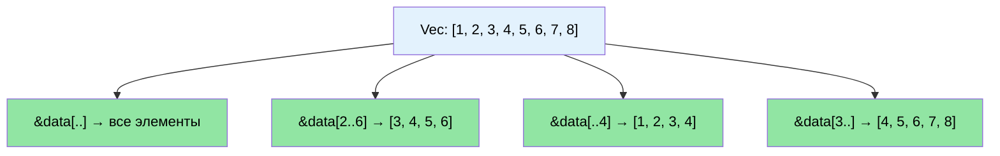

# Знакомство с курсом и общий подход

> **Что вы узнаете:** структуру курса, интерактивный формат и то, как знакомые концепции C/C++ соответствуют своим аналогам в Rust. Эта глава задаёт ожидания и даёт дорожную карту для остальной книги.

- О курсе
    - Курс основан на оригинальных материалах Rust Training (лицензии MIT и CC-BY-4.0)
    - Русский перевод и адаптация выполнены участниками проекта RustTraining-Rus
- Курс задуман как можно более интерактивный
    - Предположение: вы знаете C, C++ или оба языка
    - Примеры намеренно построены так, чтобы знакомые концепции сопоставлялись с аналогами в Rust
    - **Задавайте уточняющие вопросы в любой момент**
- Преподаватель рассчитывает на продолжение общения с командами

# Аргументы в пользу Rust
> **Хотите сразу перейти к коду?** Перейдите к разделу [Покажите мне код](ch02-getting-started.md#хватит-разговоров-покажите-код)

Независимо от того, приходите ли вы из C или C++, основные болевые точки одни и те же: ошибки безопасности памяти, которые компилируются без проблем, но приводят к падению, порче данных или утечкам во время выполнения.

- Более **70% CVE** вызваны проблемами безопасности памяти — переполнениями буфера, висячими указателями, использованием после освобождения
- Умные указатели C++ (`shared_ptr`, `unique_ptr`), RAII и семантика перемещения — шаги в правильном направлении, но это **пластыри, а не лекарство**: они оставляют открытыми использование после перемещения, циклы ссылок, инвалидацию итераторов и пробелы в безопасности исключений
- Rust даёт ту же производительность, на которую вы опираетесь в C/C++, но с **гарантиями безопасности на этапе компиляции**

> **📖 Подробнее:** см. [Почему разработчикам C/C++ нужен Rust](ch01-1-why-c-cpp-developers-need-rust.md) — там конкретные примеры уязвимостей, полный список того, что устраняет Rust, и объяснение, почему умных указателей C++ недостаточно

----

# Как Rust решает эти проблемы?

## Переполнения буфера и выход за границы
- У всех массивов, срезов и строк Rust явно заданы границы. Компилятор вставляет проверки, благодаря которым любой выход за границы приводит к **аварийному завершению во время выполнения** (panic в терминологии Rust), а не к неопределённому поведению

## Висячие указатели и ссылки
- Rust вводит времена жизни и проверку заимствований, чтобы устранять висячие ссылки на **этапе компиляции**
- Никаких висячих указателей, никакого использования после освобождения — компилятор просто не позволит это сделать

## Использование после перемещения
- Система владения в Rust делает перемещение **разрушающим**: после перемещения значения компилятор **не позволит** использовать исходную переменную. Никаких «зомби-объектов» и состояния «допустимо, но не определено»

## Управление ресурсами
- Трейт `Drop` в Rust — это RAII, реализованный правильно: компилятор автоматически освобождает ресурсы, когда они выходят из области видимости, и **предотвращает использование после перемещения**, чего RAII в C++ не может
- Правило пяти не нужно (не требуется определять конструктор копирования, конструктор перемещения, оператор копирующего присваивания, оператор перемещающего присваивания и деструктор)

## Обработка ошибок
- В Rust нет исключений. Все ошибки — это значения (`Result<T, E>`), поэтому обработка ошибок явная и видна в сигнатуре типа

## Инвалидация итераторов
- Проверка заимствований в Rust **запрещает изменять коллекцию во время итерации по ней**. Вы просто не можете написать те ошибки, которыми полны кодовые базы на C++:
```rust
// Аналог удаления во время итерации в Rust: retain()
pending_faults.retain(|f| f.id != fault_to_remove.id);

// Или: собрать в новый Vec (функциональный стиль)
let remaining: Vec<_> = pending_faults
    .into_iter()
    .filter(|f| f.id != fault_to_remove.id)
    .collect();
```

## Гонки данных
- Система типов предотвращает гонки данных на **этапе компиляции** благодаря трейтам `Send` и `Sync`

## Визуализация безопасности памяти

### Владение в Rust — безопасность по замыслу

```rust
fn safe_rust_ownership() {
    // Перемещение разрушающее: исходное значение больше недоступно
    let data = vec![1, 2, 3];
    let data2 = data;           // Происходит перемещение
    // data.len();              // Ошибка компиляции: значение использовано после перемещения
    
    // Заимствование: безопасный совместный доступ
    let owned = String::from("Hello, World!");
    let slice: &str = &owned;  // Заимствование — без выделения памяти
    println!("{}", slice);     // Всегда безопасно
    
    // Висячие ссылки невозможны
    /*
    let dangling_ref;
    {
        let temp = String::from("temporary");
        dangling_ref = &temp;  // Ошибка компиляции: temp не живёт достаточно долго
    }
    */
}
```



## Структура памяти: ссылки в Rust



### Визуализация выделения памяти в `Box<T>`

```rust
fn box_allocation_example() {
    // Выделение на стеке
    let stack_value = 42;
    
    // Выделение в куче через Box
    let heap_value = Box::new(42);
    
    // Передача владения
    let moved_box = heap_value;
    // heap_value больше недоступен
}
```



## Визуализация операций со срезами

```rust
fn slice_operations() {
    let data = vec![1, 2, 3, 4, 5, 6, 7, 8];
    
    let full_slice = &data[..];        // [1,2,3,4,5,6,7,8]
    let partial_slice = &data[2..6];   // [3,4,5,6]
    let from_start = &data[..4];       // [1,2,3,4]
    let to_end = &data[3..];           // [4,5,6,7,8]
}
```



# Другие ключевые преимущества и возможности Rust
- Никаких гонок данных между потоками (проверка `Send`/`Sync` на этапе компиляции)
- Никакого использования после перемещения (в отличие от `std::move` в C++, который оставляет зомби-объекты)
- Никаких неинициализированных переменных
    - Все переменные должны быть инициализированы до использования
- Никаких тривиальных утечек памяти
    - Трейт `Drop` = RAII, сделанный правильно, правило пяти не нужно
    - Компилятор автоматически освобождает память, когда она выходит из области видимости
- Никаких забытых блокировок мьютексов
    - Защитники блокировок — *единственный* способ доступа к данным (`Mutex<T>` оборачивает данные, а не доступ к ним)
- Никакой сложности обработки исключений
    - Ошибки — это значения (`Result<T, E>`), видны в сигнатурах функций и распространяются с помощью `?`
- Отличная поддержка вывода типов, перечислений, сопоставления с образцом и абстракций с нулевой стоимостью
- Встроенная поддержка управления зависимостями, сборки, тестирования, форматирования и линтинга
    - `cargo` заменяет make/CMake и фреймворки для линтинга и тестирования

# Краткий справочник: Rust и C/C++

| **Концепция** | **C** | **C++** | **Rust** | **Ключевое отличие** |
|---------------|-------|---------|----------|---------------------|
| Управление памятью | `malloc()/free()` | `unique_ptr`, `shared_ptr` | `Box<T>`, `Rc<T>`, `Arc<T>` | Автоматическое, без циклов |
| Массивы | `int arr[10]` | `std::vector<T>`, `std::array<T>` | `Vec<T>`, `[T; N]` | Проверка границ по умолчанию |
| Строки | `char*` с `\0` | `std::string`, `string_view` | `String`, `&str` | Гарантированный UTF-8, проверка времён жизни |
| Ссылки | `int* ptr` | `T&`, `T&&` (перемещение) | `&T`, `&mut T` | Проверка заимствований, времена жизни |
| Полиморфизм | Указатели на функции | Виртуальные функции, наследование | Трейты, трейт-объекты | Композиция вместо наследования |
| Обобщённое программирование | Макросы (`void*`) | Шаблоны | Обобщения + ограничения трейтами | Понятные сообщения об ошибках |
| Обработка ошибок | Коды возврата, `errno` | Исключения, `std::optional` | `Result<T, E>`, `Option<T>` | Никакого скрытого потока управления |
| Безопасность при null | `ptr == NULL` | `nullptr`, `std::optional<T>` | `Option<T>` | Принудительная проверка на null |
| Потокобезопасность | Вручную (pthreads) | Вручную (`std::mutex` и др.) | Гарантии на этапе компиляции | Гонки данных невозможны |
| Система сборки | Make, CMake | CMake, Make и др. | Cargo | Встроенный инструментарий |
| Неопределённое поведение | Ошибки во время выполнения | Тонкое (переполнение знаковых, алиасинг) | Ошибки на этапе компиляции | Безопасность гарантирована |
