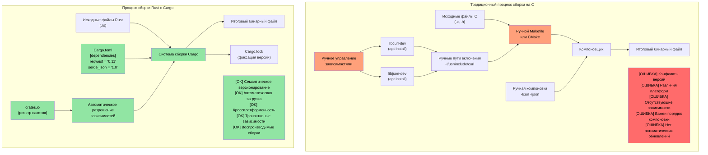
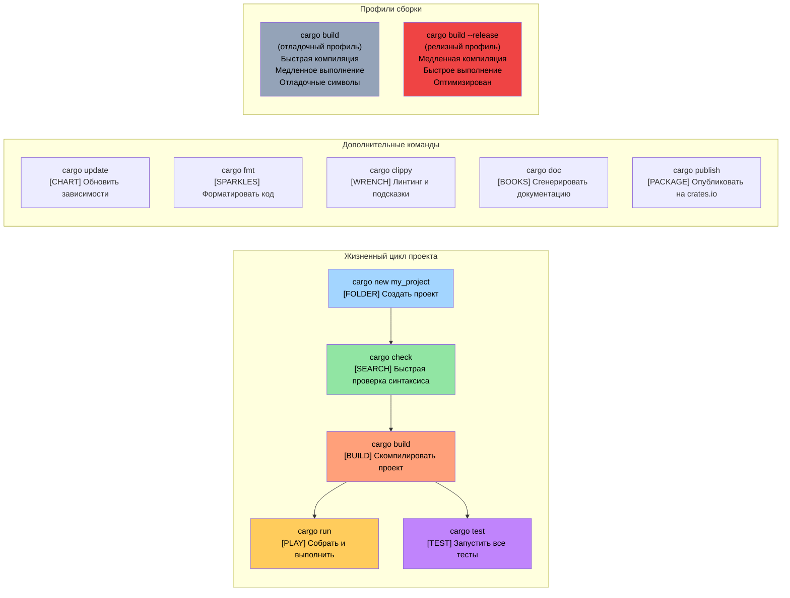

# Хватит разговоров: покажите код

> **Что вы узнаете:** вашу первую программу на Rust — `fn main()`, `println!()` и то, чем макросы Rust принципиально отличаются от препроцессорных макросов C/C++. К концу главы вы сможете написать, скомпилировать и запустить простые программы на Rust.

```rust
fn main() {
    println!("Hello world from Rust");
}
```
- Этот синтаксис должен быть понятен всем, кто знаком с языками в стиле C
    - Все функции в Rust начинаются с ключевого слова ```fn```
    - Точка входа по умолчанию для исполняемых файлов — ```main()```
    - ```println!``` выглядит как функция, но на самом деле это **макрос**. Макросы в Rust сильно отличаются от препроцессорных макросов C/C++: они гигиеничны, типобезопасны и работают с синтаксическим деревом, а не с текстовой подстановкой
- Два удобных способа быстро опробовать фрагменты кода на Rust:
    - **Онлайн**: [Rust Playground](https://play.rust-lang.org/) — вставьте код, нажмите Run и поделитесь результатом. Установка не нужна
    - **Локальный REPL**: установите [`evcxr_repl`](https://github.com/evcxr/evcxr) для интерактивного REPL Rust (как REPL Python, только для Rust):
```bash
cargo install --locked evcxr_repl
evcxr   # Запустить REPL и вводить выражения Rust интерактивно
```

### Локальная установка Rust
- Rust можно установить локально одним из следующих способов
    - Windows: https://static.rust-lang.org/rustup/dist/x86_64-pc-windows-msvc/rustup-init.exe
    - Linux / WSL: ```curl --proto '=https' --tlsv1.2 -sSf https://sh.rustup.rs | sh```
- Экосистема Rust состоит из следующих компонентов
    - ```rustc``` — самостоятельный компилятор, но им редко пользуются напрямую
    - Основной инструмент — ```cargo```, швейцарский армейский нож для управления зависимостями, сборки, тестирования, форматирования, линтинга и т. д.
    - Тулчейн Rust бывает в каналах ```stable```, ```beta``` и ```nightly``` (экспериментальный), но мы будем использовать ```stable```. Команда ```rustup update``` обновляет установку ```stable```, которая выходит каждые шесть недель
- Мы также установим плагин ```rust-analyzer``` для VSCode

# Пакеты Rust (крейты)
- Бинарные файлы Rust создаются из пакетов (далее — крейты)
    - Крейт может быть самостоятельным или зависеть от других крейтов. Крейты-зависимости могут быть локальными или удалёнными. Сторонние крейты обычно скачиваются из централизованного репозитория под названием ```crates.io```.
    - Инструмент ```cargo``` автоматически загружает крейты и их зависимости. Концептуально это эквивалентно подключению C-библиотек
    - Зависимости крейта описываются в файле ```Cargo.toml```. Там же задаётся тип цели для крейта: самостоятельный исполняемый файл, статическая библиотека, динамическая библиотека (встречается редко)
    - Справка: https://doc.rust-lang.org/cargo/reference/cargo-targets.html

## Cargo и традиционные системы сборки C

### Сравнение управления зависимостями



### Структура проекта Cargo

```text
my_project/
|-- Cargo.toml          # Конфигурация проекта (аналог package.json)
|-- Cargo.lock          # Точные версии зависимостей (генерируется автоматически)
|-- src/
|   |-- main.rs         # Главная точка входа для бинарного файла
|   |-- lib.rs          # Корень библиотеки (если создаёте библиотеку)
|   `-- bin/            # Дополнительные бинарные цели
|-- tests/              # Интеграционные тесты
|-- examples/           # Примеры кода
|-- benches/            # Бенчмарки
`-- target/             # Артефакты сборки (аналог build/ или obj/ в C)
    |-- debug/          # Отладочные сборки (быстрая компиляция, медленное выполнение)
    `-- release/        # Релизные сборки (медленная компиляция, быстрое выполнение)
```

### Основные команды Cargo



# Пример: cargo и крейты
- В этом примере у нас есть самостоятельный исполняемый крейт без других зависимостей
- Используйте следующие команды, чтобы создать новый крейт под названием ```helloworld```
```bash
cargo new helloworld
cd helloworld
cat Cargo.toml
```
- По умолчанию ```cargo run``` скомпилирует и запустит ```debug```-версию крейта (без оптимизаций). Чтобы запустить ```release```-версию, используйте ```cargo run --release```
- Обратите внимание: сам бинарный файл находится в папке ```target```, внутри папки ```debug``` или ```release```
- Возможно, вы также заметили файл ```Cargo.lock``` рядом с исходниками. Он генерируется автоматически и не должен редактироваться вручную
    - Конкретное назначение ```Cargo.lock``` мы рассмотрим позже
