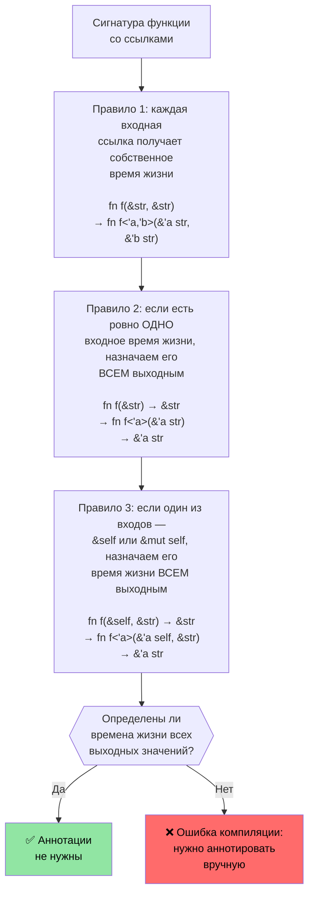

# Времена жизни и заимствование в Rust

> **Что вы узнаете:** как система времён жизни Rust гарантирует, что ссылки никогда не станут висячими — от неявных времён жизни через явные аннотации до трёх правил элизии, благодаря которым большинству кода аннотации не нужны. Понимание времён жизни здесь необходимо, прежде чем переходить к умным указателям в следующем разделе.

- Rust требует единственной изменяемой ссылки и любого количества неизменяемых ссылок
    - Время жизни любой ссылки должно быть не меньше, чем время жизни исходного владельца. Это неявные времена жизни, которые выводит компилятор (см. https://doc.rust-lang.org/nomicon/lifetime-elision.html)
```rust
fn borrow_mut(x: &mut u32) {
    *x = 43;
}
fn main() {
    let mut x = 42;
    let y = &mut x;
    borrow_mut(y);
    let _z = &x; // Допустимо, потому что компилятор знает, что y далее не используется
    //println!("{y}"); // Не скомпилируется, если раскомментировать
    borrow_mut(&mut x); // Допустимо, потому что _z не используется
    let z = &x; // Ок — изменяемое заимствование x закончилось после возврата из borrow_mut()
    println!("{z}");
}
```

# Аннотации времён жизни в Rust
- Явные аннотации времён жизни нужны, когда имеют дело с несколькими временами жизни
    - Времена жизни обозначаются символом `'`, и могут быть любым идентификатором (`'a`, `'b`, `'static` и т. д.)
    - Компилятору нужна подсказка, когда он не может понять, сколько должны жить ссылки
- **Типичный сценарий**: функция возвращает ссылку, но из какого входного параметра она взята?
```rust
#[derive(Debug)]
struct Point {x: u32, y: u32}

// Без аннотации времени жизни это не скомпилируется:
// fn left_or_right(pick_left: bool, left: &Point, right: &Point) -> &Point

// С аннотацией времени жизни — все ссылки разделяют одно время жизни 'a
fn left_or_right<'a>(pick_left: bool, left: &'a Point, right: &'a Point) -> &'a Point {
    if pick_left { left } else { right }
}

// Сложнее: разные времена жизни для входных параметров
fn get_x_coordinate<'a, 'b>(p1: &'a Point, _p2: &'b Point) -> &'a u32 {
    &p1.x  // Время жизни возвращаемого значения привязано к p1, а не к p2
}

fn main() {
    let p1 = Point {x: 20, y: 30};
    let result;
    {
        let p2 = Point {x: 42, y: 50};
        result = left_or_right(true, &p1, &p2);
        // Это работает, потому что мы используем result до выхода p2 из области видимости
        println!("Selected: {result:?}");
    }
    // Это НЕ сработает — result ссылается на p2, которого уже нет:
    // println!("After scope: {result:?}");
}
```

# Аннотации времён жизни в Rust
- Аннотации времён жизни также нужны для ссылок внутри структур данных
```rust
use std::collections::HashMap;
#[derive(Debug)]
struct Point {x: u32, y: u32}
struct Lookup<'a> {
    map: HashMap<u32, &'a Point>,
}
fn main() {
    let p = Point{x: 42, y: 42};
    let p1 = Point{x: 50, y: 60};
    let mut m = Lookup {map : HashMap::new()};
    m.map.insert(0, &p);
    m.map.insert(1, &p1);
    {
        let p3 = Point{x: 60, y:70};
        //m.map.insert(3, &p3); // Не скомпилируется
        // p3 уничтожается здесь, но m переживёт её
    }
    for (k, v) in m.map {
        println!("{v:?}");
    }
    // m уничтожается здесь
    // p1 и p уничтожаются здесь, в этом порядке
} 
```

# Упражнение: первое слово с временами жизни

🟢 **Начальный уровень** — практика элизии времён жизни в действии

Напишите функцию `fn first_word(s: &str) -> &str`, которая возвращает первое слово строки, разделённое пробелами. Подумайте, почему это компилируется без явных аннотаций времён жизни (подсказка: правила элизии №1 и №2).

<details><summary>Решение (нажмите, чтобы развернуть)</summary>

```rust
fn first_word(s: &str) -> &str {
    // Компилятор применяет правила элизии:
    // Правило 1: входной &str получает время жизни 'a → fn first_word(s: &'a str) -> &str
    // Правило 2: одно входное время жизни → выход получает то же → fn first_word(s: &'a str) -> &'a str
    match s.find(' ') {
        Some(pos) => &s[..pos],
        None => s,
    }
}

fn main() {
    let text = "hello world foo";
    let word = first_word(text);
    println!("First word: {word}");  // "hello"
    
    let single = "onlyone";
    println!("First word: {}", first_word(single));  // "onlyone"
}
```

</details>

# Упражнение: хранение срезов с временами жизни

🟡 **Средний уровень** — ваше первое знакомство с аннотациями времён жизни
- Создайте структуру, которая хранит ссылки на срез `&str`
    - Создайте длинный `&str` и сохраните в структуре ссылки на его срезы
    - Напишите функцию, которая принимает структуру и возвращает содержащийся в ней срез
```rust
// TODO: Создайте структуру для хранения ссылки на срез
struct SliceStore {

}
fn main() {
    let s = "This is long string";
    let s1 = &s[0..];
    let s2 = &s[1..2];
    // let slice = struct SliceStore {...};
    // let slice2 = struct SliceStore {...};
}
```

<details><summary>Решение (нажмите, чтобы развернуть)</summary>

```rust
struct SliceStore<'a> {
    slice: &'a str,
}

impl<'a> SliceStore<'a> {
    fn new(slice: &'a str) -> Self {
        SliceStore { slice }
    }

    fn get_slice(&self) -> &'a str {
        self.slice
    }
}

fn main() {
    let s = "This is a long string";
    let store1 = SliceStore::new(&s[0..4]);   // "This"
    let store2 = SliceStore::new(&s[5..7]);   // "is"
    println!("store1: {}", store1.get_slice());
    println!("store2: {}", store2.get_slice());
}
// Вывод:
// store1: This
// store2: is
```

</details>

---

## Углублённый разбор правил элизии времён жизни

Разработчики на C часто спрашивают: «Если времена жизни так важны, почему у большинства функций в Rust нет аннотаций `'a`?» Ответ — **элизия времён жизни**: компилятор применяет три детерминированных правила, чтобы выводить времена жизни автоматически.

### Три правила элизии

Компилятор Rust применяет эти правила **по порядку** к сигнатурам функций. Если после применения правил определены все времена жизни выходных значений, аннотации не нужны.



### Разбор правил на примерах

**Правило 1** — каждая входная ссылка получает собственный параметр времени жизни:
```rust
// Что вы пишете:
fn first_word(s: &str) -> &str { ... }

// Что видит компилятор после правила 1:
fn first_word<'a>(s: &'a str) -> &str { ... }
// Есть только одно входное время жизни → применяется правило 2
```

**Правило 2** — единственное входное время жизни распространяется на все выходные:
```rust
// После правила 2:
fn first_word<'a>(s: &'a str) -> &'a str { ... }
// ✅ Все выходные времена жизни определены — аннотация не нужна!
```

**Правило 3** — время жизни `&self` распространяется на выходные значения:
```rust
// Что вы пишете:
impl SliceStore<'_> {
    fn get_slice(&self) -> &str { self.slice }
}

// Что видит компилятор после правил 1 и 3:
impl SliceStore<'_> {
    fn get_slice<'a>(&'a self) -> &'a str { self.slice }
}
// ✅ Аннотация не нужна — время жизни &self используется для результата
```

**Когда элизия не срабатывает** — нужно аннотировать:
```rust
// Два входных параметра-ссылки, нет &self → правила 2 и 3 не применяются
// fn longest(a: &str, b: &str) -> &str  ← НЕ СКОМПИЛИРУЕТСЯ

// Исправление: сообщаем компилятору, из какого входа заимствует результат
fn longest<'a>(a: &'a str, b: &'a str) -> &'a str {
    if a.len() >= b.len() { a } else { b }
}
```

### Модель мышления программиста на C

В C каждый указатель независим — программист мысленно отслеживает, на какое выделение памяти ссылается каждый указатель, а компилятор полностью доверяет вам. В Rust времена жизни делают это отслеживание **явным и проверяемым компилятором**:

| C | Rust | Что происходит |
|---|------|-------------|
| `char* get_name(struct User* u)` | `fn get_name(&self) -> &str` | Правило 3 выводит: результат заимствован у `self` |
| `char* concat(char* a, char* b)` | `fn concat<'a>(a: &'a str, b: &'a str) -> &'a str` | Нужна аннотация — два входа |
| `void process(char* in, char* out)` | `fn process(input: &str, output: &mut String)` | Выходной ссылки нет — время жизни не нужно |
| `char* buf; /* кто владеет этим? */` | Ошибка компиляции, если время жизни неверно | Компилятор ловит висячие указатели |

### Время жизни `'static`

`'static` означает, что ссылка валидна на **протяжении всего времени работы программы**. Это аналог глобальной переменной или строкового литерала в C:

```rust
// Строковые литералы всегда 'static — они находятся в read-only секции бинарника
let s: &'static str = "hello";  // То же, что static const char* s = "hello"; в C

// Константы тоже 'static
static GREETING: &str = "hello";

// Часто встречается в ограничениях трейтов при запуске потоков:
fn spawn<F: FnOnce() + Send + 'static>(f: F) { /* ... */ }
// 'static здесь означает: «замыкание не должно заимствовать никакие локальные переменные»
// (либо перемещать их внутрь, либо использовать только данные 'static)
```

### Упражнение: предскажите элизию

🟡 **Средний уровень**

Для каждой сигнатуры функции ниже предскажите, может ли компилятор вывести времена жизни.
Если нет, добавьте необходимые аннотации:

```rust
// 1. Может ли компилятор вывести?
fn trim_prefix(s: &str) -> &str { &s[1..] }

// 2. Может ли компилятор вывести?
fn pick(flag: bool, a: &str, b: &str) -> &str {
    if flag { a } else { b }
}

// 3. Может ли компилятор вывести?
struct Parser { data: String }
impl Parser {
    fn next_token(&self) -> &str { &self.data[..5] }
}

// 4. Может ли компилятор вывести?
fn split_at(s: &str, pos: usize) -> (&str, &str) {
    (&s[..pos], &s[pos..])
}
```

<details><summary>Решение (нажмите, чтобы развернуть)</summary>

```rust,ignore
// 1. ДА — правило 1 даёт 'a для s, правило 2 распространяет его на результат
fn trim_prefix(s: &str) -> &str { &s[1..] }

// 2. НЕТ — два входных параметра-ссылки, нет &self. Нужна аннотация:
fn pick<'a>(flag: bool, a: &'a str, b: &'a str) -> &'a str {
    if flag { a } else { b }
}

// 3. ДА — правило 1 даёт 'a для &self, правило 3 распространяет его на результат
impl Parser {
    fn next_token(&self) -> &str { &self.data[..5] }
}

// 4. ДА — правило 1 даёт 'a для s (единственная входная ссылка),
//    правило 2 распространяет его на ОБА выхода. Оба среза заимствованы у s.
fn split_at(s: &str, pos: usize) -> (&str, &str) {
    (&s[..pos], &s[pos..])
}
```

</details>
