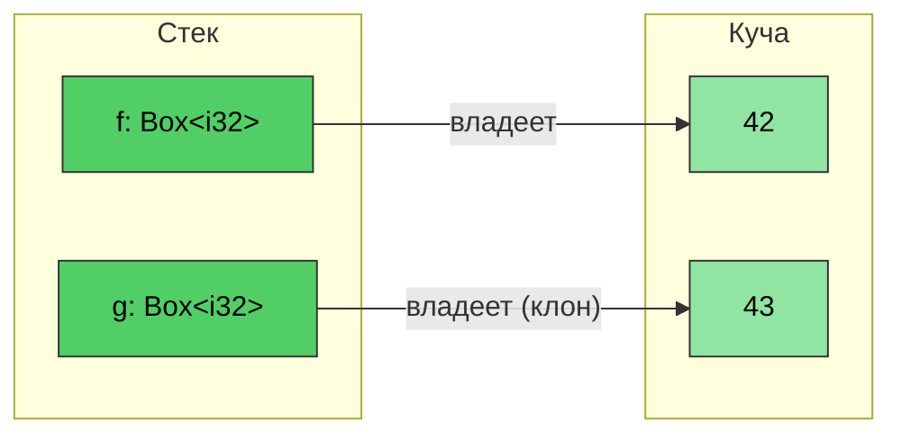
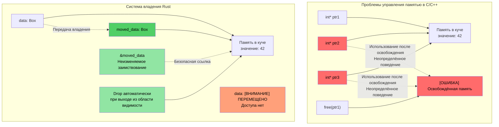
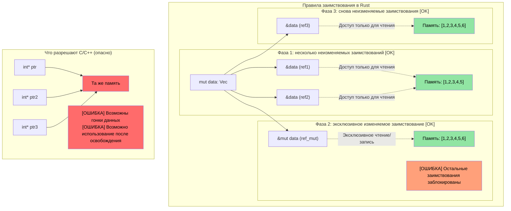

# `Box<T>` в Rust

> **Что вы узнаете:** умные указатели Rust — `Box<T>` для выделения памяти в куче, `Rc<T>` для совместного владения и `Cell<T>`/`RefCell<T>` для внутренней изменяемости. Они опираются на понятия владения и времён жизни из предыдущих разделов. Вы также кратко познакомитесь с `Weak<T>` для разрыва циклов ссылок.

**Зачем `Box<T>`?** В C для выделения памяти в куче используют `malloc`/`free`. В C++ `std::unique_ptr<T>` оборачивает `new`/`delete`. `Box<T>` в Rust — это аналог: указатель в куче с единственным владельцем, который автоматически освобождается при выходе из области видимости. В отличие от `malloc`, нет парного `free`, который можно забыть. В отличие от `unique_ptr`, нет использования после перемещения — компилятор полностью это предотвращает.

**Когда использовать `Box`, а когда выделение на стеке:**
- Содержащийся тип большой, и вы не хотите копировать его на стеке
- Нужен рекурсивный тип (например, узел связного списка, который содержит сам себя)
- Нужны трейт-объекты (`Box<dyn Trait>`)

- ```Box<T>``` можно использовать, чтобы создать указатель на тип, размещённый в куче. Размер указателя всегда фиксирован, независимо от типа ```<T>```
```rust
fn main() {
    // Создаём указатель на целое число (со значением 42), размещённое в куче
    let f = Box::new(42);
    println!("{} {}", *f, f);
    // Клонирование box создаёт новое выделение в куче
    let mut g = f.clone();
    *g = 43;
    println!("{f} {g}");
    // g и f выходят из области видимости здесь и автоматически освобождаются
}
```


## Визуализация владения и заимствования

### C/C++ и Rust: управление указателями и владением

```c
// C — ручное управление памятью, потенциальные проблемы
void c_pointer_problems() {
    int* ptr1 = malloc(sizeof(int));
    *ptr1 = 42;
    
    int* ptr2 = ptr1;  // Оба указывают на одну и ту же память
    int* ptr3 = ptr1;  // Три указателя на одну и ту же память
    
    free(ptr1);        // Освобождает память
    
    *ptr2 = 43;        // Использование после освобождения — неопределённое поведение!
    *ptr3 = 44;        // Использование после освобождения — неопределённое поведение!
}
```

> **Для программистов C++:** умные указатели помогают, но не предотвращают все проблемы:
>
> ```cpp
> // C++ — умные указатели помогают, но не предотвращают все проблемы
> void cpp_pointer_issues() {
>     auto ptr1 = std::make_unique<int>(42);
>     
>     // auto ptr2 = ptr1;  // Ошибка компиляции: unique_ptr нельзя копировать
>     auto ptr2 = std::move(ptr1);  // Ок: владение передано
>     
>     // Но C++ всё равно допускает использование после перемещения:
>     // std::cout << *ptr1;  // Компилируется! Но это неопределённое поведение!
>     
>     // Псевдонимы shared_ptr:
>     auto shared1 = std::make_shared<int>(42);
>     auto shared2 = shared1;  // Оба владеют данными
>     // Кто «на самом деле» владеет? Никто. Накладные расходы на счётчик ссылок везде.
> }
> ```

```rust
// Rust — система владения предотвращает эти проблемы
fn rust_ownership_safety() {
    let data = Box::new(42);  // data владеет выделением в куче
    
    let moved_data = data;    // Владение передано moved_data
    // data больше недоступна — ошибка компиляции при использовании
    
    let borrowed = &moved_data;  // Неизменяемое заимствование
    println!("{}", borrowed);    // Безопасно использовать
    
    // moved_data автоматически освобождается при выходе из области видимости
}
```



### Визуализация правил заимствования

```rust
fn borrowing_rules_example() {
    let mut data = vec![1, 2, 3, 4, 5];
    
    // Несколько неизменяемых заимствований — Ок
    let ref1 = &data;
    let ref2 = &data;
    println!("{:?} {:?}", ref1, ref2);  // Оба можно использовать
    
    // Изменяемое заимствование — эксклюзивный доступ
    let ref_mut = &mut data;
    ref_mut.push(6);
    // ref1 и ref2 нельзя использовать, пока активна ref_mut
    
    // Когда ref_mut закончена, неизменяемые заимствования снова работают
    let ref3 = &data;
    println!("{:?}", ref3);
}
```



---

## Внутренняя изменяемость: `Cell<T>` и `RefCell<T>`

Напомним, что по умолчанию переменные в Rust неизменяемые. Иногда хочется, чтобы большая часть типа была доступна только для чтения, но при этом разрешалась запись в одно поле.

```rust
struct Employee {
    employee_id : u64,   // Это поле должно быть неизменяемым
    on_vacation: bool,   // А что, если мы хотим разрешить запись в это поле, но сделать employee_id неизменяемым?
}
```

- Напомним, что Rust допускает *одну изменяемую* ссылку на переменную и любое количество *неизменяемых* ссылок — это проверяется на *этапе компиляции*
- Что, если мы хотим передать *неизменяемый* вектор сотрудников, но при этом разрешить обновлять поле `on_vacation`, гарантируя, что `employee_id` нельзя будет изменить?

### `Cell<T>` — внутренняя изменяемость для типов Copy

- `Cell<T>` обеспечивает **внутреннюю изменяемость**, то есть доступ на запись к отдельным элементам через ссылки, которые в остальном доступны только для чтения
- Работает копированием значений внутрь и наружу (для `.get()` требуется `T: Copy`)

### `RefCell<T>` — внутренняя изменяемость с проверкой заимствований во время выполнения

- `RefCell<T>` — вариант, который работает со ссылками
    - Применяет проверку заимствований Rust **во время выполнения**, а не на этапе компиляции
    - Допускает одно *изменяемое* заимствование, но **вызывает panic**, если есть любые другие активные ссылки
    - Используйте `.borrow()` для неизменяемого доступа и `.borrow_mut()` для изменяемого

### Когда выбрать `Cell`, а когда `RefCell`

| Критерий | `Cell<T>` | `RefCell<T>` |
|----------|-----------|-------------|
| Работает с | Типами `Copy` (целые, bool, числа с плавающей точкой) | Любыми типами (`String`, `Vec`, структуры) |
| Схема доступа | Копирует значения внутрь/наружу (`.get()`, `.set()`) | Заимствует на месте (`.borrow()`, `.borrow_mut()`) |
| Режим сбоя | Не может упасть — нет проверок во время выполнения | **Panic**, если берёте изменяемое заимствование, пока активно другое |
| Накладные расходы | Нулевые — просто копирование байтов | Небольшие — отслеживание состояния заимствования во время выполнения |
| Использовать, когда | Нужен изменяемый флаг, счётчик или небольшое значение внутри неизменяемой структуры | Нужно изменить `String`, `Vec` или сложный тип внутри неизменяемой структуры |

---

## Совместное владение: `Rc<T>`

`Rc<T>` позволяет совместное владение *неизменяемыми* данными с подсчётом ссылок. Что, если мы хотим хранить одного и того же `Employee` в нескольких местах без копирования?

```rust
#[derive(Debug)]
struct Employee {
    employee_id: u64,
}
fn main() {
    let mut us_employees = vec![];
    let mut all_global_employees = Vec::<Employee>::new();
    let employee = Employee { employee_id: 42 };
    us_employees.push(employee);
    // Не скомпилируется — employee уже перемещён
    //all_global_employees.push(employee);
}
```

`Rc<T>` решает эту проблему, разрешая совместный *неизменяемый* доступ:
- Содержащийся тип автоматически разыменовывается
- Тип уничтожается, когда счётчик ссылок становится 0

```rust
use std::rc::Rc;
#[derive(Debug)]
struct Employee {employee_id: u64}
fn main() {
    let mut us_employees = vec![];
    let mut all_global_employees = vec![];
    let employee = Employee { employee_id: 42 };
    let employee_rc = Rc::new(employee);
    us_employees.push(employee_rc.clone());
    all_global_employees.push(employee_rc.clone());
    let employee_one = all_global_employees.get(0); // Совместная неизменяемая ссылка
    for e in us_employees {
        println!("{}", e.employee_id);  // Совместная неизменяемая ссылка
    }
    println!("{employee_one:?}");
}
```

> **Для программистов C++: соответствие умных указателей**
>
> | Умный указатель C++ | Эквивалент в Rust | Ключевое отличие |
> |---|---|---|
> | `std::unique_ptr<T>` | `Box<T>` | Версия Rust используется по умолчанию — перемещение задаётся на уровне языка, а не включается явно |
> | `std::shared_ptr<T>` | `Rc<T>` (один поток) / `Arc<T>` (несколько потоков) | У `Rc` нет накладных расходов на атомарные операции; `Arc` используйте, только когда делитесь данными между потоками |
> | `std::weak_ptr<T>` | `Weak<T>` (из `Rc::downgrade()` или `Arc::downgrade()`) | Та же цель: разрыв циклов ссылок |
>
> **Ключевое различие**: в C++ вы *выбираете* использовать умные указатели. В Rust владеющие значения (`T`) и заимствование (`&T`) покрывают большинство случаев — прибегайте к `Box`/`Rc`/`Arc`, только когда нужно выделение в куче или совместное владение.

### Разрыв циклов ссылок с помощью `Weak<T>`

`Rc<T>` использует подсчёт ссылок — если два значения `Rc` указывают друг на друга, ни одно из них никогда не будет уничтожено (цикл). `Weak<T>` решает эту проблему:

```rust
use std::rc::{Rc, Weak};

struct Node {
    value: i32,
    parent: Option<Weak<Node>>,  // Слабая ссылка — не мешает уничтожению
}

fn main() {
    let parent = Rc::new(Node { value: 1, parent: None });
    let child = Rc::new(Node {
        value: 2,
        parent: Some(Rc::downgrade(&parent)),  // Слабая ссылка на родителя
    });

    // Чтобы использовать Weak, попробуйте повысить его — возвращается Option<Rc<T>>
    if let Some(parent_rc) = child.parent.as_ref().unwrap().upgrade() {
        println!("Parent value: {}", parent_rc.value);
    }
    println!("Parent strong count: {}", Rc::strong_count(&parent)); // 1, а не 2
}
```

> `Weak<T>` подробнее рассматривается в главе [Избегание избыточного clone()](ch17-1-avoiding-excessive-clone.md). Пока главное: **используйте `Weak` для «обратных ссылок» в древовидных и графовых структурах, чтобы избежать утечек памяти.**

---

## Комбинирование `Rc` с внутренней изменяемостью

Настоящая мощь проявляется, когда вы комбинируете `Rc<T>` (совместное владение) с `Cell<T>` или `RefCell<T>` (внутренняя изменяемость). Это позволяет нескольким владельцам **читать и изменять** общие данные:

| Шаблон | Сценарий использования |
|--------|----------|
| `Rc<RefCell<T>>` | Общие изменяемые данные (один поток) |
| `Arc<Mutex<T>>` | Общие изменяемые данные (несколько потоков — см. [ch13](ch13-concurrency.md)) |
| `Rc<Cell<T>>` | Общие изменяемые типы Copy (простые флаги, счётчики) |

---

# Упражнение: совместное владение и внутренняя изменяемость

🟡 **Средний уровень**

- **Часть 1 (Rc)**: создайте структуру `Employee` с полями `employee_id: u64` и `name: String`. Поместите её в `Rc<Employee>` и клонируйте в два отдельных `Vec` (`us_employees` и `global_employees`). Выведите данные из обоих векторов, чтобы показать, что они разделяют одни и те же данные.
- **Часть 2 (Cell)**: добавьте поле `on_vacation: Cell<bool>` в `Employee`. Передайте неизменяемую ссылку `&Employee` в функцию и переключите `on_vacation` изнутри этой функции — без того, чтобы делать ссылку изменяемой.
- **Часть 3 (RefCell)**: замените `name: String` на `name: RefCell<String>` и напишите функцию, которая добавляет суффикс к имени сотрудника через `&Employee` (неизменяемую ссылку).

**Стартовый код:**
```rust
use std::cell::{Cell, RefCell};
use std::rc::Rc;

#[derive(Debug)]
struct Employee {
    employee_id: u64,
    name: RefCell<String>,
    on_vacation: Cell<bool>,
}

fn toggle_vacation(emp: &Employee) {
    // TODO: Переключите on_vacation с помощью Cell::set()
}

fn append_title(emp: &Employee, title: &str) {
    // TODO: Заимствуйте name изменяемо через RefCell и добавьте title с помощью push_str
}

fn main() {
    // TODO: Создайте сотрудника, оберните в Rc, клонируйте в два Vec,
    // вызовите toggle_vacation и append_title, выведите результаты
}
```

<details><summary>Решение (нажмите, чтобы развернуть)</summary>

```rust
use std::cell::{Cell, RefCell};
use std::rc::Rc;

#[derive(Debug)]
struct Employee {
    employee_id: u64,
    name: RefCell<String>,
    on_vacation: Cell<bool>,
}

fn toggle_vacation(emp: &Employee) {
    emp.on_vacation.set(!emp.on_vacation.get());
}

fn append_title(emp: &Employee, title: &str) {
    emp.name.borrow_mut().push_str(title);
}

fn main() {
    let emp = Rc::new(Employee {
        employee_id: 42,
        name: RefCell::new("Alice".to_string()),
        on_vacation: Cell::new(false),
    });

    let mut us_employees = vec![];
    let mut global_employees = vec![];
    us_employees.push(Rc::clone(&emp));
    global_employees.push(Rc::clone(&emp));

    // Переключаем отпуск через неизменяемую ссылку
    toggle_vacation(&emp);
    println!("On vacation: {}", emp.on_vacation.get()); // true

    // Добавляем звание через неизменяемую ссылку
    append_title(&emp, ", Sr. Engineer");
    println!("Name: {}", emp.name.borrow()); // "Alice, Sr. Engineer"

    // Оба Vec видят одни и те же данные (Rc разделяет владение)
    println!("US: {:?}", us_employees[0].name.borrow());
    println!("Global: {:?}", global_employees[0].name.borrow());
    println!("Rc strong count: {}", Rc::strong_count(&emp));
}
// Вывод:
// On vacation: true
// Name: Alice, Sr. Engineer
// US: "Alice, Sr. Engineer"
// Global: "Alice, Sr. Engineer"
// Rc strong count: 3
```

</details>
