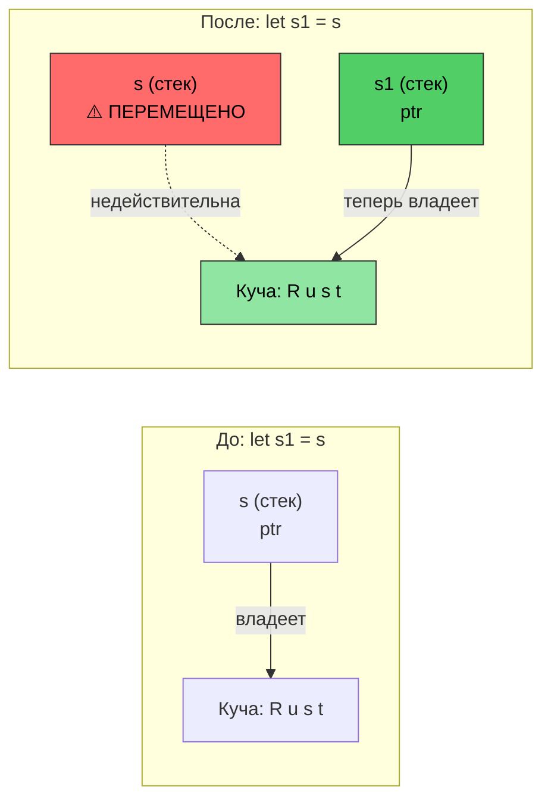
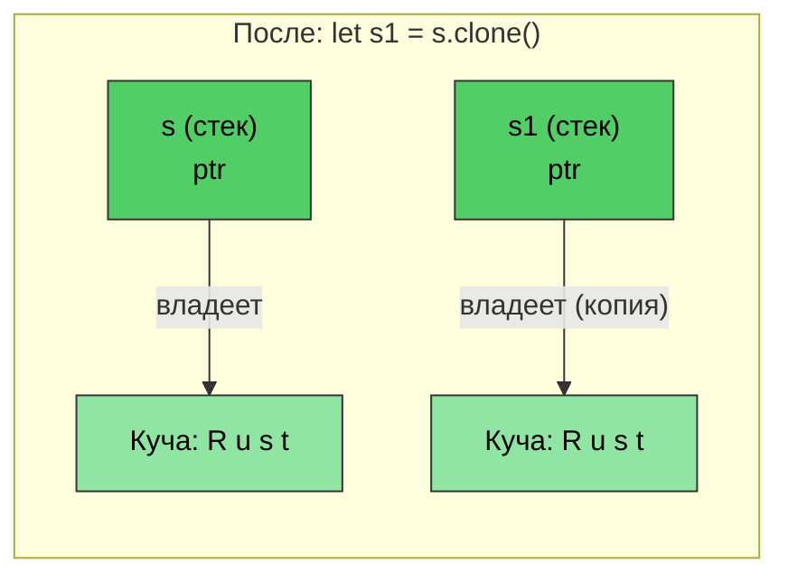

# Управление памятью в Rust

> **Что вы узнаете:** систему владения Rust — самую важную концепцию языка. После этой главы вы поймёте семантику перемещения, правила заимствования и трейт `Drop`. Если вы усвоите эту главу, остальной Rust будет даваться естественно. Если трудно — перечитайте её: владение для большинства разработчиков C/C++ становится понятным при втором прочтении.

- Управление памятью в C/C++ — источник ошибок:
    - В C память выделяется через `malloc()` и освобождается через `free()`. Нет проверок на висячие указатели, использование после освобождения или двойное освобождение
    - В C++ помогают RAII (Resource Acquisition Is Initialization) и умные указатели, но `std::move(ptr)` компилируется и после перемещения — использование после перемещения является неопределённым поведением
- Rust делает RAII **надёжным даже для невнимательных**:
    - Перемещение **разрушающее** — компилятор не позволит трогать переменную, из которой переместили значение
    - Правило пяти не нужно (нет конструктора копирования, конструктора перемещения, копирующего присваивания, перемещающего присваивания, деструктора)
    - Rust даёт полный контроль над выделением памяти, но обеспечивает безопасность на **этапе компиляции**
    - Это достигается комбинацией механизмов: владения, заимствования, изменяемости и времён жизни
    - Выделения памяти во время выполнения в Rust могут происходить как на стеке, так и в куче

> **Для программистов C++ — соответствие умных указателей:**
>
> | **C++** | **Rust** | **Улучшение безопасности** |
> |---------|----------|----------------------|
> | `std::unique_ptr<T>` | `Box<T>` | Использование после перемещения невозможно |
> | `std::shared_ptr<T>` | `Rc<T>` (один поток) | Циклов ссылок по умолчанию нет |
> | `std::shared_ptr<T>` (потокобезопасный) | `Arc<T>` | Потокобезопасность задаётся явно |
> | `std::weak_ptr<T>` | `Weak<T>` | Валидность нужно проверять |
> | Сырой указатель | `*const T` / `*mut T` | Только в блоках `unsafe` |
>
> Для разработчиков на C: `Box<T>` заменяет пары `malloc`/`free`. `Rc<T>` заменяет ручной подсчёт ссылок. Сырые указатели существуют, но ограничены блоками `unsafe`.

# Владение, заимствование и времена жизни в Rust
- Напомним, что Rust допускает только одну изменяемую ссылку на переменную и несколько ссылок только для чтения
    - Первоначальное объявление переменной устанавливает ```владение```
    - Последующие ссылки ```заимствуют``` у первоначального владельца. Правило таково: область действия заимствования никогда не может превышать область владельца. Иначе говоря, ```время жизни``` заимствования не может превышать время жизни владельца
```rust
fn main() {
    let a = 42; // Владелец
    let b = &a; // Первое заимствование
    {
        let aa = 42;
        let c = &a; // Второе заимствование; a всё ещё в области видимости
        // Ок: c выходит из области видимости здесь
        // aa выходит из области видимости здесь
    }
    // let d = &aa; // Не скомпилируется, если aa не перемещена за пределы области
    // b неявно выходит из области видимости раньше a
    // a выходит из области видимости последней
}
```

- Rust может передавать параметры в функции несколькими разными способами
    - По значению (копия): обычно для типов, которые можно тривиально скопировать (например, u8, u32, i8, i32)
    - По ссылке: это аналог передачи указателя на само значение. Также известно как заимствование; ссылка может быть неизменяемой (```&```) или изменяемой (```&mut```)
    - Перемещением: это передаёт «владение» значением функции. Вызывающий код больше не может ссылаться на исходное значение
```rust
fn foo(x: &u32) {
    println!("{x}");
}
fn bar(x: u32) {
    println!("{x}");
}
fn main() {
    let a = 42;
    foo(&a);    // По ссылке
    bar(a);     // По значению (копия)
}
```

- Rust запрещает висячие ссылки из методов
    - Ссылки, возвращаемые методами, должны оставаться в области видимости
    - Rust автоматически ```уничтожает``` ссылку, когда она выходит из области видимости.
```rust
fn no_dangling() -> &u32 {
    // Время жизни a начинается здесь
    let a = 42;
    // Не скомпилируется. Время жизни a заканчивается здесь
    &a
}

fn ok_reference(a: &u32) -> &u32 {
    // Ок, потому что время жизни a всегда превышает время жизни ok_reference()
    a
}
fn main() {
    let a = 42;     // Время жизни a начинается здесь
    let b = ok_reference(&a);
    // Время жизни b заканчивается здесь
    // Время жизни a заканчивается здесь
}
```

# Семантика перемещения в Rust
- По умолчанию присваивание в Rust передаёт владение
```rust
fn main() {
    let s = String::from("Rust");    // Выделяем строку в куче
    let s1 = s; // Передаём владение s1. На этой точке s недействительна
    println!("{s1}");
    // Это не скомпилируется
    //println!("{s}");
    // s1 выходит из области видимости здесь, и память освобождается
    // s выходит из области видимости здесь, но ничего не происходит, потому что она ничем не владеет
}
```

*После `let s1 = s` владение переходит к `s1`. Данные в куче остаются на месте — перемещается только указатель на стеке. `s` теперь недействительна.*

----
# Семантика перемещения и заимствование в Rust
```rust
fn foo(s : String) {
    println!("{s}");
    // Память в куче, на которую указывает s, освобождается здесь
}
fn bar(s : &String) {
    println!("{s}");
    // Ничего не происходит — s заимствована
}
fn main() {
    let s = String::from("Rust string move example");    // Выделяем строку в куче
    foo(s); // Передаём владение; s теперь недействительна
    // println!("{s}");  // не скомпилируется
    let t = String::from("Rust string borrow example");
    bar(&t);    // t продолжает владеть значением
    println!("{t}"); 
}
```

# Семантика перемещения и владение в Rust
- Владение можно передать перемещением
    - Нельзя использовать ссылки, которые остались открытыми после завершения перемещения
    - Рассмотрите заимствование, если перемещение нежелательно
```rust
struct Point {
    x: u32,
    y: u32,
}
fn consume_point(p: Point) {
    println!("{} {}", p.x, p.y);
}
fn borrow_point(p: &Point) {
    println!("{} {}", p.x, p.y);
}
fn main() {
    let p = Point {x: 10, y: 20};
    // Попробуйте поменять местами эти две строки
    borrow_point(&p);
    consume_point(p);
}
```

# Clone в Rust
- Метод ```clone()``` можно использовать для копирования исходной памяти. Исходная ссылка продолжает оставаться валидной (минус в том, что выделяется вдвое больше памяти)
```rust
fn main() {
    let s = String::from("Rust");    // Выделяем строку в куче
    let s1 = s.clone(); // Копируем строку; создаётся новое выделение в куче
    println!("{s1}");  
    println!("{s}");
    // s1 выходит из области видимости здесь, и память освобождается
    // s выходит из области видимости здесь, и память освобождается
}
```

*`clone()` создаёт **отдельное** выделение в куче. Обе `s` и `s1` валидны — каждая владеет своей копией.*

# Трейт Copy в Rust
- Rust реализует семантику копирования для встроенных типов через трейт ```Copy```
    - Примеры: u8, u32, i8, i32 и т. д. Семантика копирования использует «передачу по значению»
    - Пользовательские типы данных могут при желании получить семантику ```copy```, использовав макрос ```derive``` для автоматической реализации трейта ```Copy```
    - Компилятор выделит место под копию после нового присваивания
```rust
// Попробуйте закомментировать эту строку, чтобы увидеть изменение в let p1 = p; ниже
#[derive(Copy, Clone, Debug)]   // Мы подробнее поговорим об этом позже
struct Point{x: u32, y:u32}
fn main() {
    let p = Point {x: 42, y: 40};
    let p1 = p;     // Теперь здесь будет копирование вместо перемещения
    println!("p: {p:?}");
    println!("p1: {p:?}");
    let p2 = p1.clone();    // Семантически то же, что и копирование
}
```

# Трейт Drop в Rust

- Rust автоматически вызывает метод `drop()` в конце области видимости
    - `drop` — часть обобщённого трейта `Drop`. Компилятор предоставляет пустую (NOP) реализацию для всех типов по умолчанию, но типы могут её переопределить. Например, тип `String` переопределяет её, чтобы освободить память, выделенную в куче
    - Для разработчиков на C: это избавляет от необходимости вручную вызывать `free()` — ресурсы автоматически освобождаются при выходе из области видимости (RAII)
- **Ключевое свойство безопасности:** нельзя вызвать `.drop()` напрямую (компилятор это запрещает). Вместо этого используйте `drop(obj)`, которая перемещает значение в функцию, запускает его деструктор и запрещает дальнейшее использование — это исключает ошибки двойного освобождения

> **Для программистов C++:** `Drop` напрямую соответствует деструкторам C++ (`~ClassName()`):
>
> | | **Деструктор C++** | **Rust `Drop`** |
> |---|---|---|
> | **Синтаксис** | `~MyClass() { ... }` | `impl Drop for MyType { fn drop(&mut self) { ... } }` |
> | **Когда вызывается** | В конце области видимости (RAII) | В конце области видимости (так же) |
> | **При перемещении** | Исходный объект остаётся в «допустимом, но не определённом состоянии» — деструктор всё равно вызывается для перемещённого объекта | Исходного значения **больше нет** — деструктор для перемещённого значения не вызывается |
> | **Ручной вызов** | `obj.~MyClass()` (опасно, редко используется) | `drop(obj)` (безопасно — забирает владение, вызывает `drop` и запрещает дальнейшее использование) |
> | **Порядок** | Обратный порядок объявления | Обратный порядок объявления (так же) |
> | **Правило пяти** | Нужно управлять конструктором копирования, конструктором перемещения, копирующим присваиванием, перемещающим присваиванием, деструктором | Только `Drop` — компилятор обрабатывает семантику перемещения, а `Clone` подключается явно |
> | **Нужен виртуальный деструктор?** | Да, если удаляем через базовый указатель | Нет — наследования нет, поэтому проблемы среза (slicing) не возникает |

```rust
struct Point {x: u32, y:u32}

// Эквивалентно: ~Point() { printf("Goodbye point x:%u, y:%u\n", x, y); }
impl Drop for Point {
    fn drop(&mut self) {
        println!("Goodbye point x:{}, y:{}", self.x, self.y);
    }
}
fn main() {
    let p = Point{x: 42, y: 42};
    {
        let p1 = Point{x:43, y: 43};
        println!("Exiting inner block");
        // p1.drop() вызывается здесь — как деструктор C++ в конце области видимости
    }
    println!("Exiting main");
    // p.drop() вызывается здесь
}
```

# Упражнение: перемещение, копирование и Drop

🟡 **Средний уровень** — экспериментируйте свободно; компилятор подскажет
- Поэкспериментируйте с ```Point``` с ```Copy``` в ```#[derive(Debug)]``` и без него, как показано ниже, и убедитесь, что понимаете разницу. Идея в том, чтобы твёрдо понять, как работают перемещение и копирование, поэтому обязательно задавайте вопросы
- Реализуйте собственный ```Drop``` для ```Point```, который в ```drop``` обнуляет x и y. Такой шаблон полезен, например, для освобождения блокировок и других ресурсов
```rust
struct Point{x: u32, y: u32}
fn main() {
    // Создайте Point, присвойте её другой переменной, создайте новую область видимости,
    // передайте point в функцию и т. д.
}
```

<details><summary>Решение (нажмите, чтобы развернуть)</summary>

```rust
#[derive(Debug)]
struct Point { x: u32, y: u32 }

impl Drop for Point {
    fn drop(&mut self) {
        println!("Dropping Point({}, {})", self.x, self.y);
        self.x = 0;
        self.y = 0;
        // Примечание: обнуление в drop демонстрирует шаблон,
        // но эти значения нельзя наблюдать после завершения drop
    }
}

fn consume(p: Point) {
    println!("Consuming: {:?}", p);
    // p уничтожается здесь
}

fn main() {
    let p1 = Point { x: 10, y: 20 };
    let p2 = p1;  // Перемещение — p1 больше не валидна
    // println!("{:?}", p1);  // Не скомпилируется: p1 была перемещена

    {
        let p3 = Point { x: 30, y: 40 };
        println!("p3 in inner scope: {:?}", p3);
        // p3 уничтожается здесь (конец области видимости)
    }

    consume(p2);  // p2 перемещается в consume и уничтожается там
    // println!("{:?}", p2);  // Не скомпилируется: p2 была перемещена

    // Теперь попробуйте: добавить #[derive(Copy, Clone)] к Point (и удалить реализацию Drop)
    // и посмотрите, как p1 остаётся валидной после let p2 = p1;
}
// Вывод:
// p3 in inner scope: Point { x: 30, y: 40 }
// Dropping Point(30, 40)
// Consuming: Point { x: 10, y: 20 }
// Dropping Point(10, 20)
```

</details>

