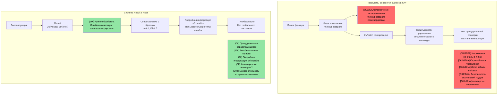
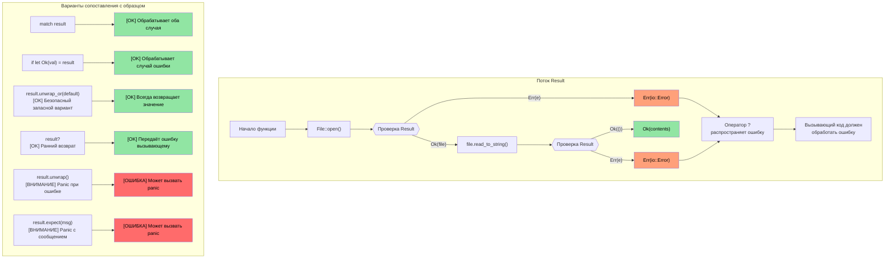

## Связываем перечисления с Option и Result

> **Что вы узнаете:** как Rust заменяет нулевые указатели на `Option<T>`, а исключения — на `Result<T, E>`, и как оператор `?` делает распространение ошибок кратким. Это самый характерный паттерн Rust: ошибки — это значения, а не скрытый поток управления.

- Помните тип `enum`, который мы изучали раньше? `Option` и `Result` в Rust — это просто перечисления, определённые в стандартной библиотеке:
```rust
// Именно так Option определён в std:
enum Option<T> {
    Some(T),  // Содержит значение
    None,     // Значения нет
}

// А вот Result:
enum Result<T, E> {
    Ok(T),    // Успех со значением
    Err(E),   // Ошибка с подробностями
}
```
- Это значит, что всё, что вы знаете о сопоставлении с образцом через `match`, напрямую работает с `Option` и `Result`
- В Rust **нет нулевых указателей** — их замена это `Option<T>`, и компилятор заставляет вас обработать случай `None`

### Сравнение с C++: исключения и Result
| **Шаблон C++** | **Аналог в Rust** | **Преимущество** |
|----------------|--------------------|--------------|
| `throw std::runtime_error(msg)` | `Err(MyError::Runtime(msg))` | Ошибка в типе возвращаемого значения — её нельзя забыть обработать |
| `try { } catch (...) { }` | `match result { Ok(v) => ..., Err(e) => ... }` | Никакого скрытого потока управления |
| `std::optional<T>` | `Option<T>` | Требуется исчерпывающее сопоставление — нельзя забыть про None |
| Аннотация `noexcept` | По умолчанию — все функции Rust «noexcept» | Исключений не существует |
| `errno` / коды возврата | `Result<T, E>` | Типобезопасно, игнорировать нельзя |

# Тип Option в Rust
- Тип ```Option``` в Rust — это ```enum``` всего с двумя вариантами: ```Some<T>``` и ```None```
    - Идея в том, что он представляет ```nullable``` тип, то есть либо содержит корректное значение этого типа (```Some<T>```), либо не содержит значения (```None```)
    - Тип ```Option``` используется в API там, где результат операции либо успешен и возвращает корректное значение, либо завершается неудачей (причина ошибки при этом неважна). Например, разбор строки в целое число
```rust
fn main() {
    // Возвращает Option<usize>
    let a = "1234".find("1");
    match a {
        Some(a) => println!("Found 1 at index {a}"),
        None => println!("Couldn't find 1")
    }
}
```

# Работа с Option в Rust
- ```Option``` в Rust можно обрабатывать разными способами
    - ```unwrap()``` вызывает panic, если ```Option<T>``` равен ```None```, и возвращает ```T``` в противном случае; это наименее предпочтительный способ
    - ```or()``` позволяет вернуть альтернативное значение
    - ```if let``` позволяет проверить наличие ```Some<T>```

> **Промышленные шаблоны**: реальные примеры из продакшн-кода на Rust — [Безопасное извлечение значения с unwrap_or](ch17-2-avoiding-unchecked-indexing.md#безопасное-извлечение-значения-с-unwrap_or) и [Функциональные преобразования: map, map_err, find_map](ch17-2-avoiding-unchecked-indexing.md#функциональные-преобразования-map-map_err-find_map).
```rust
fn main() {
  // Это возвращает Option<usize>
  let a = "1234".find("1");
  println!("{a:?} {}", a.unwrap());
  let a = "1234".find("5").or(Some(42));
  println!("{a:?}");
  if let Some(a) = "1234".find("1") {
      println!("{a}");
  } else {
    println!("Not found in string");
  }
  // Это вызовет panic
  // "1234".find("5").unwrap();
}
```

# Тип Result в Rust
- Result — это тип ```enum``` похожий на ```Option```, с двумя вариантами: ```Ok<T>``` или ```Err<E>```
    - ```Result``` широко используется в API Rust, которые могут завершиться неудачей. Идея в том, что при успехе функции вернут ```Ok<T>```, а при ошибке — конкретную ошибку ```Err<T>```
```rust
  use std::num::ParseIntError;
  fn main() {
  let a : Result<i32, ParseIntError>  = "1234z".parse();
  match a {
      Ok(n) => println!("Parsed {n}"),
      Err(e) => println!("Parsing failed {e:?}"),
  }
  let a : Result<i32, ParseIntError>  = "1234z".parse().or(Ok(-1));
  println!("{a:?}");
  if let Ok(a) = "1234".parse::<i32>() {
    println!("Let OK {a}");  
  }
  // Это вызовет panic
  //"1234z".parse().unwrap();
}
```

## Option и Result: две стороны одной медали

`Option` и `Result` тесно связаны — `Option<T>` по сути является `Result<T, ()>` (результатом, в котором ошибка не несёт никакой информации):

| `Option<T>` | `Result<T, E>` | Значение |
|-------------|---------------|---------|
| `Some(value)` | `Ok(value)` | Успех — значение есть |
| `None` | `Err(error)` | Неудача — значения нет (Option) или подробности ошибки (Result) |

**Преобразование между ними:**

```rust
fn main() {
    let opt: Option<i32> = Some(42);
    let res: Result<i32, &str> = opt.ok_or("value was None");  // Option → Result
    
    let res: Result<i32, &str> = Ok(42);
    let opt: Option<i32> = res.ok();  // Result → Option (отбрасывает ошибку)
    
    // У них много общих методов:
    // .map(), .and_then(), .unwrap_or(), .unwrap_or_else(), .is_some()/is_ok()
}
```

> **Эмпирическое правило**: используйте `Option`, когда отсутствие значения — это нормально (например, поиск по ключу). Используйте `Result`, когда неудаче нужно объяснение (например, операции ввода-вывода с файлами, разбор).

# Упражнение: реализация функции log() с Option

🟢 **Начальный уровень**

- Реализуйте функцию ```log()```, которая принимает параметр ```Option<&str>```. Если параметр равен ```None```, она должна выводить строку по умолчанию
- Функция должна возвращать ```Result``` с ```()``` и для успеха, и для ошибки (в этом случае ошибка никогда не возникнет)

<details><summary>Решение (нажмите, чтобы развернуть)</summary>

```rust
fn log(message: Option<&str>) -> Result<(), ()> {
    match message {
        Some(msg) => println!("LOG: {msg}"),
        None => println!("LOG: (no message provided)"),
    }
    Ok(())
}

fn main() {
    let _ = log(Some("System initialized"));
    let _ = log(None);
    
    // Альтернатива с unwrap_or:
    let msg: Option<&str> = None;
    println!("LOG: {}", msg.unwrap_or("(default message)"));
}
// Вывод:
// LOG: System initialized
// LOG: (no message provided)
// LOG: (default message)
```

</details>

----
# Обработка ошибок в Rust
 - Ошибки в Rust бывают неустранимыми (фатальными) и устранимыми. Фатальные ошибки приводят к ```panic```
    - В целом ситуаций, которые приводят к ```panic```, следует избегать. ```panic``` вызывается ошибками в программе, включая выход за границы индекса, вызов ```unwrap()``` для ```Option<None>``` и т. д.
    - Явные ```panic``` допустимы для условий, которые по замыслу невозможны. Макросы ```panic!``` или ```assert!``` можно использовать для проверок здравого смысла
```rust
fn main() {
   let x : Option<u32> = None;
   // println!("{x}", x.unwrap()); // Вызовет panic
   println!("{}", x.unwrap_or(0));  // OK — выводит 0
   let x = 41;
   //assert!(x == 42); // Вызовет panic
   //panic!("Something went wrong"); // Безусловный panic
   let _a = vec![0, 1];
   // println!("{}", a[2]); // Panic из-за выхода за границы; используйте a.get(2), который вернёт Option<T>
}
```

## Обработка ошибок: C++ и Rust

### Проблемы обработки ошибок на исключениях в C++

```cpp
// Обработка ошибок в C++ — исключения создают скрытый поток управления
#include <fstream>
#include <stdexcept>

std::string read_config(const std::string& path) {
    std::ifstream file(path);
    if (!file.is_open()) {
        throw std::runtime_error("Cannot open: " + path);
    }
    std::string content;
    // Что, если getline выбросит исключение? Закроется ли файл правильно?
    // С RAII — да, но как насчёт других ресурсов?
    std::getline(file, content);
    return content;  // Что, если вызывающий код не использует try/catch?
}

int main() {
    // ОШИБКА: забыли обернуть в try/catch!
    auto config = read_config("nonexistent.txt");
    // Исключение распространяется молча, программа падает
    // В сигнатуре функции ничего не предупредило нас
    return 0;
}
```



### Визуализация `Result<T, E>`

```rust
// Обработка ошибок в Rust — полная и обязательная
use std::fs::File;
use std::io::Read;

fn read_file_content(filename: &str) -> Result<String, std::io::Error> {
    let mut file = File::open(filename)?;  // ? автоматически распространяет ошибки
    let mut contents = String::new();
    file.read_to_string(&mut contents)?;
    Ok(contents)  // Случай успеха
}

fn main() {
    match read_file_content("example.txt") {
        Ok(content) => println!("File content: {}", content),
        Err(error) => println!("Failed to read file: {}", error),
        // Компилятор заставляет обработать оба случая!
    }
}
```



# Обработка ошибок в Rust
- Rust использует перечисление ```enum Result<T, E>``` для обработки устранимых ошибок
    - Вариант ```Ok<T>``` содержит результат в случае успеха, а ```Err<E>``` содержит ошибку
```rust
fn main() {
    let x = "1234x".parse::<u32>();
    match x {
        Ok(x) => println!("Parsed number {x}"),
        Err(e) => println!("Parsing error {e:?}"),
    }
    let x  = "1234".parse::<u32>();
    // То же, что и выше, но с корректным числом
    if let Ok(x) = &x {
        println!("Parsed number {x}")
    } else if let Err(e) = &x {
        println!("Error: {e:?}");
    }
}
```

# Оператор ? в Rust
- Оператор ```?``` — это удобная краткая запись для шаблона ```match``` с ветками ```Ok``` / ```Err```
    - Обратите внимание: метод должен возвращать ```Result<T, E>```, чтобы можно было использовать ```?```
    - Тип ```Result<T, E>``` можно менять. В примере ниже мы возвращаем тот же тип ошибки (```std::num::ParseIntError```), который возвращает ```str::parse()```
```rust
fn double_string_number(s : &str) -> Result<u32, std::num::ParseIntError> {
   let x = s.parse::<u32>()?; // Немедленно возвращает результат в случае ошибки
   Ok(x*2)
}
fn main() {
    let result = double_string_number("1234");
    println!("{result:?}");
    let result = double_string_number("1234x");
    println!("{result:?}");
}
```

# Преобразование ошибок в Rust
- Ошибки можно преобразовывать в другие типы или в значения по умолчанию (https://doc.rust-lang.org/std/result/enum.Result.html#method.unwrap_or_default)
```rust
// Меняет тип ошибки на () в случае ошибки
fn double_string_number(s : &str) -> Result<u32, ()> {
   let x = s.parse::<u32>().map_err(|_|())?; // Немедленно возвращает результат в случае ошибки
   Ok(x*2)
}
```
```rust
fn double_string_number(s : &str) -> Result<u32, ()> {
   let x = s.parse::<u32>().unwrap_or_default(); // По умолчанию 0 в случае ошибки разбора
   Ok(x*2)
}
```
```rust
fn double_optional_number(x : Option<u32>) -> Result<u32, ()> {
    // ok_or преобразует Option<None> в Result<u32, ()> в этом примере
    x.ok_or(()).map(|x|x*2) // .map() применяется только к Ok(u32)
}
```

# Упражнение: обработка ошибок

🟡 **Средний уровень**
- Реализуйте функцию ```log()``` с одним параметром u32. Если параметр не равен 42, верните ошибку. Тип ```Result<>``` для успеха и ошибки — ```()```
- Вызовите функцию ```log()``` так, чтобы она сама завершалась с тем же типом ```Result<>```, если ```log()``` вернула ошибку. В противном случае выведите сообщение, что log был успешно вызван

```rust
fn log(x: u32) -> ?? {

}

fn call_log(x: u32) -> ?? {
    // Вызовите log(x), затем немедленно выйдите, если она вернула ошибку
    println!("log was successfully called");
}

fn main() {
    call_log(42);
    call_log(43);
}
``` 

<details><summary>Решение (нажмите, чтобы развернуть)</summary>

```rust
fn log(x: u32) -> Result<(), ()> {
    if x == 42 {
        Ok(())
    } else {
        Err(())
    }
}

fn call_log(x: u32) -> Result<(), ()> {
    log(x)?;  // Немедленно выходим, если log() вернула ошибку
    println!("log was successfully called with {x}");
    Ok(())
}

fn main() {
    let _ = call_log(42);  // Выводит: log was successfully called with 42
    let _ = call_log(43);  // Возвращает Err(()), ничего не выводится
}
// Вывод:
// log was successfully called with 42
```

</details>

