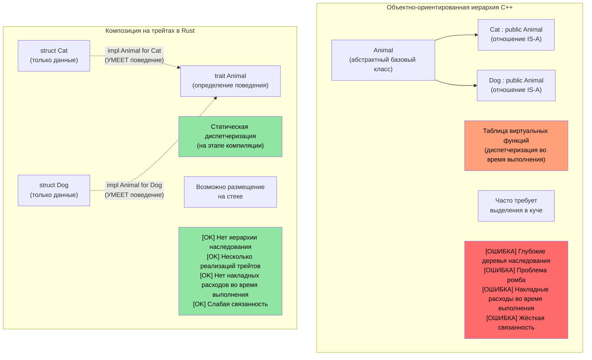
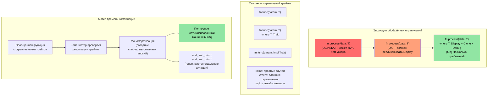

# Трейты в Rust

> **Что вы узнаете:** трейты — ответ Rust на интерфейсы, абстрактные базовые классы и перегрузку операторов. Вы научитесь определять трейты, реализовывать их для своих типов и использовать динамическую диспетчеризацию (`dyn Trait`) или статическую (обобщения). Для программистов C++: трейты заменяют виртуальные функции, CRTP и концепты. Для программистов на C: трейты — структурированный способ полиморфизма в Rust.

- Трейты в Rust похожи на интерфейсы в других языках
    - Трейты определяют методы, которые должны быть реализованы типами, реализующими трейт.
```rust
fn main() {
    trait Pet {
        fn speak(&self);
    }
    struct Cat;
    struct Dog;
    impl Pet for Cat {
        fn speak(&self) {
            println!("Meow");
        }
    }
    impl Pet for Dog {
        fn speak(&self) {
            println!("Woof!")
        }
    }
    let c = Cat{};
    let d = Dog{};
    c.speak();  // Между Cat и Dog нет отношения «является»
    d.speak(); // Между Cat и Dog нет отношения «является»
}
```

## Трейты в сравнении с концептами и интерфейсами C++

### Традиционное наследование в C++ и трейты Rust

```cpp
// C++ — полиморфизм на основе наследования
class Animal {
public:
    virtual void speak() = 0;  // Чисто виртуальная функция
    virtual ~Animal() = default;
};

class Cat : public Animal {  // «Cat ЯВЛЯЕТСЯ Animal»
public:
    void speak() override {
        std::cout << "Meow" << std::endl;
    }
};

void make_sound(Animal* animal) {  // Полиморфизм времени выполнения
    animal->speak();  // Вызов виртуальной функции
}
```

```rust
// Rust — композиция вместо наследования, через трейты
trait Animal {
    fn speak(&self);
}

struct Cat;  // Cat НЕ является Animal, но РЕАЛИЗУЕТ поведение Animal

impl Animal for Cat {  // «Cat УМЕЕТ поведение Animal»
    fn speak(&self) {
        println!("Meow");
    }
}

fn make_sound<T: Animal>(animal: &T) {  // Статический полиморфизм
    animal.speak();  // Прямой вызов функции (без накладных расходов)
}
```



### Ограничения трейтов и обобщённые ограничения

```rust
use std::fmt::Display;
use std::ops::Add;

// Аналог на C++ с шаблонами (меньше ограничений)
// template<typename T>
// T add_and_print(T a, T b) {
//     // Нет гарантии, что T поддерживает + или вывод
//     return a + b;  // Может не скомпилироваться
// }

// Rust — явные ограничения трейтами
fn add_and_print<T>(a: T, b: T) -> T 
where 
    T: Display + Add<Output = T> + Copy,
{
    println!("Adding {} + {}", a, b);  // Трейт Display
    a + b  // Трейт Add
}
```



### Перегрузка операторов в C++ → трейты `std::ops` в Rust

В C++ операторы перегружают, записывая свободные функции или методы с особыми именами (`operator+`, `operator<<`, `operator[]` и т. д.). В Rust каждый оператор соответствует трейту из `std::ops` (или `std::fmt` для вывода). Вы **реализуете трейт** вместо того, чтобы писать функцию с магическим именем.

#### Рядом: оператор `+`

```cpp
// C++: перегрузка оператора как метода или свободной функции
struct Vec2 {
    double x, y;
    Vec2 operator+(const Vec2& rhs) const {
        return {x + rhs.x, y + rhs.y};
    }
};

Vec2 a{1.0, 2.0}, b{3.0, 4.0};
Vec2 c = a + b;  // вызывает a.operator+(b)
```

```rust
use std::ops::Add;

#[derive(Debug, Clone, Copy)]
struct Vec2 { x: f64, y: f64 }

impl Add for Vec2 {
    type Output = Vec2;                     // Ассоциированный тип — результат +
    fn add(self, rhs: Vec2) -> Vec2 {
        Vec2 { x: self.x + rhs.x, y: self.y + rhs.y }
    }
}

let a = Vec2 { x: 1.0, y: 2.0 };
let b = Vec2 { x: 3.0, y: 4.0 };
let c = a + b;  // вызывает <Vec2 as Add>::add(a, b)
println!("{c:?}"); // Vec2 { x: 4.0, y: 6.0 }
```

#### Ключевые отличия от C++

| Аспект | C++ | Rust |
|--------|-----|------|
| **Механизм** | Магические имена функций (`operator+`) | Реализация трейта (`impl Add for T`) |
| **Поиск** | Grep по `operator+` или чтение заголовка | Смотрите реализации трейтов — отличная поддержка в IDE |
| **Тип результата** | Выбирается свободно | Фиксируется ассоциированным типом `Output` |
| **Получатель** | Обычно принимает `const T&` (заимствование) | По умолчанию принимает `self` по значению (перемещение!) |
| **Симметрия** | Можно написать `impl operator+(int, Vec2)` | Нужно добавить `impl Add<Vec2> for i32` (действуют правила для чужих трейтов) |
| **`<<` для вывода** | `operator<<(ostream&, T)` — перегрузка для *любого* потока | `impl fmt::Display for T` — одно каноническое представление `to_string` |

#### Ловушка `self` по значению

В Rust `Add::add(self, rhs)` принимает `self` **по значению**. Для типов `Copy` (как `Vec2` выше, у которого есть `derive(Copy)`) это нормально — компилятор копирует. Но для типов, не реализующих `Copy`, `+` **поглощает** операнды:

```rust
let s1 = String::from("hello ");
let s2 = String::from("world");
let s3 = s1 + &s2;  // s1 ПЕРЕМЕЩЁН в s3!
// println!("{s1}");  // ❌ Ошибка компиляции: значение использовано после перемещения
println!("{s2}");     // ✅ s2 была только заимствована (&s2)
```

Именно поэтому `String + &str` работает, а `&str + &str` — нет: `Add` реализован только для `String + &str`, и он поглощает левую `String`, чтобы переиспользовать её буфер. В C++ этому нет аналога: `std::string::operator+` всегда создаёт новую строку.

#### Полное соответствие: операторы C++ → трейты Rust

| Оператор C++ | Трейт Rust | Примечания |
|-------------|-----------|-------|
| `operator+` | `std::ops::Add` | Ассоциированный тип `Output` |
| `operator-` | `std::ops::Sub` | |
| `operator*` | `std::ops::Mul` | Не разыменование указателя — это `Deref` |
| `operator/` | `std::ops::Div` | |
| `operator%` | `std::ops::Rem` | |
| `operator-` (унарный) | `std::ops::Neg` | |
| `operator!` / `operator~` | `std::ops::Not` | Rust использует `!` и для логического, и для побитового НЕ (оператора `~` нет) |
| `operator&`, `\|`, `^` | `BitAnd`, `BitOr`, `BitXor` | |
| `operator<<`, `>>` (сдвиг) | `Shl`, `Shr` | НЕ потоковый ввод-вывод! |
| `operator+=` | `std::ops::AddAssign` | Принимает `&mut self` (а не `self`) |
| `operator[]` | `std::ops::Index` / `IndexMut` | Возвращает `&Output` / `&mut Output` |
| `operator()` | `Fn` / `FnMut` / `FnOnce` | Замыкания реализуют их; напрямую `impl Fn` написать нельзя |
| `operator==` | `PartialEq` (+ `Eq`) | В `std::cmp`, а не в `std::ops` |
| `operator<` | `PartialOrd` (+ `Ord`) | В `std::cmp` |
| `operator<<` (поток) | `fmt::Display` | `println!("{}", x)` |
| `operator<<` (отладка) | `fmt::Debug` | `println!("{:?}", x)` |
| `operator bool` | Прямого аналога нет | Используйте `impl From<T> for bool` или именованный метод вроде `.is_empty()` |
| `operator T()` (неявное преобразование) | Неявных преобразований нет | Используйте трейты `From`/`Into` (явные) |

#### Ограничители: что запрещает Rust

1. **Нет неявных преобразований**: `operator int()` в C++ может вызывать тихие и неожиданные приведения. В Rust нет операторов неявного преобразования — используйте `From`/`Into` и вызывайте `.into()` явно.
2. **Нельзя перегружать `&&` / `||`**: C++ это позволяет (и ломает семантику короткого замыкания!). Rust — нет.
3. **Нельзя перегружать `=`**: присваивание всегда является перемещением или копированием, никогда не определяется пользователем. Составное присваивание (`+=`) перегружается через `AddAssign` и т. д.
4. **Нельзя перегружать `,`**: C++ позволяет `operator,()` — один из самых печально известных подводных камней C++. Rust — нет.
5. **Нельзя перегружать `&` (взятие адреса)**: ещё один подводный камень C++ (для обхода существует `std::addressof`). Оператор `&` в Rust всегда означает «заимствование».
6. **Правила согласованности (coherence)**: можно реализовать `Add<Foreign>` только для собственного типа или `Add<YourType>` для чужого типа — но никогда `Add<Foreign>` для `Foreign`. Это предотвращает конфликтующие определения операторов между крейтами.

> **Главное**: в C++ перегрузка операторов мощна, но в основном не регламентирована — можно перегружать почти что угодно, включая запятую и взятие адреса, а неявные преобразования могут срабатывать незаметно. Rust даёт ту же выразительность для арифметических и операторов сравнения через трейты, но **блокирует исторически опасные перегрузки** и требует, чтобы все преобразования были явными.

----
# Трейты в Rust (реализация для встроенных типов)
- Rust позволяет реализовать пользовательский трейт даже для встроенных типов, например u32, как в этом примере. Однако либо трейт, либо тип должен принадлежать крейту
```rust
trait IsSecret {
  fn is_secret(&self);
}
// Трейт IsSecret принадлежит нашему крейту, поэтому всё в порядке
impl IsSecret for u32 {
  fn is_secret(&self) {
      if *self == 42 {
          println!("Is secret of life");
      }
  }
}

fn main() {
  42u32.is_secret();
  43u32.is_secret();
}
```


# Трейты в Rust (наследование интерфейсов)
- Трейты поддерживают наследование интерфейсов и реализации по умолчанию
```rust
trait Animal {
  // Реализация по умолчанию
  fn is_mammal(&self) -> bool {
    true
  }
}
trait Feline : Animal {
  // Реализация по умолчанию
  fn is_feline(&self) -> bool {
    true
  }
}

struct Cat;
// Используем реализации по умолчанию. Обратите внимание: все надтрейты нужно реализовать отдельно
impl Feline for Cat {}
impl Animal for Cat {}
fn main() {
  let c = Cat{};
  println!("{} {}", c.is_mammal(), c.is_feline());
}
```
----
# Упражнение: реализация трейта Logger

🟡 **Средний уровень**

- Реализуйте трейт ```Log``` с единственным методом log(), который принимает u64
    - Реализуйте два разных логгера ```SimpleLogger``` и ```ComplexLogger```, которые реализуют трейт ```Log```. Один должен выводить "Simple logger" вместе с ```u64```, а другой — "Complex logger" вместе с ```u64```

<details><summary>Решение (нажмите, чтобы развернуть)</summary>

```rust
trait Log {
    fn log(&self, value: u64);
}

struct SimpleLogger;
struct ComplexLogger;

impl Log for SimpleLogger {
    fn log(&self, value: u64) {
        println!("Simple logger: {value}");
    }
}

impl Log for ComplexLogger {
    fn log(&self, value: u64) {
        println!("Complex logger: {value} (hex: 0x{value:x}, binary: {value:b})");
    }
}

fn main() {
    let simple = SimpleLogger;
    let complex = ComplexLogger;
    simple.log(42);
    complex.log(42);
}
// Вывод:
// Simple logger: 42
// Complex logger: 42 (hex: 0x2a, binary: 101010)
```

</details>

----
# Ассоциированные типы трейтов в Rust
```rust
#[derive(Debug)]
struct Small(u32);
#[derive(Debug)]
struct Big(u32);
trait Double {
    type T;
    fn double(&self) -> Self::T;
}

impl Double for Small {
    type T = Big;
    fn double(&self) -> Self::T {
        Big(self.0 * 2)
    }
}
fn main() {
    let a = Small(42);
    println!("{:?}", a.double());
}
```

# Реализация трейтов через impl в Rust
- ```impl``` можно использовать вместе с трейтами, чтобы принимать любой тип, который реализует трейт
```rust
trait Pet {
    fn speak(&self);
}
struct Dog {}
struct Cat {}
impl Pet for Dog {
    fn speak(&self) {println!("Woof!")}
}
impl Pet for Cat {
    fn speak(&self) {println!("Meow")}
}
fn pet_speak(p: &impl Pet) {
    p.speak();
}
fn main() {
    let c = Cat {};
    let d = Dog {};
    pet_speak(&c);
    pet_speak(&d);
}
```

# Реализация трейтов через impl: возвращаемые значения
- ```impl``` также можно использовать в возвращаемом значении
```rust
trait Pet {}
struct Dog;
struct Cat;
impl Pet for Cat {}
impl Pet for Dog {}
fn cat_as_pet() -> impl Pet {
    let c = Cat {};
    c
}
fn dog_as_pet() -> impl Pet {
    let d = Dog {};
    d
}
fn main() {
    let p = cat_as_pet();
    let d = dog_as_pet();
}
```
----
# Динамические трейты в Rust
- Динамические трейты позволяют вызывать функциональность трейта, не зная конкретного типа. Это называется ```стирание типа``` (type erasure)
```rust
trait Pet {
    fn speak(&self);
}
struct Dog {}
struct Cat {x: u32}
impl Pet for Dog {
    fn speak(&self) {println!("Woof!")}
}
impl Pet for Cat {
    fn speak(&self) {println!("Meow")}
}
fn pet_speak(p: &dyn Pet) {
    p.speak();
}
fn main() {
    let c = Cat {x: 42};
    let d = Dog {};
    pet_speak(&c);
    pet_speak(&d);
}
```
----

## Выбор между `impl Trait`, `dyn Trait` и перечислениями

Все три подхода дают полиморфизм, но с разными компромиссами:

| Подход | Диспетчеризация | Производительность | Разнородные коллекции? | Когда использовать |
|----------|----------|-------------|---------------------------|-------------|
| `impl Trait` / обобщения | Статическая (мономорфизация) | Без накладных расходов — встраивается на этапе компиляции | Нет — каждый слот имеет один конкретный тип | Выбор по умолчанию. Аргументы функций, возвращаемые типы |
| `dyn Trait` | Динамическая (vtable) | Небольшие накладные расходы на вызов (~одно косвенное обращение через указатель) | Да — `Vec<Box<dyn Trait>>` | Когда нужны смешанные типы в коллекции или расширяемость в стиле плагинов |
| `enum` | Сопоставление с образцом | Без накладных расходов — варианты известны на этапе компиляции | Да — но только известные варианты | Когда набор вариантов **закрыт** и известен на этапе компиляции |

```rust
trait Shape {
    fn area(&self) -> f64;
}
struct Circle { radius: f64 }
struct Rect { w: f64, h: f64 }
impl Shape for Circle { fn area(&self) -> f64 { std::f64::consts::PI * self.radius * self.radius } }
impl Shape for Rect   { fn area(&self) -> f64 { self.w * self.h } }

// Статическая диспетчеризация — компилятор генерирует отдельный код для каждого типа
fn print_area(s: &impl Shape) { println!("{}", s.area()); }

// Динамическая диспетчеризация — одна функция, работает с любым Shape за указателем
fn print_area_dyn(s: &dyn Shape) { println!("{}", s.area()); }

// Перечисление — закрытый набор, трейт не нужен
enum ShapeEnum { Circle(f64), Rect(f64, f64) }
impl ShapeEnum {
    fn area(&self) -> f64 {
        match self {
            ShapeEnum::Circle(r) => std::f64::consts::PI * r * r,
            ShapeEnum::Rect(w, h) => w * h,
        }
    }
}
```

> **Для программистов C++:** `impl Trait` похож на шаблоны C++ (мономорфизация, без накладных расходов). `dyn Trait` похож на виртуальные функции C++ (диспетчеризация через vtable). Перечисления Rust с `match` похожи на `std::variant` с `std::visit` — но исчерпывающее сопоставление обеспечивает компилятор.

> **Эмпирическое правило**: начинайте с `impl Trait` (статическая диспетчеризация). Прибегайте к `dyn Trait`, только когда нужны разнородные коллекции или когда конкретный тип неизвестен на этапе компиляции. Используйте `enum`, когда вы владеете всеми вариантами.

