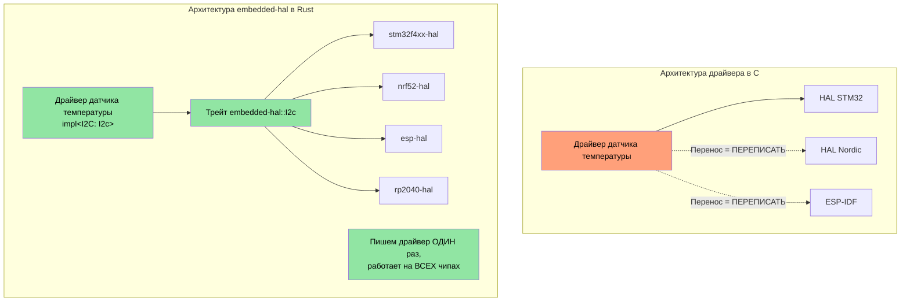
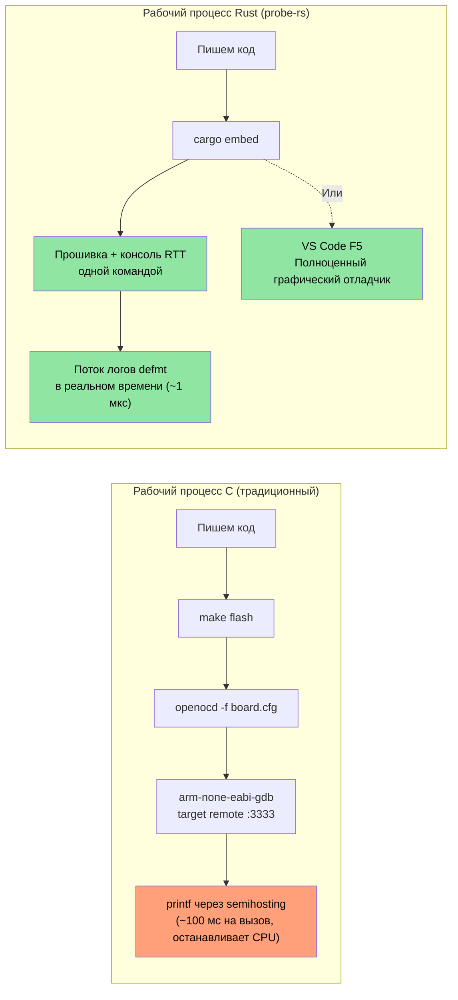

## Доступ к MMIO и volatile-регистрам

> **Что вы узнаете:** типобезопасный доступ к аппаратным регистрам во встраиваемом Rust — шаблоны volatile MMIO, крейты абстракции регистров и то, как система типов Rust может кодировать права доступа к регистрам, чего не умеет ключевое слово `volatile` из C.

В прошивке на C вы обращаетесь к аппаратным регистрам через `volatile`-указатели на конкретные
адреса памяти. В Rust есть эквивалентные механизмы — но с типобезопасностью.

### volatile в C и volatile в Rust

```c
// C — типичный доступ к регистрам MMIO
#define GPIO_BASE     0x40020000
#define GPIO_MODER    (*(volatile uint32_t*)(GPIO_BASE + 0x00))
#define GPIO_ODR      (*(volatile uint32_t*)(GPIO_BASE + 0x14))

void toggle_led(void) {
    GPIO_ODR ^= (1 << 5);  // Переключаем пин 5
}
```

```rust
// Rust — сырой volatile (низкий уровень, редко используется напрямую)
use core::ptr;

const GPIO_BASE: usize = 0x4002_0000;
const GPIO_ODR: *mut u32 = (GPIO_BASE + 0x14) as *mut u32;

/// # Safety
/// Вызывающая сторона должна гарантировать, что GPIO_BASE — валидный отображённый периферийный адрес.
unsafe fn toggle_led() {
    // SAFETY: GPIO_ODR — валидный адрес регистра, отображённого в память.
    let current = unsafe { ptr::read_volatile(GPIO_ODR) };
    unsafe { ptr::write_volatile(GPIO_ODR, current ^ (1 << 5)) };
}
```

### svd2rust — типобезопасный доступ к регистрам (путь Rust)

На практике вы **никогда** не пишете сырые volatile-указатели. Вместо этого `svd2rust` генерирует
**крейт доступа к периферии (PAC, Peripheral Access Crate)** из SVD-файла чипа (того же XML-файла,
который использует отладочное представление вашей IDE):

```rust
// Сгенерированный код PAC (вы его не пишете — это делает svd2rust)
// PAC превращает некорректный доступ к регистрам в ошибку компиляции

// Использование PAC:
use stm32f4::stm32f401;  // Крейт PAC для вашего чипа

fn configure_gpio(dp: stm32f401::Peripherals) {
    // Включаем тактирование GPIOA — типобезопасно, без магических чисел
    dp.RCC.ahb1enr.modify(|_, w| w.gpioaen().enabled());

    // Настраиваем пин 5 на выход — нельзя случайно записать в поле только для чтения
    dp.GPIOA.moder.modify(|_, w| w.moder5().output());

    // Переключаем пин 5 — доступ к полю проверяется типами
    dp.GPIOA.odr.modify(|r, w| {
        // SAFETY: переключаем один бит в корректном поле регистра.
        unsafe { w.bits(r.bits() ^ (1 << 5)) }
    });
}
```

| Доступ к регистрам в C | Аналог в Rust PAC |
|-------------------|---------------------|
| `#define REG (*(volatile uint32_t*)ADDR)` | Крейт PAC, сгенерированный `svd2rust` |
| `REG |= BITMASK;` | `periph.reg.modify(\|_, w\| w.field().variant())` |
| `value = REG;` | `let val = periph.reg.read().field().bits()` |
| Неверное поле регистра → молчаливое UB | Ошибка компиляции — поля не существует |
| Неверная ширина регистра → молчаливое UB | Проверяется типами — u8, u16 или u32 |

## Обработка прерываний и критические секции

Прошивка на C использует `__disable_irq()` / `__enable_irq()` и функции ISR с сигнатурами `void`.
Rust предоставляет типобезопасные эквиваленты.

### Шаблоны прерываний в C и Rust

```c
// C — традиционный обработчик прерывания
volatile uint32_t tick_count = 0;

void SysTick_Handler(void) {   // Имя соглашения критично — ошибка → HardFault
    tick_count++;
}

uint32_t get_ticks(void) {
    __disable_irq();
    uint32_t t = tick_count;   // Чтение внутри критической секции
    __enable_irq();
    return t;
}
```

```rust
// Rust — с использованием cortex-m и критических секций
use core::cell::Cell;
use cortex_m::interrupt::{self, Mutex};

// Разделяемое состояние, защищённое Mutex на основе критической секции
static TICK_COUNT: Mutex<Cell<u32>> = Mutex::new(Cell::new(0));

#[cortex_m_rt::exception]     // Атрибут обеспечивает правильное размещение в таблице векторов
fn SysTick() {                // Ошибка компиляции, если имя не совпадает с допустимым исключением
    interrupt::free(|cs| {    // cs — токен критической секции (доказательство, что IRQ запрещены)
        let count = TICK_COUNT.borrow(cs).get();
        TICK_COUNT.borrow(cs).set(count + 1);
    });
}

fn get_ticks() -> u32 {
    interrupt::free(|cs| TICK_COUNT.borrow(cs).get())
}
```

### RTIC — конкурентность в реальном времени, управляемая прерываниями

Для сложной прошивки с несколькими приоритетами прерываний RTIC (ранее RTFM) предоставляет
**планирование задач на этапе компиляции без накладных расходов**:

```rust
#[rtic::app(device = stm32f4xx_hal::pac, dispatchers = [USART1])]
mod app {
    use stm32f4xx_hal::prelude::*;

    #[shared]
    struct Shared {
        temperature: f32,   // Разделяется между задачами — RTIC управляет блокировками
    }

    #[local]
    struct Local {
        led: stm32f4xx_hal::gpio::Pin<'A', 5, stm32f4xx_hal::gpio::Output>,
    }

    #[init]
    fn init(cx: init::Context) -> (Shared, Local) {
        let dp = cx.device;
        let gpioa = dp.GPIOA.split();
        let led = gpioa.pa5.into_push_pull_output();
        (Shared { temperature: 25.0 }, Local { led })
    }

    // Аппаратная задача: выполняется по прерыванию SysTick
    #[task(binds = SysTick, shared = [temperature], local = [led])]
    fn tick(mut cx: tick::Context) {
        cx.local.led.toggle();
        cx.shared.temperature.lock(|temp| {
            // RTIC гарантирует эксклюзивный доступ здесь — ручная блокировка не нужна
            *temp += 0.1;
        });
    }
}
```

**Почему RTIC важен для разработчиков прошивок на C:**
- Аннотация `#[shared]` заменяет ручное управление мьютексами
- Вытесняющее планирование по приоритетам настраивается на этапе компиляции — без накладных расходов во время выполнения
- Взаимная блокировка исключена по построению (фреймворк доказывает это на этапе компиляции)
- Ошибки в именах обработчиков прерываний — это ошибки компиляции, а не сбои HardFault во время выполнения

## Стратегии обработки panic

В C, когда в прошивке что-то идёт не так, обычно выполняют сброс или мигают светодиодом.
Обработчик panic в Rust даёт структурированный контроль:

```rust
// Стратегия 1: остановка (для отладки — подключаем отладчик, смотрим состояние)
use panic_halt as _;  // Бесконечный цикл при panic

// Стратегия 2: сброс MCU
use panic_reset as _;  // Вызывает системный сброс

// Стратегия 3: логирование через probe (разработка)
use panic_probe as _;  // Отправляет информацию о panic через отладочный зонд (с defmt)

// Стратегия 4: логирование через defmt, затем остановка
use defmt_panic as _;  // Подробные сообщения о panic через ITM/RTT

// Стратегия 5: собственный обработчик (продакшн-прошивка)
use core::panic::PanicInfo;

#[panic_handler]
fn panic(info: &PanicInfo) -> ! {
    // 1. Запрещаем прерывания, чтобы не нанести дополнительный ущерб
    cortex_m::interrupt::disable();

    // 2. Записываем информацию о panic в зарезервированную область RAM (переживает сброс)
    // SAFETY: PANIC_LOG — зарезервированная область памяти, определённая в скрипте компоновщика.
    unsafe {
        let log = 0x2000_0000 as *mut [u8; 256];
        // Записываем обрезанное сообщение о panic
        use core::fmt::Write;
        let mut writer = FixedWriter::new(&mut *log);
        let _ = write!(writer, "{}", info);
    }

    // 3. Запускаем сброс по сторожевому таймеру (или мигаем светодиодом ошибки)
    loop {
        cortex_m::asm::wfi();  // Ожидание прерывания (малое потребление, пока остановлены)
    }
}
```

## Скрипты компоновщика и раскладка памяти

Разработчики прошивок на C пишут скрипты компоновщика, чтобы описать области FLASH/RAM. Встраиваемый
Rust использует ту же концепцию через `memory.x`:

```ld
/* memory.x — размещается в корне крейта, используется cortex-m-rt */
MEMORY
{
  /* Подстройте под ваш MCU — здесь значения для STM32F401 */
  FLASH : ORIGIN = 0x08000000, LENGTH = 512K
  RAM   : ORIGIN = 0x20000000, LENGTH = 96K
}

/* Необязательно: резервируем место для журнала panic (см. обработчик panic выше) */
_panic_log_start = ORIGIN(RAM);
_panic_log_size  = 256;
```

```toml
# .cargo/config.toml — задаём цель и флаги компоновщика
[target.thumbv7em-none-eabihf]
runner = "probe-rs run --chip STM32F401RE"  # прошивка и запуск через отладочный зонд
rustflags = [
    "-C", "link-arg=-Tlink.x",              # скрипт компоновщика cortex-m-rt
]

[build]
target = "thumbv7em-none-eabihf"            # Cortex-M4F с аппаратным FPU
```

| Скрипт компоновщика C | Аналог в Rust |
|-----------------|-----------------|
| `MEMORY { FLASH ..., RAM ... }` | `memory.x` в корне крейта |
| `__attribute__((section(".data")))` | `#[link_section = ".data"]` |
| `-T linker.ld` в Makefile | `-C link-arg=-Tlink.x` в `.cargo/config.toml` |
| `__bss_start__`, `__bss_end__` | Обрабатывается `cortex-m-rt` автоматически |
| Стартовый ассемблер (`startup.s`) | Макрос `#[entry]` из `cortex-m-rt` |

## Написание драйверов на `embedded-hal`

Крейт `embedded-hal` определяет трейты для SPI, I2C, GPIO, UART и т. д. Драйверы,
написанные на основе этих трейтов, работают на **любом MCU** — это главная возможность Rust
для повторного использования во встраиваемых системах.

### C и Rust: драйвер датчика температуры

```c
// C — драйвер жёстко связан с HAL STM32
#include "stm32f4xx_hal.h"

float read_temperature(I2C_HandleTypeDef* hi2c, uint8_t addr) {
    uint8_t buf[2];
    HAL_I2C_Mem_Read(hi2c, addr << 1, 0x00, I2C_MEMADD_SIZE_8BIT,
                     buf, 2, HAL_MAX_DELAY);
    int16_t raw = ((int16_t)buf[0] << 4) | (buf[1] >> 4);
    return raw * 0.0625;
}
// Проблема: этот драйвер работает ТОЛЬКО с HAL STM32. Перенос на Nordic = переписывание.
```

```rust
// Rust — драйвер работает на ЛЮБОМ MCU, реализующем embedded-hal
use embedded_hal::i2c::I2c;

pub struct Tmp102<I2C> {
    i2c: I2C,
    address: u8,
}

impl<I2C: I2c> Tmp102<I2C> {
    pub fn new(i2c: I2C, address: u8) -> Self {
        Self { i2c, address }
    }

    pub fn read_temperature(&mut self) -> Result<f32, I2C::Error> {
        let mut buf = [0u8; 2];
        self.i2c.write_read(self.address, &[0x00], &mut buf)?;
        let raw = ((buf[0] as i16) << 4) | ((buf[1] as i16) >> 4);
        Ok(raw as f32 * 0.0625)
    }
}

// Работает на STM32, Nordic nRF, ESP32, RP2040 — на любом чипе с реализацией I2C из embedded-hal
```



## Настройка глобального аллокатора

Крейт `alloc` даёт вам `Vec`, `String`, `Box`, но нужно указать Rust,
откуда берётся память кучи. Это эквивалент реализации `malloc()`
для вашей платформы:

```rust
#![no_std]
extern crate alloc;

use alloc::vec::Vec;
use alloc::string::String;
use embedded_alloc::LlffHeap as Heap;

#[global_allocator]
static HEAP: Heap = Heap::empty();

#[cortex_m_rt::entry]
fn main() -> ! {
    // Инициализируем аллокатор на области памяти
    // (обычно часть RAM, не используемая стеком или статическими данными)
    {
        const HEAP_SIZE: usize = 4096;
        static mut HEAP_MEM: [u8; HEAP_SIZE] = [0; HEAP_SIZE];
        // SAFETY: HEAP_MEM здесь используется только при инициализации, до любого выделения памяти.
        unsafe { HEAP.init(HEAP_MEM.as_ptr() as usize, HEAP_SIZE) }
    }

    // Теперь можно использовать типы кучи!
    let mut log_buffer: Vec<u8> = Vec::with_capacity(256);
    let name: String = String::from("sensor_01");
    // ...

    loop {}
}
```

| Настройка кучи в C | Аналог в Rust |
|-------------|-----------------|
| `_sbrk()` / собственный `malloc()` | `#[global_allocator]` + `Heap::init()` |
| `configTOTAL_HEAP_SIZE` (FreeRTOS) | Константа `HEAP_SIZE` |
| `pvPortMalloc()` | `alloc::vec::Vec::new()` — автоматически |
| Исчерпание кучи → неопределённое поведение | `alloc_error_handler` → контролируемый panic |

## Смешанные рабочие пространства `no_std` + `std`

В реальных проектах (например, в большом рабочем пространстве Rust) часто встречаются:
- Библиотечные крейты `no_std` для переносимой между платформами логики
- Бинарные крейты `std` для прикладного уровня под Linux

```text
workspace_root/
├── Cargo.toml              # [workspace] members = [...]
├── protocol/               # no_std — протокол обмена, разбор
│   ├── Cargo.toml          # без default-features, без std
│   └── src/lib.rs          # #![no_std]
├── driver/                 # no_std — абстракция оборудования
│   ├── Cargo.toml
│   └── src/lib.rs          # #![no_std], использует трейты embedded-hal
├── firmware/               # no_std — бинарный файл MCU
│   ├── Cargo.toml          # зависит от protocol, driver
│   └── src/main.rs         # #![no_std] #![no_main]
└── host_tool/              # std — CLI-инструмент под Linux
    ├── Cargo.toml          # зависит от protocol (тот же крейт!)
    └── src/main.rs         # Использует std::fs, std::net и т. д.
```

Ключевой паттерн: крейт `protocol` использует `#![no_std]`, поэтому он компилируется и для
прошивки MCU, и для инструмента на Linux. Общий код, нулевое дублирование.

```toml
# protocol/Cargo.toml
[package]
name = "protocol"

[features]
default = []
std = []  # Необязательно: включает возможности, специфичные для std, при сборке для хоста

[dependencies]
serde = { version = "1", default-features = false, features = ["derive"] }
# Примечание: default-features = false убирает зависимость serde от std
```

```rust
// protocol/src/lib.rs
#![cfg_attr(not(feature = "std"), no_std)]

#[cfg(feature = "std")]
extern crate std;

extern crate alloc;
use alloc::vec::Vec;
use serde::{Serialize, Deserialize};

#[derive(Debug, Serialize, Deserialize)]
pub struct DiagPacket {
    pub sensor_id: u16,
    pub value: i32,
    pub fault_code: u16,
}

// Эта функция работает и в контексте no_std, и в контексте std
pub fn parse_packet(data: &[u8]) -> Result<DiagPacket, &'static str> {
    if data.len() < 8 {
        return Err("packet too short");
    }
    Ok(DiagPacket {
        sensor_id: u16::from_le_bytes([data[0], data[1]]),
        value: i32::from_le_bytes([data[2], data[3], data[4], data[5]]),
        fault_code: u16::from_le_bytes([data[6], data[7]]),
    })
}
```

## Упражнение: драйвер слоя абстракции оборудования

Напишите драйвер `no_std` для гипотетического контроллера светодиодов, который обменивается данными по SPI.
Драйвер должен быть обобщённым по любой реализации SPI на основе `embedded-hal`.

**Требования:**
1. Определите структуру `LedController<SPI>`
2. Реализуйте `new()`, `set_brightness(led: u8, brightness: u8)` и `all_off()`
3. Протокол SPI: отправлять `[led_index, brightness_value]` как транзакцию из 2 байт
4. Напишите тесты с использованием мок-реализации SPI

```rust
// Стартовый код
#![no_std]
use embedded_hal::spi::SpiDevice;

pub struct LedController<SPI> {
    spi: SPI,
    num_leds: u8,
}

// TODO: Реализуйте new(), set_brightness(), all_off()
// TODO: Создайте MockSpi для тестирования
```

<details><summary>Решение (нажмите, чтобы развернуть)</summary>

```rust
#![no_std]
use embedded_hal::spi::SpiDevice;

pub struct LedController<SPI> {
    spi: SPI,
    num_leds: u8,
}

impl<SPI: SpiDevice> LedController<SPI> {
    pub fn new(spi: SPI, num_leds: u8) -> Self {
        Self { spi, num_leds }
    }

    pub fn set_brightness(&mut self, led: u8, brightness: u8) -> Result<(), SPI::Error> {
        if led >= self.num_leds {
            return Ok(()); // Молча игнорируем светодиоды вне диапазона
        }
        self.spi.write(&[led, brightness])
    }

    pub fn all_off(&mut self) -> Result<(), SPI::Error> {
        for led in 0..self.num_leds {
            self.spi.write(&[led, 0])?;
        }
        Ok(())
    }
}

#[cfg(test)]
mod tests {
    use super::*;

    // Мок SPI, который записывает все транзакции
    struct MockSpi {
        transactions: Vec<Vec<u8>>,
    }

    // Минимальный тип ошибки для мока
    #[derive(Debug)]
    struct MockError;
    impl embedded_hal::spi::Error for MockError {
        fn kind(&self) -> embedded_hal::spi::ErrorKind {
            embedded_hal::spi::ErrorKind::Other
        }
    }

    impl embedded_hal::spi::ErrorType for MockSpi {
        type Error = MockError;
    }

    impl SpiDevice for MockSpi {
        fn write(&mut self, buf: &[u8]) -> Result<(), Self::Error> {
            self.transactions.push(buf.to_vec());
            Ok(())
        }
        fn read(&mut self, _buf: &mut [u8]) -> Result<(), Self::Error> { Ok(()) }
        fn transfer(&mut self, _r: &mut [u8], _w: &[u8]) -> Result<(), Self::Error> { Ok(()) }
        fn transfer_in_place(&mut self, _buf: &mut [u8]) -> Result<(), Self::Error> { Ok(()) }
        fn transaction(&mut self, _ops: &mut [embedded_hal::spi::Operation<'_, u8>]) -> Result<(), Self::Error> { Ok(()) }
    }

    #[test]
    fn test_set_brightness() {
        let mock = MockSpi { transactions: vec![] };
        let mut ctrl = LedController::new(mock, 4);
        ctrl.set_brightness(2, 128).unwrap();
        assert_eq!(ctrl.spi.transactions, vec![vec![2, 128]]);
    }

    #[test]
    fn test_all_off() {
        let mock = MockSpi { transactions: vec![] };
        let mut ctrl = LedController::new(mock, 3);
        ctrl.all_off().unwrap();
        assert_eq!(ctrl.spi.transactions, vec![
            vec![0, 0], vec![1, 0], vec![2, 0],
        ]);
    }

    #[test]
    fn test_out_of_range_led() {
        let mock = MockSpi { transactions: vec![] };
        let mut ctrl = LedController::new(mock, 2);
        ctrl.set_brightness(5, 255).unwrap(); // Вне диапазона — игнорируется
        assert!(ctrl.spi.transactions.is_empty());
    }
}
```

</details>

## Отладка встраиваемого Rust — probe-rs, defmt и VS Code

Разработчики прошивок на C обычно отлаживают с помощью OpenOCD + GDB или фирменных IDE
(Keil, IAR, Segger Ozone). Экосистема встраиваемого Rust сошлась на **probe-rs**
как едином интерфейсе отладочного зонда, заменив связку OpenOCD + GDB одним
инструментом на Rust.

### probe-rs — универсальный инструмент отладочного зонда

`probe-rs` заменяет связку OpenOCD + GDB. Из коробки поддерживаются CMSIS-DAP,
ST-Link, J-Link и другие отладочные зонды:

```bash
# Установка probe-rs (включает cargo-flash и cargo-embed)
cargo install probe-rs-tools

# Прошивка и запуск вашей прошивки
cargo flash --chip STM32F401RE --release

# Прошивка, запуск и открытие консоли RTT (Real-Time Transfer)
cargo embed --chip STM32F401RE
```

**probe-rs против OpenOCD + GDB**:

| Аспект | OpenOCD + GDB | probe-rs |
|--------|--------------|----------|
| Установка | 2 отдельных пакета + скрипты | `cargo install probe-rs-tools` |
| Настройка | Файлы `.cfg` для каждой платы/зонда | Флаг `--chip` или `Embed.toml` |
| Вывод в консоль | Semihosting (очень медленно) | RTT (~10× быстрее) |
| Фреймворк логирования | `printf` | `defmt` (структурированный, без накладных расходов) |
| Алгоритм прошивки | XML-пакеты | Встроен для более чем 1000 чипов |
| Поддержка GDB | Нативная | Адаптер `probe-rs gdb` |

### `Embed.toml` — конфигурация проекта

Вместо возни с файлами `.cfg` и `.gdbinit` probe-rs использует один конфигурационный файл:

```toml
# Embed.toml — размещается в корне проекта
[default.general]
chip = "STM32F401RETx"

[default.rtt]
enabled = true           # Включить консоль Real-Time Transfer
channels = [
    { up = 0, mode = "BlockIfFull", name = "Terminal" },
]

[default.flashing]
enabled = true           # Прошивать перед запуском
restore_unwritten_bytes = false

[default.reset]
halt_afterwards = false  # Запускать после прошивки и сброса

[default.gdb]
enabled = false          # Установите true, чтобы открыть GDB-сервер на :1337
gdb_connection_string = "127.0.0.1:1337"
```

```bash
# С Embed.toml достаточно запустить:
cargo embed              # Прошивка + консоль RTT — без флагов
cargo embed --release    # Релизная сборка
```

### defmt — отложенное форматирование для логирования на встраиваемых системах

`defmt` (deferred formatting, отложенное форматирование) заменяет отладку через `printf`. Строки формата
хранятся в ELF-файле, а не во flash — поэтому вызов логирования на цели отправляет
только индекс и байты аргументов. Благодаря этому логирование работает в **10–100 раз быстрее**, чем `printf`,
и занимает малую долю flash-памяти:

```rust
#![no_std]
#![no_main]

use defmt::{info, warn, error, debug, trace};
use defmt_rtt as _; // Транспорт RTT — связывает вывод defmt с probe-rs

#[cortex_m_rt::entry]
fn main() -> ! {
    info!("Boot complete, firmware v{}", env!("CARGO_PKG_VERSION"));

    let sensor_id: u16 = 0x4A;
    let temperature: f32 = 23.5;

    // Строки формата остаются в ELF, а не во flash — практически без накладных расходов
    debug!("Sensor {:#06X}: {:.1}°C", sensor_id, temperature);

    if temperature > 80.0 {
        warn!("Overtemp on sensor {:#06X}: {:.1}°C", sensor_id, temperature);
    }

    loop {
        cortex_m::asm::wfi(); // Ожидание прерывания
    }
}

// Собственные типы — реализуйте defmt::Format вместо Debug
#[derive(defmt::Format)]
struct SensorReading {
    id: u16,
    value: i32,
    status: SensorStatus,
}

#[derive(defmt::Format)]
enum SensorStatus {
    Ok,
    Warning,
    Fault(u8),
}

// Использование:
// info!("Reading: {:?}", reading);  // <-- использует defmt::Format, а НЕ std Debug
```

**defmt против `printf` и `log`**:

| Характеристика | C `printf` (semihosting) | Крейт Rust `log` | `defmt` |
|---------|-------------------------|-------------------|---------|
| Скорость | ~100 мс на вызов | Н/Д (нужен `std`) | ~1 мкс на вызов |
| Использование flash | Полные строки формата | Полные строки формата | Только индекс (байты) |
| Транспорт | Semihosting (останавливает CPU) | Serial/UART | RTT (неблокирующий) |
| Структурированный вывод | Нет | Только текст | Типизированный, бинарно закодированный |
| `no_std` | Через semihosting | Только фасад (бэкенды требуют `std`) | ✅ Нативно |
| Уровни фильтрации | Ручной `#ifdef` | `RUST_LOG=debug` | `defmt::println` + features |

### Конфигурация отладки в VS Code

С расширением VS Code `probe-rs` вы получаете полноценную графическую отладку —
точки останова, просмотр переменных, стек вызовов и просмотр регистров:

```jsonc
// .vscode/launch.json
{
    "version": "0.2.0",
    "configurations": [
        {
            "type": "probe-rs-debug",
            "request": "launch",
            "name": "Flash & Debug (probe-rs)",
            "chip": "STM32F401RETx",
            "coreConfigs": [
                {
                    "programBinary": "target/thumbv7em-none-eabihf/debug/${workspaceFolderBasename}",
                    "rttEnabled": true,
                    "rttChannelFormats": [
                        {
                            "channelNumber": 0,
                            "dataFormat": "Defmt",
                            "showTimestamps": true
                        }
                    ]
                }
            ],
            "connectUnderReset": true,
            "speed": 4000
        }
    ]
}
```

Установите расширение:
```rust
ext install probe-rs.probe-rs-debugger
```

### Рабочий процесс отладки C и отладка встраиваемого Rust



| Действие отладки в C | Аналог в Rust |
|---------------|-----------------|
| `openocd -f board/st_nucleo_f4.cfg` | `probe-rs info` (автоопределение зонда и чипа) |
| `arm-none-eabi-gdb -x .gdbinit` | `probe-rs gdb --chip STM32F401RE` |
| `target remote :3333` | GDB подключается к `localhost:1337` |
| `monitor reset halt` | `probe-rs reset --chip ...` |
| `load firmware.elf` | `cargo flash --chip ...` |
| `printf("debug: %d\n", val)` (semihosting) | `defmt::info!("debug: {}", val)` (RTT) |
| Графический отладчик Keil/IAR | VS Code + расширение `probe-rs-debugger` |
| Segger SystemView | `defmt` + просмотрщик RTT из `probe-rs` |

> **Перекрёстная ссылка**: о продвинутых паттернах unsafe, используемых в драйверах для встраиваемых систем
> (проекции Pin, собственные аллокаторы арены и slab), см. сопутствующее руководство
> *Паттерны Rust*, разделы «Проекции pin: структурное закрепление» и
> «Пользовательские аллокаторы: паттерны арен и slab».

---

