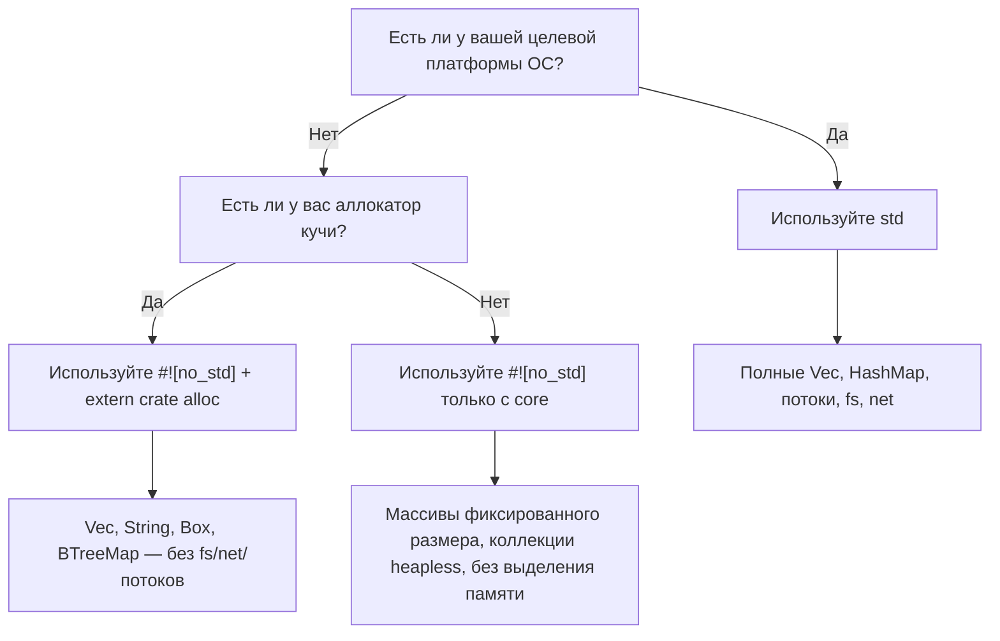

# `no_std` — Rust без стандартной библиотеки

> **Что вы узнаете:** как писать на Rust под bare-metal и встраиваемые платформы с помощью `#![no_std]` — разделение крейтов `core` и `alloc`, обработчики panic и то, как это сравнивается со встраиваемым C без `libc`.

Если вы работаете со встраиваемым C, вам уже привычно работать без `libc` или с минимальной средой выполнения. У Rust есть полноценный аналог: атрибут **`#![no_std]`**.

## Что такое `no_std`?

Когда вы добавляете `#![no_std]` в корень крейта, компилятор убирает неявное `extern crate std;` и линкуется только с **`core`** (и, при необходимости, с **`alloc`**).

| Уровень | Что предоставляет | Требует ОС / кучу? |
|-------|-----------------|---------------------|
| `core` | Примитивные типы, `Option`, `Result`, `Iterator`, математика, `slice`, `str`, атомарные операции, `fmt` | **Нет** — работает на bare metal |
| `alloc` | `Vec`, `String`, `Box`, `Rc`, `Arc`, `BTreeMap` | Нужен глобальный аллокатор, но **без ОС** |
| `std` | `HashMap`, `fs`, `net`, `thread`, `io`, `env`, `process` | **Да** — нужна ОС |

> **Эмпирическое правило для встраиваемых разработчиков:** если ваш проект на C линкуется с `-lc` и использует `malloc`, скорее всего, можно использовать `core` + `alloc`. Если же он работает на bare metal без `malloc`, оставайтесь только на `core`.

## Объявление `no_std`

```rust
// src/lib.rs  (или src/main.rs для бинарника с #![no_main])
#![no_std]

// Всё из `core` вам по-прежнему доступно:
use core::fmt;
use core::result::Result;
use core::option::Option;

// Если есть аллокатор, подключаем типы, работающие с кучей:
extern crate alloc;
use alloc::vec::Vec;
use alloc::string::String;
```

Для bare-metal бинарника также нужны `#![no_main]` и обработчик panic:

```rust
#![no_std]
#![no_main]

use core::panic::PanicInfo;

#[panic_handler]
fn panic(_info: &PanicInfo) -> ! {
    loop {} // Зависаем при panic — замените на перезагрузку платы или мигание светодиодом
}

// Точка входа зависит от вашего HAL / скрипта компоновщика
```

## Что вы теряете (и альтернативы)

| Возможность `std` | Альтернатива в `no_std` |
|---------------|---------------------|
| `println!` | `core::write!` в UART / `defmt` |
| `HashMap` | `heapless::FnvIndexMap` (фиксированная ёмкость) или `BTreeMap` (с `alloc`) |
| `Vec` | `heapless::Vec` (на стеке, фиксированная ёмкость) |
| `String` | `heapless::String` или `&str` |
| `std::io::Read/Write` | `embedded_io::Read/Write` |
| `thread::spawn` | Обработчики прерываний, задачи RTIC |
| `std::time` | Аппаратные таймерные периферийные блоки |
| `std::fs` | Драйверы flash / EEPROM |

## Заметные крейты `no_std` для встраиваемых систем

| Крейт | Назначение | Примечания |
|-------|---------|-------|
| [`heapless`](https://crates.io/crates/heapless) | Vec, String, Queue, Map фиксированной ёмкости | Аллокатор не нужен — всё на стеке |
| [`defmt`](https://crates.io/crates/defmt) | Эффективное логирование через probe/ITM | Как `printf`, но форматирование откладывается на хост |
| [`embedded-hal`](https://crates.io/crates/embedded-hal) | Трейты абстракции оборудования (SPI, I²C, GPIO, UART) | Реализуете один раз — работает на любом MCU |
| [`cortex-m`](https://crates.io/crates/cortex-m) | Интринсики и доступ к регистрам ARM Cortex-M | Низкоуровневый, как CMSIS |
| [`cortex-m-rt`](https://crates.io/crates/cortex-m-rt) | Среда выполнения / стартовый код для Cortex-M | Заменяет ваш `startup.s` |
| [`rtic`](https://crates.io/crates/rtic) | Real-Time Interrupt-driven Concurrency | Планирование задач на этапе компиляции, без накладных расходов |
| [`embassy`](https://crates.io/crates/embassy-executor) | Асинхронный исполнитель для встраиваемых систем | `async/await` на bare metal |
| [`postcard`](https://crates.io/crates/postcard) | `no_std` сериализация serde (бинарная) | Заменяет `serde_json`, когда строки не по карману |
| [`thiserror`](https://crates.io/crates/thiserror) | Derive-макрос для трейта `Error` | Работает в `no_std` начиная с v2; предпочтительнее `anyhow` |
| [`smoltcp`](https://crates.io/crates/smoltcp) | Стек TCP/IP на `no_std` | Когда нужна сеть без ОС |

## C и Rust: сравнение для bare metal

Типичный встраиваемый «blinky» на C:

```c
// C — bare metal, вендорский HAL
#include "stm32f4xx_hal.h"

void SysTick_Handler(void) {
    HAL_GPIO_TogglePin(GPIOA, GPIO_PIN_5);
}

int main(void) {
    HAL_Init();
    __HAL_RCC_GPIOA_CLK_ENABLE();
    GPIO_InitTypeDef gpio = { .Pin = GPIO_PIN_5, .Mode = GPIO_MODE_OUTPUT_PP };
    HAL_GPIO_Init(GPIOA, &gpio);
    HAL_SYSTICK_Config(HAL_RCC_GetHCLKFreq() / 1000);
    while (1) {}
}
```

Эквивалент на Rust (с использованием `embedded-hal` и крейта платы):

```rust
#![no_std]
#![no_main]

use cortex_m_rt::entry;
use panic_halt as _; // обработчик panic: бесконечный цикл
use stm32f4xx_hal::{pac, prelude::*};

#[entry]
fn main() -> ! {
    let dp = pac::Peripherals::take().unwrap();
    let gpioa = dp.GPIOA.split();
    let mut led = gpioa.pa5.into_push_pull_output();

    let rcc = dp.RCC.constrain();
    let clocks = rcc.cfgr.freeze();
    let mut delay = dp.TIM2.delay_ms(&clocks);

    loop {
        led.toggle();
        delay.delay_ms(500u32);
    }
}
```

**Ключевые отличия для разработчиков на C:**
- `Peripherals::take()` возвращает `Option` — это обеспечивает паттерн синглтона на этапе компиляции (без ошибок двойной инициализации)
- `.split()` передаёт владение отдельными выводами — нет риска, что два модуля будут управлять одним выводом
- Весь доступ к регистрам проверяется типами — вы не сможете случайно записать в регистр только для чтения
- Проверка заимствований предотвращает гонки данных между `main` и обработчиками прерываний (с RTIC)

## Когда использовать `no_std`, а когда `std`



# Упражнение: кольцевой буфер `no_std`

🔴 **Сложный уровень** — объединяет обобщения, `MaybeUninit` и `#[cfg(test)]` в контексте `no_std`

Во встраиваемых системах часто нужен кольцевой буфер фиксированного размера, который
никогда не выделяет память. Реализуйте его, используя только `core` (без `alloc` и без `std`).

**Требования:**
- Обобщённый по типу элемента `T: Copy`
- Фиксированная ёмкость `N` (константный обобщённый параметр)
- `push(&mut self, item: T)` — перезаписывает самый старый элемент, когда буфер заполнен
- `pop(&mut self) -> Option<T>` — возвращает самый старый элемент
- `len(&self) -> usize`
- `is_empty(&self) -> bool`
- Должен компилироваться с `#![no_std]`

```rust
// Стартовый код
#![no_std]

use core::mem::MaybeUninit;

pub struct RingBuffer<T: Copy, const N: usize> {
    buf: [MaybeUninit<T>; N],
    head: usize,  // позиция следующей записи
    tail: usize,  // позиция следующего чтения
    count: usize,
}

impl<T: Copy, const N: usize> RingBuffer<T, N> {
    pub const fn new() -> Self {
        todo!()
    }
    pub fn push(&mut self, item: T) {
        todo!()
    }
    pub fn pop(&mut self) -> Option<T> {
        todo!()
    }
    pub fn len(&self) -> usize {
        todo!()
    }
    pub fn is_empty(&self) -> bool {
        todo!()
    }
}
```

<details>
<summary>Решение</summary>

```rust
#![no_std]

use core::mem::MaybeUninit;

pub struct RingBuffer<T: Copy, const N: usize> {
    buf: [MaybeUninit<T>; N],
    head: usize,
    tail: usize,
    count: usize,
}

impl<T: Copy, const N: usize> RingBuffer<T, N> {
    pub const fn new() -> Self {
        Self {
            // SAFETY: MaybeUninit не требует инициализации
            buf: unsafe { MaybeUninit::uninit().assume_init() },
            head: 0,
            tail: 0,
            count: 0,
        }
    }

    pub fn push(&mut self, item: T) {
        self.buf[self.head] = MaybeUninit::new(item);
        self.head = (self.head + 1) % N;
        if self.count == N {
            // Буфер заполнен — перезаписываем самый старый элемент, сдвигаем tail
            self.tail = (self.tail + 1) % N;
        } else {
            self.count += 1;
        }
    }

    pub fn pop(&mut self) -> Option<T> {
        if self.count == 0 {
            return None;
        }
        // SAFETY: читаем только те позиции, которые ранее были записаны через push()
        let item = unsafe { self.buf[self.tail].assume_init() };
        self.tail = (self.tail + 1) % N;
        self.count -= 1;
        Some(item)
    }

    pub fn len(&self) -> usize {
        self.count
    }

    pub fn is_empty(&self) -> bool {
        self.count == 0
    }
}

#[cfg(test)]
mod tests {
    use super::*;

    #[test]
    fn basic_push_pop() {
        let mut rb = RingBuffer::<u32, 4>::new();
        assert!(rb.is_empty());

        rb.push(10);
        rb.push(20);
        rb.push(30);
        assert_eq!(rb.len(), 3);

        assert_eq!(rb.pop(), Some(10));
        assert_eq!(rb.pop(), Some(20));
        assert_eq!(rb.pop(), Some(30));
        assert_eq!(rb.pop(), None);
    }

    #[test]
    fn overwrite_on_full() {
        let mut rb = RingBuffer::<u8, 3>::new();
        rb.push(1);
        rb.push(2);
        rb.push(3);
        // Буфер заполнен: [1, 2, 3]

        rb.push(4); // Перезаписывает 1 → [4, 2, 3], tail сдвигается
        assert_eq!(rb.len(), 3);
        assert_eq!(rb.pop(), Some(2)); // самый старый из оставшихся
        assert_eq!(rb.pop(), Some(3));
        assert_eq!(rb.pop(), Some(4));
        assert_eq!(rb.pop(), None);
    }
}
```

**Почему это важно для разработчиков встраиваемого C:**
- `MaybeUninit` — это аналог неинициализированной памяти в Rust: компилятор не вставляет заполнение нулями, так же как в `char buf[N];` в C
- Блоки `unsafe` минимальны (по 2 строки), и у каждого есть комментарий `// SAFETY:`
- `const fn new()` означает, что кольцевые буферы можно создавать в переменных `static` без конструктора времени выполнения
- Тесты запускаются на вашей машине командой `cargo test`, хотя код рассчитан на `no_std`

</details>

