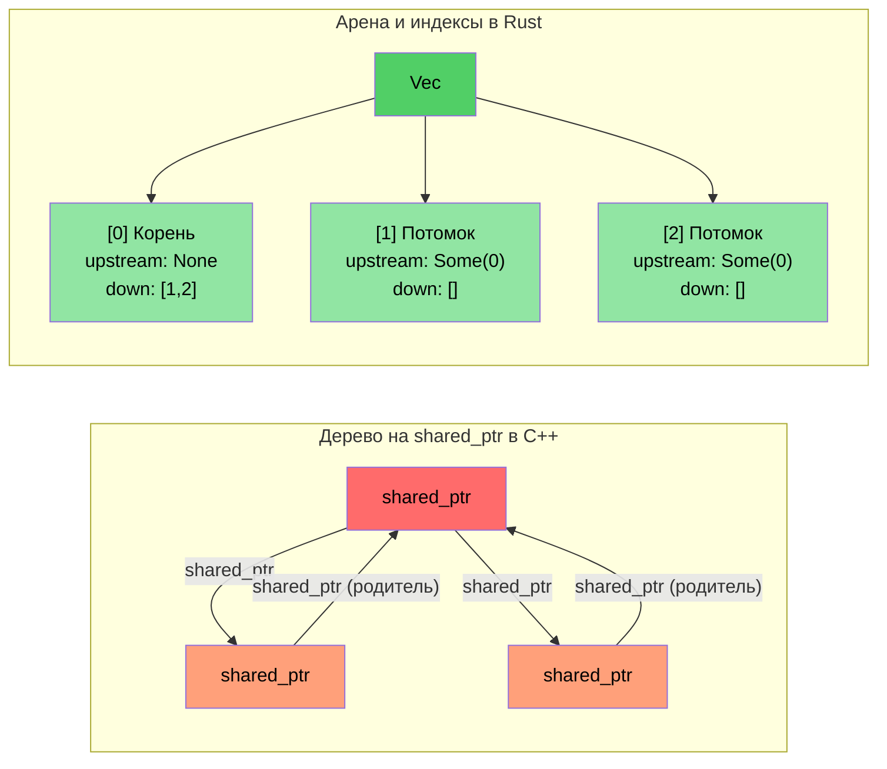

# Обзор кейсов: перевод с C++ на Rust

> **Что вы узнаете:** уроки из реального перевода примерно 100 тысяч строк C++ примерно на 90 тысяч строк Rust в составе около 20 крейтов. Пять ключевых паттернов преобразования и архитектурные решения, стоящие за ними.

- Мы перевели большую диагностическую систему на C++ (около 100 тысяч строк C++) на реализацию на Rust (около 20 крейтов Rust, около 90 тысяч строк)
- В этом разделе показаны **реальные паттерны**, которые использовались, — не игрушечные примеры, а настоящий продакшн-код
- Пять ключевых преобразований:

| **№** | **Паттерн C++** | **Паттерн Rust** | **Эффект** |
|-------|----------------|-----------------|-----------|
| 1 | Иерархия классов + `dynamic_cast` | Диспетчеризация через перечисления + `match` | ~400 → 0 вызовов dynamic_cast |
| 2 | Дерево на `shared_ptr` / `enable_shared_from_this` | Арена + связи через индексы | Циклов ссылок нет |
| 3 | Сырой указатель `Framework*` в каждом модуле | `DiagContext<'a>` с заимствованием по времени жизни | Корректность ссылок проверяется на этапе компиляции |
| 4 | «Божественный объект» (god object) | Компонуемые структуры состояния | Тестируемость, модульность |
| 5 | `vector<unique_ptr<Base>>` повсюду | Трейт-объекты **только** там, где нужно (~25 мест) | По умолчанию — статическая диспетчеризация |

### Метрики до и после

| **Метрика** | **C++ (исходный)** | **Rust (переписанный)** |
|------------|---------------------|------------------------|
| `dynamic_cast` / понижающие приведения типов | ~400 | 0 |
| Методы `virtual` / `override` | ~900 | ~25 (`Box<dyn Trait>`) |
| Сырые выделения `new` | ~200 | 0 (все типы владеющие) |
| `shared_ptr` / подсчёт ссылок | ~10 (библиотека топологии) | 0 (`Arc` только на границе FFI) |
| Определения `enum class` | ~60 | ~190 `pub enum` |
| Выражения сопоставления с образцом | Н/Д | ~750 `match` |
| «Божественные объекты» (>5 тыс. строк) | 2 | 0 |

----

# Кейс 1: иерархия наследования → диспетчеризация через перечисления

## Паттерн C++: иерархия классов событий
```cpp
// Исходный C++: каждый тип события GPU — это класс, наследующий GpuEventBase
class GpuEventBase {
public:
    virtual ~GpuEventBase() = default;
    virtual void Process(DiagFramework* fw) = 0;
    uint16_t m_recordId;
    uint8_t  m_sensorType;
    // ... общие поля
};

class GpuPcieDegradeEvent : public GpuEventBase {
public:
    void Process(DiagFramework* fw) override;
    uint8_t m_linkSpeed;
    uint8_t m_linkWidth;
};

class GpuPcieFatalEvent : public GpuEventBase { /* ... */ };
class GpuBootEvent : public GpuEventBase { /* ... */ };
// ... 10+ классов событий, наследующих GpuEventBase

// Обработка требует dynamic_cast:
void ProcessEvents(std::vector<std::unique_ptr<GpuEventBase>>& events,
                   DiagFramework* fw) {
    for (auto& event : events) {
        if (auto* degrade = dynamic_cast<GpuPcieDegradeEvent*>(event.get())) {
            // обработка degrade...
        } else if (auto* fatal = dynamic_cast<GpuPcieFatalEvent*>(event.get())) {
            // обработка fatal...
        }
        // ... ещё 10 веток
    }
}
```

## Решение на Rust: диспетчеризация через перечисления
```rust
// Пример: types.rs — без наследования, без vtable, без dynamic_cast
#[derive(Debug, Clone, PartialEq, Eq, Serialize, Deserialize)]
pub enum GpuEventKind {
    PcieDegrade,
    PcieFatal,
    PcieUncorr,
    Boot,
    BaseboardState,
    EccError,
    OverTemp,
    PowerRail,
    ErotStatus,
    Unknown,
}
```

```rust
// Пример: manager.rs — отдельные типизированные Vec, понижающее приведение не нужно
pub struct GpuEventManager {
    sku: SkuVariant,
    degrade_events: Vec<GpuPcieDegradeEvent>,   // Конкретный тип, а не Box<dyn>
    fatal_events: Vec<GpuPcieFatalEvent>,
    uncorr_events: Vec<GpuPcieUncorrEvent>,
    boot_events: Vec<GpuBootEvent>,
    baseboard_events: Vec<GpuBaseboardEvent>,
    ecc_events: Vec<GpuEccEvent>,
    // ... у каждого типа события свой Vec
}

// Методы доступа возвращают типизированные срезы — никакой двусмысленности
impl GpuEventManager {
    pub fn degrade_events(&self) -> &[GpuPcieDegradeEvent] {
        &self.degrade_events
    }
    pub fn fatal_events(&self) -> &[GpuPcieFatalEvent] {
        &self.fatal_events
    }
}
```

### Почему не `Vec<Box<dyn GpuEvent>>`?
- **Неверный подход** (буквальный перевод): сложить все события в одну разнородную коллекцию, а затем приводить типы — именно так C++ делает с `vector<unique_ptr<Base>>`
- **Верный подход**: отдельные типизированные Vec устраняют *всё* понижающее приведение типов. Каждый потребитель запрашивает ровно тот тип события, который ему нужен
- **Производительность**: отдельные Vec дают лучшую локальность кэша (все события degrade лежат в памяти непрерывно)

----

# Кейс 2: дерево на shared_ptr → паттерн арены и индексов

## Паттерн C++: дерево с подсчётом ссылок
```cpp
// Библиотека топологии на C++: PcieDevice использует enable_shared_from_this,
// потому что и родительский, и дочерние узлы должны ссылаться друг на друга
class PcieDevice : public std::enable_shared_from_this<PcieDevice> {
public:
    std::shared_ptr<PcieDevice> m_upstream;
    std::vector<std::shared_ptr<PcieDevice>> m_downstream;
    // ... данные устройства
    
    void AddChild(std::shared_ptr<PcieDevice> child) {
        child->m_upstream = shared_from_this();  // Цикл родитель ↔ потомок!
        m_downstream.push_back(child);
    }
};
// Проблема: связи родитель→потомок и потомок→родитель создают циклы ссылок
// Чтобы разорвать циклы, нужен weak_ptr, но про него легко забыть
```

## Решение на Rust: арена со связями через индексы
```rust
// Пример: components.rs — плоский Vec владеет всеми устройствами
pub struct PcieDevice {
    pub base: PcieDeviceBase,
    pub kind: PcieDeviceKind,

    // Связи дерева через индексы — без подсчёта ссылок и без циклов
    pub upstream_idx: Option<usize>,      // Индекс в Vec-арене
    pub downstream_idxs: Vec<usize>,      // Индексы в Vec-арене
}

// «Арена» — это просто Vec<PcieDevice>, которым владеет дерево:
pub struct DeviceTree {
    devices: Vec<PcieDevice>,  // Плоское владение — один Vec владеет всем
}

impl DeviceTree {
    pub fn parent(&self, device_idx: usize) -> Option<&PcieDevice> {
        self.devices[device_idx].upstream_idx
            .map(|idx| &self.devices[idx])
    }
    
    pub fn children(&self, device_idx: usize) -> Vec<&PcieDevice> {
        self.devices[device_idx].downstream_idxs
            .iter()
            .map(|&idx| &self.devices[idx])
            .collect()
    }
}
```

### Главная мысль
- **Никаких `shared_ptr`, `weak_ptr` и `enable_shared_from_this`**
- **Циклов ссылок быть не может** — индексы — это просто значения `usize`
- **Лучшая производительность кэша** — все устройства лежат в памяти непрерывно
- **Проще рассуждать** — один владелец (Vec), много «наблюдателей» (индексы)



----

