## Представление автора и общий подход

- Представление автора
    - Principal Firmware Architect в команде SCHIE (Silicon and Cloud Hardware Infrastructure Engineering) в Microsoft
    - Ветеран отрасли с опытом в области безопасности, системного программирования (прошивки, операционные системы, гипервизоры), архитектуры CPU и платформ, а также C++-систем
    - Начал программировать на Rust в 2017 году (в AWS EC2) и с тех пор без памяти влюблён в этот язык
- Этот курс задуман как можно более интерактивный
    - Предположение: вы знаете C# и разработку на .NET
    - Примеры намеренно сопоставляют концепции C# с их аналогами в Rust
    - **Задавайте уточняющие вопросы в любой момент**

---

## Аргументы в пользу Rust для разработчиков C#

> **Что вы узнаете:** почему Rust важен для разработчиков C# — разрыв в производительности между управляемым и нативным кодом,
> как Rust на этапе компиляции устраняет ошибки NullReferenceException и скрытые потоки управления,
> а также ключевые сценарии, в которых Rust дополняет C# или заменяет его.
>
> **Сложность:** 🟢 Начальный

### Производительность без налога на рантайм
```csharp
// C# — отличная продуктивность, но накладные расходы рантайма
public class DataProcessor
{
    private List<int> data = new List<int>();
    
    public void ProcessLargeDataset()
    {
        // Выделения памяти запускают GC
        for (int i = 0; i < 10_000_000; i++)
        {
            data.Add(i * 2); // Нагрузка на GC
        }
        // Непредсказуемые паузы GC во время обработки
    }
}
// Время выполнения: переменное (50–200 мс из-за GC)
// Память: ~80 МБ (включая накладные расходы GC)
// Предсказуемость: низкая (паузы GC)
```

```rust
// Rust — та же выразительность, нулевые накладные расходы рантайма
struct DataProcessor {
    data: Vec<i32>,
}

impl DataProcessor {
    fn process_large_dataset(&mut self) {
        // Абстракции с нулевой стоимостью
        for i in 0..10_000_000 {
            self.data.push(i * 2); // Нет нагрузки на GC
        }
        // Детерминированная производительность
    }
}
// Время выполнения: стабильное (~30 мс)
// Память: ~40 МБ (точное выделение)
// Предсказуемость: высокая (нет GC)
```

### Безопасность памяти без проверок во время выполнения
```csharp
// C# — безопасность во время выполнения с накладными расходами
public class RuntimeCheckedOperations
{
    public string? ProcessArray(int[] array)
    {
        // Проверка границ во время выполнения при каждом обращении
        if (array.Length > 0)
        {
            return array[0].ToString(); // Безопасно — int это значимый тип, он никогда не бывает null
        }
        return null; // Nullable-возвращаемое значение (string? с nullable-ссылочными типами C# 8+)
    }
    
    public void ProcessConcurrently()
    {
        var list = new List<int>();
        
        // Гонки данных возможны, нужна аккуратная синхронизация
        Parallel.For(0, 1000, i =>
        {
            lock (list) // Накладные расходы рантайма
            {
                list.Add(i);
            }
        });
    }
}
```

```rust
// Rust — безопасность на этапе компиляции без затрат во время выполнения
struct SafeOperations;

impl SafeOperations {
    // Null-безопасность на этапе компиляции, без проверок во время выполнения
    fn process_array(array: &[i32]) -> Option<String> {
        array.first().map(|x| x.to_string())
        // Null-ссылки здесь невозможны
        // Проверка границ убирается оптимизатором, когда безопасность доказуема
    }
    
    fn process_concurrently() {
        use std::sync::{Arc, Mutex};
        use std::thread;
        
        let data = Arc::new(Mutex::new(Vec::new()));
        
        // Гонки данных предотвращаются на этапе компиляции
        let handles: Vec<_> = (0..1000).map(|i| {
            let data = Arc::clone(&data);
            thread::spawn(move || {
                data.lock().unwrap().push(i);
            })
        }).collect();
        
        for handle in handles {
            handle.join().unwrap();
        }
    }
}
```

***

## Типичные болевые точки C#, которые решает Rust

### 1. «Миллиардная ошибка»: null-ссылки
```csharp
// C# — исключения NullReferenceException это мины замедленного действия во время выполнения
public class UserService
{
    public string GetUserDisplayName(User user)
    {
        // Любое из этих обращений может бросить NullReferenceException
        return user.Profile.DisplayName.ToUpper();
        //     ^^^^^ ^^^^^^^ ^^^^^^^^^^^ ^^^^^^^
        //     Во время выполнения любое из них может оказаться null
    }
    
    // Nullable-ссылочные типы (C# 8+) помогают, но null всё равно может проскочить
    public string GetDisplayName(User? user)
    {
        return user?.Profile?.DisplayName?.ToUpper() ?? "Unknown";
        // Эта конкретная строка безопасна благодаря ?. и ??,
        // но NRT носят рекомендательный характер — компилятор можно обойти с помощью `!`
    }
}
```

```rust
// Rust — null-безопасность гарантируется на этапе компиляции
struct UserService;

impl UserService {
    fn get_user_display_name(user: &User) -> Option<String> {
        user.profile.as_ref()?
            .display_name.as_ref()
            .map(|name| name.to_uppercase())
        // Компилятор заставляет обработать случай None
        // Null-указатели и их исключения здесь невозможны
    }
    
    fn get_display_name_safe(user: Option<&User>) -> String {
        user.and_then(|u| u.profile.as_ref())
            .and_then(|p| p.display_name.as_ref())
            .map(|name| name.to_uppercase())
            .unwrap_or_else(|| "Unknown".to_string())
        // Явная обработка, никаких сюрпризов
    }
}
```

### 2. Скрытые исключения и управление потоком
```csharp
// C# — исключения могут бросаться откуда угодно
public async Task<UserData> GetUserDataAsync(int userId)
{
    // Каждый из этих вызовов может бросить разные исключения
    var user = await userRepository.GetAsync(userId);        // SqlException
    var permissions = await permissionService.GetAsync(user); // HttpRequestException  
    var preferences = await preferenceService.GetAsync(user); // TimeoutException
    
    return new UserData(user, permissions, preferences);
    // Вызывающий код понятия не имеет, какие исключения ожидать
}
```

```rust
// Rust — все ошибки явно указаны в сигнатурах функций
#[derive(Debug)]
enum UserDataError {
    DatabaseError(String),
    NetworkError(String),
    Timeout,
    UserNotFound(i32),
}

async fn get_user_data(user_id: i32) -> Result<UserData, UserDataError> {
    // Все ошибки явные и обработаны
    let user = user_repository.get(user_id).await
        .map_err(UserDataError::DatabaseError)?;
    
    let permissions = permission_service.get(&user).await
        .map_err(UserDataError::NetworkError)?;
    
    let preferences = preference_service.get(&user).await
        .map_err(|_| UserDataError::Timeout)?;
    
    Ok(UserData::new(user, permissions, preferences))
    // Вызывающий код точно знает, какие ошибки возможны
}
```

### 3. Корректность: система типов как движок доказательств

Система типов Rust отлавливает целые классы логических ошибок на этапе компиляции — тогда как C# может поймать их только во время выполнения, или не поймать вовсе.

#### ADT против обходных путей через sealed-классы
```csharp
// C# — дискриминируемые объединения требуют шаблонного кода с sealed-классами.
// Компилятор предупреждает о пропущенных случаях (CS8524) ТОЛЬКО если нет catch-all `_`.
// На практике большинство C#-кода использует `_` по умолчанию, и это заглушает предупреждение.
public abstract record Shape;
public sealed record Circle(double Radius)   : Shape;
public sealed record Rectangle(double W, double H) : Shape;
public sealed record Triangle(double A, double B, double C) : Shape;

public static double Area(Shape shape) => shape switch
{
    Circle c    => Math.PI * c.Radius * c.Radius,
    Rectangle r => r.W * r.H,
    // Забыли Triangle? Паттерн `_` заглушает любое предупреждение компилятора.
    _           => throw new ArgumentException("Unknown shape")
};
// Через полгода добавляете новый вариант — паттерн `_` скрывает пропущенный случай.
// Ни одно предупреждение компилятора не скажет о 47 switch-выражениях, которые нужно обновить.
```

```rust
// Rust — ADT + исчерпывающее сопоставление = доказательство на этапе компиляции
enum Shape {
    Circle { radius: f64 },
    Rectangle { w: f64, h: f64 },
    Triangle { a: f64, b: f64, c: f64 },
}

fn area(shape: &Shape) -> f64 {
    match shape {
        Shape::Circle { radius }    => std::f64::consts::PI * radius * radius,
        Shape::Rectangle { w, h }   => w * h,
        // Забыли Triangle? ОШИБКА: сопоставление не исчерпывающее
        Shape::Triangle { a, b, c } => {
            let s = (a + b + c) / 2.0;
            (s * (s - a) * (s - b) * (s - c)).sqrt()
        }
    }
}
// Добавляете новый вариант → компилятор покажет ВСЕ сопоставления, которые нужно обновить.
```

#### Неизменяемость по умолчанию против неизменяемости по выбору
```csharp
// C# — всё изменяемо по умолчанию
public class Config
{
    public string Host { get; set; }   // Изменяемо по умолчанию
    public int Port { get; set; }
}

// "readonly" и "record" помогают, но не предотвращают глубокую мутацию:
public record ServerConfig(string Host, int Port, List<string> AllowedOrigins);

var config = new ServerConfig("localhost", 8080, new List<string> { "*.example.com" });
// Records «неизменяемы», но поля ссылочных типов — НЕТ:
config.AllowedOrigins.Add("*.evil.com"); // Компилируется и мутирует! ← баг
// Компилятор не выдаёт ни одного предупреждения.
```

```rust
// Rust — неизменяемо по умолчанию, мутация явная и видимая
struct Config {
    host: String,
    port: u16,
    allowed_origins: Vec<String>,
}

let config = Config {
    host: "localhost".into(),
    port: 8080,
    allowed_origins: vec!["*.example.com".into()],
};

// config.allowed_origins.push("*.evil.com".into()); // ОШИБКА: нельзя заимствовать как изменяемое

// Мутация требует явного согласия:
let mut config = config;
config.allowed_origins.push("*.safe.com".into()); // OK — мутация видна

// «mut» в сигнатуре говорит каждому читателю: «эта функция изменяет данные»
fn add_origin(config: &mut Config, origin: String) {
    config.allowed_origins.push(origin);
}
```

#### Функциональное программирование: полноправная возможность или запоздалая мысль
```csharp
// C# — ФП прикручено сбоку; LINQ выразителен, но язык сопротивляется
public IEnumerable<Order> GetHighValueOrders(IEnumerable<Order> orders)
{
    return orders
        .Where(o => o.Total > 1000)   // Func<Order, bool> — делегат в куче
        .Select(o => new OrderSummary  // Анонимный тип или дополнительный класс
        {
            Id = o.Id,
            Total = o.Total
        })
        .OrderByDescending(o => o.Total);
    // Нет исчерпывающего сопоставления результатов
    // Null может проскользнуть куда угодно в конвейере
    // Нельзя обеспечить чистоту — любая лямбда может иметь побочные эффекты
}
```

```rust
// Rust — ФП является полноправной частью языка
fn get_high_value_orders(orders: &[Order]) -> Vec<OrderSummary> {
    orders.iter()
        .filter(|o| o.total > 1000)      // Замыкание с нулевой стоимостью, без выделения в куче
        .map(|o| OrderSummary {           // Структура с проверкой типов
            id: o.id,
            total: o.total,
        })
        .sorted_by(|a, b| b.total.cmp(&a.total)) // itertools
        .collect()
    // Нигде в конвейере нет null
    // Замыкания мономорфизируются — нулевые накладные расходы по сравнению с написанными вручную циклами
    // Чистота обеспечивается: &[Order] означает, что функция НЕ может изменить orders
}
```

#### Наследование: элегантно в теории, хрупко на практике
```csharp
// C# — проблема хрупкого базового класса
public class Animal
{
    public virtual string Speak() => "...";
    public void Greet() => Console.WriteLine($"I say: {Speak()}");
}

public class Dog : Animal
{
    public override string Speak() => "Woof!";
}

public class RobotDog : Dog
{
    // Какой Speak() вызовет Greet()? Что если Dog изменится?
    // Ромбовидная проблема с интерфейсами + методами по умолчанию
    // Жёсткая связанность: изменение Animal может тихо сломать RobotDog
}

// Распространённые антипаттерны C#:
// - «Божественные» базовые классы с 20 виртуальными методами
// - Глубокие иерархии (5+ уровней), в которых никто не может разобраться
// - Поля "protected", создающие скрытую связанность
// - Изменения базового класса, которые молча меняют поведение производных
```

```rust
// Rust — композиция вместо наследования, обеспечивается самим языком
trait Speaker {
    fn speak(&self) -> &str;
}

trait Greeter: Speaker {
    fn greet(&self) {
        println!("I say: {}", self.speak());
    }
}

struct Dog;
impl Speaker for Dog {
    fn speak(&self) -> &str { "Woof!" }
}
impl Greeter for Dog {} // Использует greet() по умолчанию

struct RobotDog {
    voice: String, // Композиция: владеет собственными данными
}
impl Speaker for RobotDog {
    fn speak(&self) -> &str { &self.voice }
}
impl Greeter for RobotDog {} // Понятное и явное поведение

// Нет проблемы хрупкого базового класса — базовых классов вообще нет
// Нет скрытой связанности — трейты это явные контракты
// Нет ромбовидной проблемы — правила согласованности трейтов исключают неоднозначность
// Добавляете метод в Speaker? Компилятор покажет все места, где его нужно реализовать.
```

> **Ключевая мысль**: в C# корректность — это дисциплина: вы надеетесь, что разработчики
> следуют соглашениям, пишут тесты и ловят пограничные случаи на код-ревью.
> В Rust корректность — **свойство системы типов**: целые классы ошибок
> (разыменование null, забытые варианты, случайная мутация,
> гонки данных) структурно невозможны.

***

### 4. Непредсказуемая производительность из-за GC
```csharp
// C# — GC может приостановить работу в любой момент
public class HighFrequencyTrader
{
    private List<Trade> trades = new List<Trade>();
    
    public void ProcessMarketData(MarketTick tick)
    {
        // Выделения памяти могут запустить GC в худший возможный момент
        var analysis = new MarketAnalysis(tick);
        trades.Add(new Trade(analysis.Signal, tick.Price));
        
        // GC может приостановить работу прямо здесь, в критический момент рынка
        // Длительность паузы: 1–100 мс в зависимости от размера кучи
    }
}
```

```rust
// Rust — предсказуемая, детерминированная производительность
struct HighFrequencyTrader {
    trades: Vec<Trade>,
}

impl HighFrequencyTrader {
    fn process_market_data(&mut self, tick: MarketTick) {
        // Извлекаем поле Copy до того, как переместим `tick` в analysis
        let price = tick.price;

        // Нулевые выделения, предсказуемая производительность
        let analysis = MarketAnalysis::from(tick);
        self.trades.push(Trade::new(analysis.signal(), price));
        
        // Никаких пауз GC, стабильная задержка на уровне субмикросекунд
        // Производительность гарантируется системой типов
    }
}
```

***

## Когда выбирать Rust вместо C#

### ✅ Выбирайте Rust, когда:
- **Важна корректность**: конечные автоматы, реализации протоколов, финансовая логика — там, где пропущенный случай становится инцидентом в продакшене, а не провалом теста
- **Критична производительность**: системы реального времени, высокочастотная торговля, игровые движки
- **Важно потребление памяти**: встраиваемые системы, облачные затраты, мобильные приложения
- **Требуется предсказуемость**: медицинское оборудование, автомобильная отрасль, финансовые системы
- **Безопасность превыше всего**: криптография, сетевая безопасность, низкоуровневый код
- **Долгоживущие сервисы**: там, где паузы GC создают проблемы
- **Ограниченные ресурсы**: IoT, edge-вычисления
- **Системное программирование**: CLI-утилиты, базы данных, веб-серверы, операционные системы

### ✅ Оставайтесь на C#, когда:
- **Быстрая разработка приложений**: бизнес-приложения, CRUD-приложения
- **Большая существующая кодовая база**: когда стоимость миграции непомерна
- **Экспертиза команды**: когда кривая обучения Rust не окупается выгодами
- **Корпоративные интеграции**: сильные зависимости от .NET Framework/Windows
- **GUI-приложения**: экосистемы WPF, WinUI, Blazor
- **Скорость выхода на рынок**: когда скорость разработки важнее производительности

### 🔄 Рассмотрите оба варианта (гибридный подход):
- **Компоненты, критичные к производительности, на Rust**: вызываются из C# через P/Invoke
- **Бизнес-логика на C#**: знакомая и продуктивная разработка
- **Постепенная миграция**: начните с новых сервисов на Rust

***

## Влияние на практике: почему компании выбирают Rust

### Dropbox: инфраструктура хранения
- **До (Python)**: высокая загрузка CPU, накладные расходы памяти
- **После (Rust)**: прирост производительности в 10 раз, снижение потребления памяти на 50%
- **Результат**: миллионы экономии на инфраструктуре

### Discord: бэкенд голоса и видео
- **До (Go)**: паузы GC, приводившие к обрывам аудио
- **После (Rust)**: стабильно низкая задержка
- **Результат**: лучший пользовательский опыт, меньше затрат на серверы

### Microsoft: компоненты Windows
- **Rust в Windows**: компоненты файловой системы и сетевого стека
- **Преимущество**: безопасность памяти без потери производительности
- **Эффект**: меньше уязвимостей безопасности при той же производительности

### Почему это важно для разработчиков C#:
1. **Взаимодополняющие навыки**: Rust и C# решают разные задачи
2. **Карьерный рост**: экспертиза в системном программировании всё более ценна
3. **Понимание производительности**: изучение абстракций с нулевой стоимостью
4. **Мышление о безопасности**: применяйте мышление о владении в любом языке
5. **Облачные затраты**: производительность напрямую влияет на расходы на инфраструктуру

***

## Сравнение философий языков

### Философия C#
- **Продуктивность прежде всего**: богатые инструменты, обширный фреймворк, «яма успеха» (pit of success)
- **Управляемый рантайм**: сборщик мусора автоматически управляет памятью
- **Ориентация на корпоративный сегмент**: строгая типизация с рефлексией, обширная стандартная библиотека
- **Объектно-ориентированность**: классы, наследование, интерфейсы как основные абстракции

### Философия Rust
- **Производительность без компромиссов**: абстракции с нулевой стоимостью, без накладных расходов рантайма
- **Безопасность памяти**: гарантии на этапе компиляции предотвращают сбои и уязвимости безопасности
- **Системное программирование**: прямой доступ к оборудованию с высокоуровневыми абстракциями
- **Функциональность + системность**: неизменяемость по умолчанию, управление ресурсами на основе владения

```mermaid
graph TD
    subgraph "Модель разработки C#"
        CS_CODE["Исходный код C#<br/>Классы, методы, свойства"]
        CS_COMPILE["Компилятор C#<br/>(csc.exe)"]
        CS_IL["Промежуточный язык<br/>(байт-код IL)"]
        CS_RUNTIME[".NET Runtime<br/>(CLR)"]
        CS_JIT["Just-In-Time компилятор"]
        CS_NATIVE["Машинный код"]
        CS_GC["Сборщик мусора<br/>(управление памятью)"]
        
        CS_CODE --> CS_COMPILE
        CS_COMPILE --> CS_IL
        CS_IL --> CS_RUNTIME
        CS_RUNTIME --> CS_JIT
        CS_JIT --> CS_NATIVE
        CS_RUNTIME --> CS_GC
        
        CS_BENEFITS["[OK] Быстрая разработка<br/>[OK] Богатая экосистема<br/>[OK] Автоматическое управление памятью<br/>[ERROR] Накладные расходы рантайма<br/>[ERROR] Паузы GC<br/>[ERROR] Зависимость от платформы"]
    end
    
    subgraph "Модель разработки Rust"
        RUST_CODE["Исходный код Rust<br/>Структуры, перечисления, функции"]
        RUST_COMPILE["Компилятор Rust<br/>(rustc)"]
        RUST_NATIVE["Машинный код<br/>(прямая компиляция)"]
        RUST_ZERO["Нулевой рантайм<br/>(нет VM, нет GC)"]
        
        RUST_CODE --> RUST_COMPILE
        RUST_COMPILE --> RUST_NATIVE
        RUST_NATIVE --> RUST_ZERO
        
        RUST_BENEFITS["[OK] Максимальная производительность<br/>[OK] Безопасность памяти<br/>[OK] Нет зависимостей рантайма<br/>[ERROR] Более крутая кривая обучения<br/>[ERROR] Более долгая сборка<br/>[ERROR] Более явный код"]
    end
    
    style CS_BENEFITS fill:#e3f2fd,color:#000
    style RUST_BENEFITS fill:#e8f5e8,color:#000
    style CS_GC fill:#fff3e0,color:#000
    style RUST_ZERO fill:#e8f5e8,color:#000
```



***

## Краткая справка: Rust против C#

| **Концепция** | **C#** | **Rust** | **Ключевое отличие** |
|-------------|--------|----------|-------------------|
| Управление памятью | Сборщик мусора | Система владения | Нулевая стоимость, детерминированная очистка |
| Null-ссылки | `null` повсюду | `Option<T>` | Null-безопасность на этапе компиляции |
| Обработка ошибок | Исключения | `Result<T, E>` | Явно, без скрытого управления потоком |
| Изменяемость | Изменяемо по умолчанию | Неизменяемо по умолчанию | Мутация по явному выбору |
| Система типов | Ссылочные/значимые типы | Типы владения | Семантика перемещения, заимствование |
| Сборки | GAC, домены приложений (.NET Framework); side-by-side (.NET 5+) | Крейты | Статическая линковка, без рантайма |
| Пространства имён | `using System.IO` | `use std::fs` | Система модулей |
| Интерфейсы | `interface IFoo` | `trait Foo` | Реализации по умолчанию |
| Обобщения | `List<T>` (необязательные ограничения через `where`) | `Vec<T>` (ограничения трейтов вида `T: Clone`) | Абстракции с нулевой стоимостью |
| Многопоточность | Блокировки, async/await | Владение + Send/Sync | Предотвращение гонок данных |
| Производительность | JIT-компиляция | AOT-компиляция | Предсказуемо, без пауз GC |

***
