## Истинная неизменяемость против иллюзий record

> **Что вы узнаете:** почему типы `record` в C# не являются по-настоящему неизменяемыми (изменяемые поля, обход через рефлексию),
> как Rust обеспечивает настоящую неизменяемость на этапе компиляции и когда использовать паттерны внутренней изменяемости.
>
> **Сложность:** 🟡 Средний

### Records в C# — театр неизменяемости
```csharp
// Records в C# выглядят неизменяемыми, но у них есть лазейки
public record Person(string Name, int Age, List<string> Hobbies);

var person = new Person("John", 30, new List<string> { "reading" });

// Все эти операции «выглядят» как создание новых экземпляров:
var older = person with { Age = 31 };  // Новый record
var renamed = person with { Name = "Jonathan" };  // Новый record

// Но ссылочные типы всё ещё изменяемы!
person.Hobbies.Add("gaming");  // Меняет исходный объект!
Console.WriteLine(older.Hobbies.Count);  // 2 — older тоже затронут!
Console.WriteLine(renamed.Hobbies.Count); // 2 — renamed тоже затронут!

// Свойства с init-доступом всё равно можно установить через рефлексию
typeof(Person).GetProperty("Age")?.SetValue(person, 25);

// Коллекционные выражения помогают, но не решают фундаментальную проблему
public record BetterPerson(string Name, int Age, IReadOnlyList<string> Hobbies);

var betterPerson = new BetterPerson("Jane", 25, new List<string> { "painting" });
// Всё равно изменяемо через приведение типов:
((List<string>)betterPerson.Hobbies).Add("hacking the system");

// Даже «неизменяемые» коллекции не являются по-настоящему неизменяемыми
using System.Collections.Immutable;
public record SafePerson(string Name, int Age, ImmutableList<string> Hobbies);
// Это лучше, но требует дисциплины и имеет накладные расходы на производительность
```

### Rust — настоящая неизменяемость по умолчанию
```rust
#[derive(Debug, Clone)]
struct Person {
    name: String,
    age: u32,
    hobbies: Vec<String>,
}

let person = Person {
    name: "John".to_string(),
    age: 30,
    hobbies: vec!["reading".to_string()],
};

// Этот код просто не скомпилируется:
// person.age = 31;  // ОШИБКА: нельзя присвоить значение неизменяемому полю
// person.hobbies.push("gaming".to_string());  // ОШИБКА: нельзя заимствовать как изменяемое

// Для изменения нужно явно включить 'mut':
let mut older_person = person.clone();
older_person.age = 31;  // Теперь ясно, что это мутация

// Или используйте паттерн обновления через структурное выражение:
let renamed = Person {
    name: "Jonathan".to_string(),
    ..person  // Копирует остальные поля (применяется семантика перемещения)
};

// Исходный объект гарантированно не меняется (пока не перемещён):
println!("{:?}", person.hobbies);  // Всегда ["reading"] — неизменяемо

// Структурное разделение с эффективными неизменяемыми структурами данных
use std::rc::Rc;

#[derive(Debug, Clone)]
struct EfficientPerson {
    name: String,
    age: u32,
    hobbies: Rc<Vec<String>>,  // Общая, неизменяемая ссылка
}

// Создание новых версий эффективно разделяет данные
let person1 = EfficientPerson {
    name: "Alice".to_string(),
    age: 30,
    hobbies: Rc::new(vec!["reading".to_string(), "cycling".to_string()]),
};

let person2 = EfficientPerson {
    name: "Bob".to_string(),
    age: 25,
    hobbies: Rc::clone(&person1.hobbies),  // Общая ссылка, без глубокого копирования
};
```



```mermaid
graph TD
    subgraph "Records C# — поверхностная неизменяемость"
        CS_RECORD["record Person(...)"]
        CS_WITH["выражения with"]
        CS_SHALLOW["⚠️ Неизменяем только верхний уровень"]
        CS_REF_MUT["❌ Ссылочные типы всё ещё изменяемы"]
        CS_REFLECTION["❌ Рефлексия может обойти ограничения"]
        CS_RUNTIME["❌ Сюрпризы во время выполнения"]
        CS_DISCIPLINE["😓 Требуется дисциплина команды"]
        
        CS_RECORD --> CS_WITH
        CS_WITH --> CS_SHALLOW
        CS_SHALLOW --> CS_REF_MUT
        CS_RECORD --> CS_REFLECTION
        CS_REF_MUT --> CS_RUNTIME
        CS_RUNTIME --> CS_DISCIPLINE
    end
    
    subgraph "Rust — настоящая неизменяемость"
        RUST_STRUCT["struct Person { ... }"]
        RUST_DEFAULT["✅ Неизменяемо по умолчанию"]
        RUST_COMPILE["✅ Принудительная проверка на этапе компиляции"]
        RUST_MUT["🔒 Требуется явный 'mut'"]
        RUST_MOVE["🔄 Семантика перемещения"]
        RUST_ZERO["⚡ Нулевые накладные расходы рантайма"]
        RUST_SAFE["🛡️ Безопасность памяти"]
        
        RUST_STRUCT --> RUST_DEFAULT
        RUST_DEFAULT --> RUST_COMPILE
        RUST_COMPILE --> RUST_MUT
        RUST_MUT --> RUST_MOVE
        RUST_MOVE --> RUST_ZERO
        RUST_ZERO --> RUST_SAFE
    end
    
    style CS_REF_MUT fill:#ffcdd2,color:#000
    style CS_REFLECTION fill:#ffcdd2,color:#000
    style CS_RUNTIME fill:#ffcdd2,color:#000
    style RUST_COMPILE fill:#c8e6c9,color:#000
    style RUST_ZERO fill:#c8e6c9,color:#000
    style RUST_SAFE fill:#c8e6c9,color:#000
```

---

## Упражнения

<details>
<summary><strong>🏋️ Упражнение: докажите неизменяемость</strong> (нажмите, чтобы раскрыть)</summary>

Ваш коллега на C# утверждает, что его `record` неизменяем. Переведите этот код на Rust и объясните, почему версия на Rust действительно неизменяема:

```csharp
public record Config(string Host, int Port, List<string> AllowedOrigins);

var config = new Config("localhost", 8080, new List<string> { "example.com" });
// «Неизменяемый» record... но:
config.AllowedOrigins.Add("evil.com"); // Компилируется! List изменяем.
```

1. Создайте эквивалентную структуру на Rust, которая **действительно** неизменяема
2. Покажите, что попытка изменить `allowed_origins` — это **ошибка компиляции**
3. Напишите функцию, которая создаёт изменённую копию (с новым хостом) без мутации

<details>
<summary>🔑 Решение</summary>

```rust
#[derive(Debug, Clone)]
struct Config {
    host: String,
    port: u16,
    allowed_origins: Vec<String>,
}

impl Config {
    fn with_host(&self, host: impl Into<String>) -> Self {
        Config {
            host: host.into(),
            ..self.clone()
        }
    }
}

fn main() {
    let config = Config {
        host: "localhost".into(),
        port: 8080,
        allowed_origins: vec!["example.com".into()],
    };

    // config.allowed_origins.push("evil.com".into());
    // ❌ ОШИБКА: нельзя заимствовать `config.allowed_origins` как изменяемое

    let production = config.with_host("prod.example.com");
    println!("Dev: {:?}", config);       // исходный объект не изменился
    println!("Prod: {:?}", production);  // новая копия с другим хостом
}
```

**Ключевая мысль**: в Rust `let config = ...` (без `mut`) делает *всё дерево значений* неизменяемым — включая вложенный `Vec`. Records в C# делают неизменяемой только *ссылку*, но не содержимое.

</details>
</details>

***

