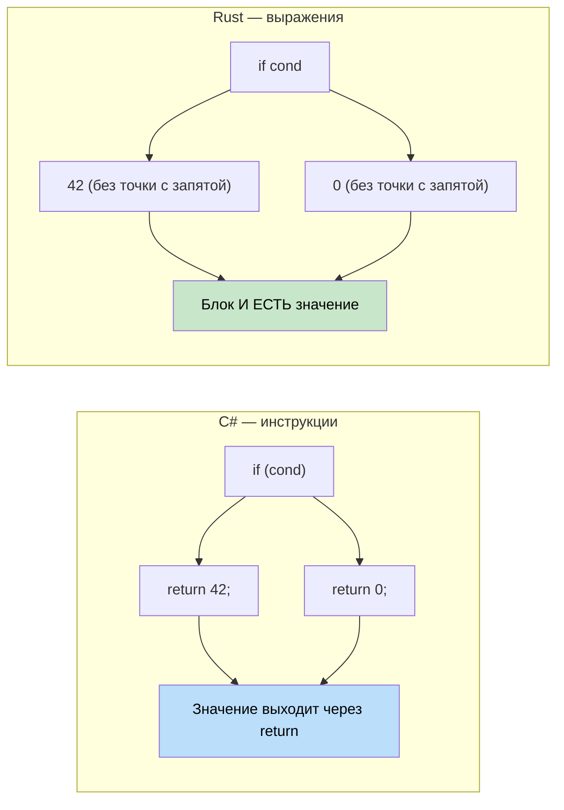

## Функции и методы

> **Что вы узнаете:** функции и методы в Rust по сравнению с C#, важнейшее различие между
> выражениями и инструкциями, синтаксис `if`/`match`/`loop`/`while`/`for`, а также то, как
> ориентированный на выражения дизайн Rust делает ненужными тернарные операторы.
>
> **Сложность:** 🟢 Начальный

### Объявление функций в C#
```csharp
// C# — методы внутри классов
public class Calculator
{
    // Метод экземпляра
    public int Add(int a, int b)
    {
        return a + b;
    }
    
    // Статический метод
    public static int Multiply(int a, int b)
    {
        return a * b;
    }
    
    // Метод с параметром ref
    public void Increment(ref int value)
    {
        value++;
    }
}
```

### Объявление функций в Rust
```rust
// Rust — самостоятельные функции
fn add(a: i32, b: i32) -> i32 {
    a + b  // Ключевое слово 'return' не нужно для последнего выражения
}

fn multiply(a: i32, b: i32) -> i32 {
    return a * b;  // Явный return тоже допустим
}

// Функция с изменяемой ссылкой
fn increment(value: &mut i32) {
    *value += 1;
}

fn main() {
    let result = add(5, 3);
    println!("5 + 3 = {}", result);
    
    let mut x = 10;
    increment(&mut x);
    println!("После increment: {}", x);
}
```

### Выражение против инструкции (важно!)



```csharp
// C# — инструкции и выражения
public int GetValue()
{
    if (condition)
    {
        return 42;  // Инструкция
    }
    return 0;       // Инструкция
}
```

```rust
// Rust — почти всё может быть выражением
fn get_value(condition: bool) -> i32 {
    if condition {
        42  // Выражение (без точки с запятой)
    } else {
        0   // Выражение (без точки с запятой)
    }
    // Сам блок if-else — это выражение, которое возвращает значение
}

// Или ещё проще
fn get_value_ternary(condition: bool) -> i32 {
    if condition { 42 } else { 0 }
}
```

### Параметры функций и типы возвращаемых значений
```rust
// Без параметров и без возвращаемого значения (возвращает тип unit ())
fn say_hello() {
    println!("Привет!");
}

// Несколько параметров
fn greet(name: &str, age: u32) {
    println!("{} — {} лет", name, age);
}

// Несколько возвращаемых значений через кортеж
fn divide_and_remainder(dividend: i32, divisor: i32) -> (i32, i32) {
    (dividend / divisor, dividend % divisor)
}

fn main() {
    let (quotient, remainder) = divide_and_remainder(10, 3);
    println!("10 ÷ 3 = {} остаток {}", quotient, remainder);
}
```

***

## Основы управления потоком

### Условные инструкции
```csharp
// Инструкции if в C#
int x = 5;
if (x > 10)
{
    Console.WriteLine("Большое число");
}
else if (x > 5)
{
    Console.WriteLine("Среднее число");
}
else
{
    Console.WriteLine("Маленькое число");
}

// Тернарный оператор C#
string message = x > 10 ? "Большое" : "Маленькое";
```

```rust
// Выражения if в Rust
let x = 5;
if x > 10 {
    println!("Большое число");
} else if x > 5 {
    println!("Среднее число");
} else {
    println!("Маленькое число");
}

// if как выражение (аналог тернарного оператора)
let message = if x > 10 { "Большое" } else { "Маленькое" };

// Несколько условий
let message = if x > 10 {
    "Большое"
} else if x > 5 {
    "Среднее"
} else {
    "Маленькое"
};
```

### Циклы
```csharp
// Циклы в C#
// Цикл for
for (int i = 0; i < 5; i++)
{
    Console.WriteLine(i);
}

// Цикл foreach
var numbers = new[] { 1, 2, 3, 4, 5 };
foreach (var num in numbers)
{
    Console.WriteLine(num);
}

// Цикл while
int count = 0;
while (count < 3)
{
    Console.WriteLine(count);
    count++;
}
```

```rust
// Циклы в Rust
// Цикл по диапазону
for i in 0..5 {  // От 0 до 4 (правая граница не включается)
    println!("{}", i);
}

// Перебор коллекции
let numbers = vec![1, 2, 3, 4, 5];
for num in numbers {  // Забирает владение
    println!("{}", num);
}

// Перебор ссылок (встречается чаще)
let numbers = vec![1, 2, 3, 4, 5];
for num in &numbers {  // Заимствует элементы
    println!("{}", num);
}

// Цикл while
let mut count = 0;
while count < 3 {
    println!("{}", count);
    count += 1;
}

// Бесконечный цикл с break
let mut counter = 0;
loop {
    if counter >= 3 {
        break;
    }
    println!("{}", counter);
    counter += 1;
}
```

### Управление циклом
```csharp
// Управление циклом в C#
for (int i = 0; i < 10; i++)
{
    if (i == 3) continue;
    if (i == 7) break;
    Console.WriteLine(i);
}
```

```rust
// Управление циклом в Rust
for i in 0..10 {
    if i == 3 { continue; }
    if i == 7 { break; }
    println!("{}", i);
}

// Метки циклов (для вложенных циклов)
'outer: for i in 0..3 {
    'inner: for j in 0..3 {
        if i == 1 && j == 1 {
            break 'outer;  // Выход из внешнего цикла
        }
        println!("i: {}, j: {}", i, j);
    }
}
```

***


<details>
<summary><strong>🏋️ Упражнение: конвертер температур</strong> (нажмите, чтобы раскрыть)</summary>

**Задача**: переведите эту программу на C# на идиоматичный Rust. Используйте выражения, сопоставление с образцом и правильную обработку ошибок.

```csharp
// C# — переведите это на Rust
public static double Convert(double value, string from, string to)
{
    double celsius = from switch
    {
        "F" => (value - 32.0) * 5.0 / 9.0,
        "K" => value - 273.15,
        "C" => value,
        _ => throw new ArgumentException($"Unknown unit: {from}")
    };
    return to switch
    {
        "F" => celsius * 9.0 / 5.0 + 32.0,
        "K" => celsius + 273.15,
        "C" => celsius,
        _ => throw new ArgumentException($"Unknown unit: {to}")
    };
}
```

<details>
<summary>🔑 Решение</summary>

```rust
#[derive(Debug, Clone, Copy)]
enum TempUnit { Celsius, Fahrenheit, Kelvin }

fn parse_unit(s: &str) -> Result<TempUnit, String> {
    match s {
        "C" => Ok(TempUnit::Celsius),
        "F" => Ok(TempUnit::Fahrenheit),
        "K" => Ok(TempUnit::Kelvin),
        _   => Err(format!("Неизвестная единица: {s}")),
    }
}

fn convert(value: f64, from: TempUnit, to: TempUnit) -> f64 {
    let celsius = match from {
        TempUnit::Fahrenheit => (value - 32.0) * 5.0 / 9.0,
        TempUnit::Kelvin     => value - 273.15,
        TempUnit::Celsius    => value,
    };
    match to {
        TempUnit::Fahrenheit => celsius * 9.0 / 5.0 + 32.0,
        TempUnit::Kelvin     => celsius + 273.15,
        TempUnit::Celsius    => celsius,
    }
}

fn main() -> Result<(), String> {
    let from = parse_unit("F")?;
    let to   = parse_unit("C")?;
    println!("212°F = {:.1}°C", convert(212.0, from, to));
    Ok(())
}
```

**Ключевые выводы**:
- Перечисления заменяют «магические» строки — исчерпывающее сопоставление ловит пропущенные единицы на этапе компиляции
- `Result<T, E>` заменяет исключения — вызывающий код видит возможные ошибки в сигнатуре
- `match` — это выражение, которое возвращает значение, — инструкции `return` не нужны

</details>
</details>


