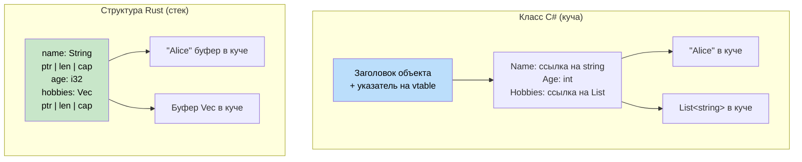

## Кортежи и деструктуризация

> **Что вы узнаете:** кортежи Rust против `ValueTuple` в C#, массивы и срезы, структуры против классов,
> паттерн newtype для моделирования предметной области с безопасностью типов без накладных расходов,
> а также синтаксис деструктуризации.
>
> **Сложность:** 🟢 Начальный

В C# есть `ValueTuple` (начиная с C# 7). Кортежи Rust похожи на них, но более глубоко интегрированы в язык.

### Кортежи в C#
```csharp
// ValueTuple в C# (C# 7+)
var point = (10, 20);                         // (int, int)
var named = (X: 10, Y: 20);                   // Именованные элементы
Console.WriteLine($"{named.X}, {named.Y}");

// Кортеж как возвращаемый тип
public (int Quotient, int Remainder) Divide(int a, int b)
{
    return (a / b, a % b);
}

var (q, r) = Divide(10, 3);    // Деконструкция
Console.WriteLine($"{q} remainder {r}");

// Пропуски (discards)
var (_, remainder) = Divide(10, 3);  // Игнорируем частное
```

### Кортежи в Rust
```rust
// Кортежи Rust — неизменяемы по умолчанию, без именованных элементов
let point = (10, 20);                // (i32, i32)
let point3d: (f64, f64, f64) = (1.0, 2.0, 3.0);

// Доступ по индексу (с нуля)
println!("x={}, y={}", point.0, point.1);

// Кортеж как возвращаемый тип
fn divide(a: i32, b: i32) -> (i32, i32) {
    (a / b, a % b)
}

let (q, r) = divide(10, 3);       // Деструктуризация
println!("{q} remainder {r}");

// Пропуск через _
let (_, remainder) = divide(10, 3);

// Тип unit () — «пустой кортеж» (аналог void в C#)
fn greet() {          // неявный возвращаемый тип — ()
    println!("hi");
}
```

### Ключевые различия

| Характеристика | `ValueTuple` в C# | Кортеж Rust |
|---------|-----------------|------------|
| Именованные элементы | `(int X, int Y)` | Не поддерживаются — используйте структуры |
| Максимальная арность | ~8 (для большего — вложенность) | Без ограничений (практически ~12) |
| Сравнение | Автоматически | Автоматически для кортежей до 12 элементов |
| Использование как ключ словаря | Да | Да (если элементы реализуют `Hash`) |
| Возврат из функций | Часто | Часто |
| Изменяемые элементы | Всегда изменяемы | Только при `let mut` |

### Кортежные структуры (newtype)
```rust
// Когда обычного кортежа недостаточно, используйте кортежную структуру:
struct Meters(f64);     // Обёртка «newtype» с одним полем
struct Celsius(f64);
struct Fahrenheit(f64);

// Компилятор считает их РАЗНЫМИ типами:
let distance = Meters(100.0);
let temp = Celsius(36.6);
// distance == temp;  // ❌ ОШИБКА: нельзя сравнивать Meters и Celsius

// Паттерн newtype предотвращает ошибки перепутанных единиц на этапе компиляции!
// В C# для той же безопасности понадобился бы полноценный класс или структура.
```

```csharp
// В C# аналог требует больше церемоний:
public readonly record struct Meters(double Value);
public readonly record struct Celsius(double Value);
// Они не взаимозаменяемы, но records добавляют накладные расходы по сравнению с newtype в Rust, которые не несут затрат
```

### Паттерн newtype в деталях: моделирование предметной области без затрат

Newtype'ы гораздо полезнее, чем защита от путаницы единиц измерения. Это основной инструмент Rust для **кодирования бизнес-правил в системе типов** — он заменяет шаблоны «защитного условия» и «класса валидации», распространённые в C#.

#### Подход C# к валидации: проверки во время выполнения
```csharp
// C# — валидация происходит во время выполнения, каждый раз
public class UserService
{
    public User CreateUser(string email, int age)
    {
        if (string.IsNullOrWhiteSpace(email) || !email.Contains('@'))
            throw new ArgumentException("Invalid email");
        if (age < 0 || age > 150)
            throw new ArgumentException("Invalid age");

        return new User { Email = email, Age = age };
    }

    public void SendEmail(string email)
    {
        // Нужно перепроверить — или доверять вызывающему коду?
        if (!email.Contains('@')) throw new ArgumentException("Invalid email");
        // ...
    }
}
```

#### Подход Rust с newtype: доказательство на этапе компиляции
```rust
/// Проверенный адрес электронной почты — сам тип является доказательством корректности.
#[derive(Debug, Clone, PartialEq, Eq, Hash)]
pub struct Email(String);

impl Email {
    /// ЕДИНСТВЕННЫЙ способ создать Email — валидация выполняется один раз, при создании.
    pub fn new(raw: &str) -> Result<Self, &'static str> {
        if raw.contains('@') && raw.len() > 3 {
            Ok(Email(raw.to_lowercase()))
        } else {
            Err("invalid email format")
        }
    }

    /// Безопасный доступ к внутреннему значению
    pub fn as_str(&self) -> &str { &self.0 }
}

/// Проверенный возраст — невозможно создать некорректный.
#[derive(Debug, Clone, Copy, PartialEq, Eq, PartialOrd, Ord)]
pub struct Age(u8);

impl Age {
    pub fn new(raw: u8) -> Result<Self, &'static str> {
        if raw <= 150 { Ok(Age(raw)) } else { Err("age out of range") }
    }
    pub fn value(&self) -> u8 { self.0 }
}

// Теперь функции принимают ДОКАЗАННЫЕ типы — повторная валидация не нужна!
fn create_user(email: Email, age: Age) -> User {
    // email ГАРАНТИРОВАННО корректен — это инвариант типа
    User { email, age }
}

fn send_email(to: &Email) {
    // Валидация не нужна — тип Email доказывает корректность
    println!("Sending to: {}", to.as_str());
}
```

#### Типичные применения newtype для разработчиков C#

| Паттерн в C# | Newtype в Rust | Что предотвращает |
|------------|-------------|------------------|
| `string` для UserId, Email и т. д. | `struct UserId(Uuid)` | Передачу неверной строки в неверный параметр |
| `int` для Port, Count, Index | `struct Port(u16)` | Port и Count нельзя перепутать |
| Защитные условия повсюду | Однократная валидация в конструкторе | Повторную проверку, пропущенную валидацию |
| `decimal` для USD, EUR | `struct Usd(Decimal)` | Случайное сложение USD с EUR |
| `TimeSpan` с разной семантикой | `struct Timeout(Duration)` | Передачу таймаута соединения как таймаута запроса |

```rust
// Без затрат: newtype компилируется в тот же машинный код, что и внутренний тип.
// Этот код на Rust:
struct UserId(u64);
fn lookup(id: UserId) -> Option<User> { /* ... */ }

// Генерирует ТОТ ЖЕ машинный код, что и:
fn lookup(id: u64) -> Option<User> { /* ... */ }
// Но с полной безопасностью типов на этапе компиляции!
```

***

## Массивы и срезы

Понимание различий между массивами, срезами и векторами крайне важно.

### Массивы в C#
```csharp
// Массивы в C#
int[] numbers = new int[5];         // Фиксированный размер, размещается в куче
int[] initialized = { 1, 2, 3, 4, 5 }; // Литерал массива

// Доступ
numbers[0] = 10;
int first = numbers[0];

// Длина
int length = numbers.Length;

// Массив как параметр (ссылочный тип)
void ProcessArray(int[] array)
{
    array[0] = 99;  // Изменяет исходный массив
}
```

### Массивы, срезы и векторы в Rust
```rust
// 1. Массивы — фиксированный размер, размещаются на стеке
let numbers: [i32; 5] = [1, 2, 3, 4, 5];  // Тип: [i32; 5]
let zeros = [0; 10];                       // 10 нулей

// Доступ
let first = numbers[0];
// numbers[0] = 10;  // ❌ Ошибка: массивы по умолчанию неизменяемы

let mut mut_array = [1, 2, 3, 4, 5];
mut_array[0] = 10;  // ✅ Работает с mut

// 2. Срезы — представления массивов или векторов
let slice: &[i32] = &numbers[1..4];  // Элементы 1, 2, 3
let all_slice: &[i32] = &numbers;    // Весь массив как срез

// 3. Векторы — динамический размер, размещаются в куче (рассмотрены ранее)
let mut vec = vec![1, 2, 3, 4, 5];
vec.push(6);  // Может расти
```

### Срезы как параметры функций
```csharp
// C# — метод, работающий с массивами
public void ProcessNumbers(int[] numbers)
{
    for (int i = 0; i < numbers.Length; i++)
    {
        Console.WriteLine(numbers[i]);
    }
}

// Работает только с массивами
ProcessNumbers(new int[] { 1, 2, 3 });
```

```rust
// Rust — функция, работающая с любой последовательностью
fn process_numbers(numbers: &[i32]) {  // Параметр-срез
    for (i, num) in numbers.iter().enumerate() {
        println!("Индекс {}: {}", i, num);
    }
}

fn main() {
    let array = [1, 2, 3, 4, 5];
    let vec = vec![1, 2, 3, 4, 5];
    
    // Одна и та же функция работает с обоими!
    process_numbers(&array);      // Массив как срез
    process_numbers(&vec);        // Вектор как срез
    process_numbers(&vec[1..4]);  // Частичный срез
}
```

### Строковые срезы (&str) — повторно
```rust
// Связь между String и &str
fn string_slice_example() {
    let owned = String::from("Hello, World!");
    let slice: &str = &owned[0..5];      // "Hello"
    let slice2: &str = &owned[7..];      // "World!"
    
    println!("{}", slice);   // "Hello"
    println!("{}", slice2);  // "World!"
    
    // Функция, принимающая любой строковый тип
    print_string("String literal");      // &str
    print_string(&owned);               // String как &str
    print_string(slice);                // Срез &str
}

fn print_string(s: &str) {
    println!("{}", s);
}
```

### Современный C#: Span\<T\> и встроенные массивы

C# ушёл далеко от традиционных массивов. `Span<T>` предоставляет типобезопасные представления непрерывной памяти, которые могут находиться на стеке, а встроенные массивы (C# 12) дают буферы фиксированного размера на стеке.

```csharp
// Span<T> в C# — представление непрерывной памяти
Span<int> span = stackalloc int[] { 1, 2, 3, 4, 5 };
span[0] = 10;

ReadOnlySpan<char> text = "Hello".AsSpan();

// Метод, принимающий любое представление непрерывной памяти
void ProcessSpan(ReadOnlySpan<int> data)
{
    for (int i = 0; i < data.Length; i++)
        Console.WriteLine(data[i]);
}

// Встроенные массивы (C# 12) — буфер фиксированного размера на стеке
[InlineArray(5)]
struct IntBuffer
{
    private int _element;
}
```

```rust
// Rust &[T] / &mut [T] — заимствованное представление непрерывной памяти
let mut array = [1, 2, 3, 4, 5];
let slice: &mut [i32] = &mut array;
slice[0] = 10;

let slice: &[i32] = &array;
let text: &str = "Hello";

// Функция, принимающая любые последовательные данные
fn process_slice(data: &[i32]) {
    for (i, num) in data.iter().enumerate() {
        println!("Индекс {}: {}", i, num);
    }
}

// Массивы фиксированного размера (размещаются на стеке)
let buffer: [i32; 5] = [0; 5];
```

| C# | Rust |
|----|------|
| `Span<T>` (ref struct, только на стеке) | `&mut [T]` / `&[T]` (заимствованный срез) |
| `ReadOnlySpan<T>` | `&[T]` (неизменяемый срез) |
| `ReadOnlySpan<char>` / `string.AsSpan()` | `&str` (строковый срез) |
| Структура `[InlineArray(N)]` (C# 12) | `[T; N]` (массив фиксированного размера) |
| `stackalloc T[]` с `Span<T>` | `let arr: [T; N] = ...` (локальный массив) |

> **Ключевая мысль:** `&[T]` в Rust совмещает роли `ArraySegment<T>`, `Span<T>` и `ReadOnlySpan<T>` из C# — это «толстый» указатель (указатель + длина), который работает с массивами, векторами и подсрезами. Встроенные массивы C# естественно соответствуют массивам `[T; N]` в Rust, которые тоже по умолчанию размещаются на стеке.

***

## Структуры против классов

Структуры в Rust похожи на классы C#, но имеют несколько ключевых отличий, связанных с владением и методами.



> **Ключевая мысль**: классы C# всегда живут в куче за ссылкой. Структуры Rust по умолчанию живут на стеке — в куче находятся только данные динамического размера (например, содержимое `String`). Это устраняет накладные расходы GC для небольших часто создаваемых объектов.

### Определение класса в C#
```csharp
// Класс C# со свойствами и методами
public class Person
{
    public string Name { get; set; }
    public int Age { get; set; }
    public List<string> Hobbies { get; set; }
    
    public Person(string name, int age)
    {
        Name = name;
        Age = age;
        Hobbies = new List<string>();
    }
    
    public void AddHobby(string hobby)
    {
        Hobbies.Add(hobby);
    }
    
    public string GetInfo()
    {
        return $"{Name} is {Age} years old";
    }
}
```

### Определение структуры в Rust
```rust
// Структура Rust с ассоциированными функциями и методами
#[derive(Debug)]  // Автоматически реализует трейт Debug
pub struct Person {
    pub name: String,    // Публичное поле
    pub age: u32,        // Публичное поле
    hobbies: Vec<String>, // Приватное поле (без pub)
}

impl Person {
    // Ассоциированная функция (аналог статического метода)
    pub fn new(name: String, age: u32) -> Person {
        Person {
            name,
            age,
            hobbies: Vec::new(),
        }
    }
    
    // Метод (принимает &self, &mut self или self)
    pub fn add_hobby(&mut self, hobby: String) {
        self.hobbies.push(hobby);
    }
    
    // Метод, который заимствует неизменяемо
    pub fn get_info(&self) -> String {
        format!("{} is {} years old", self.name, self.age)
    }
    
    // Геттер для приватного поля
    pub fn hobbies(&self) -> &Vec<String> {
        &self.hobbies
    }
}
```

### Создание и использование экземпляров
```csharp
// Создание и использование объекта в C#
var person = new Person("Alice", 30);
person.AddHobby("Reading");
person.AddHobby("Swimming");

Console.WriteLine(person.GetInfo());
Console.WriteLine($"Hobbies: {string.Join(", ", person.Hobbies)}");

// Прямое изменение свойств
person.Age = 31;
```

```rust
// Создание и использование структуры в Rust
let mut person = Person::new("Alice".to_string(), 30);
person.add_hobby("Reading".to_string());
person.add_hobby("Swimming".to_string());

println!("{}", person.get_info());
println!("Hobbies: {:?}", person.hobbies());

// Прямое изменение публичных полей
person.age = 31;

// Вывод всей структуры в отладочном формате
println!("{:?}", person);
```

### Паттерны инициализации структур
```csharp
// Инициализация объекта в C#
var person = new Person("Bob", 25)
{
    Hobbies = new List<string> { "Gaming", "Coding" }
};

// Анонимные типы
var anonymous = new { Name = "Charlie", Age = 35 };
```

```rust
// Инициализация структуры в Rust
let person = Person {
    name: "Bob".to_string(),
    age: 25,
    hobbies: vec!["Gaming".to_string(), "Coding".to_string()],
};

// Синтаксис обновления структуры (аналог spread для объектов)
let older_person = Person {
    age: 26,
    ..person  // Берём остальные поля из person (перемещает person!)
};

// Кортежные структуры (аналог анонимных типов)
#[derive(Debug)]
struct Point(i32, i32);

let point = Point(10, 20);
println!("Point: ({}, {})", point.0, point.1);
```

***

## Методы и ассоциированные функции

Понимание различий между методами и ассоциированными функциями — ключ к успеху.

### Виды методов в C#
```csharp
public class Calculator
{
    private int memory = 0;
    
    // Метод экземпляра
    public int Add(int a, int b)
    {
        return a + b;
    }
    
    // Метод экземпляра, который использует состояние
    public void StoreInMemory(int value)
    {
        memory = value;
    }
    
    // Статический метод
    public static int Multiply(int a, int b)
    {
        return a * b;
    }
    
    // Статический фабричный метод
    public static Calculator CreateWithMemory(int initialMemory)
    {
        var calc = new Calculator();
        calc.memory = initialMemory;
        return calc;
    }
}
```

### Виды методов в Rust
```rust
#[derive(Debug)]
pub struct Calculator {
    memory: i32,
}

impl Calculator {
    // Ассоциированная функция (аналог статического метода) — без параметра self
    pub fn new() -> Calculator {
        Calculator { memory: 0 }
    }
    
    // Ассоциированная функция с параметрами
    pub fn with_memory(initial_memory: i32) -> Calculator {
        Calculator { memory: initial_memory }
    }
    
    // Метод, который заимствует неизменяемо (&self)
    pub fn add(&self, a: i32, b: i32) -> i32 {
        a + b
    }
    
    // Метод, который заимствует изменяемо (&mut self)
    pub fn store_in_memory(&mut self, value: i32) {
        self.memory = value;
    }
    
    // Метод, который забирает владение (self)
    pub fn into_memory(self) -> i32 {
        self.memory  // Calculator потребляется
    }
    
    // Метод-геттер
    pub fn memory(&self) -> i32 {
        self.memory
    }
}

fn main() {
    // Ассоциированные функции вызываются через ::
    let mut calc = Calculator::new();
    let calc2 = Calculator::with_memory(42);
    
    // Методы вызываются через .
    let result = calc.add(5, 3);
    calc.store_in_memory(result);
    
    println!("Memory: {}", calc.memory());
    
    // Метод, потребляющий значение
    let memory_value = calc.into_memory();  // calc больше нельзя использовать
    println!("Final memory: {}", memory_value);
}
```

### Виды получателей методов (receiver)
```rust
impl Person {
    // &self — неизменяемое заимствование (самый частый вариант)
    // Используйте, когда нужно только читать данные
    pub fn get_name(&self) -> &str {
        &self.name
    }
    
    // &mut self — изменяемое заимствование
    // Используйте, когда нужно изменять данные
    pub fn set_name(&mut self, name: String) {
        self.name = name;
    }
    
    // self — забрать владение (встречается реже)
    // Используйте, когда структура должна быть потреблена
    pub fn consume(self) -> String {
        self.name  // Person перемещён, больше недоступен
    }
}

fn method_examples() {
    let mut person = Person::new("Alice".to_string(), 30);
    
    // Неизменяемое заимствование
    let name = person.get_name();  // person по-прежнему можно использовать
    println!("Name: {}", name);
    
    // Изменяемое заимствование
    person.set_name("Alice Smith".to_string());  // person по-прежнему можно использовать
    
    // Забираем владение
    let final_name = person.consume();  // person больше нельзя использовать
    println!("Final name: {}", final_name);
}
```

---

## Упражнения

<details>
<summary><strong>🏋️ Упражнение: скользящее среднее по срезу</strong> (нажмите, чтобы раскрыть)</summary>

**Задача**: напишите функцию, которая принимает срез значений `f64` и размер окна, и возвращает `Vec<f64>` со скользящими средними. Например, `[1.0, 2.0, 3.0, 4.0, 5.0]` с окном 3 → `[2.0, 3.0, 4.0]`.

```rust
fn rolling_average(data: &[f64], window: usize) -> Vec<f64> {
    // Ваша реализация здесь
    todo!()
}

fn main() {
    let data = vec![1.0, 2.0, 3.0, 4.0, 5.0];
    let avgs = rolling_average(&data, 3);
    println!("{avgs:?}"); // [2.0, 3.0, 4.0]
}
```

<details>
<summary>🔑 Решение</summary>

```rust
fn rolling_average(data: &[f64], window: usize) -> Vec<f64> {
    data.windows(window)
        .map(|w| w.iter().sum::<f64>() / w.len() as f64)
        .collect()
}

fn main() {
    let data = vec![1.0, 2.0, 3.0, 4.0, 5.0];
    let avgs = rolling_average(&data, 3);
    assert_eq!(avgs, vec![2.0, 3.0, 4.0]);
    println!("{avgs:?}");
}
```

**Ключевая мысль**: у срезов есть мощные встроенные методы вроде `.windows()`, `.chunks()` и `.split()`, которые заменяют ручную арифметику индексов. В C# вы бы использовали `Enumerable.Range` или LINQ `.Skip().Take()`.

</details>
</details>

<details>
<summary><strong>🏋️ Упражнение: мини-адресная книга</strong> (нажмите, чтобы раскрыть)</summary>

Создайте небольшую адресную книгу с использованием структур, перечислений и методов:

1. Определите перечисление `PhoneType { Mobile, Home, Work }`
2. Определите структуру `Contact` с полями `name: String` и `phones: Vec<(PhoneType, String)>`
3. Реализуйте `Contact::new(name: impl Into<String>) -> Self`
4. Реализуйте `Contact::add_phone(&mut self, kind: PhoneType, number: impl Into<String>)`
5. Реализуйте `Contact::mobile_numbers(&self) -> Vec<&str>`, который возвращает только мобильные номера
6. В `main` создайте контакт, добавьте два телефона и выведите мобильные номера

<details>
<summary>🔑 Решение</summary>

```rust
#[derive(Debug, PartialEq)]
enum PhoneType { Mobile, Home, Work }

#[derive(Debug)]
struct Contact {
    name: String,
    phones: Vec<(PhoneType, String)>,
}

impl Contact {
    fn new(name: impl Into<String>) -> Self {
        Contact { name: name.into(), phones: Vec::new() }
    }

    fn add_phone(&mut self, kind: PhoneType, number: impl Into<String>) {
        self.phones.push((kind, number.into()));
    }

    fn mobile_numbers(&self) -> Vec<&str> {
        self.phones
            .iter()
            .filter(|(kind, _)| *kind == PhoneType::Mobile)
            .map(|(_, num)| num.as_str())
            .collect()
    }
}

fn main() {
    let mut alice = Contact::new("Alice");
    alice.add_phone(PhoneType::Mobile, "+1-555-0100");
    alice.add_phone(PhoneType::Work, "+1-555-0200");
    alice.add_phone(PhoneType::Mobile, "+1-555-0101");

    println!("Мобильные номера {}: {:?}", alice.name, alice.mobile_numbers());
}
```

</details>
</details>

***

