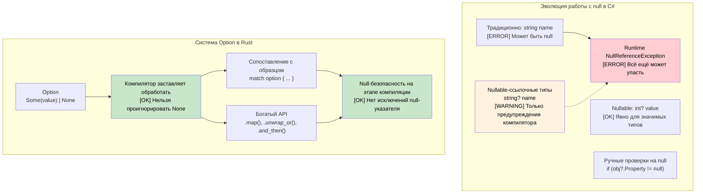

```mermaid
graph TD
    subgraph "Ограничения сопоставления с образцом в C#"
        CS_SWITCH["switch-выражение"]
        CS_WARNING["⚠️ Только предупреждения компилятора"]
        CS_COMPILE["✅ Компилируется успешно"]
        CS_RUNTIME["💥 Исключения во время выполнения"]
        CS_DEPLOY["❌ Ошибки попадают в продакшен"]
        CS_SILENT["😰 Тихие сбои при изменении перечислений"]
        
        CS_SWITCH --> CS_WARNING
        CS_WARNING --> CS_COMPILE
        CS_COMPILE --> CS_RUNTIME
        CS_RUNTIME --> CS_DEPLOY
        CS_SWITCH --> CS_SILENT
    end
    
    subgraph "Исчерпывающее сопоставление в Rust"
        RUST_MATCH["match-выражение"]
        RUST_ERROR["🛑 Компиляция падает"]
        RUST_FIX["✅ Нужно обработать все случаи"]
        RUST_SAFE["✅ Никаких сюрпризов во время выполнения"]
        RUST_EVOLUTION["🔄 Изменения перечислений ломают компиляцию"]
        RUST_REFACTOR["🛠️ Принудительный рефакторинг"]
        
        RUST_MATCH --> RUST_ERROR
        RUST_ERROR --> RUST_FIX
        RUST_FIX --> RUST_SAFE
        RUST_MATCH --> RUST_EVOLUTION
        RUST_EVOLUTION --> RUST_REFACTOR
    end
    
    style CS_RUNTIME fill:#ffcdd2,color:#000
    style CS_DEPLOY fill:#ffcdd2,color:#000
    style CS_SILENT fill:#ffcdd2,color:#000
    style RUST_SAFE fill:#c8e6c9,color:#000
    style RUST_REFACTOR fill:#c8e6c9,color:#000
```

## Исчерпывающее сопоставление с образцом: гарантии компилятора против ошибок времени выполнения

> **Что вы узнаете:** почему выражения `switch` в C# молча пропускают случаи, тогда как `match` в Rust ловит их на этапе компиляции,
> `Option<T>` против `Nullable<T>` для null-безопасности, а также собственные типы ошибок с `Result<T, E>`.
>
> **Сложность:** 🟡 Средний

### Выражения switch в C# — всё ещё неполные
```csharp
// Выражения switch в C# выглядят исчерпывающими, но это не гарантировано
public enum HttpStatus { Ok, NotFound, ServerError, Unauthorized }

public string HandleResponse(HttpStatus status) => status switch
{
    HttpStatus.Ok => "Success",
    HttpStatus.NotFound => "Resource not found",
    HttpStatus.ServerError => "Internal error",
    // Нет варианта Unauthorized — компилируется с предупреждением CS8524, но это НЕ ошибка!
    // Во время выполнения: SwitchExpressionException, если status равен Unauthorized
};

// Даже с предупреждениями о nullable этот код компилируется:
public class User 
{
    public string Name { get; set; }
    public bool IsActive { get; set; }
}

public string ProcessUser(User? user) => user switch
{
    { IsActive: true } => $"Active: {user.Name}",
    { IsActive: false } => $"Inactive: {user.Name}",
    // Нет случая для null — предупреждение компилятора CS8655, но НЕ ошибка!
    // Во время выполнения: SwitchExpressionException, если user равен null
};
```

```csharp
// Добавление варианта в перечисление позже не ломает компиляцию существующих switch
public enum HttpStatus 
{ 
    Ok, 
    NotFound, 
    ServerError, 
    Unauthorized,
    Forbidden  // Добавление этого даёт ещё одно предупреждение CS8524, но не ломает компиляцию!
}
```

### Сопоставление с образцом в Rust — настоящая исчерпываемость
```rust
#[derive(Debug)]
enum HttpStatus {
    Ok,
    NotFound, 
    ServerError,
    Unauthorized,
}

fn handle_response(status: HttpStatus) -> &'static str {
    match status {
        HttpStatus::Ok => "Success",
        HttpStatus::NotFound => "Resource not found", 
        HttpStatus::ServerError => "Internal error",
        HttpStatus::Unauthorized => "Authentication required",
        // Ошибка компилятора, если пропущен любой случай!
        // Этот код буквально не скомпилируется
    }
}

// Добавление нового варианта ломает компиляцию везде, где он используется
#[derive(Debug)]
enum HttpStatus {
    Ok,
    NotFound,
    ServerError, 
    Unauthorized,
    Forbidden,  // Добавление этого ломает компиляцию в handle_response()
}
// Компилятор заставляет обработать ВСЕ случаи

// Сопоставление с образцом для Option<T> тоже исчерпывающее
fn process_optional_value(value: Option<i32>) -> String {
    match value {
        Some(n) => format!("Got value: {}", n),
        None => "No value".to_string(),
        // Пропуск любого из случаев = ошибка компиляции
    }
}
```



***

## Null-безопасность: `Nullable<T>` против `Option<T>`

### Эволюция работы с null в C#
```csharp
// C# — традиционная работа с null (подвержена ошибкам)
public class User
{
    public string Name { get; set; }  // Может быть null!
    public string Email { get; set; } // Может быть null!
}

public string GetUserDisplayName(User user)
{
    if (user?.Name != null)  // Оператор null-условного доступа
    {
        return user.Name;
    }
    return "Unknown User";
}
```

```csharp
// Nullable-ссылочные типы C# 8+
public class User
{
    public string Name { get; set; }    // Не допускает null
    public string? Email { get; set; }  // Явно допускает null
}

// Nullable<T> в C# для значимых типов
int? maybeNumber = GetNumber();
if (maybeNumber.HasValue)
{
    Console.WriteLine(maybeNumber.Value);
}
```

### Система `Option<T>` в Rust
```rust
// Rust — явная работа с null через Option<T>
#[derive(Debug)]
pub struct User {
    name: String,           // Никогда не null
    email: Option<String>,  // Явно необязательное
}

impl User {
    pub fn get_display_name(&self) -> &str {
        &self.name  // Проверка на null не нужна — значение гарантированно существует
    }
    
    pub fn get_email_or_default(&self) -> String {
        self.email
            .as_ref()
            .map(|e| e.clone())
            .unwrap_or_else(|| "no-email@example.com".to_string())
    }
}

// Сопоставление с образцом заставляет обработать случай None
fn handle_optional_user(user: Option<User>) {
    match user {
        Some(u) => println!("User: {}", u.get_display_name()),
        None => println!("No user found"),
        // Ошибка компилятора, если случай None не обработан!
    }
}
```



***

```rust
#[derive(Debug)]
struct Point {
    x: i32,
    y: i32,
}

fn describe_point(point: Point) -> String {
    match point {
        Point { x: 0, y: 0 } => "начало координат".to_string(),
        Point { x: 0, y } => format!("на оси Y при y={}", y),
        Point { x, y: 0 } => format!("на оси X при x={}", x),
        Point { x, y } if x == y => format!("на диагонали в ({}, {})", x, y),
        Point { x, y } => format!("точка в ({}, {})", x, y),
    }
}
```

### Option и Result
```csharp
// Nullable-ссылочные типы C# (C# 8+)
public class PersonService
{
    private Dictionary<int, string> people = new();
    
    public string? FindPerson(int id)
    {
        return people.TryGetValue(id, out string? name) ? name : null;
    }
    
    public string GetPersonOrDefault(int id)
    {
        return FindPerson(id) ?? "Unknown";
    }
    
    // Обработка ошибок через исключения
    public void SavePerson(int id, string name)
    {
        if (string.IsNullOrEmpty(name))
            throw new ArgumentException("Name cannot be empty");
        
        people[id] = name;
    }
}
```

```rust
use std::collections::HashMap;

// Rust использует Option<T> вместо null
struct PersonService {
    people: HashMap<i32, String>,
}

impl PersonService {
    fn new() -> Self {
        PersonService {
            people: HashMap::new(),
        }
    }
    
    // Возвращает Option<T> — никакого null!
    fn find_person(&self, id: i32) -> Option<&String> {
        self.people.get(&id)
    }
    
    // Сопоставление с образцом по Option
    fn get_person_or_default(&self, id: i32) -> String {
        match self.find_person(id) {
            Some(name) => name.clone(),
            None => "Unknown".to_string(),
        }
    }
    
    // Использование методов Option (более функциональный стиль)
    fn get_person_or_default_functional(&self, id: i32) -> String {
        self.find_person(id)
            .map(|name| name.clone())
            .unwrap_or_else(|| "Unknown".to_string())
    }
    
    // Result<T, E> для обработки ошибок
    fn save_person(&mut self, id: i32, name: String) -> Result<(), String> {
        if name.is_empty() {
            return Err("Name cannot be empty".to_string());
        }
        
        self.people.insert(id, name);
        Ok(())
    }
    
    // Цепочка операций
    fn get_person_length(&self, id: i32) -> Option<usize> {
        self.find_person(id).map(|name| name.len())
    }
}

fn main() {
    let mut service = PersonService::new();
    
    // Обработка Result
    match service.save_person(1, "Alice".to_string()) {
        Ok(()) => println!("Person saved successfully"),
        Err(error) => println!("Error: {}", error),
    }
    
    // Обработка Option
    match service.find_person(1) {
        Some(name) => println!("Found: {}", name),
        None => println!("Person not found"),
    }
    
    // Функциональный стиль с Option
    let name_length = service.get_person_length(1)
        .unwrap_or(0);
    println!("Name length: {}", name_length);
    
    // Оператор вопросительного знака для раннего возврата
    fn try_operation(service: &mut PersonService) -> Result<String, String> {
        service.save_person(2, "Bob".to_string())?; // Ранний возврат при ошибке
        let name = service.find_person(2).ok_or("Person not found")?; // Преобразуем Option в Result
        Ok(format!("Hello, {}", name))
    }
    
    match try_operation(&mut service) {
        Ok(message) => println!("{}", message),
        Err(error) => println!("Operation failed: {}", error),
    }
}
```

### Собственные типы ошибок
```rust
// Определяем собственное перечисление ошибок
#[derive(Debug)]
enum PersonError {
    NotFound(i32),
    InvalidName(String),
    DatabaseError(String),
}

impl std::fmt::Display for PersonError {
    fn fmt(&self, f: &mut std::fmt::Formatter<'_>) -> std::fmt::Result {
        match self {
            PersonError::NotFound(id) => write!(f, "Person with ID {} not found", id),
            PersonError::InvalidName(name) => write!(f, "Invalid name: '{}'", name),
            PersonError::DatabaseError(msg) => write!(f, "Database error: {}", msg),
        }
    }
}

impl std::error::Error for PersonError {}

// Расширенный PersonService с собственными ошибками
impl PersonService {
    fn save_person_enhanced(&mut self, id: i32, name: String) -> Result<(), PersonError> {
        if name.is_empty() || name.len() > 50 {
            return Err(PersonError::InvalidName(name));
        }
        
        // Имитация операции с базой данных, которая может завершиться ошибкой
        if id < 0 {
            return Err(PersonError::DatabaseError("Negative IDs not allowed".to_string()));
        }
        
        self.people.insert(id, name);
        Ok(())
    }
    
    fn find_person_enhanced(&self, id: i32) -> Result<&String, PersonError> {
        self.people.get(&id).ok_or(PersonError::NotFound(id))
    }
}

fn demo_error_handling() {
    let mut service = PersonService::new();
    
    // Обработка разных типов ошибок
    match service.save_person_enhanced(-1, "Invalid".to_string()) {
        Ok(()) => println!("Success"),
        Err(PersonError::NotFound(id)) => println!("Not found: {}", id),
        Err(PersonError::InvalidName(name)) => println!("Invalid name: {}", name),
        Err(PersonError::DatabaseError(msg)) => println!("DB Error: {}", msg),
    }
}
```

---

## Упражнения

<details>
<summary><strong>🏋️ Упражнение: комбинаторы Option</strong> (нажмите, чтобы раскрыть)</summary>

Перепишите этот глубоко вложенный C#-код с проверками на null, используя комбинаторы `Option` в Rust (`and_then`, `map`, `unwrap_or`):

```csharp
string GetCityName(User? user)
{
    if (user != null)
        if (user.Address != null)
            if (user.Address.City != null)
                return user.Address.City.ToUpper();
    return "UNKNOWN";
}
```

Используйте такие типы Rust:
```rust
struct User { address: Option<Address> }
struct Address { city: Option<String> }
```

Запишите это как **одно выражение** без `if let` и `match`.

<details>
<summary>🔑 Решение</summary>

```rust
struct User { address: Option<Address> }
struct Address { city: Option<String> }

fn get_city_name(user: Option<&User>) -> String {
    user.and_then(|u| u.address.as_ref())
        .and_then(|a| a.city.as_ref())
        .map(|c| c.to_uppercase())
        .unwrap_or_else(|| "UNKNOWN".to_string())
}

fn main() {
    let user = User {
        address: Some(Address { city: Some("seattle".to_string()) }),
    };
    assert_eq!(get_city_name(Some(&user)), "SEATTLE");
    assert_eq!(get_city_name(None), "UNKNOWN");

    let no_city = User { address: Some(Address { city: None }) };
    assert_eq!(get_city_name(Some(&no_city)), "UNKNOWN");
}
```

**Ключевая мысль**: `and_then` — это аналог оператора `?.` из Rust для `Option`. Каждый шаг возвращает `Option`, а цепочка прерывается на `None` — ровно как оператор null-условного доступа `?.` в C#, но явно и с проверкой типов.

</details>
</details>

***


