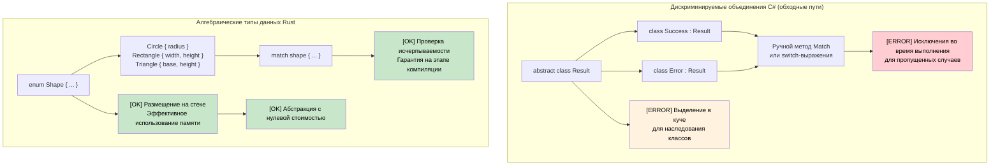

## Алгебраические типы данных против объединений C#

> **Что вы узнаете:** алгебраические типы данных Rust (перечисления с данными) в сравнении с ограниченными
> дискриминируемыми объединениями C#, выражения `match` с проверкой исчерпываемости, защитные условия (guards)
> и деструктуризацию вложенных паттернов.
>
> **Сложность:** 🟡 Средний

### Дискриминируемые объединения в C# (ограниченные)
```csharp
// C# — ограниченная поддержка объединений через наследование
public abstract class Result
{
    public abstract T Match<T>(Func<Success, T> onSuccess, Func<Error, T> onError);
}

public class Success : Result
{
    public string Value { get; }
    public Success(string value) => Value = value;
    
    public override T Match<T>(Func<Success, T> onSuccess, Func<Error, T> onError)
        => onSuccess(this);
}

public class Error : Result
{
    public string Message { get; }
    public Error(string message) => Message = message;
    
    public override T Match<T>(Func<Success, T> onSuccess, Func<Error, T> onError)
        => onError(this);
}

// Records с сопоставлением с образцом в C# 9+ (лучше)
public abstract record Shape;
public record Circle(double Radius) : Shape;
public record Rectangle(double Width, double Height) : Shape;

public static double Area(Shape shape) => shape switch
{
    Circle(var radius) => Math.PI * radius * radius,
    Rectangle(var width, var height) => width * height,
    _ => throw new ArgumentException("Unknown shape")  // [ERROR] Возможна ошибка времени выполнения
};
```

### Алгебраические типы данных Rust (перечисления)
```rust
// Rust — настоящие алгебраические типы данных с исчерпывающим сопоставлением с образцом
#[derive(Debug, Clone)]
pub enum Result<T, E> {
    Ok(T),
    Err(E),
}

#[derive(Debug, Clone)]
pub enum Shape {
    Circle { radius: f64 },
    Rectangle { width: f64, height: f64 },
    Triangle { base: f64, height: f64 },
}

impl Shape {
    pub fn area(&self) -> f64 {
        match self {
            Shape::Circle { radius } => std::f64::consts::PI * radius * radius,
            Shape::Rectangle { width, height } => width * height,
            Shape::Triangle { base, height } => 0.5 * base * height,
            // [OK] Ошибка компиляции, если какой-либо вариант пропущен!
        }
    }
}

// Продвинутый пример: перечисления могут хранить значения разных типов
#[derive(Debug)]
pub enum Value {
    Integer(i64),
    Float(f64),
    Text(String),
    Boolean(bool),
    List(Vec<Value>),  // Рекурсивные типы!
}

impl Value {
    pub fn type_name(&self) -> &'static str {
        match self {
            Value::Integer(_) => "integer",
            Value::Float(_) => "float",
            Value::Text(_) => "text",
            Value::Boolean(_) => "boolean",
            Value::List(_) => "list",
        }
    }
}
```



***

## Перечисления и сопоставление с образцом

Перечисления Rust намного мощнее перечислений C# — они могут хранить данные и составляют основу типобезопасного программирования.

### Ограничения перечислений C#
```csharp
// Перечисление C# — всего лишь именованные константы
public enum Status
{
    Pending,
    Approved,
    Rejected
}

// Перечисление C# с базовыми значениями
public enum HttpStatusCode
{
    OK = 200,
    NotFound = 404,
    InternalServerError = 500
}

// Для сложных данных нужны отдельные классы
public abstract class Result
{
    public abstract bool IsSuccess { get; }
}

public class Success : Result
{
    public string Value { get; }
    public override bool IsSuccess => true;
    
    public Success(string value)
    {
        Value = value;
    }
}

public class Error : Result
{
    public string Message { get; }
    public override bool IsSuccess => false;
    
    public Error(string message)
    {
        Message = message;
    }
}
```

### Мощь перечислений Rust
```rust
// Простое перечисление (как enum в C#)
#[derive(Debug, PartialEq)]
enum Status {
    Pending,
    Approved,
    Rejected,
}

// Перечисление с данными (здесь Rust раскрывается!)
#[derive(Debug)]
enum Result<T, E> {
    Ok(T),      // Вариант успеха, хранящий значение типа T
    Err(E),     // Вариант ошибки, хранящий ошибку типа E
}

// Сложное перечисление с данными разных типов
#[derive(Debug)]
enum Message {
    Quit,                       // Без данных
    Move { x: i32, y: i32 },   // Вариант в виде структуры
    Write(String),             // Вариант в виде кортежа
    ChangeColor(i32, i32, i32), // Несколько значений
}

// Пример из практики: HTTP-ответ
#[derive(Debug)]
enum HttpResponse {
    Ok { body: String, headers: Vec<String> },
    NotFound { path: String },
    InternalError { message: String, code: u16 },
    Redirect { location: String },
}
```

### Сопоставление с образцом через match
```csharp
// Оператор switch в C# (ограниченный)
public string HandleStatus(Status status)
{
    switch (status)
    {
        case Status.Pending:
            return "Waiting for approval";
        case Status.Approved:
            return "Request approved";
        case Status.Rejected:
            return "Request rejected";
        default:
            return "Unknown status"; // Всегда нужен default
    }
}

// Сопоставление с образцом в C# (C# 8+)
public string HandleResult(Result result)
{
    return result switch
    {
        Success success => $"Success: {success.Value}",
        Error error => $"Error: {error.Message}",
        _ => "Unknown result" // Всё равно нужен перехватывающий случай
    };
}
```

```rust
// match в Rust — исчерпывающий и мощный
fn handle_status(status: Status) -> String {
    match status {
        Status::Pending => "Waiting for approval".to_string(),
        Status::Approved => "Request approved".to_string(),
        Status::Rejected => "Request rejected".to_string(),
        // Default не нужен — компилятор гарантирует исчерпываемость
    }
}

// Сопоставление с образцом с извлечением данных
fn handle_result<T, E>(result: Result<T, E>) -> String 
where 
    T: std::fmt::Debug,
    E: std::fmt::Debug,
{
    match result {
        Result::Ok(value) => format!("Success: {:?}", value),
        Result::Err(error) => format!("Error: {:?}", error),
        // Исчерпывающе — default не нужен
    }
}

// Сложное сопоставление с образцом
fn handle_message(msg: Message) -> String {
    match msg {
        Message::Quit => "Goodbye!".to_string(),
        Message::Move { x, y } => format!("Move to ({}, {})", x, y),
        Message::Write(text) => format!("Write: {}", text),
        Message::ChangeColor(r, g, b) => format!("Change color to RGB({}, {}, {})", r, g, b),
    }
}

// Обработка HTTP-ответа
fn handle_http_response(response: HttpResponse) -> String {
    match response {
        HttpResponse::Ok { body, headers } => {
            format!("Success! Body: {}, Headers: {:?}", body, headers)
        },
        HttpResponse::NotFound { path } => {
            format!("404: Path '{}' not found", path)
        },
        HttpResponse::InternalError { message, code } => {
            format!("Error {}: {}", code, message)
        },
        HttpResponse::Redirect { location } => {
            format!("Redirect to: {}", location)
        },
    }
}
```

### Защитные условия и продвинутые паттерны
```rust
// Сопоставление с образцом с защитными условиями (guards)
fn describe_number(x: i32) -> String {
    match x {
        n if n < 0 => "negative".to_string(),
        0 => "zero".to_string(),
        n if n < 10 => "single digit".to_string(),
        n if n < 100 => "double digit".to_string(),
        _ => "large number".to_string(),
    }
}

// Сопоставление с диапазонами
fn describe_age(age: u32) -> String {
    match age {
        0..=12 => "child".to_string(),
        13..=19 => "teenager".to_string(),
        20..=64 => "adult".to_string(),
        65.. => "senior".to_string(),
    }
}

// Деструктуризация структур и кортежей
```

<details>
<summary><strong>🏋️ Упражнение: парсер команд</strong> (нажмите, чтобы раскрыть)</summary>

**Задача**: смоделируйте систему CLI-команд с помощью перечислений Rust. Разберите строку ввода в перечисление `Command` и выполните каждый вариант. Обработайте неизвестные команды с правильной обработкой ошибок.

```rust
// Стартовый код — заполните пропуски
#[derive(Debug)]
enum Command {
    // TODO: Добавьте варианты Quit, Echo(String), Move { x: i32, y: i32 }, Count(u32)
}

fn parse_command(input: &str) -> Result<Command, String> {
    let parts: Vec<&str> = input.splitn(2, ' ').collect();
    // TODO: сопоставьте parts[0] и разберите аргументы
    todo!()
}

fn execute(cmd: &Command) -> String {
    // TODO: сопоставьте каждый вариант и верните описание
    todo!()
}
```

<details>
<summary>🔑 Решение</summary>

```rust
#[derive(Debug)]
enum Command {
    Quit,
    Echo(String),
    Move { x: i32, y: i32 },
    Count(u32),
}

fn parse_command(input: &str) -> Result<Command, String> {
    let parts: Vec<&str> = input.splitn(2, ' ').collect();
    match parts[0] {
        "quit" => Ok(Command::Quit),
        "echo" => {
            let msg = parts.get(1).unwrap_or(&"").to_string();
            Ok(Command::Echo(msg))
        }
        "move" => {
            let args = parts.get(1).ok_or("move requires 'x y'")?;
            let coords: Vec<&str> = args.split_whitespace().collect();
            let x = coords.get(0).ok_or("missing x")?.parse::<i32>().map_err(|e| e.to_string())?;
            let y = coords.get(1).ok_or("missing y")?.parse::<i32>().map_err(|e| e.to_string())?;
            Ok(Command::Move { x, y })
        }
        "count" => {
            let n = parts.get(1).ok_or("count requires a number")?
                .parse::<u32>().map_err(|e| e.to_string())?;
            Ok(Command::Count(n))
        }
        other => Err(format!("Unknown command: {other}")),
    }
}

fn execute(cmd: &Command) -> String {
    match cmd {
        Command::Quit           => "Goodbye!".to_string(),
        Command::Echo(msg)      => msg.clone(),
        Command::Move { x, y }  => format!("Moving to ({x}, {y})"),
        Command::Count(n)       => format!("Counted to {n}"),
    }
}
```

**Ключевые выводы**:
- Каждый вариант перечисления может хранить разные данные — иерархии классов не нужны
- `match` заставляет обработать каждый вариант, что предотвращает забытые случаи
- Оператор `?` аккуратно связывает распространение ошибок — никаких вложенных try-catch

</details>
</details>


