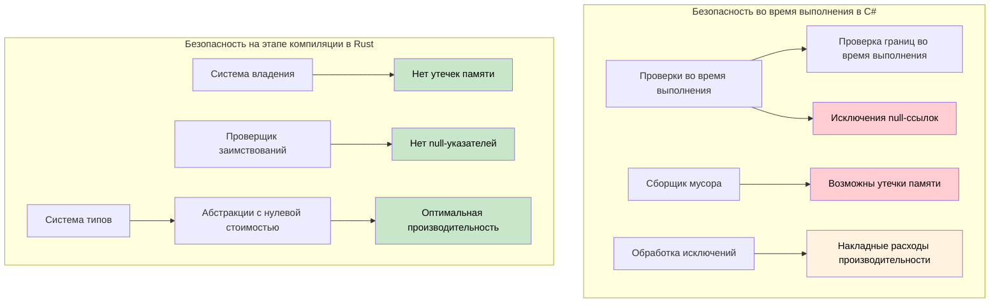

## Ссылки против указателей

> **Что вы узнаете:** ссылки Rust против указателей и небезопасных контекстов C#, основы времён жизни,
> а также почему доказательства безопасности на этапе компиляции надёжнее проверок времени выполнения в C#
> (проверка границ, защита от null).
>
> **Сложность:** 🟡 Средний

### Указатели в C# (небезопасный контекст)
```csharp
// Небезопасные указатели в C# (используются редко)
unsafe void UnsafeExample()
{
    int value = 42;
    int* ptr = &value;  // Указатель на value
    *ptr = 100;         // Разыменование и изменение
    Console.WriteLine(value);  // 100
}
```

### Ссылки в Rust (безопасны по умолчанию)
```rust
// Ссылки в Rust (всегда безопасны)
fn safe_example() {
    let mut value = 42;
    let ptr = &mut value;  // Изменяемая ссылка
    *ptr = 100;           // Разыменование и изменение
    println!("{}", value); // 100
}

// Ключевое слово "unsafe" не нужно — проверщик заимствований гарантирует безопасность
```

### Основы времён жизни для разработчиков C#
```csharp
// C# — можно вернуть ссылки, которые могут стать недействительными
public class LifetimeIssues
{
    public string GetFirstWord(string input)
    {
        return input.Split(' ')[0];  // Возвращает новую строку (безопасно)
    }
    
    public unsafe char* GetFirstChar(string input)
    {
        // Это было бы опасно — возврат указателя на управляемую память
        fixed (char* ptr = input)
            return ptr;  // ❌ Плохо: ptr становится недействительным после выхода из метода
    }
}
```

```rust
// Rust — проверка времён жизни предотвращает висячие ссылки
fn get_first_word(input: &str) -> &str {
    input.split_whitespace().next().unwrap_or("")
    // ✅ Безопасно: возвращаемая ссылка имеет то же время жизни, что и input
}

fn invalid_reference() -> &str {
    let temp = String::from("hello");
    &temp  // ❌ Ошибка компиляции: temp живёт недостаточно долго
    // temp будет уничтожена в конце функции
}

fn valid_reference() -> String {
    let temp = String::from("hello");
    temp  // ✅ Работает: владение передаётся вызывающему коду
}
```

***

## Безопасность памяти: проверки во время выполнения против доказательств на этапе компиляции

### C# — страховка времени выполнения
```csharp
// C# полагается на проверки во время выполнения и GC
public class Buffer
{
    private byte[] data;
    
    public Buffer(int size)
    {
        data = new byte[size];
    }
    
    public void ProcessData(int index)
    {
        // Проверка границ во время выполнения
        if (index >= data.Length)
            throw new IndexOutOfRangeException();
            
        data[index] = 42;  // Безопасно, но проверяется во время выполнения
    }
    
    // Утечки памяти всё равно возможны через события и статические ссылки
    public static event Action<string> GlobalEvent;
    
    public void Subscribe()
    {
        GlobalEvent += HandleEvent;  // Может создать утечку памяти
        // Забыли отписаться — объект не будет собран сборщиком мусора
    }
    
    private void HandleEvent(string message) { /* ... */ }
    
    // Исключения NullReferenceException по-прежнему возможны
    public void ProcessUser(User user)
    {
        Console.WriteLine(user.Name.ToUpper());  // NullReferenceException, если user.Name равен null
    }
    
    // Доступ к массиву может завершиться ошибкой во время выполнения
    public int GetValue(int[] array, int index)
    {
        return array[index];  // Возможно IndexOutOfRangeException
    }
}
```

### Rust — гарантии на этапе компиляции
```rust
struct Buffer {
    data: Vec<u8>,
}

impl Buffer {
    fn new(size: usize) -> Self {
        Buffer {
            data: vec![0; size],
        }
    }
    
    fn process_data(&mut self, index: usize) {
        // Проверку границ компилятор может убрать, если безопасность доказана
        if let Some(item) = self.data.get_mut(index) {
            *item = 42;  // Безопасный доступ, доказанный на этапе компиляции
        }
        // Или используйте индексирование с явной проверкой границ:
        // self.data[index] = 42;  // Паника в debug-сборке, но память в безопасности
    }
    
    // Утечки памяти невозможны — система владения их предотвращает
    fn process_with_closure<F>(&mut self, processor: F) 
    where F: FnOnce(&mut Vec<u8>)
    {
        processor(&mut self.data);
        // Когда processor выходит из области видимости, он автоматически очищается
        // Создать висячие ссылки или утечку памяти нельзя
    }
    
    // Разыменование null-указателей невозможно — null-указателей здесь нет!
    fn process_user(&self, user: &User) {
        println!("{}", user.name.to_uppercase());  // user.name не может быть null
    }
    
    // Доступ к массиву либо проверяется на границы, либо явно небезопасен
    fn get_value(array: &[i32], index: usize) -> Option<i32> {
        array.get(index).copied()  // Возвращает None, если индекс вне границ
    }
    
    // Или явно небезопасно, если вы точно знаете, что делаете:
    /// # Safety
    /// `index` должен быть меньше `array.len()`.
    unsafe fn get_value_unchecked(array: &[i32], index: usize) -> i32 {
        *array.get_unchecked(index)  // Быстро, но границы нужно доказать вручную
    }
}

struct User {
    name: String,  // String в Rust не может быть null
}

// Владение предотвращает использование после освобождения
fn ownership_example() {
    let data = vec![1, 2, 3, 4, 5];
    let reference = &data[0];  // Заимствуем data
    
    // drop(data);  // ОШИБКА: нельзя уничтожить, пока есть заимствование
    println!("{}", reference);  // Это гарантированно безопасно
}

// Заимствование предотвращает гонки данных
fn borrowing_example(data: &mut Vec<i32>) {
    let first = &data[0];  // Неизменяемое заимствование
    // data.push(6);  // ОШИБКА: нельзя заимствовать изменяемо, пока есть неизменяемое заимствование
    println!("{}", first);  // Гарантированно нет гонки данных
}
```



---

## Упражнения

<details>
<summary><strong>🏋️ Упражнение: найдите ошибку безопасности</strong> (нажмите, чтобы раскрыть)</summary>

В этом C#-коде есть тонкая ошибка безопасности. Найдите её, затем напишите эквивалент на Rust и объясните, почему версия на Rust **не скомпилируется**:

```csharp
public List<int> GetEvenNumbers(List<int> numbers)
{
    var result = new List<int>();
    foreach (var n in numbers)
    {
        if (n % 2 == 0)
        {
            result.Add(n);
            numbers.Remove(n);  // Ошибка: изменение коллекции во время перебора
        }
    }
    return result;
}
```

<details>
<summary>🔑 Решение</summary>

**Ошибка в C#**: изменение `numbers` во время перебора приводит к `InvalidOperationException` во *время выполнения*. Её легко пропустить на код-ревью.

```rust
fn get_even_numbers(numbers: &mut Vec<i32>) -> Vec<i32> {
    let mut result = Vec::new();
    for &n in numbers.iter() {
        if n % 2 == 0 {
            result.push(n);
            // numbers.retain(|&x| x != n);
            // ❌ ОШИБКА: нельзя заимствовать `*numbers` как изменяемое, потому что
            //    оно уже заимствовано как неизменяемое (итератором)
        }
    }
    result
}

// Идиоматичный Rust: используйте retain или partition
fn get_even_numbers_idiomatic(numbers: &mut Vec<i32>) -> Vec<i32> {
    let evens: Vec<i32> = numbers.iter().copied().filter(|n| n % 2 == 0).collect();
    numbers.retain(|n| n % 2 != 0); // удаляем чётные после перебора
    evens
}

fn main() {
    let mut nums = vec![1, 2, 3, 4, 5, 6];
    let evens = get_even_numbers_idiomatic(&mut nums);
    assert_eq!(evens, vec![2, 4, 6]);
    assert_eq!(nums, vec![1, 3, 5]);
}
```

**Ключевая мысль**: проверщик заимствований Rust предотвращает целую *категорию* ошибок «изменение во время перебора» на этапе компиляции. C# ловит это во время выполнения; многие языки не ловят вообще.

</details>
</details>

***

