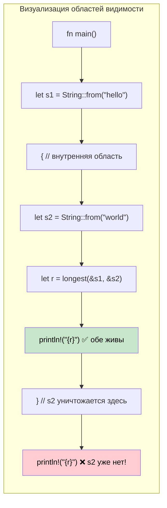

## Времена жизни: как сообщить компилятору, сколько живут ссылки

> **Что вы узнаете:** зачем нужны времена жизни (без GC компилятору нужно доказательство), синтаксис аннотаций времён жизни,
> правила элизии, времена жизни в структурах, время жизни `'static`, а также типичные ошибки проверщика заимствований и способы их исправить.
>
> **Сложность:** 🔴 Продвинутый

Разработчики C# никогда не думают о временах жизни ссылок — достижимостью занимается сборщик мусора. В Rust компилятору нужно *доказательство* того, что каждая ссылка действительна столько, сколько она используется. Времена жизни и есть это доказательство.

### Зачем нужны времена жизни
```rust
// Этот код не скомпилируется — компилятор не может доказать, что возвращаемая ссылка действительна
fn longest(a: &str, b: &str) -> &str {
    if a.len() > b.len() { a } else { b }
}
// ОШИБКА: пропущен specifier времени жизни — компилятор не знает,
// заимствует ли возвращаемое значение из `a` или из `b`
```

### Аннотации времён жизни
```rust
// Время жизни 'a означает: «возвращаемое значение живёт не меньше, чем ОБА входных параметра»
fn longest<'a>(a: &'a str, b: &'a str) -> &'a str {
    if a.len() > b.len() { a } else { b }
}

fn main() {
    let result;
    let string1 = String::from("long string");
    {
        let string2 = String::from("xyz");
        result = longest(&string1, &string2);
        println!("Longest: {result}"); // ✅ обе ссылки здесь ещё действительны
    }
    // println!("{result}"); // ❌ ОШИБКА: string2 живёт недостаточно долго
}
```

### Сравнение с C#
```csharp
// C# — GC держит объекты живыми, пока существует хотя бы одна ссылка
string Longest(string a, string b) => a.Length > b.Length ? a : b;

// Проблем с временами жизни нет — GC сам отслеживает достижимость
// Но: паузы GC, непредсказуемое потребление памяти, нет доказательств на этапе компиляции
```

### Правила элизии времён жизни

В большинстве случаев аннотации времён жизни **писать не нужно**. Компилятор применяет три правила автоматически:

| Правило | Описание | Пример |
|------|-------------|---------|
| **Правило 1** | Каждый параметр-ссылка получает собственное время жизни | `fn foo(x: &str, y: &str)` → `fn foo<'a, 'b>(x: &'a str, y: &'b str)` |
| **Правило 2** | Если есть ровно одно входное время жизни, оно присваивается всем выходным | `fn first(s: &str) -> &str` → `fn first<'a>(s: &'a str) -> &'a str` |
| **Правило 3** | Если один из входов — `&self` или `&mut self`, его время жизни присваивается всем выходным | `fn name(&self) -> &str` → работает благодаря &self |

```rust
// Эти записи эквивалентны — компилятор добавляет времена жизни автоматически:
fn first_word(s: &str) -> &str { /* ... */ }           // с элизией
fn first_word<'a>(s: &'a str) -> &'a str { /* ... */ } // явно

// А вот здесь нужна явная аннотация — два входа, из какого из них заимствует выход?
fn longest<'a>(a: &'a str, b: &'a str) -> &'a str { /* ... */ }
```

### Времена жизни в структурах
```rust
// Структура, которая заимствует данные (а не владеет ими)
struct Excerpt<'a> {
    text: &'a str,  // заимствует из String, которая должна пережить эту структуру
}

impl<'a> Excerpt<'a> {
    fn new(text: &'a str) -> Self {
        Excerpt { text }
    }

    fn first_sentence(&self) -> &str {
        self.text.split('.').next().unwrap_or(self.text)
    }
}

fn main() {
    let novel = String::from("Call me Ishmael. Some years ago...");
    let excerpt = Excerpt::new(&novel); // excerpt заимствует из novel
    println!("First sentence: {}", excerpt.first_sentence());
    // novel должен жить, пока существует excerpt
}
```

```csharp
// Аналог в C# — проблем с временами жизни нет, но и гарантий на этапе компиляции нет
class Excerpt
{
    public string Text { get; }
    public Excerpt(string text) => Text = text;
    public string FirstSentence() => Text.Split('.')[0];
}
// Что если строку изменят где-то в другом месте? Сюрприз во время выполнения.
```

### Время жизни `'static`
```rust
// 'static означает «живёт всё время работы программы»
let s: &'static str = "I'm a string literal"; // хранится в бинарнике, всегда действителен

// Типичные места, где встречается 'static:
// 1. Строковые литералы
// 2. Глобальные константы
// 3. Thread::spawn требует 'static (поток может пережить вызывающий код)
std::thread::spawn(move || {
    // Замыкания, передаваемые в потоки, должны владеть своими данными или использовать ссылки 'static
    println!("{s}"); // OK: &'static str
});

// 'static НЕ означает «бессмертный» — это значит «МОЖЕТ жить вечно, если потребуется»
let owned = String::from("hello");
// owned не имеет времени жизни 'static, но его можно переместить в поток (передача владения)
```

### Типичные ошибки проверщика заимствований и их исправление

| Ошибка | Причина | Исправление |
|-------|-------|-------|
| `missing lifetime specifier` | Несколько входных ссылок, неоднозначный выход | Добавьте `<'a>`, связав выход с нужным входом |
| `does not live long enough` | Ссылка переживает данные, на которые указывает | Расширьте область видимости данных или верните владеемые данные |
| `cannot borrow as mutable` | Неизменяемое заимствование ещё активно | Используйте неизменяемую ссылку до изменения или перестройте код |
| `cannot move out of borrowed content` | Попытка забрать владение заимствованными данными | Используйте `.clone()` или перестройте код, чтобы избежать перемещения |
| `lifetime may not live long enough` | Заимствование структуры переживает источник | Убедитесь, что область видимости исходных данных охватывает использование структуры |

### Визуализация областей видимости времён жизни



### Несколько параметров времени жизни

Иногда ссылки приходят из разных источников с разными временами жизни:

```rust
// Два независимых времени жизни: результат заимствует только из 'a, а не из 'b
fn first_with_context<'a, 'b>(data: &'a str, _context: &'b str) -> &'a str {
    // Результат заимствуется только из 'data' — у 'context' может быть более короткое время жизни
    data.split(',').next().unwrap_or(data)
}

fn main() {
    let data = String::from("alice,bob,charlie");
    let result;
    {
        let context = String::from("user lookup"); // более короткое время жизни
        result = first_with_context(&data, &context);
    } // context уничтожается — но result заимствует из data, а не из context ✅
    println!("{result}");
}
```

```csharp
// C# — без отслеживания времён жизни нельзя выразить «заимствует из A, но не из B»
string FirstWithContext(string data, string context) => data.Split(',')[0];
// Для языков с GC это нормально, но Rust может доказать безопасность без GC
```

### Типичные паттерны из практики

**Паттерн 1: итератор, возвращающий ссылки**
```rust
// Парсер, который отдаёт заимствованные срезы из входной строки
struct CsvRow<'a> {
    fields: Vec<&'a str>,
}

fn parse_csv_line(line: &str) -> CsvRow<'_> {
    // '_ говорит компилятору «выведи время жизни из входного параметра»
    CsvRow {
        fields: line.split(',').collect(),
    }
}
```

**Паттерн 2: «если сомневаешься — возвращай владеемые данные»**
```rust
// Когда времена жизни становятся сложными, практичное решение — вернуть владеемые данные
fn format_greeting(first: &str, last: &str) -> String {
    // Возвращаем владеемую String — аннотация времени жизни не нужна
    format!("Hello, {first} {last}!")
}

// Заимствуйте только тогда, когда:
// 1. Важна производительность (избегаем выделения памяти)
// 2. Связь между временем жизни входа и выхода очевидна
```

**Паттерн 3: ограничения времён жизни для обобщений**
```rust
// «T должен жить не меньше, чем 'a»
fn store_reference<'a, T: 'a>(cache: &mut Vec<&'a T>, item: &'a T) {
    cache.push(item);
}

// Часто встречается в трейт-объектах: Box<dyn Display + 'a>
fn make_printer<'a>(text: &'a str) -> Box<dyn std::fmt::Display + 'a> {
    Box::new(text)
}
```

### Когда использовать `'static`

| Сценарий | Использовать `'static`? | Альтернатива |
|----------|:-----------:|-------------|
| Строковые литералы | ✅ Да — они всегда `'static` | — |
| Замыкание для `thread::spawn` | Часто — поток переживает вызывающий код | Используйте `thread::scope` для заимствованных данных |
| Глобальная конфигурация | ✅ `lazy_static!` или `OnceLock` | Передавайте ссылки через параметры |
| Трейт-объекты, которые хранятся долго | Часто — `Box<dyn Trait + 'static>` | Параметризуйте контейнер через `'a` |
| Временные заимствования | ❌ Никогда — излишнее ограничение | Используйте реальное время жизни |

<details>
<summary><strong>🏋️ Упражнение: аннотации времён жизни</strong> (нажмите, чтобы раскрыть)</summary>

**Задача**: добавьте правильные аннотации времён жизни, чтобы код скомпилировался:

```rust
struct Config {
    db_url: String,
    api_key: String,
}

// TODO: Добавьте аннотации времён жизни
fn get_connection_info(config: &Config) -> (&str, &str) {
    (&config.db_url, &config.api_key)
}

// TODO: Эта структура заимствует из Config — добавьте параметр времени жизни
struct ConnectionInfo {
    db_url: &str,
    api_key: &str,
}
```

<details>
<summary>🔑 Решение</summary>

```rust
struct Config {
    db_url: String,
    api_key: String,
}

// Правило 3 не применяется (нет &self), применяется правило 2 (один вход → выход)
// Поэтому компилятор справляется сам — аннотация не нужна!
fn get_connection_info(config: &Config) -> (&str, &str) {
    (&config.db_url, &config.api_key)
}

// Аннотация времени жизни для структуры нужна:
struct ConnectionInfo<'a> {
    db_url: &'a str,
    api_key: &'a str,
}

fn make_info<'a>(config: &'a Config) -> ConnectionInfo<'a> {
    ConnectionInfo {
        db_url: &config.db_url,
        api_key: &config.api_key,
    }
}
```

**Ключевая мысль**: элизия времён жизни часто избавляет от необходимости писать аннотации у функций, но структуры, которые заимствуют данные, всегда требуют явного `<'a>`.

</details>
</details>

***


