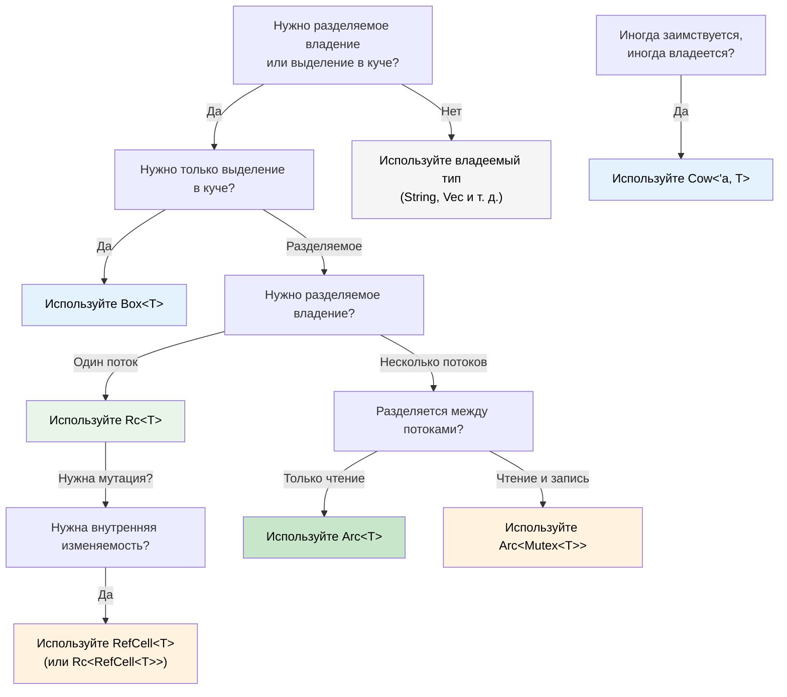

## Умные указатели: когда единоличного владения недостаточно

> **Что вы узнаете:** `Box<T>`, `Rc<T>`, `Arc<T>`, `Cell<T>`, `RefCell<T>` и `Cow<'a, T>` —
> когда что использовать, как они соотносятся со ссылками, которыми управляет GC в C#, `Drop` как аналог `IDisposable` в Rust,
> приведение через `Deref`, а также дерево решений для выбора подходящего умного указателя.
>
> **Сложность:** 🔴 Продвинутый

В C# каждый объект по сути подсчитывается сборщиком мусора. В Rust по умолчанию действует единоличное владение, но иногда нужны разделяемое владение, выделение в куче или внутренняя изменяемость. Для этого и существуют умные указатели.

### Box&lt;T&gt; — простое выделение в куче
```rust
// Выделение на стеке (по умолчанию в Rust)
let x = 42;           // на стеке

// Выделение в куче через Box
let y = Box::new(42); // в куче, как `new int(42)` в C# (упаковка)
println!("{}", y);     // автоматическое разыменование: выводит 42

// Типичное применение: рекурсивные типы (размер неизвестен на этапе компиляции)
#[derive(Debug)]
enum List {
    Cons(i32, Box<List>),  // Box даёт указатель известного размера
    Nil,
}

let list = List::Cons(1, Box::new(List::Cons(2, Box::new(List::Nil))));
```

```csharp
// C# — всё уже в куче (ссылочные типы)
// Box<T> нужен в Rust только потому, что стек — это умолчание
var list = new LinkedListNode<int>(1);  // всегда выделяется в куче
```

### Rc&lt;T&gt; — разделяемое владение (один поток)
```rust
use std::rc::Rc;

// Несколько владельцев одних и тех же данных — как несколько ссылок в C#
let shared = Rc::new(vec![1, 2, 3]);
let clone1 = Rc::clone(&shared); // счётчик ссылок: 2
let clone2 = Rc::clone(&shared); // счётчик ссылок: 3

println!("Count: {}", Rc::strong_count(&shared)); // 3
// Данные уничтожаются, когда выходит из области видимости последний Rc

// Типичное применение: общая конфигурация, узлы графа, древовидные структуры
```

### Arc&lt;T&gt; — разделяемое владение (потокобезопасное)
```rust
use std::sync::Arc;
use std::thread;

// Arc = Atomic Reference Counting — безопасно разделяется между потоками
let data = Arc::new(vec![1, 2, 3]);

let handles: Vec<_> = (0..3).map(|i| {
    let data = Arc::clone(&data);
    thread::spawn(move || {
        println!("Thread {i}: {:?}", data);
    })
}).collect();

for h in handles { h.join().unwrap(); }
```

```csharp
// C# — все ссылки потокобезопасны по умолчанию (этим занимается GC)
var data = new List<int> { 1, 2, 3 };
// Можно свободно разделять между потоками (но мутация по-прежнему небезопасна!)
```

### Cell&lt;T&gt; и RefCell&lt;T&gt; — внутренняя изменяемость
```rust
use std::cell::RefCell;

// Иногда нужно изменять данные за разделяемой ссылкой.
// RefCell переносит проверку заимствований из времени компиляции во время выполнения.
struct Logger {
    entries: RefCell<Vec<String>>,
}

impl Logger {
    fn new() -> Self {
        Logger { entries: RefCell::new(Vec::new()) }
    }

    fn log(&self, msg: &str) { // &self, а не &mut self!
        self.entries.borrow_mut().push(msg.to_string());
    }

    fn dump(&self) {
        for entry in self.entries.borrow().iter() {
            println!("{entry}");
        }
    }
}
// ⚠️ RefCell вызывает панику во время выполнения, если нарушены правила заимствования
// Используйте осторожно — по возможности предпочитайте проверку на этапе компиляции
```

### Cow&lt;'a, str&gt; — копирование при записи (Clone on Write)
```rust
use std::borrow::Cow;

// Иногда есть &str, который МОЖЕТ понадобиться превратить в String
fn normalize(input: &str) -> Cow<'_, str> {
    if input.contains('\t') {
        // Выделяем память, только когда нужно изменить данные
        Cow::Owned(input.replace('\t', "    "))
    } else {
        // Заимствуем исходные данные — без выделения памяти
        Cow::Borrowed(input)
    }
}

let clean = normalize("hello");           // Cow::Borrowed — без выделения памяти
let dirty = normalize("hello\tworld");    // Cow::Owned — выделено
// Оба можно использовать как &str через Deref
println!("{clean} / {dirty}");
```

### Drop: аналог `IDisposable` в Rust

В C# очисткой ресурсов занимаются `IDisposable` и `using`. Аналог в Rust — трейт `Drop`, но он **автоматический**, а не включаемый по желанию:

```csharp
// C# — нужно не забыть использовать 'using' или вызвать Dispose()
using var file = File.OpenRead("data.bin");
// Dispose() вызывается в конце области видимости

// Забыть 'using' — значит получить утечку ресурса!
var file2 = File.OpenRead("data.bin");
// GC в итоге финализирует объект, но момент непредсказуем
```

```rust
// Rust — Drop выполняется автоматически, когда значение выходит из области видимости
{
    let file = File::open("data.bin")?;
    // работаем с file...
}   // file.drop() вызывается ЗДЕСЬ, детерминированно — 'using' не нужен

// Собственный Drop (аналог реализации IDisposable)
struct TempFile {
    path: std::path::PathBuf,
}

impl Drop for TempFile {
    fn drop(&mut self) {
        // Гарантированно выполняется, когда TempFile выходит из области видимости
        let _ = std::fs::remove_file(&self.path);
        println!("Cleaned up {:?}", self.path);
    }
}

fn main() {
    let tmp = TempFile { path: "scratch.tmp".into() };
    // ... используем tmp ...
}   // scratch.tmp удаляется автоматически здесь
```

**Ключевое отличие от C#:** в Rust *любой* тип может иметь детерминированную очистку. Вы никогда не забудете `using`, потому что забывать нечего — `Drop` выполняется, когда владелец выходит из области видимости. Этот паттерн называется **RAII** (Resource Acquisition Is Initialization — получение ресурса есть инициализация).

> **Правило**: если ваш тип хранит ресурс (дескриптор файла, сетевое соединение, охранник блокировки, временный файл), реализуйте `Drop`. Система владения гарантирует, что он выполнится ровно один раз.

### Приведение через Deref: автоматическое разворачивание умных указателей

Rust автоматически «разворачивает» умные указатели, когда вы вызываете методы или передаёте их в функции. Это называется **приведением через Deref** (Deref coercion):

```rust
let boxed: Box<String> = Box::new(String::from("hello"));

// Цепочка приведения через Deref: Box<String> → String → str
println!("Length: {}", boxed.len());   // вызывается str::len() — автоматическое разыменование!

fn greet(name: &str) {
    println!("Hello, {name}");
}

let s = String::from("Alice");
greet(&s);       // &String → &str через приведение Deref
greet(&boxed);   // &Box<String> → &String → &str — два уровня!
```

```csharp
// В C# аналога нет — понадобились бы явные приведения или .ToString()
// Ближайшее — неявные операторы преобразования, но их нужно явно определить
```

**Почему это важно:** вы можете передать `&String` там, где ожидается `&str`, `&Vec<T>` там, где ожидается `&[T]`, и `&Box<T>` там, где ожидается `&T`, — и всё это без явного преобразования. Поэтому API на Rust обычно принимают `&str` и `&[T]`, а не `&String` и `&Vec<T>`.

### Rc против Arc: что выбрать

| | `Rc<T>` | `Arc<T>` |
|---|---|---|
| **Потокобезопасность** | ❌ Только один поток | ✅ Потокобезопасен (атомарные операции) |
| **Накладные расходы** | Ниже (неатомарный счётчик ссылок) | Выше (атомарный счётчик ссылок) |
| **Проверка компилятором** | Не скомпилируется при передаче в `thread::spawn` | Работает везде |
| **Сочетается с** | `RefCell<T>` для изменения | `Mutex<T>` или `RwLock<T>` для изменения |

**Эмпирическое правило:** начинайте с `Rc`. Компилятор подскажет, если понадобится `Arc`.

### Дерево решений: какой умный указатель выбрать?



<details>
<summary><strong>🏋️ Упражнение: выберите подходящий умный указатель</strong> (нажмите, чтобы раскрыть)</summary>

**Задача**: для каждого сценария выберите подходящий умный указатель и объясните почему.

1. Рекурсивная древовидная структура данных
2. Общий объект конфигурации, который читают несколько компонентов (один поток)
3. Счётчик запросов, разделяемый между обработчиками HTTP-запросов в разных потоках
4. Кэш, который может возвращать заимствованные или владеемые строки
5. Буфер логов, который нужно изменять через разделяемую ссылку

<details>
<summary>🔑 Решение</summary>

1. **`Box<T>`** — рекурсивным типам нужна косвенная адресация, чтобы размер был известен на этапе компиляции
2. **`Rc<T>`** — разделяемый доступ только для чтения, один поток, накладные расходы `Arc` не нужны
3. **`Arc<Mutex<u64>>`** — разделяется между потоками (`Arc`) с изменением (`Mutex`)
4. **`Cow<'a, str>`** — иногда возвращает `&str` (попадание в кэш), иногда `String` (промах кэша)
5. **`RefCell<Vec<String>>`** — внутренняя изменяемость за `&self` (один поток)

**Эмпирическое правило**: начинайте с владеемых типов. Берите `Box`, когда нужна косвенная адресация, `Rc`/`Arc`, когда нужно разделение, `RefCell`/`Mutex`, когда нужна внутренняя изменяемость, и `Cow`, когда хотите работать без копирования в типичном случае.

</details>
</details>

***

