```mermaid
graph TD
    subgraph "Управление памятью в C#"
        CS_ALLOC["Выделение объекта<br/>new Person()"]
        CS_HEAP["Управляемая куча"]
        CS_REF["Ссылки указывают на кучу"]
        CS_GC_CHECK["GC периодически проверяет<br/>недостижимые объекты"]
        CS_SWEEP["Сборка по принципу<br/>mark and sweep"]
        CS_PAUSE["[ERROR] Паузы GC"]
        
        CS_ALLOC --> CS_HEAP
        CS_HEAP --> CS_REF
        CS_REF --> CS_GC_CHECK
        CS_GC_CHECK --> CS_SWEEP
        CS_SWEEP --> CS_PAUSE
        
        CS_ISSUES["[ERROR] Недетерминированная очистка<br/>[ERROR] Давление на память<br/>[ERROR] Сложность финализации<br/>[OK] Легко использовать"]
    end
    
    subgraph "Система владения Rust"
        RUST_ALLOC["Создание значения<br/>Person { ... }"]
        RUST_OWNER["Единственный владелец<br/>на стеке или в куче"]
        RUST_BORROW["Система заимствований<br/>&T, &mut T"]
        RUST_SCOPE["Очистка по области видимости<br/>трейт Drop"]
        RUST_COMPILE["Проверка на этапе компиляции"]
        
        RUST_ALLOC --> RUST_OWNER
        RUST_OWNER --> RUST_BORROW
        RUST_BORROW --> RUST_SCOPE
        RUST_SCOPE --> RUST_COMPILE
        
        RUST_BENEFITS["[OK] Детерминированная очистка<br/>[OK] Нулевые накладные расходы рантайма<br/>[OK] Никаких утечек памяти<br/>[ERROR] Кривая обучения"]
    end
    
    style CS_ISSUES fill:#ffebee,color:#000
    style RUST_BENEFITS fill:#e8f5e8,color:#000
    style CS_PAUSE fill:#ffcdd2,color:#000
    style RUST_COMPILE fill:#c8e6c9,color:#000
```

## Понимание владения

> **Что вы узнаете:** систему владения Rust — почему `let s2 = s1` делает `s1` недействительным (в отличие от копирования ссылок в C#),
> три правила владения, типы `Copy` и `Move`, заимствование через `&` и `&mut`,
> а также то, как проверщик заимствований заменяет сборку мусора.
>
> **Сложность:** 🟡 Средний

Владение — самая уникальная особенность Rust и самый большой концептуальный сдвиг для разработчиков C#. Разберём её шаг за шагом.

### Модель памяти C# (повторение)
```csharp
// C# — автоматическое управление памятью
public void ProcessData()
{
    var data = new List<int> { 1, 2, 3, 4, 5 };
    ProcessList(data);
    // data здесь по-прежнему доступен
    Console.WriteLine(data.Count);  // Работает нормально
    
    // GC очистит память, когда не останется ссылок
}

public void ProcessList(List<int> list)
{
    list.Add(6);  // Изменяет исходный список
}
```

### Правила владения в Rust
1. **У каждого значения ровно один владелец** (если вы не выберете разделяемое владение через `Rc<T>`/`Arc<T>` — см. [Умные указатели](ch07-3-smart-pointers-beyond-single-ownership.md))
2. **Когда владелец выходит из области видимости, значение уничтожается** (детерминированная очистка — см. [Drop](ch07-3-smart-pointers-beyond-single-ownership.md#drop-rusts-idisposable))
3. **Владение можно передать (переместить)**

```rust
// Rust — явное управление владением
fn process_data() {
    let data = vec![1, 2, 3, 4, 5];  // data владеет вектором
    process_list(data);              // Владение передано функции
    // println!("{:?}", data);       // ❌ Ошибка: data здесь больше не владеет значением
}

fn process_list(mut list: Vec<i32>) {  // list теперь владеет вектором
    list.push(6);
    // list уничтожается здесь, при завершении функции
}
```

### Понятие «перемещения» для разработчиков C#
```csharp
// C# — ссылки копируются, объекты остаются на месте
// (так работают только ссылочные типы — классы;
//  значимые типы C#, такие как struct, ведут себя иначе)
var original = new List<int> { 1, 2, 3 };
var reference = original;  // Обе переменные указывают на один объект
original.Add(4);
Console.WriteLine(reference.Count);  // 4 — тот же объект
```

```rust
// Rust — владение передаётся
let original = vec![1, 2, 3];
let moved = original;       // Владение передано
// println!("{:?}", original);  // ❌ Ошибка: original больше не владеет данными
println!("{:?}", moved);    // ✅ Работает: moved теперь владеет данными
```

### Типы Copy и типы Move
```rust
// Типы Copy (как значимые типы в C#) — копируются, а не перемещаются
let x = 5;        // i32 реализует Copy
let y = x;        // x копируется в y
println!("{}", x); // ✅ Работает: x по-прежнему действителен

// Типы Move (как ссылочные типы в C#) — перемещаются, а не копируются
let s1 = String::from("hello");  // String не реализует Copy
let s2 = s1;                     // s1 перемещается в s2
// println!("{}", s1);           // ❌ Ошибка: s1 больше не действителен
```

### Практический пример: обмен значениями
```csharp
// C# — простой обмен ссылками
public void SwapLists(ref List<int> a, ref List<int> b)
{
    var temp = a;
    a = b;
    b = temp;
}
```

```rust
// Rust — обмен с учётом владения
fn swap_vectors(a: &mut Vec<i32>, b: &mut Vec<i32>) {
    std::mem::swap(a, b);  // Встроенная функция обмена
}

// Или ручной вариант
fn manual_swap() {
    let mut a = vec![1, 2, 3];
    let mut b = vec![4, 5, 6];
    
    let temp = a;  // Перемещаем a во временную переменную
    a = b;         // Перемещаем b в a
    b = temp;      // Перемещаем temp в b
    
    println!("a: {:?}, b: {:?}", a, b);
}
```

***

## Основы заимствования

Заимствование похоже на получение ссылки в C#, но с гарантиями безопасности на этапе компиляции.

### Ссылочные параметры в C#
```csharp
// C# — параметры ref и out
public void ModifyValue(ref int value)
{
    value += 10;
}

public void ReadValue(in int value)  // ссылка только для чтения
{
    Console.WriteLine(value);
}

public bool TryParse(string input, out int result)
{
    return int.TryParse(input, out result);
}
```

### Заимствование в Rust
```rust
// Rust — заимствование через & и &mut
fn modify_value(value: &mut i32) {  // Изменяемое заимствование
    *value += 10;
}

fn read_value(value: &i32) {        // Неизменяемое заимствование
    println!("{}", value);
}

fn main() {
    let mut x = 5;
    
    read_value(&x);      // Заимствуем неизменяемо
    modify_value(&mut x); // Заимствуем изменяемо
    
    println!("{}", x);   // x по-прежнему принадлежит нам
}
```

### Правила заимствования (проверяются на этапе компиляции!)
```rust
fn borrowing_rules() {
    let mut data = vec![1, 2, 3];
    
    // Правило 1: несколько неизменяемых заимствований допустимы
    let r1 = &data;
    let r2 = &data;
    println!("{:?} {:?}", r1, r2);  // ✅ Работает
    
    // Правило 2: одновременно — только одно изменяемое заимствование
    let r3 = &mut data;
    // let r4 = &mut data;  // ❌ Ошибка: нельзя заимствовать изменяемо дважды
    // let r5 = &data;      // ❌ Ошибка: нельзя заимствовать неизменяемо, пока есть изменяемое заимствование
    
    r3.push(4);  // Используем изменяемое заимствование
    // r3 выходит из области видимости здесь
    
    // Правило 3: можно заимствовать снова после окончания предыдущих заимствований
    let r6 = &data;  // ✅ Теперь работает
    println!("{:?}", r6);
}
```

### C# против Rust: безопасность ссылок
```csharp
// C# — возможны ошибки времени выполнения
public class ReferenceSafety
{
    private List<int> data = new List<int>();
    
    public List<int> GetData() => data;  // Возвращает ссылку на внутреннее состояние
    
    public void UnsafeExample()
    {
        var reference = GetData();
        
        // Другой поток может изменить data прямо здесь!
        Thread.Sleep(1000);
        
        // reference может быть недействительным или изменённым
        reference.Add(42);  // Возможное состояние гонки
    }
}
```

```rust
// Rust — безопасность на этапе компиляции
pub struct SafeContainer {
    data: Vec<i32>,
}

impl SafeContainer {
    // Возвращаем неизменяемое заимствование — вызывающий код не может изменить данные
    // Предпочитайте &[i32] вместо &Vec<i32> — принимайте самый широкий тип
    pub fn get_data(&self) -> &[i32] {
        &self.data
    }
    
    // Возвращаем изменяемое заимствование — эксклюзивный доступ гарантирован
    pub fn get_data_mut(&mut self) -> &mut Vec<i32> {
        &mut self.data
    }
}

fn safe_example() {
    let mut container = SafeContainer { data: vec![1, 2, 3] };
    
    let reference = container.get_data();
    // container.get_data_mut();  // ❌ Ошибка: нельзя заимствовать изменяемо, пока есть неизменяемое заимствование
    
    println!("{:?}", reference);  // Используем неизменяемую ссылку
    // reference выходит из области видимости здесь
    
    let mut_reference = container.get_data_mut();  // ✅ Теперь можно
    mut_reference.push(4);
}
```

***

## Семантика перемещения

### Значимые и ссылочные типы в C#
```csharp
// C# — значимые типы копируются
struct Point
{
    public int X { get; set; }
    public int Y { get; set; }
}

var p1 = new Point { X = 1, Y = 2 };
var p2 = p1;  // Копирование
p2.X = 10;
Console.WriteLine(p1.X);  // По-прежнему 1

// C# — ссылочные типы разделяют объект
var list1 = new List<int> { 1, 2, 3 };
var list2 = list1;  // Копирование ссылки
list2.Add(4);
Console.WriteLine(list1.Count);  // 4 — тот же объект
```

### Семантика перемещения в Rust
```rust
// Rust — по умолчанию перемещение для типов, не реализующих Copy
#[derive(Debug)]
struct Point {
    x: i32,
    y: i32,
}

fn move_example() {
    let p1 = Point { x: 1, y: 2 };
    let p2 = p1;  // Перемещение (не копирование)
    // println!("{:?}", p1);  // ❌ Ошибка: p1 перемещён
    println!("{:?}", p2);    // ✅ Работает
}

// Чтобы включить копирование, реализуйте трейт Copy
#[derive(Debug, Copy, Clone)]
struct CopyablePoint {
    x: i32,
    y: i32,
}

fn copy_example() {
    let p1 = CopyablePoint { x: 1, y: 2 };
    let p2 = p1;  // Копирование (потому что реализован Copy)
    println!("{:?}", p1);  // ✅ Работает
    println!("{:?}", p2);  // ✅ Работает
}
```

### Когда значения перемещаются
```rust
fn demonstrate_moves() {
    let s = String::from("hello");
    
    // 1. Присваивание перемещает
    let s2 = s;  // s перемещается в s2
    
    // 2. Вызовы функций перемещают
    take_ownership(s2);  // s2 перемещается в функцию
    
    // 3. Возврат из функций перемещает
    let s3 = give_ownership();  // Возвращаемое значение перемещается в s3
    
    println!("{}", s3);  // s3 действителен
}

fn take_ownership(s: String) {
    println!("{}", s);
    // s уничтожается здесь
}

fn give_ownership() -> String {
    String::from("yours")  // Владение перемещается к вызывающему коду
}
```

### Избегаем перемещений с помощью заимствования
```rust
fn demonstrate_borrowing() {
    let s = String::from("hello");
    
    // Заимствуем вместо перемещения
    let len = calculate_length(&s);  // s заимствуется
    println!("'{}' has length {}", s, len);  // s по-прежнему действителен
}

fn calculate_length(s: &String) -> usize {
    s.len()  // s не принадлежит нам, поэтому не уничтожается
}
```

***

## Управление памятью: GC против RAII

### Сборка мусора в C#
```csharp
// C# — автоматическое управление памятью
public class Person
{
    public string Name { get; set; }
    public List<string> Hobbies { get; set; } = new List<string>();
    
    public void AddHobby(string hobby)
    {
        Hobbies.Add(hobby);  // Память выделяется автоматически
    }
    
    // Явная очистка не нужна — GC с ней справляется
    // Но для ресурсов существует паттерн IDisposable
}

using var file = new FileStream("data.txt", FileMode.Open);
// 'using' гарантирует вызов Dispose()
```

### Владение и RAII в Rust
```rust
// Rust — управление памятью на этапе компиляции
pub struct Person {
    name: String,
    hobbies: Vec<String>,
}

impl Person {
    pub fn add_hobby(&mut self, hobby: String) {
        self.hobbies.push(hobby);  // Управление памятью отслеживается на этапе компиляции
    }
    
        // Трейт Drop реализуется автоматически — очистка гарантирована
    // Сравните с IDisposable в C#:
    //   C#:   using var file = new FileStream(...)    // Dispose() вызывается в конце блока using
    //   Rust: let file = File::open(...)?             // drop() вызывается в конце области видимости — 'using' не нужен
}

// RAII — Resource Acquisition Is Initialization (получение ресурса есть инициализация)
{
    let file = std::fs::File::open("data.txt")?;
    // Файл автоматически закрывается, когда 'file' выходит из области видимости
    // Оператор using не нужен — это обеспечивает система типов
}
```



***


<details>
<summary><strong>🏋️ Упражнение: исправьте ошибки проверщика заимствований</strong> (нажмите, чтобы раскрыть)</summary>

**Задача**: в каждом фрагменте ниже есть ошибка проверщика заимствований. Исправьте их, не меняя вывод.

```rust
// 1. Перемещение после использования
fn problem_1() {
    let name = String::from("Alice");
    let greeting = format!("Hello, {name}!");
    let upper = name.to_uppercase();  // подсказка: заимствуйте вместо перемещения
    println!("{greeting} — {upper}");
}

// 2. Пересечение изменяемого и неизменяемого заимствований
fn problem_2() {
    let mut numbers = vec![1, 2, 3];
    let first = &numbers[0];
    numbers.push(4);            // подсказка: переупорядочьте операции
    println!("first = {first}");
}

// 3. Возврат ссылки на локальную переменную
fn problem_3() -> String {
    let s = String::from("hello");
    s   // подсказка: верните владеемое значение, а не &str
}
```

<details>
<summary>🔑 Решение</summary>

```rust
// 1. format! уже заимствует — исправление в том, что format! принимает ссылку.
//    Исходный код на самом деле компилируется! Но если бы было `let greeting = name;`,
//    исправили бы через &name:
fn solution_1() {
    let name = String::from("Alice");
    let greeting = format!("Hello, {}!", &name); // заимствование
    let upper = name.to_uppercase();             // name по-прежнему действителен
    println!("{greeting} — {upper}");
}

// 2. Используем неизменяемое заимствование до изменяющей операции:
fn solution_2() {
    let mut numbers = vec![1, 2, 3];
    let first = numbers[0]; // копируем значение i32 (i32 реализует Copy)
    numbers.push(4);
    println!("first = {first}");
}

// 3. Возвращаем владеемую String (уже правильно — частая путаница у новичков):
fn solution_3() -> String {
    let s = String::from("hello");
    s // владение передаётся вызывающему коду — это правильный паттерн
}
```

**Ключевые выводы**:
- `format!()` заимствует свои аргументы — он их не перемещает
- Примитивные типы вроде `i32` реализуют `Copy`, поэтому индексация копирует значение
- Возврат владеемого значения передаёт владение вызывающему коду — проблем с временами жизни нет

</details>
</details>


