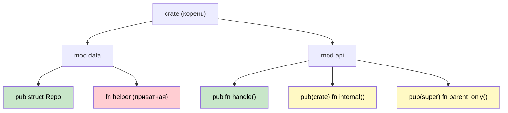

## Модули и крейты: организация кода

> **Что вы узнаете:** систему модулей Rust в сравнении с пространствами имён и сборками C#, модификаторы видимости `pub`/`pub(crate)`/`pub(super)`,
> организацию модулей по файлам и то, как крейты соответствуют сборкам .NET.
>
> **Сложность:** 🟢 Начальный

Понимание системы модулей Rust необходимо для организации кода и управления зависимостями. Разработчикам C# это аналогично пониманию пространств имён, сборок и пакетов NuGet.

### Модули Rust против пространств имён C#

#### Организация пространств имён в C#
```csharp
// Файл: Models/User.cs
namespace MyApp.Models
{
    public class User
    {
        public string Name { get; set; }
        public int Age { get; set; }
    }
}

// Файл: Services/UserService.cs
using MyApp.Models;

namespace MyApp.Services
{
    public class UserService
    {
        public User CreateUser(string name, int age)
        {
            return new User { Name = name, Age = age };
        }
    }
}

// Файл: Program.cs
using MyApp.Models;
using MyApp.Services;

namespace MyApp
{
    class Program
    {
        static void Main(string[] args)
        {
            var service = new UserService();
            var user = service.CreateUser("Alice", 30);
        }
    }
}
```

#### Организация модулей в Rust
```rust
// Файл: src/models.rs
pub struct User {
    pub name: String,
    pub age: u32,
}

impl User {
    pub fn new(name: String, age: u32) -> User {
        User { name, age }
    }
}

// Файл: src/services.rs
use crate::models::User;

pub struct UserService;

impl UserService {
    pub fn create_user(name: String, age: u32) -> User {
        User::new(name, age)
    }
}

// Файл: src/lib.rs (или main.rs)
pub mod models;
pub mod services;

use models::User;
use services::UserService;

fn main() {
    let service = UserService;
    let user = UserService::create_user("Alice".to_string(), 30);
}
```

### Иерархия модулей и видимость



> 🟢 Зелёный = публичный везде &nbsp;|&nbsp; 🟡 Жёлтый = ограниченная видимость &nbsp;|&nbsp; 🔴 Красный = приватный

#### Модификаторы видимости в C#
```csharp
namespace MyApp.Data
{
    // public — доступен откуда угодно
    public class Repository
    {
        // private — только внутри этого класса
        private string connectionString;
        
        // internal — внутри этой сборки
        internal void Connect() { }
        
        // protected — этот класс и его наследники
        protected virtual void Initialize() { }
        
        // public — доступен откуда угодно
        public void Save(object data) { }
    }
}
```

#### Правила видимости в Rust
```rust
// В Rust всё по умолчанию приватно
mod data {
    struct Repository {  // Приватная структура
        connection_string: String,  // Приватное поле
    }
    
    impl Repository {
        fn new() -> Repository {  // Приватная функция
            Repository {
                connection_string: "localhost".to_string(),
            }
        }
        
        pub fn connect(&self) {  // Публичный метод
            // Доступен только внутри этого модуля и его потомков
        }
        
        pub(crate) fn initialize(&self) {  // Публичен на уровне крейта
            // Доступен из любого места этого крейта
        }
        
        pub(super) fn internal_method(&self) {  // Публичен для родительского модуля
            // Доступен в родительском модуле
        }
    }
    
    // Публичная структура — доступна извне модуля
    pub struct PublicRepository {
        pub data: String,  // Публичное поле
        private_data: String,  // Приватное поле (без pub)
    }
}

pub use data::PublicRepository;  // Реэкспорт для внешнего использования
```

### Организация файлов модулей

#### Структура проекта C#
```text
MyApp/
├── MyApp.csproj
├── Models/
│   ├── User.cs
│   └── Product.cs
├── Services/
│   ├── UserService.cs
│   └── ProductService.cs
├── Controllers/
│   └── ApiController.cs
└── Program.cs
```

#### Структура файлов модулей в Rust
```text
my_app/
├── Cargo.toml
└── src/
    ├── main.rs (или lib.rs)
    ├── models/
    │   ├── mod.rs        // Объявление модуля
    │   ├── user.rs
    │   └── product.rs
    ├── services/
    │   ├── mod.rs        // Объявление модуля
    │   ├── user_service.rs
    │   └── product_service.rs
    └── controllers/
        ├── mod.rs
        └── api_controller.rs
```

#### Паттерны объявления модулей
```rust
// src/models/mod.rs
pub mod user;      // Объявляет user.rs как подмодуль
pub mod product;   // Объявляет product.rs как подмодуль

// Реэкспорт часто используемых типов
pub use user::User;
pub use product::Product;

// src/main.rs
mod models;     // Объявляет models/ как модуль
mod services;   // Объявляет services/ как модуль

// Импорт конкретных элементов
use models::{User, Product};
use services::UserService;

// Или импорт всего модуля
use models::user::*;  // Импортирует все публичные элементы модуля user
```

***

## Крейты против сборок .NET

### Понятие крейта
В Rust **крейт** — это базовая единица компиляции и распространения кода, похожая на **сборку** (assembly) в .NET.

#### Модель сборок C#
```csharp
// MyLibrary.dll — скомпилированная сборка
namespace MyLibrary
{
    public class Calculator
    {
        public int Add(int a, int b) => a + b;
    }
}

// MyApp.exe — исполняемая сборка, которая ссылается на MyLibrary.dll
using MyLibrary;

class Program
{
    static void Main()
    {
        var calc = new Calculator();
        Console.WriteLine(calc.Add(2, 3));
    }
}
```

#### Модель крейтов Rust
```toml
# Cargo.toml для библиотечного крейта
[package]
name = "my_calculator"
version = "0.1.0"
edition = "2021"

[lib]
name = "my_calculator"
```

```rust
// src/lib.rs — библиотечный крейт
pub struct Calculator;

impl Calculator {
    pub fn add(&self, a: i32, b: i32) -> i32 {
        a + b
    }
}
```

```toml
# Cargo.toml для бинарного крейта, который использует библиотеку
[package]
name = "my_app"
version = "0.1.0"
edition = "2021"

[dependencies]
my_calculator = { path = "../my_calculator" }
```

```rust
// src/main.rs — бинарный крейт
use my_calculator::Calculator;

fn main() {
    let calc = Calculator;
    println!("{}", calc.add(2, 3));
}
```

### Сравнение типов крейтов

| Концепция C# | Аналог в Rust | Назначение |
|------------|----------------|---------|
| Библиотека классов (.dll) | Библиотечный крейт | Повторно используемый код |
| Консольное приложение (.exe) | Бинарный крейт | Исполняемая программа |
| Пакет NuGet | Опубликованный крейт | Единица распространения |
| Сборка (.dll/.exe) | Скомпилированный крейт | Единица компиляции |
| Solution (.sln) | Workspace | Организация нескольких проектов |

### Workspace против Solution

#### Структура Solution в C#
```xml
<!-- Структура MySolution.sln -->
<Solution>
    <Project Include="WebApi/WebApi.csproj" />
    <Project Include="Business/Business.csproj" />
    <Project Include="DataAccess/DataAccess.csproj" />
    <Project Include="Tests/Tests.csproj" />
</Solution>
```

#### Структура Workspace в Rust
```toml
# Cargo.toml в корне workspace
[workspace]
members = [
    "web_api",
    "business",
    "data_access",
    "tests"
]

[workspace.dependencies]
serde = "1.0"           # Общие версии зависимостей
tokio = "1.0"
```

```toml
# web_api/Cargo.toml
[package]
name = "web_api"
version = "0.1.0"
edition = "2021"

[dependencies]
business = { path = "../business" }
serde = { workspace = true }    # Использовать версию из workspace
tokio = { workspace = true }
```

---

## Упражнения

<details>
<summary><strong>🏋️ Упражнение: спроектируйте дерево модулей</strong> (нажмите, чтобы раскрыть)</summary>

Дана такая структура проекта на C#. Спроектируйте эквивалентное дерево модулей на Rust:

```csharp
// C#
namespace MyApp.Services { public class AuthService { } }
namespace MyApp.Services { internal class TokenStore { } }
namespace MyApp.Models { public class User { } }
namespace MyApp.Models { public class Session { } }
```

Требования:
1. `AuthService` и обе модели должны быть публичными
2. `TokenStore` должен быть приватным для модуля `services`
3. Приведите структуру файлов **и** объявления `mod` / `pub` в `lib.rs`

<details>
<summary>🔑 Решение</summary>

Структура файлов:
```
src/
├── lib.rs
├── services/
│   ├── mod.rs
│   ├── auth_service.rs
│   └── token_store.rs
└── models/
    ├── mod.rs
    ├── user.rs
    └── session.rs
```

```rust,ignore
// src/lib.rs
pub mod services;
pub mod models;

// src/services/mod.rs
mod token_store;          // приватный — как internal в C#
pub mod auth_service;     // публичный

// src/services/auth_service.rs
use super::token_store::TokenStore; // виден внутри модуля

pub struct AuthService;

impl AuthService {
    pub fn login(&self) { /* использует TokenStore внутри */ }
}

// src/services/token_store.rs
pub(super) struct TokenStore; // виден только родительскому модулю (services)

// src/models/mod.rs
pub mod user;
pub mod session;

// src/models/user.rs
pub struct User {
    pub name: String,
}

// src/models/session.rs
pub struct Session {
    pub user_id: u64,
}
```

</details>
</details>

***


