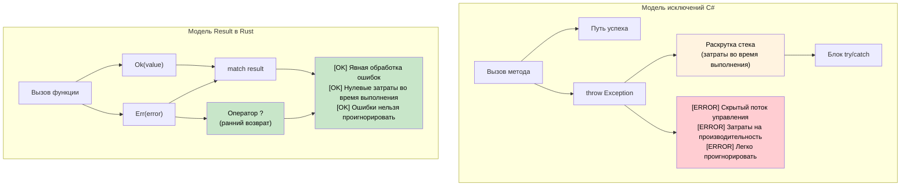

## Исключения против `Result<T, E>`

> **Что вы узнаете:** почему Rust заменяет исключения на `Result<T, E>` и `Option<T>`,
> оператор `?` для краткого распространения ошибок, и как явная обработка ошибок
> устраняет скрытый поток управления, который осложняет код с `try`/`catch` в C#.
>
> **Сложность:** 🟡 Средний
>
> **См. также**: [Собственные типы ошибок уровня крейта](ch09-1-crate-level-error-types-and-result-alias.md) — производственные паттерны с `thiserror` и `anyhow`, и [Основные крейты](ch15-1-essential-crates-for-c-developers.md) — экосистема крейтов для ошибок.

### Обработка ошибок через исключения в C#
```csharp
// C# — обработка ошибок через исключения
public class UserService
{
    public User GetUser(int userId)
    {
        if (userId <= 0)
        {
            throw new ArgumentException("User ID must be positive");
        }
        
        var user = database.FindUser(userId);
        if (user == null)
        {
            throw new UserNotFoundException($"User {userId} not found");
        }
        
        return user;
    }
    
    public async Task<string> GetUserEmailAsync(int userId)
    {
        try
        {
            var user = GetUser(userId);
            return user.Email ?? throw new InvalidOperationException("User has no email");
        }
        catch (UserNotFoundException ex)
        {
            logger.Warning("User not found: {UserId}", userId);
            return "noreply@company.com";
        }
        catch (Exception ex)
        {
            logger.Error(ex, "Unexpected error getting user email");
            throw; // Повторно выбрасываем
        }
    }
}
```

### Обработка ошибок через Result в Rust
```rust
use std::fmt;

#[derive(Debug)]
pub enum UserError {
    InvalidId(i32),
    NotFound(i32),
    NoEmail,
    DatabaseError(String),
}

impl fmt::Display for UserError {
    fn fmt(&self, f: &mut fmt::Formatter<'_>) -> fmt::Result {
        match self {
            UserError::InvalidId(id) => write!(f, "Invalid user ID: {}", id),
            UserError::NotFound(id) => write!(f, "User {} not found", id),
            UserError::NoEmail => write!(f, "User has no email address"),
            UserError::DatabaseError(msg) => write!(f, "Database error: {}", msg),
        }
    }
}

impl std::error::Error for UserError {}

#[derive(Debug, Clone)]
pub struct User {
    pub name: String,
    pub email: Option<String>,
}

pub struct UserService {
    users: Vec<User>,  // Имитация базы данных
}

impl UserService {
    fn database_find_user(&self, user_id: i32) -> Option<User> {
        self.users.get(user_id as usize).cloned()
    }

    pub fn get_user(&self, user_id: i32) -> Result<User, UserError> {
        if user_id <= 0 {
            return Err(UserError::InvalidId(user_id));
        }
        
        // Имитация поиска в базе данных
        self.database_find_user(user_id)
            .ok_or(UserError::NotFound(user_id))
    }
    
    pub fn get_user_email(&self, user_id: i32) -> Result<String, UserError> {
        let user = self.get_user(user_id)?; // Оператор ? пробрасывает ошибку
        
        user.email
            .ok_or(UserError::NoEmail)
    }
    
    pub fn get_user_email_or_default(&self, user_id: i32) -> String {
        match self.get_user_email(user_id) {
            Ok(email) => email,
            Err(UserError::NotFound(_)) => {
                log::warn!("User not found: {}", user_id);
                "noreply@company.com".to_string()
            }
            Err(err) => {
                log::error!("Error getting user email: {}", err);
                "error@company.com".to_string()
            }
        }
    }
}
```



***

### Оператор ?: краткое распространение ошибок
```csharp
// C# — распространение исключений (неявное)
public async Task<string> ProcessFileAsync(string path)
{
    var content = await File.ReadAllTextAsync(path);  // Бросает исключение при ошибке
    var processed = ProcessContent(content);          // Бросает исключение при ошибке
    return processed;
}
```

```rust
// Rust — распространение ошибок через ?
fn process_file(path: &str) -> Result<String, ConfigError> {
    let content = read_config(path)?;  // ? пробрасывает ошибку, если это Err
    let processed = process_content(&content)?;  // ? пробрасывает ошибку, если это Err
    Ok(processed)  // Оборачиваем успешное значение в Ok
}

fn process_content(content: &str) -> Result<String, ConfigError> {
    if content.is_empty() {
        Err(ConfigError::InvalidFormat)
    } else {
        Ok(content.to_uppercase())
    }
}
```

### `Option<T>` для значений, которые могут отсутствовать
```csharp
// C# — ссылочные типы с поддержкой null
public string? FindUserName(int userId)
{
    var user = database.FindUser(userId);
    return user?.Name;  // Возвращает null, если пользователь не найден
}

public void ProcessUser(int userId)
{
    string? name = FindUserName(userId);
    if (name != null)
    {
        Console.WriteLine($"User: {name}");
    }
    else
    {
        Console.WriteLine("User not found");
    }
}
```

```rust
// Rust — Option<T> для необязательных значений
fn find_user_name(user_id: u32) -> Option<String> {
    // Имитация поиска в базе данных
    if user_id == 1 {
        Some("Alice".to_string())
    } else {
        None
    }
}

fn process_user(user_id: u32) {
    match find_user_name(user_id) {
        Some(name) => println!("User: {}", name),
        None => println!("User not found"),
    }
    
    // Или используйте if let (сокращённая форма сопоставления с образцом)
    if let Some(name) = find_user_name(user_id) {
        println!("User: {}", name);
    } else {
        println!("User not found");
    }
}
```

### Комбинирование Option и Result
```rust
fn safe_divide(a: f64, b: f64) -> Option<f64> {
    if b != 0.0 {
        Some(a / b)
    } else {
        None
    }
}

fn parse_and_divide(a_str: &str, b_str: &str) -> Result<Option<f64>, ParseFloatError> {
    let a: f64 = a_str.parse()?;  // Возвращаем ошибку разбора, если значение некорректно
    let b: f64 = b_str.parse()?;  // Возвращаем ошибку разбора, если значение некорректно
    Ok(safe_divide(a, b))         // Возвращаем Ok(Some(result)) или Ok(None)
}

use std::num::ParseFloatError;

fn main() {
    match parse_and_divide("10.0", "2.0") {
        Ok(Some(result)) => println!("Result: {}", result),
        Ok(None) => println!("Division by zero"),
        Err(error) => println!("Parse error: {}", error),
    }
}
```

***


<details>
<summary><strong>🏋️ Упражнение: создайте тип ошибок уровня крейта</strong> (нажмите, чтобы раскрыть)</summary>

**Задача**: создайте перечисление `AppError` для приложения обработки файлов, которое может завершиться ошибкой из-за ошибок ввода-вывода, ошибок разбора JSON и ошибок валидации. Реализуйте преобразования `From` для автоматического распространения через `?`.

```rust
// Стартовый код
use std::io;

// TODO: Определите AppError с вариантами:
//   Io(io::Error), Json(serde_json::Error), Validation(String)
// TODO: Реализуйте трейты Display и Error
// TODO: Реализуйте From<io::Error> и From<serde_json::Error>
// TODO: Определите псевдоним типа: type Result<T> = std::result::Result<T, AppError>;

fn load_config(path: &str) -> Result<Config> {
    let content = std::fs::read_to_string(path)?;  // io::Error → AppError
    let config: Config = serde_json::from_str(&content)?;  // ошибка serde → AppError
    if config.name.is_empty() {
        return Err(AppError::Validation("name cannot be empty".into()));
    }
    Ok(config)
}
```

<details>
<summary>🔑 Решение</summary>

```rust
use std::io;
use thiserror::Error;

#[derive(Error, Debug)]
pub enum AppError {
    #[error("I/O error: {0}")]
    Io(#[from] io::Error),

    #[error("JSON error: {0}")]
    Json(#[from] serde_json::Error),

    #[error("Validation: {0}")]
    Validation(String),
}

pub type Result<T> = std::result::Result<T, AppError>;

#[derive(serde::Deserialize)]
struct Config {
    name: String,
    port: u16,
}

fn load_config(path: &str) -> Result<Config> {
    let content = std::fs::read_to_string(path)?;
    let config: Config = serde_json::from_str(&content)?;
    if config.name.is_empty() {
        return Err(AppError::Validation("name cannot be empty".into()));
    }
    Ok(config)
}
```

**Ключевые выводы**:
- `thiserror` генерирует реализации `Display` и `Error` на основе атрибутов
- `#[from]` генерирует реализации `From<T>`, что позволяет автоматически преобразовывать ошибки через `?`
- Псевдоним `Result<T>` убирает шаблонный код во всём крейте
- В отличие от исключений C#, тип ошибки виден в каждой сигнатуре функции

</details>
</details>


