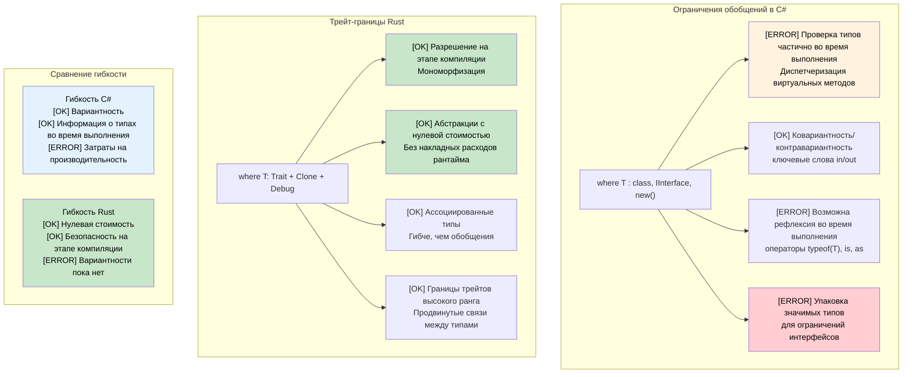

## Ограничения обобщений: where и ограничения трейтов

> **Что вы узнаете:** ограничения трейтов Rust в сравнении с ограничениями `where` в C#, синтаксис предложения `where`,
> условные реализации трейтов, ассоциированные типы и границы трейтов высокого ранга (HRTB).
>
> **Сложность:** 🔴 Продвинутый

### Ограничения обобщений в C#
```csharp
// Ограничения обобщений в C# через предложение where
public class Repository<T> where T : class, IEntity, new()
{
    public T Create()
    {
        return new T();  // Ограничение new() позволяет конструктор без параметров
    }
    
    public void Save(T entity)
    {
        if (entity.Id == 0)  // Ограничение IEntity даёт свойство Id
        {
            entity.Id = GenerateId();
        }
        // Сохранение в базу данных
    }
}

// Несколько параметров типа с ограничениями
public class Converter<TInput, TOutput> 
    where TInput : IConvertible
    where TOutput : class, new()
{
    public TOutput Convert(TInput input)
    {
        var output = new TOutput();
        // Логика преобразования через IConvertible
        return output;
    }
}

// Вариантность в обобщениях
public interface IRepository<out T> where T : IEntity
{
    IEnumerable<T> GetAll();  // Ковариантность — может возвращать более производные типы
}

public interface IWriter<in T> where T : IEntity
{
    void Write(T entity);  // Контравариантность — может принимать более базовые типы
}
```

### Ограничения обобщений Rust через трейт-границы
```rust
use std::fmt::{Debug, Display};
use std::clone::Clone;

// Базовые трейт-границы
pub struct Repository<T> 
where 
    T: Clone + Debug + Default,
{
    items: Vec<T>,
}

impl<T> Repository<T> 
where 
    T: Clone + Debug + Default,
{
    pub fn new() -> Self {
        Repository { items: Vec::new() }
    }
    
    pub fn create(&self) -> T {
        T::default()  // Трейт Default предоставляет значение по умолчанию
    }
    
    pub fn add(&mut self, item: T) {
        println!("Adding item: {:?}", item);  // Трейт Debug для вывода
        self.items.push(item);
    }
    
    pub fn get_all(&self) -> Vec<T> {
        self.items.clone()  // Трейт Clone для копирования
    }
}

// Несколько трейт-границ с разным синтаксисом
pub fn process_data<T, U>(input: T) -> U 
where 
    T: Display + Clone,
    U: From<T> + Debug,
{
    println!("Processing: {}", input);  // Трейт Display
    let cloned = input.clone();         // Трейт Clone
    let output = U::from(cloned);       // Трейт From для преобразования
    println!("Result: {:?}", output);   // Трейт Debug
    output
}

// Ассоциированные типы (аналог ограничений обобщений в C#)
pub trait Iterator {
    type Item;  // Ассоциированный тип вместо параметра обобщения
    
    fn next(&mut self) -> Option<Self::Item>;
}

pub trait Collect<T> {
    fn collect<I: Iterator<Item = T>>(iter: I) -> Self;
}

// Границы трейтов высокого ранга (продвинутый уровень)
fn apply_to_all<F>(items: &[String], f: F) -> Vec<String>
where 
    F: for<'a> Fn(&'a str) -> String,  // Функция работает с любым временем жизни
{
    items.iter().map(|s| f(s)).collect()
}

// Условные реализации трейтов
impl<T> PartialEq for Repository<T> 
where 
    T: PartialEq + Clone + Debug + Default,
{
    fn eq(&self, other: &Self) -> bool {
        self.items == other.items
    }
}
```



---

## Упражнения

<details>
<summary><strong>🏋️ Упражнение: обобщённый репозиторий</strong> (нажмите, чтобы раскрыть)</summary>

Переведите этот обобщённый интерфейс репозитория C# на трейты Rust:

```csharp
public interface IRepository<T> where T : IEntity, new()
{
    T GetById(int id);
    IEnumerable<T> Find(Func<T, bool> predicate);
    void Save(T entity);
}
```

Требования:
1. Определите трейт `Entity` с методом `fn id(&self) -> u64`
2. Определите трейт `Repository<T>`, где `T: Entity + Clone`
3. Реализуйте `InMemoryRepository<T>`, который хранит элементы в `Vec<T>`
4. Метод `find` должен принимать `impl Fn(&T) -> bool`

<details>
<summary>🔑 Решение</summary>

```rust
trait Entity: Clone {
    fn id(&self) -> u64;
}

trait Repository<T: Entity> {
    fn get_by_id(&self, id: u64) -> Option<&T>;
    fn find(&self, predicate: impl Fn(&T) -> bool) -> Vec<&T>;
    fn save(&mut self, entity: T);
}

struct InMemoryRepository<T> {
    items: Vec<T>,
}

impl<T: Entity> InMemoryRepository<T> {
    fn new() -> Self { Self { items: Vec::new() } }
}

impl<T: Entity> Repository<T> for InMemoryRepository<T> {
    fn get_by_id(&self, id: u64) -> Option<&T> {
        self.items.iter().find(|item| item.id() == id)
    }
    fn find(&self, predicate: impl Fn(&T) -> bool) -> Vec<&T> {
        self.items.iter().filter(|item| predicate(item)).collect()
    }
    fn save(&mut self, entity: T) {
        if let Some(pos) = self.items.iter().position(|e| e.id() == entity.id()) {
            self.items[pos] = entity;
        } else {
            self.items.push(entity);
        }
    }
}

#[derive(Clone, Debug)]
struct User { user_id: u64, name: String }

impl Entity for User {
    fn id(&self) -> u64 { self.user_id }
}

fn main() {
    let mut repo = InMemoryRepository::new();
    repo.save(User { user_id: 1, name: "Alice".into() });
    repo.save(User { user_id: 2, name: "Bob".into() });

    let found = repo.find(|u| u.name.starts_with('A'));
    assert_eq!(found.len(), 1);
}
```

**Ключевые отличия от C#**: ограничения `new()` нет (вместо него используется трейт `Default`). `Fn(&T) -> bool` заменяет `Func<T, bool>`. Вместо генерации исключения возвращается `Option`.

</details>
</details>

***


