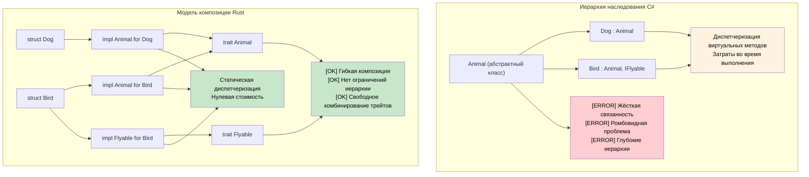

## Наследование против композиции

> **Что вы узнаете:** почему в Rust нет наследования классов, как трейты и структуры заменяют глубокие иерархии классов,
> и практические паттерны для достижения полиморфизма через композицию.
>
> **Сложность:** 🟡 Средний

```csharp
// C# — наследование на основе классов
public abstract class Animal
{
    public string Name { get; protected set; }
    public abstract void MakeSound();
    
    public virtual void Sleep()
    {
        Console.WriteLine($"{Name} is sleeping");
    }
}

public class Dog : Animal
{
    public Dog(string name) { Name = name; }
    
    public override void MakeSound()
    {
        Console.WriteLine("Woof!");
    }
    
    public void Fetch()
    {
        Console.WriteLine($"{Name} is fetching");
    }
}

// Контракты на основе интерфейсов
public interface IFlyable
{
    void Fly();
}

public class Bird : Animal, IFlyable
{
    public Bird(string name) { Name = name; }
    
    public override void MakeSound()
    {
        Console.WriteLine("Tweet!");
    }
    
    public void Fly()
    {
        Console.WriteLine($"{Name} is flying");
    }
}
```

### Модель композиции в Rust
```rust
// Rust — композиция вместо наследования, через трейты
pub trait Animal {
    fn name(&self) -> &str;
    fn make_sound(&self);
    
    // Реализация по умолчанию (как виртуальные методы в C#)
    fn sleep(&self) {
        println!("{} is sleeping", self.name());
    }
}

pub trait Flyable {
    fn fly(&self);
}

// Отделяем данные от поведения
#[derive(Debug)]
pub struct Dog {
    name: String,
}

#[derive(Debug)]
pub struct Bird {
    name: String,
    wingspan: f64,
}

// Реализуем поведение для типов
impl Animal for Dog {
    fn name(&self) -> &str {
        &self.name
    }
    
    fn make_sound(&self) {
        println!("Woof!");
    }
}

impl Dog {
    pub fn new(name: String) -> Self {
        Dog { name }
    }
    
    pub fn fetch(&self) {
        println!("{} is fetching", self.name);
    }
}

impl Animal for Bird {
    fn name(&self) -> &str {
        &self.name
    }
    
    fn make_sound(&self) {
        println!("Tweet!");
    }
}

impl Flyable for Bird {
    fn fly(&self) {
        println!("{} is flying with {:.1}m wingspan", self.name, self.wingspan);
    }
}

// Несколько трейт-границ (как несколько интерфейсов)
fn make_flying_animal_sound<T>(animal: &T) 
where 
    T: Animal + Flyable,
{
    animal.make_sound();
    animal.fly();
}
```



---

## Упражнения

<details>
<summary><strong>🏋️ Упражнение: замените наследование трейтами</strong> (нажмите, чтобы раскрыть)</summary>

Этот C#-код использует наследование. Перепишите его на Rust, используя композицию трейтов:

```csharp
public abstract class Shape { public abstract double Area(); }
public abstract class Shape3D : Shape { public abstract double Volume(); }
public class Cylinder : Shape3D
{
    public double Radius { get; }
    public double Height { get; }
    public Cylinder(double r, double h) { Radius = r; Height = h; }
    public override double Area() => 2.0 * Math.PI * Radius * (Radius + Height);
    public override double Volume() => Math.PI * Radius * Radius * Height;
}
```

Требования:
1. Трейт `HasArea` с методом `fn area(&self) -> f64`
2. Трейт `HasVolume` с методом `fn volume(&self) -> f64`
3. Структура `Cylinder`, реализующая оба трейта
4. Функция `fn print_shape_info(shape: &(impl HasArea + HasVolume))` — обратите внимание на композицию трейт-границ (наследование не нужно)

<details>
<summary>🔑 Решение</summary>

```rust
use std::f64::consts::PI;

trait HasArea {
    fn area(&self) -> f64;
}

trait HasVolume {
    fn volume(&self) -> f64;
}

struct Cylinder {
    radius: f64,
    height: f64,
}

impl HasArea for Cylinder {
    fn area(&self) -> f64 {
        2.0 * PI * self.radius * (self.radius + self.height)
    }
}

impl HasVolume for Cylinder {
    fn volume(&self) -> f64 {
        PI * self.radius * self.radius * self.height
    }
}

fn print_shape_info(shape: &(impl HasArea + HasVolume)) {
    println!("Area:   {:.2}", shape.area());
    println!("Volume: {:.2}", shape.volume());
}

fn main() {
    let c = Cylinder { radius: 3.0, height: 5.0 };
    print_shape_info(&c);
}
```

**Ключевая мысль**: C# требует трёхуровневой иерархии (Shape → Shape3D → Cylinder). Rust использует плоскую композицию трейтов — `impl HasArea + HasVolume` объединяет возможности без глубины наследования.

</details>
</details>

***


