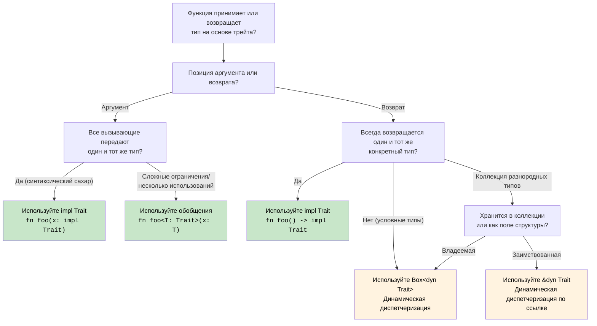

## Трейты — интерфейсы Rust

> **Что вы узнаете:** трейты против интерфейсов C#, реализации методов по умолчанию, трейт-объекты (`dyn Trait`)
> против ограничений обобщений (`impl Trait`), производные трейты, распространённые трейты стандартной библиотеки,
> ассоциированные типы и перегрузку операторов через трейты.
>
> **Сложность:** 🟡 Средний

Трейты — способ Rust описывать общее поведение. Они похожи на интерфейсы C#, но мощнее.

### Сравнение с интерфейсами C#
```csharp
// Определение интерфейса в C#
public interface IAnimal
{
    string Name { get; }
    void MakeSound();
    
    // Реализация по умолчанию (C# 8+)
    string Describe()
    {
        return $"{Name} makes a sound";
    }
}

// Реализация интерфейса в C#
public class Dog : IAnimal
{
    public string Name { get; }
    
    public Dog(string name)
    {
        Name = name;
    }
    
    public void MakeSound()
    {
        Console.WriteLine("Woof!");
    }
    
    // Можно переопределить реализацию по умолчанию
    public string Describe()
    {
        return $"{Name} is a loyal dog";
    }
}

// Ограничения обобщений
public void ProcessAnimal<T>(T animal) where T : IAnimal
{
    animal.MakeSound();
    Console.WriteLine(animal.Describe());
}
```

### Определение и реализация трейтов в Rust
```rust
// Определение трейта
trait Animal {
    fn name(&self) -> &str;
    fn make_sound(&self);
    
    // Реализация по умолчанию
    fn describe(&self) -> String {
        format!("{} makes a sound", self.name())
    }
    
    // Реализация по умолчанию, использующая другие методы трейта
    fn introduce(&self) {
        println!("Hi, I'm {}", self.name());
        self.make_sound();
    }
}

// Определение структуры
#[derive(Debug)]
struct Dog {
    name: String,
    breed: String,
}

impl Dog {
    fn new(name: String, breed: String) -> Dog {
        Dog { name, breed }
    }
}

// Реализация трейта
impl Animal for Dog {
    fn name(&self) -> &str {
        &self.name
    }
    
    fn make_sound(&self) {
        println!("Woof!");
    }
    
    // Переопределяем реализацию по умолчанию
    fn describe(&self) -> String {
        format!("{} is a loyal {} dog", self.name, self.breed)
    }
}

// Ещё одна реализация
#[derive(Debug)]
struct Cat {
    name: String,
    indoor: bool,
}

impl Animal for Cat {
    fn name(&self) -> &str {
        &self.name
    }
    
    fn make_sound(&self) {
        println!("Meow!");
    }
    
    // Используем describe() по умолчанию
}

// Обобщённая функция с ограничениями трейтов
fn process_animal<T: Animal>(animal: &T) {
    animal.make_sound();
    println!("{}", animal.describe());
    animal.introduce();
}

// Несколько ограничений трейтов
fn process_animal_debug<T: Animal + std::fmt::Debug>(animal: &T) {
    println!("Debug: {:?}", animal);
    process_animal(animal);
}

fn main() {
    let dog = Dog::new("Buddy".to_string(), "Golden Retriever".to_string());
    let cat = Cat { name: "Whiskers".to_string(), indoor: true };
    
    process_animal(&dog);
    process_animal(&cat);
    
    process_animal_debug(&dog);
}
```

### Трейт-объекты и динамическая диспетчеризация
```csharp
// Динамический полиморфизм в C#
public void ProcessAnimals(List<IAnimal> animals)
{
    foreach (var animal in animals)
    {
        animal.MakeSound(); // Динамическая диспетчеризация
        Console.WriteLine(animal.Describe());
    }
}

// Использование
var animals = new List<IAnimal>
{
    new Dog("Buddy"),
    new Cat("Whiskers"),
    new Dog("Rex")
};

ProcessAnimals(animals);
```

```rust
// Трейт-объекты Rust для динамической диспетчеризации
fn process_animals(animals: &[Box<dyn Animal>]) {
    for animal in animals {
        animal.make_sound(); // Динамическая диспетчеризация
        println!("{}", animal.describe());
    }
}

// Альтернатива: использование ссылок
fn process_animal_refs(animals: &[&dyn Animal]) {
    for animal in animals {
        animal.make_sound();
        println!("{}", animal.describe());
    }
}

fn main() {
    // Использование Box<dyn Trait>
    let animals: Vec<Box<dyn Animal>> = vec![
        Box::new(Dog::new("Buddy".to_string(), "Golden Retriever".to_string())),
        Box::new(Cat { name: "Whiskers".to_string(), indoor: true }),
        Box::new(Dog::new("Rex".to_string(), "German Shepherd".to_string())),
    ];
    
    process_animals(&animals);
    
    // Использование ссылок
    let dog = Dog::new("Buddy".to_string(), "Golden Retriever".to_string());
    let cat = Cat { name: "Whiskers".to_string(), indoor: true };
    
    let animal_refs: Vec<&dyn Animal> = vec![&dog, &cat];
    process_animal_refs(&animal_refs);
}
```

### Производные трейты
```rust
// Автоматически выводим распространённые трейты
#[derive(Debug, Clone, PartialEq, Eq, Hash)]
struct Person {
    name: String,
    age: u32,
}

// Что генерируется (упрощённо):
impl std::fmt::Debug for Person {
    fn fmt(&self, f: &mut std::fmt::Formatter<'_>) -> std::fmt::Result {
        f.debug_struct("Person")
            .field("name", &self.name)
            .field("age", &self.age)
            .finish()
    }
}

impl Clone for Person {
    fn clone(&self) -> Self {
        Person {
            name: self.name.clone(),
            age: self.age,
        }
    }
}

impl PartialEq for Person {
    fn eq(&self, other: &Self) -> bool {
        self.name == other.name && self.age == other.age
    }
}

// Использование
fn main() {
    let person1 = Person {
        name: "Alice".to_string(),
        age: 30,
    };
    
    let person2 = person1.clone(); // Трейт Clone
    
    println!("{:?}", person1); // Трейт Debug
    println!("Equal: {}", person1 == person2); // Трейт PartialEq
}
```

### Распространённые трейты стандартной библиотеки
```rust
use std::collections::HashMap;

// Трейт Display для удобного для пользователя вывода
impl std::fmt::Display for Person {
    fn fmt(&self, f: &mut std::fmt::Formatter<'_>) -> std::fmt::Result {
        write!(f, "{} (age {})", self.name, self.age)
    }
}

// Трейт From для преобразований
impl From<(String, u32)> for Person {
    fn from((name, age): (String, u32)) -> Self {
        Person { name, age }
    }
}

// Трейт Into реализуется автоматически, когда реализован From
fn create_person() {
    let person: Person = ("Alice".to_string(), 30).into();
    println!("{}", person);
}

// Реализация трейта Iterator
struct PersonIterator {
    people: Vec<Person>,
    index: usize,
}

impl Iterator for PersonIterator {
    type Item = Person;
    
    fn next(&mut self) -> Option<Self::Item> {
        if self.index < self.people.len() {
            let person = self.people[self.index].clone();
            self.index += 1;
            Some(person)
        } else {
            None
        }
    }
}

impl Person {
    fn iterator(people: Vec<Person>) -> PersonIterator {
        PersonIterator { people, index: 0 }
    }
}

fn main() {
    let people = vec![
        Person::from(("Alice".to_string(), 30)),
        Person::from(("Bob".to_string(), 25)),
        Person::from(("Charlie".to_string(), 35)),
    ];
    
    // Используем наш собственный итератор
    for person in Person::iterator(people.clone()) {
        println!("{}", person); // Использует трейт Display
    }
}
```

***


<details>
<summary><strong>🏋️ Упражнение: система рисования на основе трейтов</strong> (нажмите, чтобы раскрыть)</summary>

**Задача**: реализуйте трейт `Drawable` с методом `area()` и методом `draw()` по умолчанию. Создайте структуры `Circle` и `Rect`. Напишите функцию, которая принимает `&[Box<dyn Drawable>]` и выводит суммарную площадь.

<details>
<summary>🔑 Решение</summary>

```rust
use std::f64::consts::PI;

trait Drawable {
    fn area(&self) -> f64;

    fn draw(&self) {
        println!("Drawing shape with area {:.2}", self.area());
    }
}

struct Circle { radius: f64 }
struct Rect   { w: f64, h: f64 }

impl Drawable for Circle {
    fn area(&self) -> f64 { PI * self.radius * self.radius }
}

impl Drawable for Rect {
    fn area(&self) -> f64 { self.w * self.h }
}

fn total_area(shapes: &[Box<dyn Drawable>]) -> f64 {
    shapes.iter().map(|s| s.area()).sum()
}

fn main() {
    let shapes: Vec<Box<dyn Drawable>> = vec![
        Box::new(Circle { radius: 5.0 }),
        Box::new(Rect { w: 4.0, h: 6.0 }),
        Box::new(Circle { radius: 2.0 }),
    ];
    for s in &shapes { s.draw(); }
    println!("Total area: {:.2}", total_area(&shapes));
}
```

**Ключевые выводы**:
- `dyn Trait` даёт полиморфизм времени выполнения (как `IDrawable` в C#)
- `Box<dyn Trait>` размещается в куче и нужен для коллекций разнородных типов
- Методы по умолчанию работают точно так же, как методы интерфейсов по умолчанию в C# 8+

</details>
</details>

### Ассоциированные типы: трейты с типовыми членами

Интерфейсы C# не имеют ассоциированных типов — трейты Rust имеют. Так устроен `Iterator`:

```rust
// Трейт Iterator имеет ассоциированный тип 'Item'
trait Iterator {
    type Item;                         // Каждая реализация определяет, что такое Item
    fn next(&mut self) -> Option<Self::Item>;
}

struct Counter { max: u32, current: u32 }

impl Iterator for Counter {
    type Item = u32;                   // Этот Counter выдаёт значения u32
    fn next(&mut self) -> Option<u32> {
        if self.current < self.max {
            self.current += 1;
            Some(self.current)
        } else {
            None
        }
    }
}
```

В C# для этой цели `IEnumerator<T>` использует параметр обобщения (`T`). Ассоциированные типы Rust устроены иначе: у `Iterator` *один* тип `Item` на каждую реализацию, а не параметр обобщения на уровне трейта. Это упрощает ограничения трейтов: `impl Iterator<Item = u32>` против `IEnumerable<int>` в C#.

### Перегрузка операторов через трейты

В C# вы определяете `public static MyType operator+(MyType a, MyType b)`. В Rust каждый оператор соответствует трейту из `std::ops`:

```rust
use std::ops::Add;

#[derive(Debug, Clone, Copy)]
struct Vec2 { x: f64, y: f64 }

impl Add for Vec2 {
    type Output = Vec2;
    fn add(self, rhs: Vec2) -> Vec2 {
        Vec2 { x: self.x + rhs.x, y: self.y + rhs.y }
    }
}

let a = Vec2 { x: 1.0, y: 2.0 };
let b = Vec2 { x: 3.0, y: 4.0 };
let c = a + b;  // вызывает <Vec2 as Add>::add(a, b)
```

| C# | Rust | Примечания |
|----|------|-------|
| `operator+` | `impl Add` | `self` передаётся по значению — для типов, не реализующих `Copy`, это потребление |
| `operator==` | `impl PartialEq` | Обычно `#[derive(PartialEq)]` |
| `operator<` | `impl PartialOrd` | Обычно `#[derive(PartialOrd)]` |
| `ToString()` | `impl fmt::Display` | Используется в `println!("{}", x)` |
| Неявное преобразование | Аналога нет | В Rust нет неявных преобразований — используйте `From`/`Into` |

### Согласованность: правило сироты

Трейт можно реализовать, только если вы владеете либо трейтом, либо типом. Это предотвращает конфликтующие реализации между крейтами:

```rust
// ✅ OK — вы владеете MyType
impl Display for MyType { ... }

// ✅ OK — вы владеете MyTrait
impl MyTrait for String { ... }

// ❌ ОШИБКА — вы не владеете ни Display, ни String
impl Display for String { ... }
```

В C# такого ограничения нет — любой код может добавить методы расширения к любому типу, что может привести к неоднозначности.

<!-- ch10.0a: impl Trait and Dispatch Strategies -->
## `impl Trait`: возврат трейтов без упаковки в Box

Интерфейсы C# всегда можно использовать как возвращаемые типы. В Rust возврат трейта требует выбора: статическая диспетчеризация (`impl Trait`) или динамическая (`dyn Trait`).

### `impl Trait` в позиции аргумента (сокращённая запись обобщения)
```rust
// Эти две записи эквивалентны:
fn print_animal(animal: &impl Animal) { animal.make_sound(); }
fn print_animal<T: Animal>(animal: &T)  { animal.make_sound(); }

// impl Trait — это просто синтаксический сахар для параметра обобщения
// Компилятор генерирует специализированную копию для каждого конкретного типа (мономорфизация)
```

### `impl Trait` в позиции возвращаемого значения (ключевое отличие)
```rust
// Возвращаем итератор, не раскрывая конкретный тип
fn even_squares(limit: u32) -> impl Iterator<Item = u32> {
    (0..limit)
        .filter(|n| n % 2 == 0)
        .map(|n| n * n)
}
// Вызывающий код видит «какой-то тип, реализующий Iterator<Item = u32>»
// Фактический тип (Filter<Map<Range<u32>, ...>>) не имеет имени — impl Trait решает эту проблему

fn main() {
    for n in even_squares(20) {
        print!("{n} ");
    }
    // Вывод: 0 4 16 36 64 100 144 196 256 324
}
```

```csharp
// C# — возврат интерфейса (всегда динамическая диспетчеризация, объект итератора в куче)
public IEnumerable<int> EvenSquares(int limit) =>
    Enumerable.Range(0, limit)
        .Where(n => n % 2 == 0)
        .Select(n => n * n);
// Тип возвращаемого значения скрывает конкретный итератор за интерфейсом IEnumerable
// В отличие от Box<dyn Trait> в Rust, C# не упаковывает явно — выделением памяти занимается рантайм
```

### Возврат замыканий: `impl Fn` против `Box<dyn Fn>`
```rust
// Возвращаем замыкание — тип замыкания назвать нельзя, поэтому impl Fn необходим
fn make_adder(x: i32) -> impl Fn(i32) -> i32 {
    move |y| x + y
}

let add5 = make_adder(5);
println!("{}", add5(3)); // 8

// Если нужно условно возвращать РАЗНЫЕ замыкания, понадобится Box:
fn choose_op(add: bool) -> Box<dyn Fn(i32, i32) -> i32> {
    if add {
        Box::new(|a, b| a + b)
    } else {
        Box::new(|a, b| a * b)
    }
}
// impl Trait требует ОДНОГО конкретного типа; разные замыкания — это разные типы
```

```csharp
// C# — делегаты решают это естественно (всегда выделяются в куче)
Func<int, int> MakeAdder(int x) => y => x + y;
Func<int, int, int> ChooseOp(bool add) => add ? (a, b) => a + b : (a, b) => a * b;
```

### Решение о диспетчеризации: `impl Trait` против `dyn Trait` против обобщений

С этим архитектурным решением разработчики C# сталкиваются в Rust сразу. Вот полное руководство:



| Подход | Диспетчеризация | Выделение памяти | Когда использовать |
|----------|----------|------------|-------------|
| `fn foo<T: Trait>(x: T)` | Статическая (мономорфизация) | Стек | Несколько ограничений трейтов, нужен turbofish, один и тот же тип используется повторно |
| `fn foo(x: impl Trait)` | Статическая (мономорфизация) | Стек | Простые ограничения, более чистый синтаксис, разовые параметры |
| `fn foo() -> impl Trait` | Статическая | Стек | Один конкретный тип возвращаемого значения, итераторы, замыкания |
| `fn foo() -> Box<dyn Trait>` | Динамическая (таблица виртуальных методов) | **Куча** | Разные типы возвращаемых значений, трейт-объекты в коллекциях |
| `&dyn Trait` / `&mut dyn Trait` | Динамическая (таблица виртуальных методов) | Без выделения | Заимствованные ссылки на разнородные типы, параметры функций |

```rust
// Сводка: от самого быстрого к самому гибкому
fn static_dispatch(x: impl Display)             { /* быстрее всего, без выделения */ }
fn generic_dispatch<T: Display + Clone>(x: T)    { /* быстрее всего, несколько ограничений */ }
fn dynamic_dispatch(x: &dyn Display)             { /* поиск в таблице виртуальных методов, без выделения */ }
fn boxed_dispatch(x: Box<dyn Display>)           { /* поиск в таблице виртуальных методов + выделение в куче */ }
```

***


