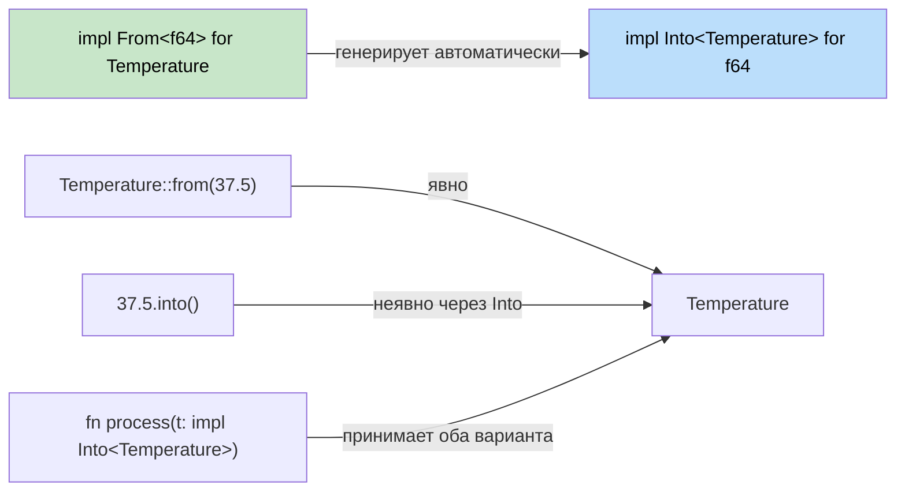

## Преобразования типов в Rust

> **Что вы узнаете:** трейты `From`/`Into` против неявных и явных операторов C#, `TryFrom`/`TryInto`
> для преобразований, которые могут завершиться ошибкой, `FromStr` для разбора строк, а также идиоматичные паттерны преобразования строк.
>
> **Сложность:** 🟡 Средний

В C# используются неявные и явные преобразования и операторы приведения. В Rust для безопасных и явных преобразований применяются трейты `From` и `Into`.

### Паттерны преобразований в C#
```csharp
// Неявные и явные преобразования в C#
public class Temperature
{
    public double Celsius { get; }
    
    public Temperature(double celsius) { Celsius = celsius; }
    
    // Неявное преобразование
    public static implicit operator double(Temperature t) => t.Celsius;
    
    // Явное преобразование
    public static explicit operator Temperature(double d) => new Temperature(d);
}

double temp = new Temperature(100.0);  // неявно
Temperature t = (Temperature)37.5;     // явно
```

### From и Into в Rust
```rust
#[derive(Debug)]
struct Temperature {
    celsius: f64,
}

impl From<f64> for Temperature {
    fn from(celsius: f64) -> Self {
        Temperature { celsius }
    }
}

impl From<Temperature> for f64 {
    fn from(temp: Temperature) -> f64 {
        temp.celsius
    }
}

fn main() {
    // From
    let temp = Temperature::from(100.0);
    
    // Into (доступен автоматически, когда реализован From)
    let temp2: Temperature = 37.5.into();
    
    // Работает и в аргументах функций
    fn process_temp(temp: impl Into<Temperature>) {
        let t: Temperature = temp.into();
        println!("Temperature: {:.1}°C", t.celsius);
    }
    
    process_temp(98.6);
    process_temp(Temperature { celsius: 0.0 });
}
```



> **Эмпирическое правило**: реализуйте `From` — и `Into` получите бесплатно. Вызывающий код может использовать тот вариант, который читается лучше.

### TryFrom для преобразований, которые могут завершиться ошибкой
```rust
use std::convert::TryFrom;

impl TryFrom<i32> for Temperature {
    type Error = String;
    
    fn try_from(value: i32) -> Result<Self, Self::Error> {
        if value < -273 {
            Err(format!("Temperature {}°C is below absolute zero", value))
        } else {
            Ok(Temperature { celsius: value as f64 })
        }
    }
}

fn main() {
    match Temperature::try_from(-300) {
        Ok(t) => println!("Valid: {:?}", t),
        Err(e) => println!("Error: {}", e),
    }
}
```

### Преобразования строк
```rust
// ToString через трейт Display
impl std::fmt::Display for Temperature {
    fn fmt(&self, f: &mut std::fmt::Formatter<'_>) -> std::fmt::Result {
        write!(f, "{:.1}°C", self.celsius)
    }
}

// Теперь .to_string() работает автоматически
let s = Temperature::from(100.0).to_string(); // "100.0°C"

// FromStr для разбора
use std::str::FromStr;

impl FromStr for Temperature {
    type Err = String;
    
    fn from_str(s: &str) -> Result<Self, Self::Err> {
        let s = s.trim_end_matches("°C").trim();
        let celsius: f64 = s.parse().map_err(|e| format!("Invalid temp: {}", e))?;
        Ok(Temperature { celsius })
    }
}

let t: Temperature = "100.0°C".parse().unwrap();
```

---

## Упражнения

<details>
<summary><strong>🏋️ Упражнение: конвертер валют</strong> (нажмите, чтобы раскрыть)</summary>

Создайте структуру `Money`, которая демонстрирует всю экосистему преобразований:

1. `Money { cents: i64 }` (хранит значение в центах, чтобы избежать проблем с плавающей точкой)
2. Реализуйте `From<i64>` (входное значение — целые доллары → `cents = dollars * 100`)
3. Реализуйте `TryFrom<f64>` — отвергайте отрицательные суммы, округляйте до ближайшего цента
4. Реализуйте `Display`, чтобы выводить формат `"$1.50"`
5. Реализуйте `FromStr`, чтобы разбирать `"$1.50"` или `"1.50"` обратно в `Money`
6. Напишите функцию `fn total(items: &[impl Into<Money> + Copy]) -> Money`, которая суммирует значения

<details>
<summary>🔑 Решение</summary>

```rust
use std::fmt;
use std::str::FromStr;

#[derive(Debug, Clone, Copy)]
struct Money { cents: i64 }

impl From<i64> for Money {
    fn from(dollars: i64) -> Self {
        Money { cents: dollars * 100 }
    }
}

impl TryFrom<f64> for Money {
    type Error = String;
    fn try_from(value: f64) -> Result<Self, Self::Error> {
        if value < 0.0 {
            Err(format!("negative amount: {value}"))
        } else {
            Ok(Money { cents: (value * 100.0).round() as i64 })
        }
    }
}

impl fmt::Display for Money {
    fn fmt(&self, f: &mut fmt::Formatter<'_>) -> fmt::Result {
        write!(f, "${}.{:02}", self.cents / 100, self.cents.abs() % 100)
    }
}

impl FromStr for Money {
    type Err = String;
    fn from_str(s: &str) -> Result<Self, Self::Err> {
        let s = s.trim_start_matches('$');
        let val: f64 = s.parse().map_err(|e| format!("{e}"))?;
        Money::try_from(val)
    }
}

fn main() {
    let a = Money::from(10);                       // $10.00
    let b = Money::try_from(3.50).unwrap();         // $3.50
    let c: Money = "$7.25".parse().unwrap();        // $7.25
    println!("{a} + {b} + {c}");
}
```

</details>
</details>

***


