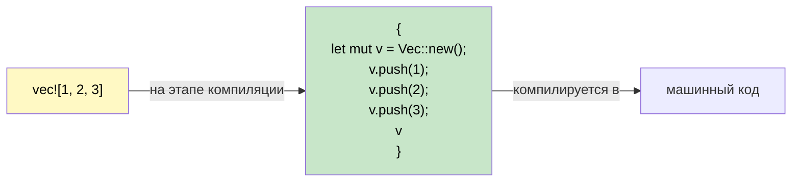

## Макросы: код, который пишет код

> **Что вы узнаете:** зачем Rust нужны макросы (нет перегрузки и вариативных аргументов), основы `macro_rules!`,
> соглашение о суффиксе `!`, распространённые производные макросы и `dbg!()` для быстрой отладки.
>
> **Сложность:** 🟡 Средний

В C# нет прямого аналога макросам Rust. Понимание того, зачем они нужны и как работают, устраняет крупный источник путаницы для разработчиков C#.

### Зачем в Rust нужны макросы



```csharp
// В C# есть возможности, которые делают макросы ненужными:
Console.WriteLine("Hello");           // Перегрузка методов (1–16 параметров)
Console.WriteLine("{0}, {1}", a, b);  // Вариативность через массив params
var list = new List<int> { 1, 2, 3 }; // Синтаксис инициализатора коллекции
```

```rust
// В Rust НЕТ перегрузки функций, НЕТ вариативных аргументов, НЕТ особого синтаксиса.
// Макросы закрывают эти пробелы:
println!("Hello");                    // Макрос — принимает 0 и более аргументов на этапе компиляции
println!("{}, {}", a, b);             // Макрос — типы проверяются на этапе компиляции
let list = vec![1, 2, 3];            // Макрос — раскрывается в Vec::new() + push()
```

### Распознавание макросов: суффикс `!`

Каждый вызов макроса заканчивается на `!`. Если вы видите `!`, это макрос, а не функция:

```rust
println!("hello");     // макрос — генерирует код форматирования на этапе компиляции
format!("{x}");        // макрос — возвращает String, проверка формата на этапе компиляции
vec![1, 2, 3];         // макрос — создаёт и заполняет Vec
todo!();               // макрос — паникует с сообщением "not yet implemented"
dbg!(expression);      // макрос — выводит файл:строку + выражение + значение, возвращает значение
assert_eq!(a, b);      // макрос — паникует с дифом, если a ≠ b
cfg!(target_os = "linux"); // макрос — определение платформы на этапе компиляции
```

### Простой макрос на `macro_rules!`
```rust
// Определяем макрос, который создаёт HashMap из пар ключ-значение
macro_rules! hashmap {
    // Шаблон: пары ключ => значение, разделённые запятыми
    ( $( $key:expr => $value:expr ),* $(,)? ) => {{
        let mut map = std::collections::HashMap::new();
        $( map.insert($key, $value); )*
        map
    }};
}

fn main() {
    let scores = hashmap! {
        "Alice" => 100,
        "Bob"   => 85,
        "Carol" => 92,
    };
    println!("{scores:?}");
}
```

### Производные макросы: автоматическая реализация трейтов
```rust
// #[derive] — это процедурный макрос, который генерирует реализации трейтов
#[derive(Debug, Clone, PartialEq, Eq, Hash)]
struct User {
    name: String,
    age: u32,
}
// Компилятор автоматически генерирует Debug::fmt, Clone::clone, PartialEq::eq и т. д.,
// анализируя поля структуры.
```

```csharp
// Аналога в C# нет — пришлось бы вручную реализовывать IEquatable, ICloneable и т. д.
// Или использовать records: public record User(string Name, int Age);
// Records автоматически генерируют Equals, GetHashCode, ToString — похожая идея!
```

### Распространённые производные макросы

| Derive | Назначение | Аналог в C# |
|--------|---------|---------------|
| `Debug` | Вывод в формате `{:?}` | Переопределение `ToString()` |
| `Clone` | Глубокое копирование через `.clone()` | `ICloneable` |
| `Copy` | Неявное побитовое копирование (`.clone()` не нужен) | Семантика значимого типа (`struct`) |
| `PartialEq`, `Eq` | Сравнение `==` | `IEquatable<T>` |
| `PartialOrd`, `Ord` | Сравнение `<`, `>` и сортировка | `IComparable<T>` |
| `Hash` | Хеширование для ключей `HashMap` | `GetHashCode()` |
| `Default` | Значения по умолчанию через `Default::default()` | Конструктор без параметров |
| `Serialize`, `Deserialize` | JSON/TOML и т. д. (serde) | Атрибуты `[JsonProperty]` |

> **Эмпирическое правило:** начинайте с `#[derive(Debug)]` на каждом типе. Добавляйте `Clone`, `PartialEq`, когда это нужно. Добавляйте `Serialize, Deserialize` для любого типа, который пересекает границу (API, файл, база данных).

### Процедурные и атрибутные макросы (на уровне понимания)

Производные макросы — это один из видов **процедурных макросов**: кода, который выполняется на этапе компиляции и генерирует код. Вы встретите ещё две формы:

**Атрибутные макросы** — присоединяются к элементам через `#[...]`:
```rust
#[tokio::main]          // превращает main() в точку входа асинхронного рантайма
async fn main() { }

#[test]                 // помечает функцию как модульный тест
fn it_works() { assert_eq!(2 + 2, 4); }

#[cfg(test)]            // условно компилирует этот модуль только во время тестирования
mod tests { /* ... */ }
```

**Функциональные макросы** — выглядят как вызовы функций:
```rust
// sqlx::query! проверяет ваш SQL по базе данных на этапе компиляции
let users = sqlx::query!("SELECT id, name FROM users WHERE active = $1", true)
    .fetch_all(&pool)
    .await?;
```

> **Ключевая мысль для разработчиков C#:** процедурные макросы вы редко *пишете* — это инструмент для авторов библиотек продвинутого уровня. Но вы *используете* их постоянно (`#[derive(...)]`, `#[tokio::main]`, `#[test]`). Думайте о них как об источниках генерации кода (source generators) в C#: вы получаете выгоду, не реализуя их сами.

### Условная компиляция через `#[cfg]`

Атрибуты `#[cfg]` в Rust похожи на директивы препроцессора `#if DEBUG` в C#, но с проверкой типов:

```rust
// Компилируем эту функцию только для Linux
#[cfg(target_os = "linux")]
fn platform_specific() {
    println!("Running on Linux");
}

// Проверки только для отладки (как Debug.Assert в C#)
#[cfg(debug_assertions)]
fn expensive_check(data: &[u8]) {
    assert!(data.len() < 1_000_000, "data unexpectedly large");
}

// Feature-флаги (как #if FEATURE_X в C#, но объявляются в Cargo.toml)
#[cfg(feature = "json")]
pub fn to_json<T: Serialize>(val: &T) -> String {
    serde_json::to_string(val).unwrap()
}
```

```csharp
// Аналог в C#
#if DEBUG
    Debug.Assert(data.Length < 1_000_000);
#endif
```

### `dbg!()` — ваш лучший друг при отладке
```rust
fn calculate(x: i32) -> i32 {
    let intermediate = dbg!(x * 2);     // выводит: [src/main.rs:3] x * 2 = 10
    let result = dbg!(intermediate + 1); // выводит: [src/main.rs:4] intermediate + 1 = 11
    result
}
// dbg! пишет в stderr, включает файл:строку и возвращает значение
// Гораздо полезнее, чем Console.WriteLine для отладки!
```

<details>
<summary><strong>🏋️ Упражнение: напишите макрос min!</strong> (нажмите, чтобы раскрыть)</summary>

**Задача**: напишите макрос `min!`, который принимает два или более аргументов и возвращает наименьший.

```rust
// Должно работать так:
let smallest = min!(5, 3, 8, 1, 4); // → 1
let pair = min!(10, 20);             // → 10
```

<details>
<summary>🔑 Решение</summary>

```rust
macro_rules! min {
    // Базовый случай: одно значение
    ($x:expr) => ($x);
    // Рекурсивно: сравниваем первое со минимумом остальных
    ($x:expr, $($rest:expr),+) => {{
        let first = $x;
        let rest = min!($($rest),+);
        if first < rest { first } else { rest }
    }};
}

fn main() {
    assert_eq!(min!(5, 3, 8, 1, 4), 1);
    assert_eq!(min!(10, 20), 10);
    assert_eq!(min!(42), 42);
    println!("All assertions passed!");
}
```

**Ключевая мысль**: `macro_rules!` выполняет сопоставление с образцом по деревьям токенов — это как `match`, только для структуры кода, а не значений.

</details>
</details>

***


