## Потокобезопасность: соглашение против гарантий системы типов

> **Что вы узнаете:** как Rust обеспечивает потокобезопасность на этапе компиляции в отличие от подхода C# на основе соглашений,
> `Arc<Mutex<T>>` против `lock`, каналы против `ConcurrentQueue`, трейты `Send`/`Sync`,
> ограниченные по области потоки и переход к async/await.
>
> **Сложность:** 🔴 Продвинутый

> **Глубокое погружение**: о производственных асинхронных паттернах (обработка потоков, корректное завершение, пулы соединений, безопасность отмены) см. сопутствующее руководство [Async Rust Training](../../async-book/src/summary.md).
>
> **Предварительные требования**: [Владение и заимствование](ch07-ownership-and-borrowing.md) и [Умные указатели](ch07-3-smart-pointers-beyond-single-ownership.md) (дерево решений Rc против Arc).

### C# — потокобезопасность по соглашению
```csharp
// Коллекции в C# по умолчанию не потокобезопасны
public class UserService
{
    private readonly List<string> items = new();
    private readonly Dictionary<int, User> cache = new();

    // Это может привести к гонкам данных:
    public void AddItem(string item)
    {
        items.Add(item);  // Не потокобезопасно!
    }

    // Приходится вручную использовать блокировки:
    private readonly object lockObject = new();

    public void SafeAddItem(string item)
    {
        lock (lockObject)
        {
            items.Add(item);  // Безопасно, но есть накладные расходы рантайма
        }
        // Легко забыть о блокировке в другом месте
    }

    // ConcurrentCollection помогает, но возможности ограничены
    private readonly ConcurrentBag<string> safeItems = new();
    
    public void ConcurrentAdd(string item)
    {
        safeItems.Add(item);  // Потокобезопасно, но операции ограничены
    }

    // Сложное управление разделяемым состоянием
    private readonly ConcurrentDictionary<int, User> threadSafeCache = new();
    private volatile bool isShutdown = false;
    
    public async Task ProcessUser(int userId)
    {
        if (isShutdown) return;  // Возможна гонка!
        
        var user = await GetUser(userId);
        threadSafeCache.TryAdd(userId, user);  // Нужно помнить, какие коллекции безопасны
    }

    // Локальное для потока хранилище требует аккуратного управления
    private static readonly ThreadLocal<Random> threadLocalRandom = 
        new ThreadLocal<Random>(() => new Random());
        
    public int GetRandomNumber()
    {
        return threadLocalRandom.Value.Next();  // Безопасно, но управление вручную
    }
}

// Обработка событий с возможными гонками
public class EventProcessor
{
    public event Action<string> DataReceived;
    private readonly List<string> eventLog = new();
    
    public void OnDataReceived(string data)
    {
        // Гонка: обработчик может стать null между проверкой и вызовом
        if (DataReceived != null)
        {
            DataReceived(data);
        }
        // Современный C# (6+) смягчает гонку на null через: DataReceived?.Invoke(data);
        // но модель событий-делегатов по-прежнему допускает гонки на списке ниже
        
        // Ещё одна гонка — список не потокобезопасен
        eventLog.Add($"Processed: {data}");
    }
}
```

### Rust — потокобезопасность гарантируется системой типов
```rust
use std::sync::{Arc, Mutex, RwLock};
use std::thread;
use std::collections::HashMap;
use tokio::sync::{mpsc, broadcast};

// Rust предотвращает гонки данных на этапе компиляции
pub struct UserService {
    items: Arc<Mutex<Vec<String>>>,
    cache: Arc<RwLock<HashMap<i32, User>>>,
}

impl UserService {
    pub fn new() -> Self {
        UserService {
            items: Arc::new(Mutex::new(Vec::new())),
            cache: Arc::new(RwLock::new(HashMap::new())),
        }
    }
    
    pub fn add_item(&self, item: String) {
        let mut items = self.items.lock().unwrap();
        items.push(item);
        // Блокировка автоматически освобождается, когда `items` выходит из области видимости
    }
    
    // Несколько читателей, один писатель — обеспечивается автоматически
    pub async fn get_user(&self, user_id: i32) -> Option<User> {
        let cache = self.cache.read().unwrap();
        cache.get(&user_id).cloned()
    }
    
    pub async fn cache_user(&self, user_id: i32, user: User) {
        let mut cache = self.cache.write().unwrap();
        cache.insert(user_id, user);
    }
    
    // Клонируем Arc для совместного использования между потоками
    pub fn process_in_background(&self) {
        let items = Arc::clone(&self.items);
        
        thread::spawn(move || {
            let items = items.lock().unwrap();
            for item in items.iter() {
                println!("Processing: {}", item);
            }
        });
    }
}

// Взаимодействие через каналы — разделяемое состояние не нужно
pub struct MessageProcessor {
    sender: mpsc::UnboundedSender<String>,
}

impl MessageProcessor {
    pub fn new() -> (Self, mpsc::UnboundedReceiver<String>) {
        let (tx, rx) = mpsc::unbounded_channel();
        (MessageProcessor { sender: tx }, rx)
    }
    
    pub fn send_message(&self, message: String) -> Result<(), mpsc::error::SendError<String>> {
        self.sender.send(message)
    }
}

// Этот код не скомпилируется — Rust не даёт небезопасно разделять изменяемые данные:
fn impossible_data_race() {
    let mut items = vec![1, 2, 3];
    
    // Не скомпилируется — нельзя переместить `items` в несколько замыканий
    /*
    thread::spawn(move || {
        items.push(4);  // ОШИБКА: использование перемещённого значения
    });
    
    thread::spawn(move || {
        items.push(5);  // ОШИБКА: использование перемещённого значения
    });
    */
}

// Безопасная параллельная обработка данных
use rayon::prelude::*;

fn parallel_processing() {
    let data = vec![1, 2, 3, 4, 5];
    
    // Параллельная итерация — потокобезопасность гарантирована
    let results: Vec<i32> = data
        .par_iter()
        .map(|&x| x * x)
        .collect();
        
    println!("{:?}", results);
}

// Асинхронная конкурентность с передачей сообщений
async fn async_message_passing() {
    let (tx, mut rx) = mpsc::channel(100);
    
    // Задача-производитель
    let producer = tokio::spawn(async move {
        for i in 0..10 {
            if tx.send(i).await.is_err() {
                break;
            }
        }
    });
    
    // Задача-потребитель
    let consumer = tokio::spawn(async move {
        while let Some(value) = rx.recv().await {
            println!("Received: {}", value);
        }
    });
    
    // Ждём обе задачи
    let (producer_result, consumer_result) = tokio::join!(producer, consumer);
    producer_result.unwrap();
    consumer_result.unwrap();
}

#[derive(Clone)]
struct User {
    id: i32,
    name: String,
}
```



```mermaid
graph TD
    subgraph "Проблемы потокобезопасности в C#"
        CS_MANUAL["Ручная синхронизация"]
        CS_LOCKS["Инструкции lock"]
        CS_CONCURRENT["Потокобезопасные коллекции"]
        CS_VOLATILE["Поля volatile"]
        CS_FORGET["😰 Легко забыть блокировки"]
        CS_DEADLOCK["💀 Возможны взаимные блокировки"]
        CS_RACE["🏃 Гонки данных"]
        CS_OVERHEAD["⚡ Накладные расходы рантайма"]
        
        CS_MANUAL --> CS_LOCKS
        CS_MANUAL --> CS_CONCURRENT
        CS_MANUAL --> CS_VOLATILE
        CS_LOCKS --> CS_FORGET
        CS_LOCKS --> CS_DEADLOCK
        CS_FORGET --> CS_RACE
        CS_LOCKS --> CS_OVERHEAD
    end
    
    subgraph "Гарантии системы типов Rust"
        RUST_OWNERSHIP["Система владения"]
        RUST_BORROWING["Проверщик заимствований"]
        RUST_SEND["Трейт Send"]
        RUST_SYNC["Трейт Sync"]
        RUST_ARC["Arc<Mutex<T>>"]
        RUST_CHANNELS["Передача сообщений"]
        RUST_SAFE["✅ Гонки данных невозможны"]
        RUST_FAST["⚡ Абстракции с нулевой стоимостью"]
        
        RUST_OWNERSHIP --> RUST_BORROWING
        RUST_BORROWING --> RUST_SEND
        RUST_SEND --> RUST_SYNC
        RUST_SYNC --> RUST_ARC
        RUST_ARC --> RUST_CHANNELS
        RUST_CHANNELS --> RUST_SAFE
        RUST_SAFE --> RUST_FAST
    end
    
    style CS_FORGET fill:#ffcdd2,color:#000
    style CS_DEADLOCK fill:#ffcdd2,color:#000
    style CS_RACE fill:#ffcdd2,color:#000
    style RUST_SAFE fill:#c8e6c9,color:#000
    style RUST_FAST fill:#c8e6c9,color:#000
```

***


<details>
<summary><strong>🏋️ Упражнение: потокобезопасный счётчик</strong> (нажмите, чтобы раскрыть)</summary>

**Задача**: реализуйте потокобезопасный счётчик, который могут одновременно инкрементировать 10 потоков. Каждый поток увеличивает его 1000 раз. Итоговое значение должно быть ровно 10 000.

<details>
<summary>🔑 Решение</summary>

```rust
use std::sync::{Arc, Mutex};
use std::thread;

fn main() {
    let counter = Arc::new(Mutex::new(0u64));
    let mut handles = vec![];

    for _ in 0..10 {
        let counter = Arc::clone(&counter);
        handles.push(thread::spawn(move || {
            for _ in 0..1000 {
                let mut count = counter.lock().unwrap();
                *count += 1;
            }
        }));
    }

    for h in handles { h.join().unwrap(); }
    assert_eq!(*counter.lock().unwrap(), 10_000);
    println!("Final count: {}", counter.lock().unwrap());
}
```

**Или с атомарными типами (быстрее, без блокировок):**
```rust
use std::sync::atomic::{AtomicU64, Ordering};
use std::sync::Arc;
use std::thread;

fn main() {
    let counter = Arc::new(AtomicU64::new(0));
    let handles: Vec<_> = (0..10).map(|_| {
        let counter = Arc::clone(&counter);
        thread::spawn(move || {
            for _ in 0..1000 {
                counter.fetch_add(1, Ordering::Relaxed);
            }
        })
    }).collect();

    for h in handles { h.join().unwrap(); }
    assert_eq!(counter.load(Ordering::SeqCst), 10_000);
}
```

**Ключевая мысль**: `Arc<Mutex<T>>` — общий паттерн. Для простых счётчиков `AtomicU64` полностью избавляет от накладных расходов на блокировки.

</details>
</details>

### Почему Rust предотвращает гонки данных: Send и Sync

Rust использует два маркерных трейта, чтобы обеспечивать потокобезопасность **на этапе компиляции** — аналога в C# нет:

- `Send`: тип можно безопасно **передать** в другой поток (например, переместить в замыкание, переданное в `thread::spawn`)
- `Sync`: тип можно безопасно **разделять** (через `&T`) между потоками

Большинство типов автоматически реализуют `Send + Sync`. Заметные исключения:
- `Rc<T>` **не** реализует ни Send, ни Sync — компилятор не даст передать его в `thread::spawn` (используйте `Arc<T>`)
- `Cell<T>` и `RefCell<T>` **не** реализуют Sync — для потокобезопасной внутренней изменяемости используйте `Mutex<T>` или `RwLock<T>`
- Сырые указатели (`*const T`, `*mut T`) **не** реализуют ни Send, ни Sync

В C# `List<T>` не потокобезопасен, но компилятор не помешает разделить его между потоками. В Rust такая же ошибка — это **ошибка компиляции**, а не гонка во время выполнения.

### Ограниченные по области потоки: заимствование из стека

`thread::scope()` позволяет порождённым потокам заимствовать локальные переменные — `Arc` не нужен:

```rust
use std::thread;

fn main() {
    let data = vec![1, 2, 3, 4, 5];
    
    // Потоки в области видимости могут заимствовать 'data' — scope ждёт завершения всех потоков
    thread::scope(|s| {
        s.spawn(|| println!("Thread 1: {data:?}"));
        s.spawn(|| println!("Thread 2: sum = {}", data.iter().sum::<i32>()));
    });
    // 'data' здесь по-прежнему действителен — потоки гарантированно завершились
}
```

Это похоже на `Parallel.ForEach` в C# тем, что вызывающий код ждёт завершения, но проверщик заимствований Rust **доказывает** отсутствие гонок данных на этапе компиляции.

### Переход к async/await

Разработчики C# обычно используют `Task` и `async/await`, а не потоки напрямую. В Rust есть обе парадигмы:

| C# | Rust | Когда использовать |
|----|------|-------------|
| `Thread` | `std::thread::spawn` | Задачи, ограниченные CPU; один поток ОС на задачу |
| `Task.Run` | `tokio::spawn` | Асинхронная задача в рантайме |
| `async/await` | `async/await` | Конкурентность, ограниченная вводом-выводом |
| `lock` | `Mutex<T>` | Синхронная взаимная блокировка |
| `SemaphoreSlim` | `tokio::sync::Semaphore` | Ограничение асинхронной конкурентности |
| `Interlocked` | `std::sync::atomic` | Атомарные операции без блокировок |
| `CancellationToken` | `tokio_util::sync::CancellationToken` | Кооперативная отмена |

> Следующая глава ([Глубокое погружение в async/await](ch13-1-asyncawait-deep-dive.md)) подробно описывает асинхронную модель Rust — в том числе то, чем она отличается от модели C# на основе `Task`.

