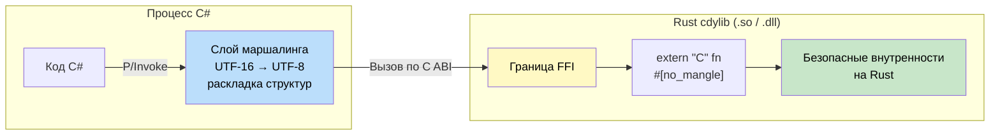

## Небезопасный Rust (unsafe Rust)

> **Что вы узнаете:** что разрешает `unsafe` (сырые указатели, FFI, непроверяемые приведения), паттерны безопасных обёрток,
> P/Invoke в C# против FFI в Rust для вызова нативного кода, а также чек-лист безопасности для блоков `unsafe`.
>
> **Сложность:** 🔴 Продвинутый

Unsafe Rust позволяет выполнять операции, которые проверщик заимствований не может верифицировать. Используйте его осторожно и с понятной документацией.

> **Расширенное описание**: о безопасных абстракциях поверх unsafe-кода (арена-аллокаторы, структуры без блокировок, пользовательские таблицы виртуальных методов) см. [Паттерны Rust](https://r007.github.io/RustTraining-Rus/rust-patterns-book/).

### Когда нужен unsafe

```rust
// 1. Разыменование сырых указателей
let mut value = 42;
let ptr = &mut value as *mut i32;
// SAFETY: ptr указывает на действительную, живую локальную переменную.
unsafe {
    *ptr = 100; // Должно находиться в блоке unsafe
}

// 2. Вызов небезопасных функций
unsafe fn dangerous() {
    // Внутренняя реализация, которая требует от вызывающего кода соблюдения инвариантов
}

// SAFETY: для этой примерной функции инвариантов нет.
unsafe {
    dangerous(); // Ответственность берёт на себя вызывающий код
}

// 3. Доступ к изменяемым статическим переменным
static mut COUNTER: u32 = 0;
// SAFETY: однопоточный контекст; параллельного доступа к COUNTER нет.
unsafe {
    COUNTER += 1; // Не потокобезопасно — вызывающий код должен обеспечить синхронизацию
}

// 4. Реализация небезопасных трейтов
unsafe trait UnsafeTrait {
    fn do_something(&self);
}
```

### Сравнение с C#: ключевое слово unsafe

```csharp
// unsafe в C# — похожая идея, но другой масштаб
unsafe void UnsafeExample()
{
    int value = 42;
    int* ptr = &value;
    *ptr = 100;
    
    // unsafe в C# — это про арифметику указателей
    // unsafe в Rust — это про ослабление правил владения и заимствования
}

// fixed в C# — закрепление управляемых объектов
unsafe void PinnedExample()
{
    byte[] buffer = new byte[100];
    fixed (byte* ptr = buffer)
    {
        // ptr действителен только внутри этого блока
    }
}
```

### Безопасные обёртки

```rust
/// Ключевой паттерн: оборачиваем небезопасный код в безопасный API
pub struct SafeBuffer {
    data: Vec<u8>,
}

impl SafeBuffer {
    pub fn new(size: usize) -> Self {
        SafeBuffer { data: vec![0; size] }
    }
    
    /// Безопасный API — доступ с проверкой границ
    pub fn get(&self, index: usize) -> Option<u8> {
        self.data.get(index).copied()
    }
    
    /// Быстрый доступ без проверки — небезопасный, но безопасно обёрнутый проверкой границ
    pub fn get_unchecked_safe(&self, index: usize) -> Option<u8> {
        if index < self.data.len() {
            // SAFETY: мы только что проверили, что index находится в границах
            Some(unsafe { *self.data.get_unchecked(index) })
        } else {
            None
        }
    }
}
```

***

## Взаимодействие с C# через FFI

Rust может экспортировать функции с C-совместимым интерфейсом, которые C# вызывает через P/Invoke.



### Библиотека Rust (собирается как cdylib)

```rust
// src/lib.rs
#[no_mangle]
pub extern "C" fn add_numbers(a: i32, b: i32) -> i32 {
    a + b
}

#[no_mangle]
pub extern "C" fn process_string(input: *const std::os::raw::c_char) -> i32 {
    // SAFETY: input проверяется на null внутри, а вызывающий код гарантирует null-терминированность.
    let c_str = unsafe {
        if input.is_null() {
            return -1;
        }
        std::ffi::CStr::from_ptr(input)
    };
    
    match c_str.to_str() {
        Ok(s) => s.len() as i32,
        Err(_) => -1,
    }
}
```

```toml
# Cargo.toml
[lib]
crate-type = ["cdylib"]
```

### Потребитель на C# (P/Invoke)

```csharp
using System.Runtime.InteropServices;

public static class RustInterop
{
    [DllImport("my_rust_lib", CallingConvention = CallingConvention.Cdecl)]
    public static extern int add_numbers(int a, int b);
    
    [DllImport("my_rust_lib", CallingConvention = CallingConvention.Cdecl)]
    public static extern int process_string(
        [MarshalAs(UnmanagedType.LPUTF8Str)] string input);
}

// Использование
int sum = RustInterop.add_numbers(5, 3);  // 8
int len = RustInterop.process_string("Hello from C#!");  // 15
```

### Чек-лист безопасности FFI

При экспорте функций Rust в C# эти правила предотвращают большинство частых ошибок:

1. **Всегда используйте `extern "C"`** — без него Rust применяет собственное (нестабильное) соглашение о вызовах. P/Invoke в C# ожидает C ABI.

2. **`#[no_mangle]`** — не даёт компилятору Rust менять имя функции. Без него C# не сможет найти символ.

3. **Никогда не пускайте панику через границу FFI** — раскрутка паники Rust внутрь C# является **неопределённым поведением**. Перехватывайте паники на входах в FFI:

    ```rust
    #[no_mangle]
    pub extern "C" fn safe_ffi_function() -> i32 {
        match std::panic::catch_unwind(|| {
            // реальная логика здесь
            42
        }) {
            Ok(result) => result,
            Err(_) => -1,  // Возвращаем код ошибки вместо паники внутрь C#
        }
    }
    ```

4. **Непрозрачные и прозрачные структуры** — если C# хранит только указатель (непрозрачный дескриптор), `#[repr(C)]` не нужен. Если C# читает поля структуры через `StructLayout`, `#[repr(C)]` **обязателен**:

    ```rust
    // Непрозрачная — C# хранит только IntPtr. #[repr(C)] не нужен.
    pub struct Connection { /* поля только для Rust */ }

    // Прозрачная — C# маршалирует поля напрямую. ОБЯЗАТЕЛЬНО #[repr(C)].
    #[repr(C)]
    pub struct Point { pub x: f64, pub y: f64 }
    ```

5. **Проверки на null-указатели** — всегда проверяйте указатели перед разыменованием. C# может передать `IntPtr.Zero`.

6. **Кодировка строк** — C# использует UTF-16 внутренне. `MarshalAs(UnmanagedType.LPUTF8Str)` конвертирует строку в UTF-8 для `CStr` в Rust. Этот контракт нужно явно документировать.

### Сквозной пример: непрозрачный дескриптор с управлением жизненным циклом

Этот паттерн распространён в продакшене: Rust владеет объектом, C# хранит непрозрачный дескриптор, а явные функции создания и уничтожения управляют жизненным циклом.

**Сторона Rust** (`src/lib.rs`):

```rust
use std::ffi::{c_char, CStr};

pub struct ImageProcessor {
    width: u32,
    height: u32,
    pixels: Vec<u8>,
}

/// Создаёт новый обработчик. Возвращает null при некорректных размерах.
#[no_mangle]
pub extern "C" fn processor_new(width: u32, height: u32) -> *mut ImageProcessor {
    if width == 0 || height == 0 {
        return std::ptr::null_mut();
    }
    let proc = ImageProcessor {
        width,
        height,
        pixels: vec![0u8; (width * height * 4) as usize],
    };
    Box::into_raw(Box::new(proc)) // Выделяем в куче, возвращаем сырой указатель
}

/// Применяет фильтр оттенков серого. Возвращает 0 при успехе, -1 при null-указателе.
#[no_mangle]
pub extern "C" fn processor_grayscale(ptr: *mut ImageProcessor) -> i32 {
    // SAFETY: ptr был создан через Box::into_raw (не null), всё ещё действителен.
    let proc = match unsafe { ptr.as_mut() } {
        Some(p) => p,
        None => return -1,
    };
    for chunk in proc.pixels.chunks_exact_mut(4) {
        let gray = (0.299 * chunk[0] as f64
                  + 0.587 * chunk[1] as f64
                  + 0.114 * chunk[2] as f64) as u8;
        chunk[0] = gray;
        chunk[1] = gray;
        chunk[2] = gray;
    }
    0
}

/// Уничтожает обработчик. Безопасно вызывать с null.
#[no_mangle]
pub extern "C" fn processor_free(ptr: *mut ImageProcessor) {
    if !ptr.is_null() {
        // SAFETY: ptr был создан через processor_new с помощью Box::into_raw
        unsafe { drop(Box::from_raw(ptr)); }
    }
}
```

**Сторона C#**:

```csharp
using System.Runtime.InteropServices;

public sealed class ImageProcessor : IDisposable
{
    [DllImport("image_rust", CallingConvention = CallingConvention.Cdecl)]
    private static extern IntPtr processor_new(uint width, uint height);

    [DllImport("image_rust", CallingConvention = CallingConvention.Cdecl)]
    private static extern int processor_grayscale(IntPtr ptr);

    [DllImport("image_rust", CallingConvention = CallingConvention.Cdecl)]
    private static extern void processor_free(IntPtr ptr);

    private IntPtr _handle;

    public ImageProcessor(uint width, uint height)
    {
        _handle = processor_new(width, height);
        if (_handle == IntPtr.Zero)
            throw new ArgumentException("Invalid dimensions");
    }

    public void Grayscale()
    {
        if (processor_grayscale(_handle) != 0)
            throw new InvalidOperationException("Processor is null");
    }

    public void Dispose()
    {
        if (_handle != IntPtr.Zero)
        {
            processor_free(_handle);
            _handle = IntPtr.Zero;
        }
    }
}

// Использование — IDisposable гарантирует освобождение памяти Rust
using var proc = new ImageProcessor(1920, 1080);
proc.Grayscale();
// proc.Dispose() вызывается автоматически → processor_free() → Rust освобождает Vec
```

> **Ключевая мысль**: это аналог паттерна `SafeHandle` в C#. `Box::into_raw` / `Box::from_raw` передают владение через границу FFI, а обёртка `IDisposable` в C# обеспечивает очистку.

---

## Упражнения

<details>
<summary><strong>🏋️ Упражнение: безопасная обёртка над сырым указателем</strong> (нажмите, чтобы раскрыть)</summary>

Вы получаете сырой указатель из C-библиотеки. Напишите безопасную обёртку на Rust:

```rust
// Имитация C API
extern "C" {
    fn lib_create_buffer(size: usize) -> *mut u8;
    fn lib_free_buffer(ptr: *mut u8);
}
```

Требования:

1. Создайте структуру `SafeBuffer`, которая оборачивает сырой указатель
2. Реализуйте `Drop`, который вызывает `lib_free_buffer`
3. Предоставьте безопасное представление `&[u8]` через `as_slice()`
4. Убедитесь, что `SafeBuffer::new()` возвращает `None`, если указатель null

<details>
<summary>🔑 Решение</summary>

```rust,ignore
struct SafeBuffer {
    ptr: *mut u8,
    len: usize,
}

impl SafeBuffer {
    fn new(size: usize) -> Option<Self> {
        // SAFETY: lib_create_buffer возвращает действительный указатель или null (проверяется ниже).
        let ptr = unsafe { lib_create_buffer(size) };
        if ptr.is_null() {
            None
        } else {
            Some(SafeBuffer { ptr, len: size })
        }
    }

    fn as_slice(&self) -> &[u8] {
        // SAFETY: ptr не null (проверено в new()), len — это выделенный размер,
        // и мы владеем буфером монопольно.
        unsafe { std::slice::from_raw_parts(self.ptr, self.len) }
    }
}

impl Drop for SafeBuffer {
    fn drop(&mut self) {
        // SAFETY: ptr был выделен через lib_create_buffer
        unsafe { lib_free_buffer(self.ptr); }
    }
}

// Использование: весь unsafe сосредоточен внутри SafeBuffer
fn process(buf: &SafeBuffer) {
    let data = buf.as_slice(); // полностью безопасный API
    println!("First byte: {}", data[0]);
}
```

**Ключевой паттерн**: инкапсулируйте `unsafe` в небольшом модуле с комментариями `// SAFETY:`. Открывайте наружу полностью безопасный публичный API. Так устроена стандартная библиотека Rust — `Vec`, `String`, `HashMap` внутри содержат unsafe-код, но предоставляют безопасные интерфейсы.

</details>
</details>

***

