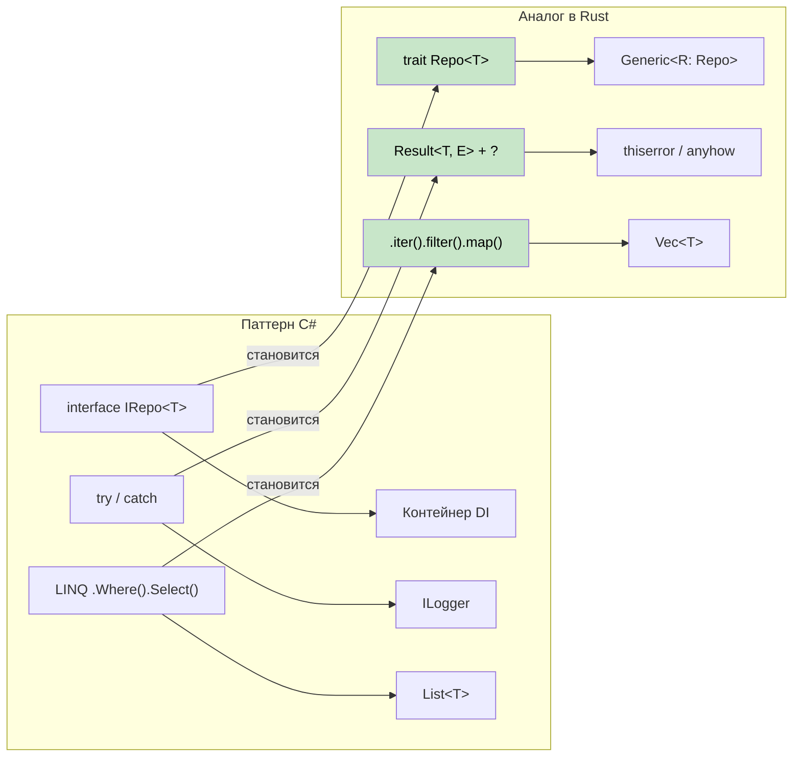

## Распространённые паттерны C# в Rust

> **Что вы узнаете:** как переводить с C# на идиоматичный Rust паттерн Repository, паттерн Builder, внедрение зависимостей,
> цепочки LINQ, запросы Entity Framework и паттерны конфигурации.
>
> **Сложность:** 🟡 Средний



### Паттерн Repository
```csharp
// Паттерн Repository в C#
public interface IRepository<T> where T : IEntity
{
    Task<T> GetByIdAsync(int id);
    Task<IEnumerable<T>> GetAllAsync();
    Task<T> AddAsync(T entity);
    Task UpdateAsync(T entity);
    Task DeleteAsync(int id);
}

public class UserRepository : IRepository<User>
{
    private readonly DbContext _context;
    
    public UserRepository(DbContext context)
    {
        _context = context;
    }
    
    public async Task<User> GetByIdAsync(int id)
    {
        return await _context.Users.FindAsync(id);
    }
    
    // ... остальные реализации
}
```

```rust
// Паттерн Repository в Rust с трейтами и обобщениями
use async_trait::async_trait;
use std::fmt::Debug;

#[async_trait]
pub trait Repository<T, E> 
where 
    T: Clone + Debug + Send + Sync,
    E: std::error::Error + Send + Sync,
{
    async fn get_by_id(&self, id: u64) -> Result<Option<T>, E>;
    async fn get_all(&self) -> Result<Vec<T>, E>;
    async fn add(&self, entity: T) -> Result<T, E>;
    async fn update(&self, entity: T) -> Result<T, E>;
    async fn delete(&self, id: u64) -> Result<(), E>;
}

#[derive(Debug, Clone)]
pub struct User {
    pub id: u64,
    pub name: String,
    pub email: String,
}

#[derive(Debug)]
pub enum RepositoryError {
    NotFound(u64),
    DatabaseError(String),
    ValidationError(String),
}

impl std::fmt::Display for RepositoryError {
    fn fmt(&self, f: &mut std::fmt::Formatter<'_>) -> std::fmt::Result {
        match self {
            RepositoryError::NotFound(id) => write!(f, "Entity with id {} not found", id),
            RepositoryError::DatabaseError(msg) => write!(f, "Database error: {}", msg),
            RepositoryError::ValidationError(msg) => write!(f, "Validation error: {}", msg),
        }
    }
}

impl std::error::Error for RepositoryError {}

pub struct UserRepository {
    // пул соединений с базой данных и т. д.
}

#[async_trait]
impl Repository<User, RepositoryError> for UserRepository {
    async fn get_by_id(&self, id: u64) -> Result<Option<User>, RepositoryError> {
        // Имитация поиска в базе данных
        if id == 0 {
            return Ok(None);
        }
        
        Ok(Some(User {
            id,
            name: format!("User {}", id),
            email: format!("user{}@example.com", id),
        }))
    }
    
    async fn get_all(&self) -> Result<Vec<User>, RepositoryError> {
        // Реализация здесь
        Ok(vec![])
    }
    
    async fn add(&self, entity: User) -> Result<User, RepositoryError> {
        // Валидация и вставка в базу данных
        if entity.name.is_empty() {
            return Err(RepositoryError::ValidationError("Name cannot be empty".to_string()));
        }
        Ok(entity)
    }
    
    async fn update(&self, entity: User) -> Result<User, RepositoryError> {
        // Реализация здесь
        Ok(entity)
    }
    
    async fn delete(&self, id: u64) -> Result<(), RepositoryError> {
        // Реализация здесь
        Ok(())
    }
}
```

### Паттерн Builder
```csharp
// Паттерн Builder в C# (текучий интерфейс)
public class HttpClientBuilder
{
    private TimeSpan? _timeout;
    private string _baseAddress;
    private Dictionary<string, string> _headers = new();
    
    public HttpClientBuilder WithTimeout(TimeSpan timeout)
    {
        _timeout = timeout;
        return this;
    }
    
    public HttpClientBuilder WithBaseAddress(string baseAddress)
    {
        _baseAddress = baseAddress;
        return this;
    }
    
    public HttpClientBuilder WithHeader(string name, string value)
    {
        _headers[name] = value;
        return this;
    }
    
    public HttpClient Build()
    {
        var client = new HttpClient();
        if (_timeout.HasValue)
            client.Timeout = _timeout.Value;
        if (!string.IsNullOrEmpty(_baseAddress))
            client.BaseAddress = new Uri(_baseAddress);
        foreach (var header in _headers)
            client.DefaultRequestHeaders.Add(header.Key, header.Value);
        return client;
    }
}

// Использование
var client = new HttpClientBuilder()
    .WithTimeout(TimeSpan.FromSeconds(30))
    .WithBaseAddress("https://api.example.com")
    .WithHeader("Accept", "application/json")
    .Build();
```

```rust
// Паттерн Builder в Rust (потребляющий builder)
use std::collections::HashMap;
use std::time::Duration;

#[derive(Debug)]
pub struct HttpClient {
    timeout: Duration,
    base_address: String,
    headers: HashMap<String, String>,
}

pub struct HttpClientBuilder {
    timeout: Option<Duration>,
    base_address: Option<String>,
    headers: HashMap<String, String>,
}

impl HttpClientBuilder {
    pub fn new() -> Self {
        HttpClientBuilder {
            timeout: None,
            base_address: None,
            headers: HashMap::new(),
        }
    }
    
    pub fn with_timeout(mut self, timeout: Duration) -> Self {
        self.timeout = Some(timeout);
        self
    }
    
    pub fn with_base_address<S: Into<String>>(mut self, base_address: S) -> Self {
        self.base_address = Some(base_address.into());
        self
    }
    
    pub fn with_header<K: Into<String>, V: Into<String>>(mut self, name: K, value: V) -> Self {
        self.headers.insert(name.into(), value.into());
        self
    }
    
    pub fn build(self) -> Result<HttpClient, String> {
        let base_address = self.base_address.ok_or("Base address is required")?;
        
        Ok(HttpClient {
            timeout: self.timeout.unwrap_or(Duration::from_secs(30)),
            base_address,
            headers: self.headers,
        })
    }
}

// Использование
let client = HttpClientBuilder::new()
    .with_timeout(Duration::from_secs(30))
    .with_base_address("https://api.example.com")
    .with_header("Accept", "application/json")
    .build()?;

// Альтернатива: трейт Default для типичных случаев
impl Default for HttpClientBuilder {
    fn default() -> Self {
        Self::new()
    }
}
```

***

## Сопоставление концепций C# и Rust

### Внедрение зависимостей → внедрение через конструктор и трейты
```csharp
// C# с контейнером DI
services.AddScoped<IUserRepository, UserRepository>();
services.AddScoped<IUserService, UserService>();

public class UserService
{
    private readonly IUserRepository _repository;
    
    public UserService(IUserRepository repository)
    {
        _repository = repository;
    }
}
```

```rust
// Rust: внедрение через конструктор с трейтами
pub trait UserRepository {
    async fn find_by_id(&self, id: Uuid) -> Result<Option<User>, Error>;
    async fn save(&self, user: &User) -> Result<(), Error>;
}

pub struct UserService<R> 
where 
    R: UserRepository,
{
    repository: R,
}

impl<R> UserService<R> 
where 
    R: UserRepository,
{
    pub fn new(repository: R) -> Self {
        Self { repository }
    }
    
    pub async fn get_user(&self, id: Uuid) -> Result<Option<User>, Error> {
        self.repository.find_by_id(id).await
    }
}

// Использование
let repository = PostgresUserRepository::new(pool);
let service = UserService::new(repository);
```

### LINQ → цепочки итераторов
```csharp
// LINQ в C#
var result = users
    .Where(u => u.Age > 18)
    .Select(u => u.Name.ToUpper())
    .OrderBy(name => name)
    .Take(10)
    .ToList();
```

```rust
// Rust: цепочки итераторов (с нулевой стоимостью!)
let mut result: Vec<String> = users
    .iter()
    .filter(|u| u.age > 18)
    .map(|u| u.name.to_uppercase())
    .collect();
result.sort();
result.truncate(10);

// Или с крейтом itertools для более LINQ-подобной цепочки
use itertools::Itertools;

let result: Vec<String> = users
    .iter()
    .filter(|u| u.age > 18)
    .map(|u| u.name.to_uppercase())
    .sorted()
    .take(10)
    .collect();
```

### Entity Framework → SQLx и миграции
```csharp
// Entity Framework в C#
public class ApplicationDbContext : DbContext
{
    public DbSet<User> Users { get; set; }
}

var user = await context.Users
    .Where(u => u.Email == email)
    .FirstOrDefaultAsync();
```

```rust
// Rust: SQLx с запросами, проверяемыми на этапе компиляции
use sqlx::{PgPool, FromRow};

#[derive(FromRow)]
struct User {
    id: Uuid,
    email: String,
    name: String,
}

// Запрос, проверяемый на этапе компиляции
let user = sqlx::query_as!(
    User,
    "SELECT id, email, name FROM users WHERE email = $1",
    email
)
.fetch_optional(&pool)
.await?;

// Или динамический запрос
let user = sqlx::query_as::<_, User>(
    "SELECT id, email, name FROM users WHERE email = $1"
)
.bind(email)
.fetch_optional(&pool)
.await?;
```

### Конфигурация → крейты конфигурации
```csharp
// Конфигурация в C#
public class AppSettings
{
    public string DatabaseUrl { get; set; }
    public int Port { get; set; }
}

var config = builder.Configuration.Get<AppSettings>();
```

```rust
// Rust: конфигурация через serde
use config::{Config, ConfigError, Environment, File};
use serde::Deserialize;

#[derive(Debug, Deserialize)]
struct AppSettings {
    database_url: String,
    port: u16,
}

impl AppSettings {
    pub fn new() -> Result<Self, ConfigError> {
        let s = Config::builder()
            .add_source(File::with_name("config/default"))
            .add_source(Environment::with_prefix("APP"))
            .build()?;

        s.try_deserialize()
    }
}

// Использование
let settings = AppSettings::new()?;
```

---

## Разборы случаев

### Случай 1: миграция CLI-утилиты (csvtool)

**Контекст**: команда поддерживала консольное приложение на C# (`CsvProcessor`), которое читало большие CSV-файлы, применяло преобразования и записывало результат. При файлах в 500 МБ потребление памяти подскакивало до 4 ГБ, а паузы GC вызывали зависания на 30 секунд.

**Подход к миграции**: переписали на Rust за 2 недели, по одному модулю за раз.

| Шаг | Что изменилось | C# → Rust |
|------|-------------|-----------|
| 1 | Разбор CSV | `CsvHelper` → крейт `csv` (потоковый `Reader`) |
| 2 | Модель данных | `class Record` → `struct Record` (размещается на стеке, `#[derive(Deserialize)]`) |
| 3 | Преобразования | LINQ `.Select().Where()` → `.iter().map().filter()` |
| 4 | Файловый ввод-вывод | `StreamReader` → `BufReader<File>` с распространением ошибок через `?` |
| 5 | Аргументы CLI | `System.CommandLine` → `clap` с derive-макросами |
| 6 | Параллельная обработка | `Parallel.ForEach` → `.par_iter()` из `rayon` |

**Результаты**:
- Память: 4 ГБ → 12 МБ (потоковая обработка вместо загрузки всего файла)
- Скорость: 45 с → 3 с для файла в 500 МБ
- Размер бинарника: один исполняемый файл 2 МБ, без зависимости от рантайма

**Главный урок**: основной выигрыш был не в самом Rust — а в том, что модель владения Rust *вынуждала* к потоковому дизайну. В C# было легко сделать `.ToList()` и загрузить всё в память. В Rust проверщик заимствований естественно подталкивал к обработке на основе `Iterator`.

### Случай 2: замена микросервиса (auth-gateway)

**Контекст**: шлюз аутентификации на C# ASP.NET Core отвечал за валидацию JWT и ограничение частоты запросов для более чем 50 бэкенд-сервисов. При 10 000 запросов в секунду p99-задержка достигала 200 мс из-за всплесков GC.

**Подход к миграции**: заменили на сервис на Rust с использованием `axum` + `tower`, сохранив тот же контракт API.

```rust
// Было (C#):  services.AddAuthentication().AddJwtBearer(...)
// Стало (Rust): слой middleware из tower

use axum::{Router, middleware};
use tower::ServiceBuilder;

let app = Router::new()
    .route("/api/*path", any(proxy_handler))
    .layer(
        ServiceBuilder::new()
            .layer(middleware::from_fn(validate_jwt))
            .layer(middleware::from_fn(rate_limit))
    );
```

| Метрика | C# (ASP.NET Core) | Rust (axum) |
|--------|-------------------|-------------|
| p50-задержка | 5 мс | 0,8 мс |
| p99-задержка | 200 мс (всплески GC) | 4 мс |
| Память | 300 МБ | 8 МБ |
| Docker-образ | 210 МБ (рантайм .NET) | 12 МБ (статический бинарник) |
| Холодный старт | 2,1 с | 0,05 с |

**Ключевые уроки**:
1. **Сохраните тот же контракт API** — изменения на стороне клиентов не нужны. Сервис на Rust стал прямой заменой.
2. **Начните с горячего пути** — узким местом была валидация JWT. Миграция только этого middleware дала бы 80% выигрыша.
3. **Используйте middleware `tower`** — он повторяет конвейер middleware ASP.NET Core, поэтому разработчикам C# архитектура на Rust показалась знакомой.
4. **Улучшение p99-задержки** пришло от устранения пауз GC, а не от более быстрого кода — установившаяся пропускная способность Rust была лишь примерно в 2 раза выше, но отсутствие GC сделало «хвост» задержек предсказуемым.

---

## Упражнения

<details>
<summary><strong>🏋️ Упражнение: мигрируйте сервис на C#</strong> (нажмите, чтобы раскрыть)</summary>

Переведите этот сервис на C# на идиоматичный Rust:

```csharp
public interface IUserService
{
    Task<User?> GetByIdAsync(int id);
    Task<List<User>> SearchAsync(string query);
}

public class UserService : IUserService
{
    private readonly IDatabase _db;
    public UserService(IDatabase db) { _db = db; }

    public async Task<User?> GetByIdAsync(int id)
    {
        try { return await _db.QuerySingleAsync<User>(id); }
        catch (NotFoundException) { return null; }
    }

    public async Task<List<User>> SearchAsync(string query)
    {
        return await _db.QueryAsync<User>($"SELECT * WHERE name LIKE '%{query}%'");
    }
}
```

**Подсказки**: используйте трейт, `Option<User>` вместо null, `Result` вместо try/catch, и устраните уязвимость SQL-инъекции.

<details>
<summary>🔑 Решение</summary>

```rust
use async_trait::async_trait;

#[derive(Debug, Clone)]
struct User { id: i64, name: String }

#[async_trait]
trait Database: Send + Sync {
    async fn get_user(&self, id: i64) -> Result<Option<User>, sqlx::Error>;
    async fn search_users(&self, query: &str) -> Result<Vec<User>, sqlx::Error>;
}

#[async_trait]
trait UserService: Send + Sync {
    async fn get_by_id(&self, id: i64) -> Result<Option<User>, AppError>;
    async fn search(&self, query: &str) -> Result<Vec<User>, AppError>;
}

struct UserServiceImpl<D: Database> {
    db: D,  // Arc не нужен — владение Rust справляется с этим само
}

#[async_trait]
impl<D: Database> UserService for UserServiceImpl<D> {
    async fn get_by_id(&self, id: i64) -> Result<Option<User>, AppError> {
        // Option вместо null; Result вместо try/catch
        Ok(self.db.get_user(id).await?)
    }

    async fn search(&self, query: &str) -> Result<Vec<User>, AppError> {
        // Параметризованный запрос — НИКАКИХ SQL-инъекций!
        // (sqlx использует плейсхолдеры $1, а не интерполяцию строк)
        self.db.search_users(query).await.map_err(Into::into)
    }
}
```

**Ключевые изменения по сравнению с C#**:
- `null` → `Option<User>` (null-безопасность на этапе компиляции)
- `try/catch` → `Result` + `?` (явное распространение ошибок)
- SQL-инъекция устранена: параметризованные запросы вместо интерполяции строк
- `IDatabase _db` → обобщение `D: Database` (статическая диспетчеризация, без упаковки)

</details>
</details>

***


