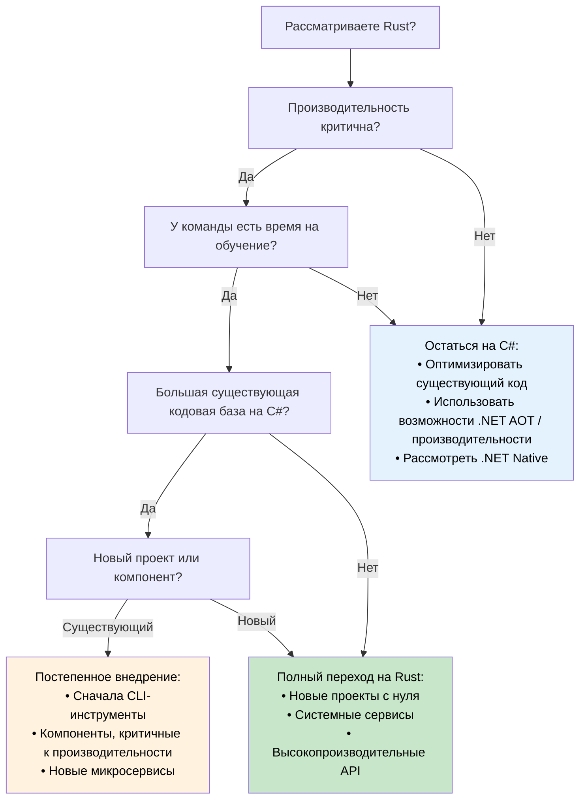

## Сравнение производительности: управляемый и нативный код

> **Что вы узнаете:** реальные различия в производительности между C# и Rust — время запуска, потребление памяти,
> бенчмарки пропускной способности, задачи, интенсивные по CPU, а также дерево решений о том,
> когда стоит мигрировать, а когда остаться на C#.
>
> **Сложность:** 🟡 Средний

### Реальные характеристики производительности

| **Аспект** | **C# (.NET)** | **Rust** | **Влияние на производительность** |
|------------|---------------|----------|------------------------|
| **Время запуска** | 100–500 мс (JIT); 5–30 мс (.NET 8 AOT) | 1–10 мс (нативный бинарник) | 🚀 **В 10–50 раз быстрее** (относительно JIT) |
| **Потребление памяти** | +30–100% (накладные расходы GC и метаданных) | Базовый уровень (минимальный рантайм) | 💾 **На 30–50% меньше RAM** |
| **Паузы GC** | Периодические паузы 1–100 мс | Никогда (нет GC) | ⚡ **Стабильная задержка** |
| **Загрузка CPU** | +10–20% (накладные расходы GC и JIT) | Базовый уровень (прямое исполнение) | 🔋 **На 10–20% эффективнее** |
| **Размер бинарника** | 30–200 МБ (с рантаймом); 10–30 МБ (AOT с обрезкой) | 1–20 МБ (статический бинарник) | 📦 **Компактнее развёртывание** |
| **Безопасность памяти** | Проверки во время выполнения | Доказательства на этапе компиляции | 🛡️ **Безопасность без накладных расходов** |
| **Производительность при конкурентности** | Хорошая (при аккуратной синхронизации) | Отличная (конкурентность без страха) | 🏃 **Превосходная масштабируемость** |

> **Примечание о .NET 8+ AOT**: нативная AOT-компиляция существенно сокращает разрыв во времени запуска (5–30 мс). По пропускной способности и памяти накладные расходы GC и паузы сохраняются. Оценивая миграцию, измеряйте производительность на *вашей конкретной нагрузке* — цифры из заголовков могут вводить в заблуждение.

### Примеры бенчмарков

```csharp
// C# — бенчмарк обработки JSON
public class JsonProcessor
{
    public async Task<List<User>> ProcessJsonFile(string path)
    {
        var json = await File.ReadAllTextAsync(path);
        var users = JsonSerializer.Deserialize<List<User>>(json);
        
        return users.Where(u => u.Age > 18)
                   .OrderBy(u => u.Name)
                   .Take(1000)
                   .ToList();
    }
}

// Типичная производительность: ~200 мс для файла 100 МБ
// Пиковое потребление памяти: ~500 МБ (накладные расходы GC)
// Размер бинарника: ~80 МБ (самодостаточный)
```

```rust
// Rust — эквивалентная обработка JSON
use serde::{Deserialize, Serialize};
use tokio::fs;

#[derive(Deserialize, Serialize)]
struct User {
    name: String,
    age: u32,
}

pub async fn process_json_file(path: &str) -> Result<Vec<User>, Box<dyn std::error::Error>> {
    let json = fs::read_to_string(path).await?;
    let mut users: Vec<User> = serde_json::from_str(&json)?;
    
    users.retain(|u| u.age > 18);
    users.sort_by(|a, b| a.name.cmp(&b.name));
    users.truncate(1000);
    
    Ok(users)
}

// Типичная производительность: ~120 мс для того же файла 100 МБ
// Пиковое потребление памяти: ~200 МБ (без накладных расходов GC)
// Размер бинарника: ~8 МБ (статический бинарник)
```

### Задачи, интенсивные по CPU

```csharp
// C# — математические вычисления
public class Mandelbrot
{
    public static int[,] Generate(int width, int height, int maxIterations)
    {
        var result = new int[height, width];
        
        Parallel.For(0, height, y =>
        {
            for (int x = 0; x < width; x++)
            {
                var c = new Complex(
                    (x - width / 2.0) * 4.0 / width,
                    (y - height / 2.0) * 4.0 / height);
                
                result[y, x] = CalculateIterations(c, maxIterations);
            }
        });
        
        return result;
    }
}

// Производительность: ~2,3 секунды (машина с 8 ядрами)
// Память: ~500 МБ
```

```rust
// Rust — то же вычисление с Rayon
use rayon::prelude::*;
use num_complex::Complex;

pub fn generate_mandelbrot(width: usize, height: usize, max_iterations: u32) -> Vec<Vec<u32>> {
    (0..height)
        .into_par_iter()
        .map(|y| {
            (0..width)
                .map(|x| {
                    let c = Complex::new(
                        (x as f64 - width as f64 / 2.0) * 4.0 / width as f64,
                        (y as f64 - height as f64 / 2.0) * 4.0 / height as f64,
                    );
                    calculate_iterations(c, max_iterations)
                })
                .collect()
        })
        .collect()
}

// Производительность: ~1,1 секунды (та же машина с 8 ядрами)
// Память: ~200 МБ
// В 2 раза быстрее при на 60% меньшем потреблении памяти
```

### Когда выбирать каждый язык

**Выбирайте C#, когда:**
- **Быстрая разработка критична** — богатая экосистема инструментов
- **Экспертиза команды в .NET** — имеющиеся знания и навыки
- **Интеграция с корпоративными системами** — активное использование экосистемы Microsoft
- **Умеренные требования к производительности** — производительности достаточно
- **Приложения с богатым UI** — WPF, WinUI, Blazor
- **Прототипы и MVP** — быстрый выход на рынок

**Выбирайте Rust, когда:**
- **Производительность критична** — приложения, интенсивные по CPU и памяти
- **Важны ограничения ресурсов** — встраиваемые системы, edge-вычисления, serverless
- **Долгоживущие сервисы** — веб-серверы, базы данных, системные сервисы
- **Системное программирование** — компоненты ОС, драйверы, сетевые утилиты
- **Высокие требования к надёжности** — финансовые системы, системы критической безопасности
- **Конкурентные и параллельные нагрузки** — обработка данных с высокой пропускной способностью

### Дерево решений о стратегии миграции



***


