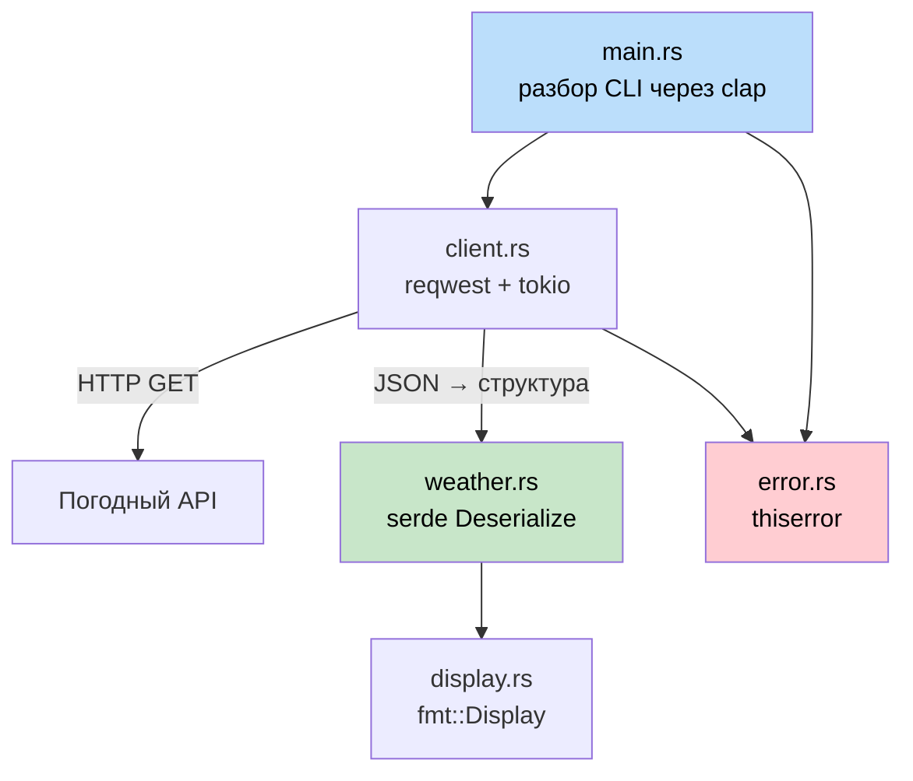

## Итоговый проект: CLI-утилита для погоды на Rust

> **Что вы узнаете:** как объединить всё изученное — структуры, трейты, обработку ошибок, асинхронность, модули,
> serde и разбор аргументов командной строки — в работающее приложение на Rust. Это повторяет тот тип утилиты, который
> разработчик C# написал бы с `HttpClient`, `System.Text.Json` и `System.CommandLine`.
>
> **Сложность:** 🟡 Средний

Этот итоговый проект собирает концепции из всех частей книги. Вы создадите `weather-cli` — утилиту командной строки, которая получает данные о погоде из API и выводит их. Проект организован как мини-крейт с правильной структурой модулей, типами ошибок и тестами.

### Обзор проекта



**Что вы создадите:**
```
$ weather-cli --city "Seattle"
🌧  Seattle: 12°C, Overcast clouds
    Влажность: 82%  Ветер: 5.4 м/с
```

**Используемые концепции:**
| Глава книги | Концепция, используемая здесь |
|---|---|
| Гл. 05 (Структуры) | Типы данных `WeatherReport`, `Config` |
| Гл. 08 (Модули) | `src/lib.rs`, `src/client.rs`, `src/display.rs` |
| Гл. 09 (Ошибки) | Собственный `WeatherError` с `thiserror` |
| Гл. 10 (Трейты) | Реализация `Display` для форматированного вывода |
| Гл. 11 (From/Into) | Десериализация JSON через `serde` |
| Гл. 12 (Итераторы) | Обработка массивов из ответа API |
| Гл. 13 (Async) | `reqwest` + `tokio` для HTTP-запросов |
| Гл. 14-1 (Тестирование) | Модульные тесты и интеграционный тест |

---

### Шаг 1: настройка проекта

```bash
cargo new weather-cli
cd weather-cli
```

Добавьте зависимости в `Cargo.toml`:
```toml
[package]
name = "weather-cli"
version = "0.1.0"
edition = "2021"

[dependencies]
clap = { version = "4", features = ["derive"] }   # Аргументы CLI (как System.CommandLine)
reqwest = { version = "0.12", features = ["json"] } # HTTP-клиент (как HttpClient)
serde = { version = "1", features = ["derive"] }    # Сериализация (как System.Text.Json)
serde_json = "1"
thiserror = "2"                                      # Типы ошибок
tokio = { version = "1", features = ["full"] }       # Асинхронный рантайм
```

```csharp
// Эквивалентные зависимости в C#:
// dotnet add package System.CommandLine
// dotnet add package System.Net.Http.Json
// (System.Text.Json и HttpClient входят в состав платформы)
```

### Шаг 2: определите типы данных

Создайте `src/weather.rs`:
```rust
use serde::Deserialize;

/// Сырой ответ API (повторяет структуру JSON)
#[derive(Deserialize, Debug)]
pub struct ApiResponse {
    pub main: MainData,
    pub weather: Vec<WeatherCondition>,
    pub wind: WindData,
    pub name: String,
}

#[derive(Deserialize, Debug)]
pub struct MainData {
    pub temp: f64,
    pub humidity: u32,
}

#[derive(Deserialize, Debug)]
pub struct WeatherCondition {
    pub description: String,
    pub icon: String,
}

#[derive(Deserialize, Debug)]
pub struct WindData {
    pub speed: f64,
}

/// Наш доменный тип (чистый, отделённый от API)
#[derive(Debug, Clone)]
pub struct WeatherReport {
    pub city: String,
    pub temp_celsius: f64,
    pub description: String,
    pub humidity: u32,
    pub wind_speed: f64,
}

impl From<ApiResponse> for WeatherReport {
    fn from(api: ApiResponse) -> Self {
        let description = api.weather
            .first()
            .map(|w| w.description.clone())
            .unwrap_or_else(|| "Unknown".to_string());

        WeatherReport {
            city: api.name,
            temp_celsius: api.main.temp,
            description,
            humidity: api.main.humidity,
            wind_speed: api.wind.speed,
        }
    }
}
```

```csharp
// Эквивалент в C#:
// public record ApiResponse(MainData Main, List<WeatherCondition> Weather, ...);
// public record WeatherReport(string City, double TempCelsius, ...);
// Ручное маппирование или AutoMapper
```

**Ключевое отличие:** `#[derive(Deserialize)]` + реализация `From` заменяют `JsonSerializer.Deserialize<T>()` + AutoMapper. В Rust оба этих шага выполняются на этапе компиляции — без рефлексии.

### Шаг 3: тип ошибок

Создайте `src/error.rs`:
```rust
use thiserror::Error;

#[derive(Error, Debug)]
pub enum WeatherError {
    #[error("Ошибка HTTP-запроса: {0}")]
    Http(#[from] reqwest::Error),

    #[error("Город не найден: {0}")]
    CityNotFound(String),

    #[error("Ключ API не задан — выполните export WEATHER_API_KEY")]
    MissingApiKey,
}

pub type Result<T> = std::result::Result<T, WeatherError>;
```

### Шаг 4: HTTP-клиент

Создайте `src/client.rs`:
```rust
use crate::error::{WeatherError, Result};
use crate::weather::{ApiResponse, WeatherReport};

pub struct WeatherClient {
    api_key: String,
    http: reqwest::Client,
}

impl WeatherClient {
    pub fn new(api_key: String) -> Self {
        WeatherClient {
            api_key,
            http: reqwest::Client::new(),
        }
    }

    pub async fn get_weather(&self, city: &str) -> Result<WeatherReport> {
        let url = format!(
            "https://api.openweathermap.org/data/2.5/weather?q={}&appid={}&units=metric",
            city, self.api_key
        );

        let response = self.http.get(&url).send().await?;

        if response.status() == reqwest::StatusCode::NOT_FOUND {
            return Err(WeatherError::CityNotFound(city.to_string()));
        }

        let api_data: ApiResponse = response.json().await?;
        Ok(WeatherReport::from(api_data))
    }
}
```

```csharp
// Эквивалент в C#:
// var response = await _httpClient.GetAsync(url);
// if (response.StatusCode == HttpStatusCode.NotFound)
//     throw new CityNotFoundException(city);
// var data = await response.Content.ReadFromJsonAsync<ApiResponse>();
```

**Ключевые отличия:**
- Оператор `?` заменяет `try/catch` — ошибки распространяются автоматически через `Result`
- `WeatherReport::from(api_data)` использует трейт `From` вместо AutoMapper
- `IHttpClientFactory` не нужен — `reqwest::Client` сам управляет пулом соединений

### Шаг 5: форматирование вывода

Создайте `src/display.rs`:
```rust
use std::fmt;
use crate::weather::WeatherReport;

impl fmt::Display for WeatherReport {
    fn fmt(&self, f: &mut fmt::Formatter<'_>) -> fmt::Result {
        let icon = weather_icon(&self.description);
        writeln!(f, "{}  {}: {:.0}°C, {}",
            icon, self.city, self.temp_celsius, self.description)?;
        write!(f, "    Влажность: {}%  Ветер: {:.1} м/с",
            self.humidity, self.wind_speed)
    }
}

fn weather_icon(description: &str) -> &str {
    let desc = description.to_lowercase();
    if desc.contains("clear") { "☀️" }
    else if desc.contains("cloud") { "☁️" }
    else if desc.contains("rain") || desc.contains("drizzle") { "🌧" }
    else if desc.contains("snow") { "❄️" }
    else if desc.contains("thunder") { "⛈" }
    else { "🌡" }
}
```

### Шаг 6: собираем всё вместе

`src/lib.rs`:
```rust
pub mod client;
pub mod display;
pub mod error;
pub mod weather;
```

`src/main.rs`:
```rust
use clap::Parser;
use weather_cli::{client::WeatherClient, error::WeatherError};

#[derive(Parser)]
#[command(name = "weather-cli", about = "Получение погоды из командной строки")]
struct Cli {
    /// Название города для поиска
    #[arg(short, long)]
    city: String,
}

#[tokio::main]
async fn main() {
    let cli = Cli::parse();

    let api_key = match std::env::var("WEATHER_API_KEY") {
        Ok(key) => key,
        Err(_) => {
            eprintln!("Ошибка: {}", WeatherError::MissingApiKey);
            std::process::exit(1);
        }
    };

    let client = WeatherClient::new(api_key);

    match client.get_weather(&cli.city).await {
        Ok(report) => println!("{report}"),
        Err(WeatherError::CityNotFound(city)) => {
            eprintln!("Город не найден: {city}");
            std::process::exit(1);
        }
        Err(e) => {
            eprintln!("Ошибка: {e}");
            std::process::exit(1);
        }
    }
}
```

### Шаг 7: тесты

```rust
// В src/weather.rs или tests/weather_test.rs
#[cfg(test)]
mod tests {
    use super::*;

    fn sample_api_response() -> ApiResponse {
        serde_json::from_str(r#"{
            "main": {"temp": 12.3, "humidity": 82},
            "weather": [{"description": "overcast clouds", "icon": "04d"}],
            "wind": {"speed": 5.4},
            "name": "Seattle"
        }"#).unwrap()
    }

    #[test]
    fn api_response_to_weather_report() {
        let report = WeatherReport::from(sample_api_response());
        assert_eq!(report.city, "Seattle");
        assert!((report.temp_celsius - 12.3).abs() < 0.01);
        assert_eq!(report.description, "overcast clouds");
    }

    #[test]
    fn display_format_includes_icon() {
        let report = WeatherReport {
            city: "Test".into(),
            temp_celsius: 20.0,
            description: "clear sky".into(),
            humidity: 50,
            wind_speed: 3.0,
        };
        let output = format!("{report}");
        assert!(output.contains("☀️"));
        assert!(output.contains("20°C"));
    }

    #[test]
    fn empty_weather_array_defaults_to_unknown() {
        let json = r#"{
            "main": {"temp": 0.0, "humidity": 0},
            "weather": [],
            "wind": {"speed": 0.0},
            "name": "Nowhere"
        }"#;
        let api: ApiResponse = serde_json::from_str(json).unwrap();
        let report = WeatherReport::from(api);
        assert_eq!(report.description, "Unknown");
    }
}
```

---

### Итоговая структура файлов

```
weather-cli/
├── Cargo.toml
├── src/
│   ├── main.rs        # Точка входа CLI (clap)
│   ├── lib.rs         # Объявления модулей
│   ├── client.rs      # HTTP-клиент (reqwest + tokio)
│   ├── weather.rs     # Типы данных + реализация From + тесты
│   ├── display.rs     # Форматирование вывода
│   └── error.rs       # WeatherError + псевдоним Result
└── tests/
    └── integration.rs # Интеграционные тесты
```

Сравните с эквивалентом на C#:
```
WeatherCli/
├── WeatherCli.csproj
├── Program.cs
├── Services/
│   └── WeatherClient.cs
├── Models/
│   ├── ApiResponse.cs
│   └── WeatherReport.cs
└── Tests/
    └── WeatherTests.cs
```

**Версия на Rust удивительно похожа по структуре.** Основные различия:
- Объявления `mod` вместо пространств имён
- `Result<T, E>` вместо исключений
- Трейт `From` вместо AutoMapper
- Явный `#[tokio::main]` вместо встроенного асинхронного рантайма

### Бонус: заготовка интеграционного теста

Создайте `tests/integration.rs`, чтобы проверить публичный API без обращения к настоящему серверу:

```rust
// tests/integration.rs
use weather_cli::weather::WeatherReport;

#[test]
fn weather_report_display_roundtrip() {
    let report = WeatherReport {
        city: "Seattle".into(),
        temp_celsius: 12.3,
        description: "overcast clouds".into(),
        humidity: 82,
        wind_speed: 5.4,
    };

    let output = format!("{report}");
    assert!(output.contains("Seattle"));
    assert!(output.contains("12°C"));
    assert!(output.contains("82%"));
}
```

Запустите `cargo test` — Rust автоматически находит тесты и в `src/` (модули `#[cfg(test)]`), и в `tests/` (интеграционные тесты). Никакой настройки тестового фреймворка не требуется — сравните с настройкой xUnit/NUnit в C#.

---

### Задания для продолжения

Когда всё заработает, попробуйте эти задания, чтобы углубить навыки:

1. **Добавьте кэширование** — сохраняйте последний ответ API в файл. При запуске проверяйте, не старше ли он 10 минут, и если нет — пропускайте HTTP-запрос. Это упражнение на `std::fs`, `serde_json::to_writer` и `SystemTime`.

2. **Добавьте поддержку нескольких городов** — принимайте `--city "Seattle,Portland,Vancouver"` и загружайте все города конкурентно через `tokio::join!`. Это упражнение на конкурентное асинхронное программирование.

3. **Добавьте флаг `--format json`** — выводите отчёт в формате JSON вместо читаемого текста с помощью `serde_json::to_string_pretty`. Это упражнение на условное форматирование и `Serialize`.

4. **Напишите интеграционный тест** — создайте `tests/integration.rs`, который проверяет полный сценарий с имитацией HTTP-сервера через `wiremock`. Это упражнение на шаблон каталога `tests/` из главы 14-1.

***
