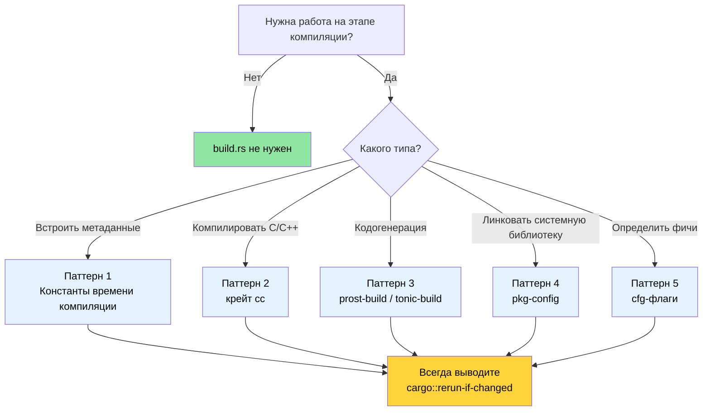

# Build-скрипты — `build.rs` в деталях 🟢

> **Чему вы научитесь:**
> - Как `build.rs` встраивается в конвейер сборки Cargo и когда он запускается
> - Пять продакшн-паттернов: константы времени компиляции, компиляция C/C++, кодогенерация protobuf, линковка через `pkg-config` и определение фич
> - Антипаттерны, которые замедляют сборку или ломают кросс-компиляцию
> - Как совмещать прослеживаемость с воспроизводимыми сборками
>
> **Перекрёстные ссылки:** [Кросс-компиляция](ch02-cross-compilation-one-source-many-target.md) использует build-скрипты для сборок с учётом целевой платформы · [`no_std` и фичи](ch09-no-std-and-feature-verification.md) расширяет `cfg`-флаги, заданные здесь · [CI/CD-конвейер](ch11-putting-it-all-together-a-production-cic.md) оркестрирует build-скрипты в автоматизации

Каждый пакет Cargo может содержать файл с именем `build.rs` в корне крейта.
Cargo компилирует и выполняет этот файл *до* компиляции вашего крейта. Build-скрипт
сообщает результаты Cargo через инструкции `println!`, которые выводятся в stdout.

### Что такое build.rs и когда он запускается

```text
┌─────────────────────────────────────────────────────────┐
│                   Конвейер сборки Cargo                 │
│                                                         │
│  1. Разрешение зависимостей                             │
│  2. Загрузка крейтов                                    │
│  3. Компиляция build.rs  ← обычный Rust, на HOST        │
│  4. Запуск build.rs  ← stdout → инструкции для Cargo    │
│  5. Компиляция крейта (по инструкциям из шага 4)        │
│  6. Линковка                                            │
└─────────────────────────────────────────────────────────┘
```

Ключевые факты:
- `build.rs` выполняется на **хост-машине**, а не на целевой. При кросс-компиляции
  build-скрипт запускается на вашей машине разработки, даже если итоговый бинарник
  предназначен для другой архитектуры.
- Область действия build-скрипта ограничена его собственным пакетом. Он не может
  повлиять на то, как компилируются другие крейты, — если только пакет не объявляет
  ключ `links` в `Cargo.toml`, который позволяет передавать метаданные зависимым крейтам
  через `cargo::metadata=KEY=VALUE`.
- Он запускается **каждый раз**, когда Cargo обнаруживает изменения, — если только вы
  не выводите инструкции `cargo::rerun-if-changed`, чтобы ограничить повторные запуски.

> **Примечание (Rust 1.71+)**: начиная с Rust 1.71 Cargo вычисляет «отпечаток»
> (fingerprint) скомпилированного бинарника `build.rs` — если бинарник не изменился,
> он не будет перезапущен, даже если временные метки исходников изменились. Однако
> `cargo::rerun-if-changed=build.rs` всё равно полезна: без *какой-либо* инструкции
> `rerun-if-changed` Cargo перезапускает `build.rs` при изменении **любого файла в пакете**
> (а не только самого `build.rs`). Если вывести `cargo::rerun-if-changed=build.rs`,
> повторные запуски будут происходить только при изменении самого `build.rs` — заметная
> экономия времени компиляции в крупных крейтах.
- Он может выводить *cfg-флаги*, *переменные окружения*, *аргументы линкера* и
  *пути к файлам*, которые использует основной крейт.

Минимальная запись в `Cargo.toml`:

```toml
[package]
name = "my-crate"
version = "0.1.0"
edition = "2021"
build = "build.rs"       # значение по умолчанию — Cargo ищет build.rs автоматически
# build = "src/build.rs" # или разместите его в другом месте
```

### Протокол инструкций Cargo

Build-скрипт взаимодействует с Cargo, выводя инструкции в stdout.
Начиная с Rust 1.77 предпочтительным префиксом является `cargo::` (он заменил
старую форму с одним двоеточием `cargo:`).

| Инструкция | Назначение |
|------------|------------|
| `cargo::rerun-if-changed=PATH` | Перезапускать build.rs только при изменении PATH |
| `cargo::rerun-if-env-changed=VAR` | Перезапускать только при изменении переменной окружения VAR |
| `cargo::rustc-link-lib=NAME` | Линковаться с нативной библиотекой NAME |
| `cargo::rustc-link-search=PATH` | Добавить PATH в путь поиска библиотек |
| `cargo::rustc-cfg=KEY` | Задать флаг `#[cfg(KEY)]` для условной компиляции |
| `cargo::rustc-cfg=KEY="VALUE"` | Задать флаг `#[cfg(KEY = "VALUE")]` |
| `cargo::rustc-env=KEY=VALUE` | Задать переменную окружения, доступную через `env!()` |
| `cargo::rustc-cdylib-link-arg=FLAG` | Передать FLAG линкеру для целей cdylib |
| `cargo::warning=MESSAGE` | Вывести предупреждение во время компиляции |
| `cargo::metadata=KEY=VALUE` | Сохранить метаданные, доступные зависимым крейтам |

```rust
// build.rs — минимальный пример
fn main() {
    // Перезапускать, только если сам build.rs изменился
    println!("cargo::rerun-if-changed=build.rs");

    // Задать переменную окружения времени компиляции
    let timestamp = std::time::SystemTime::now()
        .duration_since(std::time::UNIX_EPOCH)
        .map(|d| d.as_secs().to_string())
        .unwrap_or_else(|_| "0".into());
    println!("cargo::rustc-env=BUILD_TIMESTAMP={timestamp}");
}
```

### Паттерн 1: константы времени компиляции

Самый распространённый случай: встроить метаданные сборки в бинарник, чтобы выводить
их во время выполнения (хеш git, дата сборки, ID задачи CI).

```rust
// build.rs
use std::process::Command;

fn main() {
    println!("cargo::rerun-if-changed=.git/HEAD");
    println!("cargo::rerun-if-changed=.git/refs");

    // Хеш коммита git
    let output = Command::new("git")
        .args(["rev-parse", "--short", "HEAD"])
        .output()
        .expect("git не найден");
    let git_hash = String::from_utf8_lossy(&output.stdout).trim().to_string();
    println!("cargo::rustc-env=GIT_HASH={git_hash}");

    // Профиль сборки (debug или release)
    let profile = std::env::var("PROFILE").unwrap_or_else(|_| "unknown".into());
    println!("cargo::rustc-env=BUILD_PROFILE={profile}");

    // Target triple
    let target = std::env::var("TARGET").unwrap_or_else(|_| "unknown".into());
    println!("cargo::rustc-env=BUILD_TARGET={target}");
}
```

```rust
// src/main.rs — использование значений, известных на этапе сборки
fn print_version() {
    println!(
        "{} {} (git:{} target:{} profile:{})",
        env!("CARGO_PKG_NAME"),
        env!("CARGO_PKG_VERSION"),
        env!("GIT_HASH"),
        env!("BUILD_TARGET"),
        env!("BUILD_PROFILE"),
    );
}
```

> **Встроенные переменные окружения Cargo**, которые доступны без build.rs:
> `CARGO_PKG_NAME`, `CARGO_PKG_VERSION`, `CARGO_PKG_AUTHORS`,
> `CARGO_PKG_DESCRIPTION`, `CARGO_MANIFEST_DIR`.
> См. [полный список](https://doc.rust-lang.org/cargo/reference/environment-variables.html#environment-variables-cargo-sets-for-crates).

### Паттерн 2: компиляция C/C++ кода с помощью крейта `cc`

Когда ваш крейт на Rust оборачивает C-библиотеку или нуждается в небольшом C-помощнике
(типично для аппаратных интерфейсов), крейт [`cc`](https://docs.rs/cc) упрощает
компиляцию внутри build.rs.

```toml
# Cargo.toml
[build-dependencies]
cc = "1.0"
```

```rust
// build.rs
fn main() {
    println!("cargo::rerun-if-changed=csrc/");

    cc::Build::new()
        .file("csrc/ipmi_raw.c")
        .file("csrc/smbios_parser.c")
        .include("csrc/include")
        .flag("-Wall")
        .flag("-Wextra")
        .opt_level(2)
        .compile("diag_helpers");
    // Это создаёт libdiag_helpers.a и выводит правильные инструкции
    // cargo::rustc-link-lib и cargo::rustc-link-search.
}
```

```rust
// src/lib.rs — FFI-привязки к скомпилированному C-коду
extern "C" {
    fn ipmi_raw_command(
        netfn: u8,
        cmd: u8,
        data: *const u8,
        data_len: usize,
        response: *mut u8,
        response_len: *mut usize,
    ) -> i32;
}

/// Безопасная обёртка над сырым интерфейсом команд IPMI.
/// Предполагается: enum IpmiError { CommandFailed(i32), ... }
pub fn send_ipmi_command(netfn: u8, cmd: u8, data: &[u8]) -> Result<Vec<u8>, IpmiError> {
    let mut response = vec![0u8; 256];
    let mut response_len: usize = response.len();

    // SAFETY: буфер ответа достаточно велик, а response_len корректно инициализирован.
    let rc = unsafe {
        ipmi_raw_command(
            netfn,
            cmd,
            data.as_ptr(),
            data.len(),
            response.as_mut_ptr(),
            &mut response_len,
        )
    };

    if rc != 0 {
        return Err(IpmiError::CommandFailed(rc));
    }
    response.truncate(response_len);
    Ok(response)
}
```

Для C++-кода используйте `.cpp(true)` и `.flag("-std=c++17")`:

```rust
// build.rs — вариант для C++
fn main() {
    println!("cargo::rerun-if-changed=cppsrc/");

    cc::Build::new()
        .cpp(true)
        .file("cppsrc/vendor_parser.cpp")
        .flag("-std=c++17")
        .flag("-fno-exceptions")    // соответствует модели Rust без исключений
        .compile("vendor_helpers");
}
```

### Паттерн 3: Protocol Buffers и кодогенерация

Build-скрипты отлично подходят для кодогенерации — превращения файлов схем `.proto`,
`.fbs` или `.json` в исходный код Rust во время компиляции. Вот паттерн для protobuf
с использованием [`prost-build`](https://docs.rs/prost-build):

```toml
# Cargo.toml
[build-dependencies]
prost-build = "0.13"
```

```rust
// build.rs
fn main() {
    println!("cargo::rerun-if-changed=proto/");

    prost_build::compile_protos(
        &["proto/diagnostics.proto", "proto/telemetry.proto"],
        &["proto/"],
    )
    .expect("Не удалось скомпилировать определения protobuf");
}
```

```rust
// src/lib.rs — подключаем сгенерированный код
pub mod diagnostics {
    include!(concat!(env!("OUT_DIR"), "/diagnostics.rs"));
}

pub mod telemetry {
    include!(concat!(env!("OUT_DIR"), "/telemetry.rs"));
}
```

> **`OUT_DIR`** — это директория, которую предоставляет Cargo и в которую build-скрипты
> должны помещать сгенерированные файлы. Каждый крейт получает собственный `OUT_DIR`
> внутри `target/`.

### Паттерн 4: линковка системных библиотек через `pkg-config`

Для системных библиотек, которые предоставляют файлы `.pc` (systemd, OpenSSL, libpci),
крейт [`pkg-config`](https://docs.rs/pkg-config) проверяет систему и выводит
нужные инструкции для линковки:

```toml
# Cargo.toml
[build-dependencies]
pkg-config = "0.3"
```

```rust
// build.rs
fn main() {
    // Проверяем наличие libpci (используется для перечисления устройств PCIe)
    pkg_config::Config::new()
        .atleast_version("3.6.0")
        .probe("libpci")
        .expect("libpci >= 3.6.0 не найдена — установите pciutils-dev");

    // Проверяем наличие libsystemd (необязательно — для интеграции с sd_notify)
    if pkg_config::probe_library("libsystemd").is_ok() {
        println!("cargo::rustc-cfg=has_systemd");
    }
}
```

```rust
// src/lib.rs — условная компиляция на основе проверки через pkg-config
#[cfg(has_systemd)]
mod systemd_notify {
    extern "C" {
        fn sd_notify(unset_environment: i32, state: *const std::ffi::c_char) -> i32;
    }

    pub fn notify_ready() {
        let state = std::ffi::CString::new("READY=1").unwrap();
        // SAFETY: state — корректная C-строка с нулевым завершителем.
        unsafe { sd_notify(0, state.as_ptr()) };
    }
}

#[cfg(not(has_systemd))]
mod systemd_notify {
    pub fn notify_ready() {
        // ничего не делаем на системах без systemd
    }
}
```

### Паттерн 5: определение фич и условная компиляция

Build-скрипты могут проверять окружение компиляции и задавать cfg-флаги, которые основной
крейт использует для условных путей выполнения.

**Определение архитектуры процессора и ОС** (безопасно — это константы времени компиляции):

```rust
// build.rs — определяем возможности CPU и ОС
fn main() {
    println!("cargo::rerun-if-changed=build.rs");

    let target = std::env::var("TARGET").unwrap();
    let target_os = std::env::var("CARGO_CFG_TARGET_OS").unwrap();

    // Включаем оптимизированные пути AVX2 на x86_64
    if target.starts_with("x86_64") {
        println!("cargo::rustc-cfg=has_x86_64");
    }

    // Включаем пути ARM NEON на aarch64
    if target.starts_with("aarch64") {
        println!("cargo::rustc-cfg=has_aarch64");
    }

    // Проверяем, доступно ли /dev/ipmi0 (проверка во время сборки)
    if target_os == "linux" && std::path::Path::new("/dev/ipmi0").exists() {
        println!("cargo::rustc-cfg=has_ipmi_device");
    }
}
```

> ⚠️ **Демонстрация антипаттерна** — код ниже показывает заманчивый, но проблемный подход.
> **Не используйте его в продакшне.**

```rust
// build.rs — ПЛОХО: определение аппаратуры во время выполнения, но на этапе сборки
fn main() {
    // АНТИПАТТЕРН: бинарник «привязывается» к железу машины сборки.
    // Если собрать его на машине с GPU, а развернуть на машине без GPU,
    // бинарник молча будет считать, что GPU есть.
    if std::process::Command::new("accel-query")
        .arg("--query-gpu=name")
        .arg("--format=csv,noheader")
        .output()
        .is_ok()
    {
        println!("cargo::rustc-cfg=has_accel_device");
    }
}
```

```rust
// src/gpu.rs — код, который адаптируется на основе определения на этапе сборки
pub fn query_gpu_info() -> GpuResult {
    #[cfg(has_accel_device)]
    {
        run_accel_query()
    }

    #[cfg(not(has_accel_device))]
    {
        GpuResult::NotAvailable("accel-query не найден на этапе сборки".into())
    }
}
```

> ⚠️ **Почему это неправильно**: определение устройств во время выполнения почти всегда
> лучше, чем определение во время сборки, для необязательного оборудования. Бинарник,
> созданный выше, *привязан к конфигурации оборудования машины сборки* — на целевой
> машине он будет вести себя иначе. Определение на этапе сборки уместно только для
> возможностей, которые действительно фиксированы на этапе компиляции (архитектура, ОС,
> наличие библиотек). Для оборудования вроде GPU определяйте его во время выполнения,
> например проверкой `which accel-query` или через `accel-mgmt`.

### Антипаттерны и ловушки

| Антипаттерн | Почему это плохо | Решение |
|-------------|------------------|---------|
| Нет `rerun-if-changed` | build.rs запускается при *каждой* сборке, замедляя итерации | Всегда выводите как минимум `cargo::rerun-if-changed=build.rs` |
| Сетевые вызовы в build.rs | Сборки падают без сети, результат невоспроизводим | Вендорьте файлы или используйте отдельный шаг загрузки |
| Запись в `src/` | Cargo не ожидает, что исходники меняются во время сборки | Пишите в `OUT_DIR` и используйте `include!()` |
| Тяжёлые вычисления | Замедляют каждый `cargo build` | Кешируйте результаты в `OUT_DIR` и ограничивайте через `rerun-if-changed` |
| Игнорирование кросс-компиляции | `Command::new("gcc")` без учёта `$CC` | Используйте крейт `cc`, который работает с кросс-компиляционными тулчейнами |
| Паника без контекста | `unwrap()` выдаёт непрозрачную ошибку «build script failed» | Используйте `.expect("понятное сообщение")` или выводите `cargo::warning=` |

### Применение: встраивание метаданных сборки

Сейчас проект использует `env!("CARGO_PKG_VERSION")` для вывода версии. Build-скрипт
мог бы расширить это более богатыми метаданными:

```rust
// build.rs — предлагаемое дополнение
fn main() {
    println!("cargo::rerun-if-changed=.git/HEAD");
    println!("cargo::rerun-if-changed=.git/refs");
    println!("cargo::rerun-if-changed=build.rs");

    // Встраиваем хеш git для прослеживаемости в диагностических отчётах
    if let Ok(output) = std::process::Command::new("git")
        .args(["rev-parse", "--short=10", "HEAD"])
        .output()
    {
        let hash = String::from_utf8_lossy(&output.stdout).trim().to_string();
        println!("cargo::rustc-env=APP_GIT_HASH={hash}");
    } else {
        println!("cargo::rustc-env=APP_GIT_HASH=unknown");
    }

    // Встраиваем временную метку сборки для связи с отчётами
    let timestamp = std::time::SystemTime::now()
        .duration_since(std::time::UNIX_EPOCH)
        .map(|d| d.as_secs().to_string())
        .unwrap_or_else(|_| "0".into());
    println!("cargo::rustc-env=APP_BUILD_EPOCH={timestamp}");

    // Выводим target triple — полезно при развёртывании на нескольких архитектурах
    let target = std::env::var("TARGET").unwrap_or_else(|_| "unknown".into());
    println!("cargo::rustc-env=APP_TARGET={target}");
}
```

```rust
// src/version.rs — использование метаданных
pub struct BuildInfo {
    pub version: &'static str,
    pub git_hash: &'static str,
    pub build_epoch: &'static str,
    pub target: &'static str,
}

pub const BUILD_INFO: BuildInfo = BuildInfo {
    version: env!("CARGO_PKG_VERSION"),
    git_hash: env!("APP_GIT_HASH"),
    build_epoch: env!("APP_BUILD_EPOCH"),
    target: env!("APP_TARGET"),
};

impl BuildInfo {
    /// Разбираем эпоху во время выполнения, когда это нужно (преобразовать
    /// const &str в u64 на stable Rust нельзя — нет const fn для разбора строки в число).
    pub fn build_epoch_secs(&self) -> u64 {
        self.build_epoch.parse().unwrap_or(0)
    }
}

impl std::fmt::Display for BuildInfo {
    fn fmt(&self, f: &mut std::fmt::Formatter<'_>) -> std::fmt::Result {
        write!(
            f,
            "DiagTool v{} (git:{} target:{})",
            self.version, self.git_hash, self.target
        )
    }
}
```

> **Ключевая мысль из проекта**: в кодовой базе нет ни одного файла `build.rs` ни в одном
> из крейтов, потому что это чистый Rust без зависимостей от C, без кодогенерации и без
> линковки системных библиотек. Когда это понадобится, `build.rs` — правильный инструмент,
> но не добавляйте его «просто так». Отсутствие build-скриптов в большой кодовой базе —
> признак чистой архитектуры, а не пробел. См. [Управление зависимостями](ch06-dependency-management-and-supply-chain-s.md),
> чтобы узнать, как проект управляет цепочкой поставок без собственной логики сборки.

### Попробуйте сами

1. **Встройте метаданные git**: создайте `build.rs`, который выводит `APP_GIT_HASH` и
   `APP_BUILD_EPOCH` как переменные окружения. Прочитайте их через `env!()` в `main.rs`
   и выведите информацию о сборке. Убедитесь, что хеш меняется после коммита.

2. **Проверьте системную библиотеку**: напишите `build.rs`, который использует `pkg-config`,
   чтобы найти `libz` (zlib). Если библиотека найдена, выведите `cargo::rustc-cfg=has_zlib`.
   В `main.rs` выведите «zlib доступен» или «zlib не найден» в зависимости от флага cfg.

3. **Понаблюдайте за лишними перезапусками**: удалите строку `rerun-if-changed` из
   `build.rs` и посмотрите, сколько раз он перезапускается во время `cargo build` и
   `cargo test`. Затем верните строку и сравните результаты.

### Воспроизводимые сборки

Глава 1 учит встраивать временные метки и хеши git в бинарники. Это полезно для
прослеживаемости, но **противоречит воспроизводимым сборкам** — свойству, при котором
сборка одного и того же исходного кода всегда даёт один и тот же бинарник.

**Противоречие:**

| Цель | Достигается через | Цена |
|------|-------------------|------|
| Прослеживаемость | `APP_BUILD_EPOCH` в бинарнике | Каждая сборка уникальна — нельзя проверить целостность |
| Воспроизводимость | `cargo build --locked` всегда даёт одинаковый результат | Нет метаданных времени сборки |

**Практическое решение:**

```bash
# 1. Всегда используйте --locked в CI (гарантирует, что Cargo.lock учитывается)
cargo build --release --locked
# Завершится с ошибкой, если Cargo.lock отсутствует или устарел — ловит «у меня работает»

# 2. Для сборок, критичных к воспроизводимости, задайте SOURCE_DATE_EPOCH
SOURCE_DATE_EPOCH=$(git log -1 --format=%ct) cargo build --release --locked
# Использует временную метку последнего коммита вместо «сейчас» — один коммит = один бинарник
```

```rust
// В build.rs: учитываем SOURCE_DATE_EPOCH для воспроизводимости
let timestamp = std::env::var("SOURCE_DATE_EPOCH")
    .unwrap_or_else(|_| {
        std::time::SystemTime::now()
            .duration_since(std::time::UNIX_EPOCH)
            .map(|d| d.as_secs().to_string())
            .unwrap_or_else(|_| "0".into())
    });
println!("cargo::rustc-env=APP_BUILD_EPOCH={timestamp}");
```

> **Лучшая практика**: используйте `SOURCE_DATE_EPOCH` в build-скриптах, чтобы релизные
> сборки были воспроизводимыми (`хеш git + зафиксированные зависимости + детерминированная
> временная метка = один и тот же бинарник`), а dev-сборки по-прежнему получали актуальные
> временные метки для удобства.

### Диаграмма выбора в конвейере сборки



### 🏋️ Упражнения

#### 🟢 Упражнение 1: штамп версии

Создайте минимальный крейт с `build.rs`, который встраивает текущий хеш git и профиль
сборки в переменные окружения. Выведите их из `main()`. Убедитесь, что вывод меняется
между debug- и release-сборками.

<details>
<summary>Решение</summary>

```rust
// build.rs
fn main() {
    println!("cargo::rerun-if-changed=.git/HEAD");
    println!("cargo::rerun-if-changed=build.rs");

    let hash = std::process::Command::new("git")
        .args(["rev-parse", "--short", "HEAD"])
        .output()
        .map(|o| String::from_utf8_lossy(&o.stdout).trim().to_string())
        .unwrap_or_else(|_| "unknown".into());
    println!("cargo::rustc-env=GIT_HASH={hash}");
    println!("cargo::rustc-env=BUILD_PROFILE={}", std::env::var("PROFILE").unwrap_or_default());
}
```

```rust,ignore
// src/main.rs
fn main() {
    println!("{} v{} (git:{} profile:{})",
        env!("CARGO_PKG_NAME"),
        env!("CARGO_PKG_VERSION"),
        env!("GIT_HASH"),
        env!("BUILD_PROFILE"),
    );
}
```

```bash
cargo run          # покажет profile:debug
cargo run --release # покажет profile:release
```
</details>

#### 🟡 Упражнение 2: условная системная библиотека

Напишите `build.rs`, который с помощью `pkg-config` проверяет наличие и `libz`, и `libpci`.
Выведите cfg-флаг для каждой найденной библиотеки. В `main.rs` выведите, какие библиотеки
были обнаружены во время сборки.

<details>
<summary>Решение</summary>

```toml
# Cargo.toml
[build-dependencies]
pkg-config = "0.3"
```

```rust,ignore
// build.rs
fn main() {
    println!("cargo::rerun-if-changed=build.rs");
    if pkg_config::probe_library("zlib").is_ok() {
        println!("cargo::rustc-cfg=has_zlib");
    }
    if pkg_config::probe_library("libpci").is_ok() {
        println!("cargo::rustc-cfg=has_libpci");
    }
}
```

```rust
// src/main.rs
fn main() {
    #[cfg(has_zlib)]
    println!("✅ zlib обнаружен");
    #[cfg(not(has_zlib))]
    println!("❌ zlib не найден");

    #[cfg(has_libpci)]
    println!("✅ libpci обнаружен");
    #[cfg(not(has_libpci))]
    println!("❌ libpci не найден");
}
```
</details>

### Ключевые выводы

- `build.rs` выполняется на **хосте** во время компиляции — всегда выводите
  `cargo::rerun-if-changed`, чтобы избежать лишних пересборок
- Используйте крейт `cc` (а не прямые вызовы `gcc`) для компиляции C/C++ — он корректно
  работает с кросс-компиляционными тулчейнами
- Записывайте сгенерированные файлы в `OUT_DIR`, но никогда в `src/` — Cargo не ожидает,
  что исходники будут меняться во время сборки
- Предпочитайте определение во время выполнения определению во время сборки для
  необязательного оборудования
- Используйте `SOURCE_DATE_EPOCH`, чтобы сборки были воспроизводимыми при встраивании
  временных меток

---
