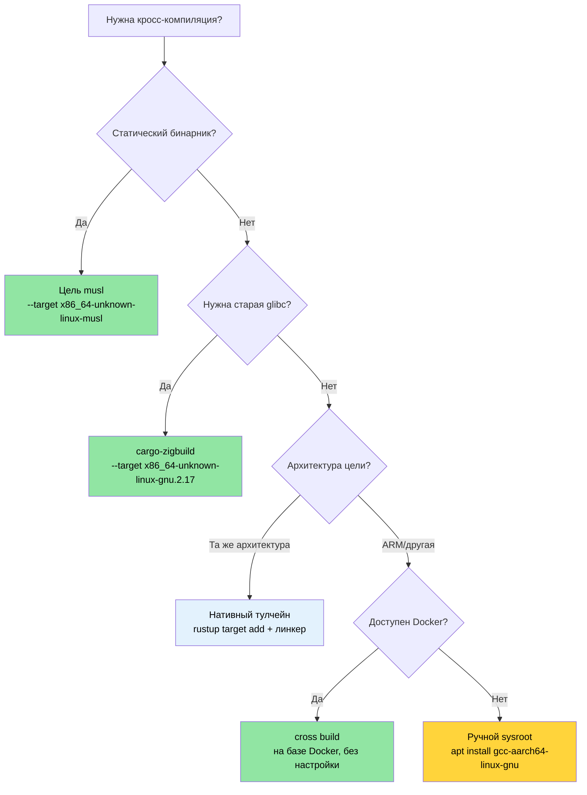

# Кросс-компиляция — один исходник, много целей 🟡

> **Чему вы научитесь:**
> - Как устроены target triple в Rust и как добавлять их через `rustup`
> - Сборка статических бинарников musl для развёртывания в контейнерах и облаке
> - Кросс-компиляция под ARM (aarch64) с нативными тулчейнами, `cross` и `cargo-zigbuild`
> - Настройка матричных сборок GitHub Actions для мультиархитектурного CI
>
> **Перекрёстные ссылки:** [Build-скрипты](ch01-build-scripts-buildrs-in-depth.md) — build.rs выполняется на HOST при кросс-компиляции · [Профили релиза](ch07-release-profiles-and-binary-size.md) — настройки LTO и strip для релизных кросс-скомпилированных бинарников · [Windows](ch10-windows-and-conditional-compilation.md) — кросс-компиляция под Windows и цели `no_std`

Кросс-компиляция — это сборка исполняемого файла на одной машине (**хост**), который
будет работать на другой машине (**целевая**). Хостом может быть ваш ноутбук x86_64,
а целью — ARM-сервер, контейнер на базе musl или даже машина с Windows.
Rust делает это на удивление просто, потому что `rustc` уже является кросс-компилятором —
ему нужны только подходящие библиотеки для целевой платформы и совместимый линкер.

### Устройство target triple

Каждая цель компиляции в Rust задаётся **target triple** (несмотря на название, у неё
часто четыре части):

```text
<arch>-<vendor>-<os>-<env>

Примеры:
  x86_64  - unknown - linux  - gnu      ← стандартный Linux (glibc)
  x86_64  - unknown - linux  - musl     ← статический Linux (musl libc)
  aarch64 - unknown - linux  - gnu      ← 64-бит ARM Linux
  x86_64  - pc      - windows- msvc     ← Windows с MSVC
  aarch64 - apple   - darwin             ← macOS на Apple Silicon
  x86_64  - unknown - none              ← голое железо (без ОС)
```

Список всех доступных целей:

```bash
# Все цели, в которые может компилировать rustc (~250 целей)
rustc --print target-list | wc -l

# Установленные на вашей системе цели
rustup target list --installed

# Текущая цель по умолчанию
rustc -vV | grep host
```

### Установка тулчейнов через rustup

```bash
# Добавляем библиотеки для целевых платформ (std для нужной цели)
rustup target add x86_64-unknown-linux-musl
rustup target add aarch64-unknown-linux-gnu

# Теперь можно кросс-компилировать:
cargo build --target x86_64-unknown-linux-musl
cargo build --target aarch64-unknown-linux-gnu  # нужен линкер — см. ниже
```

**Что даёт `rustup target add`**: предварительно скомпилированные библиотеки `std`, `core`
и `alloc` для этой цели. Он *не* предоставляет C-линкер или C-библиотеку. Для целей,
которым нужен C-тулчейн (большинство целей `gnu`), его нужно установить отдельно.

```bash
# Ubuntu/Debian — устанавливаем кросс-линкер для aarch64
sudo apt install gcc-aarch64-linux-gnu

# Ubuntu/Debian — устанавливаем тулчейн musl для статических сборок
sudo apt install musl-tools

# Fedora
sudo dnf install gcc-aarch64-linux-gnu
```

### `.cargo/config.toml` — настройка по целям

Вместо того чтобы передавать `--target` в каждой команде, задайте значения по умолчанию в
`.cargo/config.toml` в корне проекта или в домашней директории:

```toml
# .cargo/config.toml

# Цель по умолчанию для этого проекта (необязательно — уберите, чтобы оставить нативную)
# [build]
# target = "x86_64-unknown-linux-musl"

# Линкер для кросс-компиляции под aarch64
[target.aarch64-unknown-linux-gnu]
linker = "aarch64-linux-gnu-gcc"
rustflags = ["-C", "target-feature=+crc"]

# Линкер для статических сборок musl (обычно подходит и системный gcc)
[target.x86_64-unknown-linux-musl]
linker = "musl-gcc"
rustflags = ["-C", "target-feature=+crc,+aes"]

# ARM 32-бит (Raspberry Pi, встраиваемые системы)
[target.armv7-unknown-linux-gnueabihf]
linker = "arm-linux-gnueabihf-gcc"

# Переменные окружения для всех целей
[env]
# Пример: задаём собственный sysroot
# SYSROOT = "/opt/cross/sysroot"
```

**Порядок поиска файла конфигурации** (побеждает первый найденный):
1. `<project>/.cargo/config.toml`
2. `<project>/../.cargo/config.toml` (родительские директории, подъём вверх по дереву)
3. `$CARGO_HOME/config.toml` (обычно `~/.cargo/config.toml`)

### Статические бинарники с musl

Для развёртывания в минимальных контейнерах (Alpine, образы Docker `scratch`) или на
системах, где нельзя контролировать версию glibc, собирайте проект с musl:

```bash
# Устанавливаем musl-цель
rustup target add x86_64-unknown-linux-musl
sudo apt install musl-tools  # предоставляет musl-gcc

# Собираем полностью статический бинарник
cargo build --release --target x86_64-unknown-linux-musl

# Проверяем, что он статический
file target/x86_64-unknown-linux-musl/release/diag_tool
# → ELF 64-bit LSB executable, x86-64, statically linked

ldd target/x86_64-unknown-linux-musl/release/diag_tool
# → not a dynamic executable
```

**Компромиссы статической и динамической линковки:**

| Аспект | glibc (динамическая) | musl (статическая) |
|--------|----------------------|--------------------|
| Размер бинарника | Меньше (общие библиотеки) | Больше (примерно на 5–15 МБ) |
| Переносимость | Нужна совместимая версия glibc | Работает на любом Linux |
| Разрешение DNS | Полная поддержка `nsswitch` | Базовый резолвер (без mDNS) |
| Развёртывание | Нужны sysroot или контейнер | Один бинарник, без зависимостей |
| Производительность | Немного быстрее malloc | Немного медленнее malloc |
| Поддержка `dlopen()` | Да | Нет |

> **Для проекта**: статическая сборка musl идеально подходит для развёртывания на
> разнородном серверном железе, где нельзя гарантировать версию ОС на хосте. Модель
> развёртывания одним бинарником устраняет проблемы «у меня работает».

### Кросс-компиляция под ARM (aarch64)

ARM-серверы (AWS Graviton, Ampere Altra, Grace) всё чаще встречаются в дата-центрах.
Кросс-компиляция под aarch64 с хоста x86_64:

```bash
# Шаг 1: установите цель и кросс-линкер
rustup target add aarch64-unknown-linux-gnu
sudo apt install gcc-aarch64-linux-gnu

# Шаг 2: настройте линкер в .cargo/config.toml (см. выше)

# Шаг 3: сборка
cargo build --release --target aarch64-unknown-linux-gnu

# Шаг 4: проверяем бинарник
file target/aarch64-unknown-linux-gnu/release/diag_tool
# → ELF 64-bit LSB executable, ARM aarch64
```

**Для запуска тестов под целевую архитектуру** нужно одно из двух:
- Реальная ARM-машина
- Эмуляция QEMU в пользовательском режиме

```bash
# Устанавливаем QEMU в пользовательском режиме (запускает ARM-бинарники на x86_64)
sudo apt install qemu-user qemu-user-static binfmt-support

# Теперь cargo test может запускать кросс-скомпилированные тесты через QEMU
cargo test --target aarch64-unknown-linux-gnu
# (Медленно — каждый тестовый бинарник эмулируется. Используйте для проверки в CI, а не в ежедневной разработке.)
```

Настройте QEMU как тестовый раннер в `.cargo/config.toml`:

```toml
[target.aarch64-unknown-linux-gnu]
linker = "aarch64-linux-gnu-gcc"
runner = "qemu-aarch64-static -L /usr/aarch64-linux-gnu"
```

### Инструмент `cross` — кросс-компиляция на основе Docker

Инструмент [`cross`](https://github.com/cross-rs/cross) даёт кросс-компиляцию без
настройки, используя готовые Docker-образы с предварительно настроенными тулчейнами:

```bash
# Установка cross (с crates.io — стабильные релизы)
cargo install cross
# Или из git для новейших возможностей (менее стабильно):
# cargo install cross --git https://github.com/cross-rs/cross

# Кросс-компиляция — настраивать тулчейн не нужно!
cross build --release --target aarch64-unknown-linux-gnu
cross build --release --target x86_64-unknown-linux-musl
cross build --release --target armv7-unknown-linux-gnueabihf

# Кросс-тестирование — QEMU входит в состав Docker-образа
cross test --target aarch64-unknown-linux-gnu
```

**Как это работает**: `cross` заменяет `cargo` и запускает сборку внутри Docker-контейнера,
в котором уже установлен нужный кросс-тулчейн. Ваш исходный код монтируется в контейнер,
а результат попадает в обычную директорию `target/`.

**Настройка Docker-образа** через `Cross.toml`:

```toml
# Cross.toml
[target.aarch64-unknown-linux-gnu]
# Используем собственный Docker-образ с дополнительными системными библиотеками
image = "my-registry/cross-aarch64:latest"

# Предустановка системных пакетов
pre-build = [
    "dpkg --add-architecture arm64",
    "apt-get update && apt-get install -y libpci-dev:arm64"
]

[target.aarch64-unknown-linux-gnu.env]
# Передаём переменные окружения в контейнер
passthrough = ["CI", "GITHUB_TOKEN"]
```

Для `cross` нужен Docker (или Podman), но он избавляет от ручной установки
кросс-компиляторов, sysroot и QEMU. Это рекомендуемый подход для CI.

### Zig как кросс-линкер

[Zig](https://ziglang.org/) включает в один архив размером около 40 МБ C-компилятор и
sysroot для кросс-компиляции примерно под 40 целей. Это делает его удобным
кросс-линкером для Rust:

```bash
# Установка Zig (один бинарник, менеджер пакетов не нужен)
# Скачайте с https://ziglang.org/download/
# Или через менеджер пакетов:
sudo snap install zig --classic --beta  # Ubuntu
brew install zig                          # macOS

# Установка cargo-zigbuild
cargo install cargo-zigbuild
```

**Зачем Zig?** Главное преимущество — **выбор версии glibc**. Zig позволяет указать
точную версию glibc для линковки, гарантируя, что бинарник запустится на старых
дистрибутивах Linux:

```bash
# Сборка под glibc 2.17 (совместимость с CentOS 7 / RHEL 7)
cargo zigbuild --release --target x86_64-unknown-linux-gnu.2.17

# Сборка под aarch64 с glibc 2.28 (Ubuntu 18.04+)
cargo zigbuild --release --target aarch64-unknown-linux-gnu.2.28

# Сборка под musl (полностью статическая)
cargo zigbuild --release --target x86_64-unknown-linux-musl
```

Суффикс `.2.17` — расширение Zig: он указывает линкеру использовать версии символов
glibc 2.17, благодаря чему полученный бинарник работает на CentOS 7 и более поздних
системах. Без Docker, без управления sysroot и без установки кросс-компиляторов.

**Сравнение: cross, cargo-zigbuild и ручной способ:**

| Возможность | Вручную | cross | cargo-zigbuild |
|-------------|---------|-------|----------------|
| Усилия на настройку | Высокие (тулчейн на каждую цель) | Низкие (нужен Docker) | Низкие (один бинарник) |
| Нужен Docker | Нет | Да | Нет |
| Выбор версии glibc | Нет (используется glibc хоста) | Нет (используется glibc контейнера) | Да (точная версия) |
| Запуск тестов | Нужен QEMU | Входит в состав | Нужен QEMU |
| macOS → Linux | Сложно | Легко | Легко |
| Linux → macOS | Очень сложно | Не поддерживается | Ограниченно |
| Накладные расходы на размер бинарника | Нет | Нет | Нет |

### CI-конвейер: матрица GitHub Actions

Продакшн-уровень CI-workflow, который собирает проект под несколько целей:

```yaml
# .github/workflows/cross-build.yml
name: Кросс-платформенная сборка

on: [push, pull_request]

env:
  CARGO_TERM_COLOR: always

jobs:
  build:
    strategy:
      matrix:
        include:
          - target: x86_64-unknown-linux-gnu
            os: ubuntu-latest
            name: linux-x86_64
          - target: x86_64-unknown-linux-musl
            os: ubuntu-latest
            name: linux-x86_64-static
          - target: aarch64-unknown-linux-gnu
            os: ubuntu-latest
            name: linux-aarch64
            use_cross: true
          - target: x86_64-pc-windows-msvc
            os: windows-latest
            name: windows-x86_64

    runs-on: ${{ matrix.os }}
    name: Сборка (${{ matrix.name }})

    steps:
      - uses: actions/checkout@v4

      - uses: dtolnay/rust-toolchain@stable
        with:
          targets: ${{ matrix.target }}

      - name: Установка инструментов musl
        if: matrix.target == 'x86_64-unknown-linux-musl'
        run: sudo apt-get install -y musl-tools

      - name: Установка cross
        if: matrix.use_cross
        run: cargo install cross

      - name: Сборка (нативная)
        if: "!matrix.use_cross"
        run: cargo build --release --target ${{ matrix.target }}

      - name: Сборка (cross)
        if: matrix.use_cross
        run: cross build --release --target ${{ matrix.target }}

      - name: Запуск тестов
        if: "!matrix.use_cross"
        run: cargo test --target ${{ matrix.target }}

      - name: Загрузка артефакта
        uses: actions/upload-artifact@v4
        with:
          name: diag_tool-${{ matrix.name }}
          path: target/${{ matrix.target }}/release/diag_tool*
```

### Применение: сборки для серверов с разной архитектурой

Сейчас у бинарника нет настройки кросс-компиляции. Для инструмента диагностики
оборудования, который развёртывается на разнородном парке серверов, рекомендуется добавить:

```text
my_workspace/
├── .cargo/
│   └── config.toml          ← конфигурация линкеров для каждой цели
├── Cross.toml                ← конфигурация инструмента cross
└── .github/workflows/
    └── cross-build.yml       ← матрица CI для 3 целей
```

**Рекомендуемый `.cargo/config.toml`:**

```toml
# .cargo/config.toml для проекта

# Оптимизации профиля релиза (уже есть в Cargo.toml, показано для справки)
# [profile.release]
# lto = true
# codegen-units = 1
# panic = "abort"
# strip = true

# aarch64 для ARM-серверов (Graviton, Ampere, Grace)
[target.aarch64-unknown-linux-gnu]
linker = "aarch64-linux-gnu-gcc"

# musl для переносимых статических бинарников
[target.x86_64-unknown-linux-musl]
linker = "musl-gcc"
```

**Рекомендуемые цели сборки:**

| Цель | Сценарий | Куда развёртывать |
|------|----------|-------------------|
| `x86_64-unknown-linux-gnu` | Стандартная нативная сборка | Обычные x86-серверы |
| `x86_64-unknown-linux-musl` | Статический бинарник, любой дистрибутив | Контейнеры, минимальные хосты |
| `aarch64-unknown-linux-gnu` | ARM-серверы | Graviton, Ampere, Grace |

> **Ключевая мысль**: секция `[profile.release]` в корневом `Cargo.toml` воркспейса уже
> содержит `lto = true`, `codegen-units = 1`, `panic = "abort"` и `strip = true` — это
> идеальный профиль релиза для кросс-скомпилированных бинарников, которые развёртываются
> (полную таблицу влияния см. в разделе [Профили релиза](ch07-release-profiles-and-binary-size.md)).
> В сочетании с musl это даёт один статический бинарник размером около 10 МБ без
> зависимостей во время выполнения.

### Устранение неполадок при кросс-компиляции

| Симптом | Причина | Решение |
|---------|---------|---------|
| `linker 'aarch64-linux-gnu-gcc' not found` | Не установлен тулчейн кросс-линкера | `sudo apt install gcc-aarch64-linux-gnu` |
| `cannot find -lssl` (цель musl) | Системный OpenSSL слинкован с glibc | Используйте фичу `vendored`: `openssl = { version = "0.10", features = ["vendored"] }` |
| `build.rs` запускает не тот бинарник | build.rs выполняется на HOST, а не на целевой платформе | Проверяйте `CARGO_CFG_TARGET_OS` в build.rs, а не `cfg!(target_os)` |
| Тесты проходят локально, но падают в `cross` | В Docker-образе нет тестовых данных | Подключите данные через `Cross.toml`: `[build.env] volumes = ["./TestArea:/TestArea"]` |
| `undefined reference to __cxa_thread_atexit_impl` | На целевой машине старая glibc | Используйте `cargo-zigbuild` с явной версией glibc: `--target x86_64-unknown-linux-gnu.2.17` |
| Бинарник падает с segfault на ARM | Собран под другой вариант ARM | Убедитесь, что target triple соответствует железу: `aarch64-unknown-linux-gnu` для 64-битного ARM |
| `GLIBC_2.XX not found` во время выполнения | На машине сборки более новая glibc | Используйте musl для статических сборок или `cargo-zigbuild` для фиксации версии glibc |

### Дерево решений для кросс-компиляции



### 🏋️ Упражнения

#### 🟢 Упражнение 1: статический бинарник musl

Соберите любой бинарник Rust для `x86_64-unknown-linux-musl`. Проверьте, что он
статически слинкован, с помощью `file` и `ldd`.

<details>
<summary>Решение</summary>

```bash
rustup target add x86_64-unknown-linux-musl
cargo new hello-static && cd hello-static
cargo build --release --target x86_64-unknown-linux-musl

# Проверка
file target/x86_64-unknown-linux-musl/release/hello-static
# Вывод: ... statically linked ...

ldd target/x86_64-unknown-linux-musl/release/hello-static
# Вывод: not a dynamic executable
```
</details>

#### 🟡 Упражнение 2: матрица GitHub Actions для кросс-сборки

Напишите workflow GitHub Actions, который собирает проект на Rust для трёх целей:
`x86_64-unknown-linux-gnu`, `x86_64-unknown-linux-musl` и `aarch64-unknown-linux-gnu`.
Используйте стратегию matrix.

<details>
<summary>Решение</summary>

```yaml
name: Кросс-сборка
on: [push]
jobs:
  build:
    runs-on: ubuntu-latest
    strategy:
      matrix:
        target:
          - x86_64-unknown-linux-gnu
          - x86_64-unknown-linux-musl
          - aarch64-unknown-linux-gnu
    steps:
      - uses: actions/checkout@v4
      - uses: dtolnay/rust-toolchain@stable
        with:
          targets: ${{ matrix.target }}
      - name: Установка cross
        run: cargo install cross --locked
      - name: Сборка
        run: cross build --release --target ${{ matrix.target }}
      - uses: actions/upload-artifact@v4
        with:
          name: binary-${{ matrix.target }}
          path: target/${{ matrix.target }}/release/my-binary
```
</details>

### Ключевые выводы

- `rustc` уже является кросс-компилятором — нужны только правильная цель и линкер
- **musl** создаёт полностью статические бинарники без зависимостей во время выполнения —
  идеально для контейнеров
- **`cargo-zigbuild`** решает проблему «какую версию glibc выбрать» для корпоративных
  дистрибутивов Linux
- **`cross`** — самый простой путь для ARM и других экзотических целей: Docker берёт на себя sysroot
- Всегда проверяйте бинарник через `file` и `ldd`, чтобы убедиться, что он соответствует
  целевой платформе развёртывания

---
